# ALL NOTES COPIED INTO ONE

No Im expecting you to give me just a list of questions, But I need you to absorbe all of the knowledge I gave you so far and the file structure and the package.json to ask only questions we need more clarification on. Not just random big questions. The AI agent needs to be given context clues to find the right answer through RAG codebase indexing.

# Project Overview

bolt.diy (previously oTToDev) is an open-source AI-powered full-stack web development platform that allows users to choose different LLM providers for coding assistance. The project supports multiple AI providers including OpenAI, Anthropic, Ollama, OpenRouter, Gemini, LMStudio, Mistral, xAI, HuggingFace, DeepSeek, and Groq.

# Personality

- Professional and technically precise

- Focus on best practices and clean code

- Provide clear explanations for code changes

- Maintain consistent code style with the existing codebase

# Techstack

- Framework: Remix

- Runtime: Node.js (>=18.18.0)

- Package Manager: pnpm

- UI: React with TypeScript

- Styling: UnoCSS

- Development Environment: Vite

- Testing: Vitest

- Deployment: Cloudflare Pages

- Containerization: Docker

- Code Quality: ESLint, Prettier, TypeScript

# our .env file

- Follow .env.example for required environment variables

- Keep API keys and sensitive data in .env.local

- Never commit .env files (they are gitignored)

# Error Fixing Process

1. Identify the root cause through error messages and logs

2. Check relevant components and dependencies

3. Verify type safety and TypeScript compliance

4. Test changes locally before committing

5. Follow existing error handling patterns

# Our Codebase

- Main application code in /app directory

- Components follow a modular structure

- Server-side code in app/lib/.server

- Client-side utilities in app/lib/

- Type definitions in types/ directory

- Documentation in docs/ directory

# Current File Structure

- /app - Main application code

- /docs - Documentation

- /functions - Serverless functions

- /public - Static assets

- /scripts - Build and utility scripts

- /types - TypeScript definitions

- /icons - SVG icons and assets

# github upload process

1. Follow conventional commit messages

2. Run linting and tests before committing

3. Create feature branches for new work

4. Submit PRs with clear descriptions

5. Ensure CI/CD checks pass

# Important

- Keep dependencies updated

- Follow TypeScript strict mode

- Maintain backward compatibility

- Document API changes

- Test cross-browser compatibility

# comments

- Use JSDoc for function documentation

- Keep comments clear and concise

- Document complex logic and business rules

- Update comments when changing code

- Remove redundant comments

- Always write comments that are relevant to the code they describe

- Ensure comments explain the "why" not just the "what"

# code review

- Check for type safety

- Verify error handling

- Ensure code follows project patterns

- Look for performance implications

- Validate accessibility standards

# code writing

- Follow TypeScript best practices

- Use functional components for React

- Implement proper error boundaries

- Write testable code

- Follow the DRY principle

# code refactoring

- Maintain backward compatibility

- Update tests alongside changes

- Document breaking changes

- Follow the project's type system

- Keep components modular and reusable

# Development Process

- Write 3 reasoning paragraphs before implementing solutions

- Analyze the problem space thoroughly before jumping to conclusions

- Consider all edge cases and potential impacts

- Process tasks with a Senior Developer mindset

- Continue working until the solution is complete and verified

- Remember and consider the full commit/change history when working

# Code Quality Guidelines

- Fewer lines of code is better, but not at the expense of readability

- Preserve existing comments and documentation

- Add meaningful comments explaining complex logic or business rules

- Follow the principle of "Clean Code, Clear Intent"

- Balance between conciseness and maintainability

- Think twice, code once - avoid premature optimization

- Never add comments just for the sake of commenting - ensure they add value

# Problem Solving Approach

1. Understand the context fully before making changes

2. Document your reasoning and assumptions

3. Consider alternative approaches and their trade-offs

4. Validate your solution against existing patterns

5. Test thoroughly before considering work complete

6. Review impact on related components

# UI GUIDELINES

- Use consistent colors and typography

- Ensure UI is responsive and accessible

- Provide clear feedback for user actions

- Use meaningful icons and labels

- Keep UI clean and organized

- Use consistent spacing and alignment

- Use consistent naming conventions for components and variables

- Use consistent file and folder structure

- Use consistent naming conventions for components and variables

- Use consistent file and folder structure

# Style Guide

- Use consistent naming conventions for components and variables

- Use consistent file and folder structure

- Respect the Light/Dark mode

- Don't use white background for dark mode

- Don't use white text on white background for dark mode

- Match the style of the existing codebase

- Use consistent naming conventions for components and variables

# File Structure

```tree
📦bolt.diy
 ┣ 📂.github
 ┃ ┣ 📂actions
 ┃ ┃ ┗ 📂setup-and-build
 ┃ ┃ ┃ ┗ 📜action.yaml
 ┃ ┗ 📂workflows
 ┃ ┃ ┣ 📜ci.yaml
 ┃ ┃ ┣ 📜cloudflare-preview.yml
 ┃ ┃ ┣ 📜docker.yaml
 ┃ ┃ ┣ 📜docs.yaml
 ┃ ┃ ┣ 📜electron.yml
 ┃ ┃ ┣ 📜pr-release-validation.yaml
 ┃ ┃ ┣ 📜semantic-pr.yaml
 ┃ ┃ ┣ 📜stale.yml
 ┃ ┃ ┗ 📜update-stable.yml
 ┣ 📂app
 ┃ ┣ 📂components
 ┃ ┃ ┣ 📂@settings
 ┃ ┃ ┃ ┣ 📂core
 ┃ ┃ ┃ ┃ ┣ 📜AvatarDropdown.tsx
 ┃ ┃ ┃ ┃ ┣ 📜ControlPanel.tsx
 ┃ ┃ ┃ ┃ ┣ 📜constants.ts
 ┃ ┃ ┃ ┃ ┗ 📜types.ts
 ┃ ┃ ┃ ┣ 📂shared
 ┃ ┃ ┃ ┃ ┗ 📂components
 ┃ ┃ ┃ ┃ ┃ ┣ 📜DraggableTabList.tsx
 ┃ ┃ ┃ ┃ ┃ ┣ 📜TabManagement.tsx
 ┃ ┃ ┃ ┃ ┃ ┗ 📜TabTile.tsx
 ┃ ┃ ┃ ┣ 📂tabs
 ┃ ┃ ┃ ┃ ┣ 📂connections
 ┃ ┃ ┃ ┃ ┃ ┣ 📂components
 ┃ ┃ ┃ ┃ ┃ ┃ ┣ 📜ConnectionForm.tsx
 ┃ ┃ ┃ ┃ ┃ ┃ ┣ 📜CreateBranchDialog.tsx
 ┃ ┃ ┃ ┃ ┃ ┃ ┣ 📜PushToGitHubDialog.tsx
 ┃ ┃ ┃ ┃ ┃ ┃ ┗ 📜RepositorySelectionDialog.tsx
 ┃ ┃ ┃ ┃ ┃ ┣ 📂types
 ┃ ┃ ┃ ┃ ┃ ┃ ┗ 📜GitHub.ts
 ┃ ┃ ┃ ┃ ┃ ┗ 📜ConnectionsTab.tsx
 ┃ ┃ ┃ ┃ ┣ 📂data
 ┃ ┃ ┃ ┃ ┃ ┗ 📜DataTab.tsx
 ┃ ┃ ┃ ┃ ┣ 📂debug
 ┃ ┃ ┃ ┃ ┃ ┗ 📜DebugTab.tsx
 ┃ ┃ ┃ ┃ ┣ 📂event-logs
 ┃ ┃ ┃ ┃ ┃ ┗ 📜EventLogsTab.tsx
 ┃ ┃ ┃ ┃ ┣ 📂features
 ┃ ┃ ┃ ┃ ┃ ┗ 📜FeaturesTab.tsx
 ┃ ┃ ┃ ┃ ┣ 📂notifications
 ┃ ┃ ┃ ┃ ┃ ┗ 📜NotificationsTab.tsx
 ┃ ┃ ┃ ┃ ┣ 📂profile
 ┃ ┃ ┃ ┃ ┃ ┗ 📜ProfileTab.tsx
 ┃ ┃ ┃ ┃ ┣ 📂providers
 ┃ ┃ ┃ ┃ ┃ ┣ 📂cloud
 ┃ ┃ ┃ ┃ ┃ ┃ ┗ 📜CloudProvidersTab.tsx
 ┃ ┃ ┃ ┃ ┃ ┣ 📂local
 ┃ ┃ ┃ ┃ ┃ ┃ ┣ 📜LocalProvidersTab.tsx
 ┃ ┃ ┃ ┃ ┃ ┃ ┗ 📜OllamaModelInstaller.tsx
 ┃ ┃ ┃ ┃ ┃ ┣ 📂service-status
 ┃ ┃ ┃ ┃ ┃ ┃ ┣ 📂providers
 ┃ ┃ ┃ ┃ ┃ ┃ ┃ ┣ 📜amazon-bedrock.ts
 ┃ ┃ ┃ ┃ ┃ ┃ ┃ ┣ 📜anthropic.ts
 ┃ ┃ ┃ ┃ ┃ ┃ ┃ ┣ 📜cohere.ts
 ┃ ┃ ┃ ┃ ┃ ┃ ┃ ┣ 📜deepseek.ts
 ┃ ┃ ┃ ┃ ┃ ┃ ┃ ┣ 📜google.ts
 ┃ ┃ ┃ ┃ ┃ ┃ ┃ ┣ 📜groq.ts
 ┃ ┃ ┃ ┃ ┃ ┃ ┃ ┣ 📜huggingface.ts
 ┃ ┃ ┃ ┃ ┃ ┃ ┃ ┣ 📜hyperbolic.ts
 ┃ ┃ ┃ ┃ ┃ ┃ ┃ ┣ 📜mistral.ts
 ┃ ┃ ┃ ┃ ┃ ┃ ┃ ┣ 📜openai.ts
 ┃ ┃ ┃ ┃ ┃ ┃ ┃ ┣ 📜openrouter.ts
 ┃ ┃ ┃ ┃ ┃ ┃ ┃ ┣ 📜perplexity.ts
 ┃ ┃ ┃ ┃ ┃ ┃ ┃ ┣ 📜together.ts
 ┃ ┃ ┃ ┃ ┃ ┃ ┃ ┗ 📜xai.ts
 ┃ ┃ ┃ ┃ ┃ ┃ ┣ 📜ServiceStatusTab.tsx
 ┃ ┃ ┃ ┃ ┃ ┃ ┣ 📜base-provider.ts
 ┃ ┃ ┃ ┃ ┃ ┃ ┣ 📜provider-factory.ts
 ┃ ┃ ┃ ┃ ┃ ┃ ┗ 📜types.ts
 ┃ ┃ ┃ ┃ ┃ ┗ 📂status
 ┃ ┃ ┃ ┃ ┃ ┃ ┗ 📜ServiceStatusTab.tsx
 ┃ ┃ ┃ ┃ ┣ 📂settings
 ┃ ┃ ┃ ┃ ┃ ┗ 📜SettingsTab.tsx
 ┃ ┃ ┃ ┃ ┣ 📂task-manager
 ┃ ┃ ┃ ┃ ┃ ┗ 📜TaskManagerTab.tsx
 ┃ ┃ ┃ ┃ ┗ 📂update
 ┃ ┃ ┃ ┃ ┃ ┗ 📜UpdateTab.tsx
 ┃ ┃ ┃ ┣ 📂utils
 ┃ ┃ ┃ ┃ ┣ 📜animations.ts
 ┃ ┃ ┃ ┃ ┗ 📜tab-helpers.ts
 ┃ ┃ ┃ ┗ 📜index.ts
 ┃ ┃ ┣ 📂chat
 ┃ ┃ ┃ ┣ 📂chatExportAndImport
 ┃ ┃ ┃ ┃ ┣ 📜ExportChatButton.tsx
 ┃ ┃ ┃ ┃ ┗ 📜ImportButtons.tsx
 ┃ ┃ ┃ ┣ 📜APIKeyManager.tsx
 ┃ ┃ ┃ ┣ 📜Artifact.tsx
 ┃ ┃ ┃ ┣ 📜AssistantMessage.tsx
 ┃ ┃ ┃ ┣ 📜BaseChat.module.scss
 ┃ ┃ ┃ ┣ 📜BaseChat.tsx
 ┃ ┃ ┃ ┣ 📜Chat.client.tsx
 ┃ ┃ ┃ ┣ 📜ChatAlert.tsx
 ┃ ┃ ┃ ┣ 📜CodeBlock.module.scss
 ┃ ┃ ┃ ┣ 📜CodeBlock.tsx
 ┃ ┃ ┃ ┣ 📜ExamplePrompts.tsx
 ┃ ┃ ┃ ┣ 📜FilePreview.tsx
 ┃ ┃ ┃ ┣ 📜GitCloneButton.tsx
 ┃ ┃ ┃ ┣ 📜ImportFolderButton.tsx
 ┃ ┃ ┃ ┣ 📜Markdown.module.scss
 ┃ ┃ ┃ ┣ 📜Markdown.spec.ts
 ┃ ┃ ┃ ┣ 📜Markdown.tsx
 ┃ ┃ ┃ ┣ 📜Messages.client.tsx
 ┃ ┃ ┃ ┣ 📜ModelSelector.tsx
 ┃ ┃ ┃ ┣ 📜ProgressCompilation.tsx
 ┃ ┃ ┃ ┣ 📜ScreenshotStateManager.tsx
 ┃ ┃ ┃ ┣ 📜SendButton.client.tsx
 ┃ ┃ ┃ ┣ 📜SpeechRecognition.tsx
 ┃ ┃ ┃ ┣ 📜StarterTemplates.tsx
 ┃ ┃ ┃ ┣ 📜SupabaseAlert.tsx
 ┃ ┃ ┃ ┣ 📜ThoughtBox.tsx
 ┃ ┃ ┃ ┗ 📜UserMessage.tsx
 ┃ ┃ ┣ 📂editor
 ┃ ┃ ┃ ┗ 📂codemirror
 ┃ ┃ ┃ ┃ ┣ 📜BinaryContent.tsx
 ┃ ┃ ┃ ┃ ┣ 📜CodeMirrorEditor.tsx
 ┃ ┃ ┃ ┃ ┣ 📜cm-theme.ts
 ┃ ┃ ┃ ┃ ┣ 📜indent.ts
 ┃ ┃ ┃ ┃ ┗ 📜languages.ts
 ┃ ┃ ┣ 📂git
 ┃ ┃ ┃ ┗ 📜GitUrlImport.client.tsx
 ┃ ┃ ┣ 📂header
 ┃ ┃ ┃ ┣ 📜Header.tsx
 ┃ ┃ ┃ ┗ 📜HeaderActionButtons.client.tsx
 ┃ ┃ ┣ 📂settings
 ┃ ┃ ┣ 📂sidebar
 ┃ ┃ ┃ ┣ 📜HistoryItem.tsx
 ┃ ┃ ┃ ┣ 📜Menu.client.tsx
 ┃ ┃ ┃ ┗ 📜date-binning.ts
 ┃ ┃ ┣ 📂ui
 ┃ ┃ ┃ ┣ 📂BackgroundRays
 ┃ ┃ ┃ ┃ ┣ 📜index.tsx
 ┃ ┃ ┃ ┃ ┗ 📜styles.module.scss
 ┃ ┃ ┃ ┣ 📜Badge.tsx
 ┃ ┃ ┃ ┣ 📜Button.tsx
 ┃ ┃ ┃ ┣ 📜Card.tsx
 ┃ ┃ ┃ ┣ 📜Collapsible.tsx
 ┃ ┃ ┃ ┣ 📜Dialog.tsx
 ┃ ┃ ┃ ┣ 📜Dropdown.tsx
 ┃ ┃ ┃ ┣ 📜IconButton.tsx
 ┃ ┃ ┃ ┣ 📜Input.tsx
 ┃ ┃ ┃ ┣ 📜Label.tsx
 ┃ ┃ ┃ ┣ 📜LoadingDots.tsx
 ┃ ┃ ┃ ┣ 📜LoadingOverlay.tsx
 ┃ ┃ ┃ ┣ 📜PanelHeader.tsx
 ┃ ┃ ┃ ┣ 📜PanelHeaderButton.tsx
 ┃ ┃ ┃ ┣ 📜Popover.tsx
 ┃ ┃ ┃ ┣ 📜Progress.tsx
 ┃ ┃ ┃ ┣ 📜ScrollArea.tsx
 ┃ ┃ ┃ ┣ 📜Separator.tsx
 ┃ ┃ ┃ ┣ 📜SettingsButton.tsx
 ┃ ┃ ┃ ┣ 📜Slider.tsx
 ┃ ┃ ┃ ┣ 📜Switch.tsx
 ┃ ┃ ┃ ┣ 📜Tabs.tsx
 ┃ ┃ ┃ ┣ 📜ThemeSwitch.tsx
 ┃ ┃ ┃ ┣ 📜Tooltip.tsx
 ┃ ┃ ┃ ┗ 📜use-toast.ts
 ┃ ┃ ┗ 📂workbench
 ┃ ┃ ┃ ┣ 📂terminal
 ┃ ┃ ┃ ┃ ┣ 📜Terminal.tsx
 ┃ ┃ ┃ ┃ ┣ 📜TerminalTabs.tsx
 ┃ ┃ ┃ ┃ ┗ 📜theme.ts
 ┃ ┃ ┃ ┣ 📜EditorPanel.tsx
 ┃ ┃ ┃ ┣ 📜FileBreadcrumb.tsx
 ┃ ┃ ┃ ┣ 📜FileTree.tsx
 ┃ ┃ ┃ ┣ 📜PortDropdown.tsx
 ┃ ┃ ┃ ┣ 📜Preview.tsx
 ┃ ┃ ┃ ┣ 📜ScreenshotSelector.tsx
 ┃ ┃ ┃ ┗ 📜Workbench.client.tsx
 ┃ ┣ 📂lib
 ┃ ┃ ┣ 📂.server
 ┃ ┃ ┃ ┗ 📂llm
 ┃ ┃ ┃ ┃ ┣ 📜constants.ts
 ┃ ┃ ┃ ┃ ┣ 📜create-summary.ts
 ┃ ┃ ┃ ┃ ┣ 📜generate-suggestions.ts
 ┃ ┃ ┃ ┃ ┣ 📜select-context.ts
 ┃ ┃ ┃ ┃ ┣ 📜stream-text.ts
 ┃ ┃ ┃ ┃ ┣ 📜switchable-stream.ts
 ┃ ┃ ┃ ┃ ┗ 📜utils.ts
 ┃ ┃ ┣ 📂api
 ┃ ┃ ┃ ┣ 📜connection.ts
 ┃ ┃ ┃ ┣ 📜cookies.ts
 ┃ ┃ ┃ ┣ 📜debug.ts
 ┃ ┃ ┃ ┣ 📜features.ts
 ┃ ┃ ┃ ┣ 📜notifications.ts
 ┃ ┃ ┃ ┗ 📜updates.ts
 ┃ ┃ ┣ 📂common
 ┃ ┃ ┃ ┣ 📂prompts
 ┃ ┃ ┃ ┃ ┣ 📜optimized.ts
 ┃ ┃ ┃ ┃ ┗ 📜prompts.ts
 ┃ ┃ ┃ ┗ 📜prompt-library.ts
 ┃ ┃ ┣ 📂hooks
 ┃ ┃ ┃ ┣ 📜index.ts
 ┃ ┃ ┃ ┣ 📜useConnectionStatus.ts
 ┃ ┃ ┃ ┣ 📜useDebugStatus.ts
 ┃ ┃ ┃ ┣ 📜useEditChatDescription.ts
 ┃ ┃ ┃ ┣ 📜useFeatures.ts
 ┃ ┃ ┃ ┣ 📜useGit.ts
 ┃ ┃ ┃ ┣ 📜useLocalProviders.ts
 ┃ ┃ ┃ ┣ 📜useMessageParser.ts
 ┃ ┃ ┃ ┣ 📜useNotifications.ts
 ┃ ┃ ┃ ┣ 📜usePromptEnhancer.ts
 ┃ ┃ ┃ ┣ 📜useSearchFilter.ts
 ┃ ┃ ┃ ┣ 📜useSettings.ts
 ┃ ┃ ┃ ┣ 📜useShortcuts.ts
 ┃ ┃ ┃ ┣ 📜useSnapScroll.ts
 ┃ ┃ ┃ ┣ 📜useUpdateCheck.ts
 ┃ ┃ ┃ ┗ 📜useViewport.ts
 ┃ ┃ ┣ 📂modules
 ┃ ┃ ┃ ┗ 📂llm
 ┃ ┃ ┃ ┃ ┣ 📂providers
 ┃ ┃ ┃ ┃ ┃ ┣ 📜amazon-bedrock.ts
 ┃ ┃ ┃ ┃ ┃ ┣ 📜anthropic.ts
 ┃ ┃ ┃ ┃ ┃ ┣ 📜cohere.ts
 ┃ ┃ ┃ ┃ ┃ ┣ 📜deepseek.ts
 ┃ ┃ ┃ ┃ ┃ ┣ 📜github.ts
 ┃ ┃ ┃ ┃ ┃ ┣ 📜google.ts
 ┃ ┃ ┃ ┃ ┃ ┣ 📜groq.ts
 ┃ ┃ ┃ ┃ ┃ ┣ 📜huggingface.ts
 ┃ ┃ ┃ ┃ ┃ ┣ 📜hyperbolic.ts
 ┃ ┃ ┃ ┃ ┃ ┣ 📜lmstudio.ts
 ┃ ┃ ┃ ┃ ┃ ┣ 📜mistral.ts
 ┃ ┃ ┃ ┃ ┃ ┣ 📜ollama.ts
 ┃ ┃ ┃ ┃ ┃ ┣ 📜open-router.ts
 ┃ ┃ ┃ ┃ ┃ ┣ 📜openai-like.ts
 ┃ ┃ ┃ ┃ ┃ ┣ 📜openai.ts
 ┃ ┃ ┃ ┃ ┃ ┣ 📜perplexity.ts
 ┃ ┃ ┃ ┃ ┃ ┣ 📜together.ts
 ┃ ┃ ┃ ┃ ┃ ┣ 📜vertex-ai.ts
 ┃ ┃ ┃ ┃ ┃ ┗ 📜xai.ts
 ┃ ┃ ┃ ┃ ┣ 📜base-provider.ts
 ┃ ┃ ┃ ┃ ┣ 📜manager.ts
 ┃ ┃ ┃ ┃ ┣ 📜registry.ts
 ┃ ┃ ┃ ┃ ┗ 📜types.ts
 ┃ ┃ ┣ 📂persistence
 ┃ ┃ ┃ ┣ 📂document-store
 ┃ ┃ ┃ ┃ ┣ 📜text-chunker.ts
 ┃ ┃ ┃ ┃ ┗ 📜vector-store.ts
 ┃ ┃ ┃ ┣ 📜ChatDescription.client.tsx
 ┃ ┃ ┃ ┣ 📜db.ts
 ┃ ┃ ┃ ┣ 📜index.ts
 ┃ ┃ ┃ ┣ 📜localStorage.ts
 ┃ ┃ ┃ ┗ 📜useChatHistory.ts
 ┃ ┃ ┣ 📂runtime
 ┃ ┃ ┃ ┣ 📂__snapshots__
 ┃ ┃ ┃ ┃ ┗ 📜message-parser.spec.ts.snap
 ┃ ┃ ┃ ┣ 📜action-runner.ts
 ┃ ┃ ┃ ┣ 📜message-parser.spec.ts
 ┃ ┃ ┃ ┗ 📜message-parser.ts
 ┃ ┃ ┣ 📂stores
 ┃ ┃ ┃ ┣ 📜chat.ts
 ┃ ┃ ┃ ┣ 📜editor.ts
 ┃ ┃ ┃ ┣ 📜files.ts
 ┃ ┃ ┃ ┣ 📜logs.ts
 ┃ ┃ ┃ ┣ 📜previews.ts
 ┃ ┃ ┃ ┣ 📜profile.ts
 ┃ ┃ ┃ ┣ 📜settings.ts
 ┃ ┃ ┃ ┣ 📜tabConfigurationStore.ts
 ┃ ┃ ┃ ┣ 📜terminal.ts
 ┃ ┃ ┃ ┣ 📜theme.ts
 ┃ ┃ ┃ ┗ 📜workbench.ts
 ┃ ┃ ┣ 📂webcontainer
 ┃ ┃ ┃ ┣ 📜auth.client.ts
 ┃ ┃ ┃ ┗ 📜index.ts
 ┃ ┃ ┣ 📜crypto.ts
 ┃ ┃ ┗ 📜fetch.ts
 ┃ ┣ 📂routes
 ┃ ┃ ┣ 📜_index.tsx
 ┃ ┃ ┣ 📜api.chat.ts
 ┃ ┃ ┣ 📜api.check-env-key.ts
 ┃ ┃ ┣ 📜api.enhancer.ts
 ┃ ┃ ┣ 📜api.git-proxy.$.ts
 ┃ ┃ ┣ 📜api.health.ts
 ┃ ┃ ┣ 📜api.llmcall.ts
 ┃ ┃ ┣ 📜api.models.$provider.ts
 ┃ ┃ ┣ 📜api.models.ts
 ┃ ┃ ┣ 📜api.system.app-info.ts
 ┃ ┃ ┣ 📜api.system.git-info.ts
 ┃ ┃ ┣ 📜api.update.ts
 ┃ ┃ ┣ 📜chat.$id.tsx
 ┃ ┃ ┣ 📜git.tsx
 ┃ ┃ ┗ 📜webcontainer.preview.$id.tsx
 ┃ ┣ 📂styles
 ┃ ┃ ┣ 📂components
 ┃ ┃ ┃ ┣ 📜code.scss
 ┃ ┃ ┃ ┣ 📜editor.scss
 ┃ ┃ ┃ ┣ 📜resize-handle.scss
 ┃ ┃ ┃ ┣ 📜terminal.scss
 ┃ ┃ ┃ ┗ 📜toast.scss
 ┃ ┃ ┣ 📜animations.scss
 ┃ ┃ ┣ 📜index.scss
 ┃ ┃ ┣ 📜variables.scss
 ┃ ┃ ┗ 📜z-index.scss
 ┃ ┣ 📂types
 ┃ ┃ ┣ 📜GitHub.ts
 ┃ ┃ ┣ 📜actions.ts
 ┃ ┃ ┣ 📜artifact.ts
 ┃ ┃ ┣ 📜context.ts
 ┃ ┃ ┣ 📜global.d.ts
 ┃ ┃ ┣ 📜model.ts
 ┃ ┃ ┣ 📜template.ts
 ┃ ┃ ┣ 📜terminal.ts
 ┃ ┃ ┗ 📜theme.ts
 ┃ ┣ 📂utils
 ┃ ┃ ┣ 📜buffer.ts
 ┃ ┃ ┣ 📜classNames.ts
 ┃ ┃ ┣ 📜constants.ts
 ┃ ┃ ┣ 📜debounce.ts
 ┃ ┃ ┣ 📜diff.spec.ts
 ┃ ┃ ┣ 📜diff.ts
 ┃ ┃ ┣ 📜easings.ts
 ┃ ┃ ┣ 📜fileUtils.ts
 ┃ ┃ ┣ 📜folderImport.ts
 ┃ ┃ ┣ 📜formatSize.ts
 ┃ ┃ ┣ 📜logger.ts
 ┃ ┃ ┣ 📜markdown.ts
 ┃ ┃ ┣ 📜mobile.ts
 ┃ ┃ ┣ 📜os.ts
 ┃ ┃ ┣ 📜path.ts
 ┃ ┃ ┣ 📜projectCommands.ts
 ┃ ┃ ┣ 📜promises.ts
 ┃ ┃ ┣ 📜react.ts
 ┃ ┃ ┣ 📜sampler.ts
 ┃ ┃ ┣ 📜selectStarterTemplate.ts
 ┃ ┃ ┣ 📜shell.ts
 ┃ ┃ ┣ 📜stacktrace.ts
 ┃ ┃ ┣ 📜stripIndent.ts
 ┃ ┃ ┣ 📜terminal.ts
 ┃ ┃ ┣ 📜types.ts
 ┃ ┃ ┗ 📜unreachable.ts
 ┃ ┣ 📜entry.client.tsx
 ┃ ┣ 📜entry.server.tsx
 ┃ ┣ 📜root.tsx
 ┃ ┗ 📜vite-env.d.ts
 ┃ ┣ 📜.python-version
 ┃ ┣ 📜README.md
 ┃ ┣ 📜mkdocs.yml
 ┃ ┣ 📜poetry.lock
 ┃ ┗ 📜pyproject.toml
 ┣ 📂electron
 ┃ ┣ 📂main
 ┃ ┃ ┣ 📂ui
 ┃ ┃ ┃ ┣ 📜menu.ts
 ┃ ┃ ┃ ┗ 📜window.ts
 ┃ ┃ ┣ 📂utils
 ┃ ┃ ┃ ┣ 📜auto-update.ts
 ┃ ┃ ┃ ┣ 📜constants.ts
 ┃ ┃ ┃ ┣ 📜cookie.ts
 ┃ ┃ ┃ ┣ 📜reload.ts
 ┃ ┃ ┃ ┣ 📜serve.ts
 ┃ ┃ ┃ ┣ 📜store.ts
 ┃ ┃ ┃ ┗ 📜vite-server.ts
 ┃ ┃ ┣ 📜index.ts
 ┃ ┃ ┣ 📜tsconfig.json
 ┃ ┃ ┗ 📜vite.config.ts
 ┃ ┗ 📂preload
 ┃ ┃ ┣ 📜index.ts
 ┃ ┃ ┣ 📜tsconfig.json
 ┃ ┃ ┗ 📜vite.config.ts
 ┣ 📂functions
 ┃ ┗ 📜[[path]].ts
 ┣ 📂icons
 ┣ 📂public
 ┃ ┣ 📂icons
 ┣ 📂scripts
 ┃ ┣ 📜clean.js
 ┃ ┣ 📜update-imports.sh
 ┃ ┗ 📜update.sh
 ┣ 📂types
 ┃ ┗ 📜istextorbinary.d.ts
 ┣ 📜.env.example
 ┣ 📜Dockerfile
 ┣ 📜bindings.sh
 ┣ 📜docker-compose.yaml
 ┣ 📜electron-builder.yml
 ┣ 📜electron-update.yml
 ┣ 📜entitlements.mac.plist
 ┣ 📜load-context.ts
 ┣ 📜package.json
 ┣ 📜pnpm-lock.yaml
 ┣ 📜pre-start.cjs
 ┣ 📜tsconfig.json
 ┣ 📜uno.config.ts
 ┣ 📜vite-electron.config.ts
 ┣ 📜vite.config.ts
 ┗ 📜worker-configuration.d.ts
```

##### Package.json

###### Scripts:

-      "deploy": "npm run build && wrangler pages deploy",
-      "build": "remix vite:build",
-      "dev": "node pre-start.cjs  && remix vite:dev",
-      "test": "vitest --run",
-      "test:watch": "vitest",
-      "lint": "eslint --cache --cache-location ./node_modules/.cache/eslint app",
-      "lint:fix": "npm run lint -- --fix && prettier app --write",
-      "start:windows": "wrangler pages dev ./build/client",
-      "start:unix": "bindings=$(./bindings.sh) && wrangler pages dev ./build/client $bindings",
-      "start": "node -e \"const { spawn } = require('child_process'); const isWindows = process.platform === 'win32'; const cmd = isWindows ? 'npm run start:windows' : 'npm run start:unix'; const child = spawn(cmd, { shell: true, stdio: 'inherit' }); child.on('exit', code => process.exit(code));\"",
-      "dockerstart": "bindings=$(./bindings.sh) && wrangler pages dev ./build/client $bindings --ip 0.0.0.0 --port 5173 --no-show-interactive-dev-session",
-      "dockerrun": "docker run -it -d --name bolt-ai-live -p 5173:5173 --env-file .env.local bolt-ai",
-      "dockerbuild:prod": "docker build -t bolt-ai:production -t bolt-ai:latest --target bolt-ai-production .",
-      "dockerbuild": "docker build -t bolt-ai:development -t bolt-ai:latest --target bolt-ai-development .",
-      "typecheck": "tsc",
-      "typegen": "wrangler types",
-      "preview": "pnpm run build && pnpm run start",
-      "prepare": "husky",
-      "electron:dev": "pnpm electron:dev:main",
-      "electron:dev:renderer": "cross-env NODE_ENV=development pnpm exec electron electron/dev-server.mjs",
-      "electron:dev:main": "cross-env NODE_ENV=development pnpm run electron:build:deps && electron build/electron/main/index.mjs",
-      "electron:build:start": "electron-builder start",
-      "electron:build:deps": "concurrently \"pnpm electron:build:main\" \"pnpm electron:build:preload\" --kill-others-on-fail",
-      "electron:build:main": "vite build --config ./electron/main/vite.config.ts",
-      "electron:build:preload": "vite build --config ./electron/preload/vite.config.ts",
-      "electron:build:renderer": "remix vite:build --config vite-electron.config.js",
-      "electron:build:unpack": "rm -rf dist && pnpm electron:build:renderer && pnpm electron:build:deps && electron-builder --dir",
-      "electron:build:mac": "rm -rf dist && pnpm electron:build:renderer && pnpm electron:build:deps && electron-builder --mac",
-      "electron:build:win": "rm -rf dist && pnpm electron:build:renderer && pnpm electron:build:deps && electron-builder --win",
-      "electron:build:linux": "rm -rf dist && pnpm electron:build:renderer && pnpm electron:build:deps && electron-builder --linux""electron:build:dist": "rm -rf dist && pnpm electron:build:renderer && pnpm electron:build:deps && electron-builder --mwl""clean": "node scripts/clean.js"

##### dependencies

- "@ai-sdk/amazon-bedrock": "1.0.6",
- "@ai-sdk/anthropic": "^0.0.39",
- "@ai-sdk/cohere": "^1.0.3",
- "@ai-sdk/deepseek": "^0.1.3",
- "@ai-sdk/google": "^0.0.52",
- "@ai-sdk/mistral": "^0.0.43",
- "@ai-sdk/openai": "^1.1.2",
- "@codemirror/autocomplete": "^6.18.3",
- "@codemirror/commands": "^6.7.1",
- "@codemirror/lang-cpp": "^6.0.2",
- "@codemirror/lang-css": "^6.3.1",
- "@codemirror/lang-html": "^6.4.9",
- "@codemirror/lang-javascript": "^6.2.2",
- "@codemirror/lang-json": "^6.0.1",
- "@codemirror/lang-markdown": "^6.3.1",
- "@codemirror/lang-python": "^6.1.6",
- "@codemirror/lang-sass": "^6.0.2",
- "@codemirror/lang-vue": "^0.1.3",
- "@codemirror/lang-wast": "^6.0.2",
- "@codemirror/language": "^6.10.6",
- "@codemirror/search": "^6.5.8",
- "@codemirror/state": "^6.4.1",
- "@codemirror/view": "^6.35.0",
- "@headlessui/react": "^2.2.0",
- "@iconify-json/svg-spinners": "^1.2.1",
- "@lezer/highlight": "^1.2.1",
- "@nanostores/react": "^0.7.3",
- "@octokit/rest": "^21.0.2",
- "@octokit/types": "^13.6.2",
- "@openrouter/ai-sdk-provider": "^0.0.5",
- "@phosphor-icons/react": "^2.1.7",
- "@radix-ui/react-collapsible": "^1.0.3",
- "@radix-ui/react-context-menu": "^2.2.2",
- "@radix-ui/react-dialog": "^1.1.5",
- "@radix-ui/react-dropdown-menu": "^2.1.6",
- "@radix-ui/react-label": "^2.1.1",
- "@radix-ui/react-popover": "^1.1.5",
- "@radix-ui/react-progress": "^1.0.3",
- "@radix-ui/react-scroll-area": "^1.2.2",
- "@radix-ui/react-separator": "^1.1.0",
- "@radix-ui/react-switch": "^1.1.1",
- "@radix-ui/react-tabs": "^1.1.2",
- "@radix-ui/react-tooltip": "^1.1.4",
- "@remix-run/cloudflare": "^2.15.2",
- "@remix-run/cloudflare-pages": "^2.15.2",
- "@remix-run/node": "^2.15.2",
- "@remix-run/react": "^2.15.2",
- "@types/react-beautiful-dnd": "^13.1.8",
- "@uiw/codemirror-theme-vscode": "^4.23.6",
- "@unocss/reset": "^0.61.9",
- "@webcontainer/api": "1.3.0-internal.10",
- "@xenova/transformers": "^2.17.2",
- "@xterm/addon-fit": "^0.10.0",
- "@xterm/addon-web-links": "^0.11.0",
- "@xterm/xterm": "^5.5.0",
- "ai": "^4.1.2",
- "chalk": "^5.4.1",
- "chart.js": "^4.4.7",
- "class-variance-authority": "^0.7.0",
- "clsx": "^2.1.0",
- "date-fns": "^3.6.0",
- "diff": "^5.2.0",
- "dotenv": "^16.4.7",
- "electron-log": "^5.2.3",
- "electron-store": "^10.0.0",
- "electron-updater": "^6.3.9",
- "file-saver": "^2.0.5",
- "framer-motion": "^11.12.0",
- "ignore": "^6.0.2",
- "isbot": "^4.4.0",
- "isomorphic-git": "^1.27.2",
- "istextorbinary": "^9.5.0",
- "jose": "^5.9.6",
- "js-cookie": "^3.0.5",
- "jspdf": "^2.5.2",
- "jszip": "^3.10.1",
- "mime": "^4.0.4",
- "nanostores": "^0.10.3",
- "ollama-ai-provider": "^0.15.2",
- "path-browserify": "^1.0.1",
- "react": "^18.3.1",
- "react-beautiful-dnd": "^13.1.1",
- "react-chartjs-2": "^5.3.0",
- "react-dnd": "^16.0.1",
- "react-dnd-html5-backend": "^16.0.1",
- "react-dom": "^18.3.1",
- "react-hotkeys-hook": "^4.6.1",
- "react-icons": "^5.4.0",
- "react-markdown": "^9.0.1",
- "react-resizable-panels": "^2.1.7",
- "react-toastify": "^10.0.6",
- "react-virtuoso": "^4.12.5",
- "rehype-raw": "^7.0.0",
- "rehype-sanitize": "^6.0.0",
- "remark-gfm": "^4.0.0",
- "remix-island": "^0.2.0",
- "remix-utils": "^7.7.0",
- "rxdb": "^15.39.0",
- "shiki": "^1.24.0",
- "tailwind-merge": "^2.2.1",
- "unist-util-visit": "^5.0.0",
- "vite-plugin-node-polyfills": "^0.22.0",
- "zod": "^3.24.1",
- "zustand": "^5.0.3"

###### devDependencies

- "@blitz/eslint-plugin": "0.1.0",
- "@cloudflare/workers-types": "^4.20241127.0",
- "@electron/notarize": "^2.5.0",
- "@iconify-json/ph": "^1.2.1",
- "@iconify/types": "^2.0.0",
- "@remix-run/dev": "^2.15.2",
- "@remix-run/serve": "^2.15.0",
- "@types/diff": "^5.2.3",
- "@types/dom-speech-recognition": "^0.0.4",
- "@types/electron": "^1.6.10",
- "@types/file-saver": "^2.0.7",
- "@types/js-cookie": "^3.0.6",
- "@types/path-browserify": "^1.0.3",
- "@types/react": "^18.3.12",
- "@types/react-dom": "^18.3.1",
- "concurrently": "^8.2.2",
- "cross-env": "^7.0.3",
- "electron": "^33.2.0",
- "electron-builder": "^25.1.8",
- "fast-glob": "^3.3.2",
- "husky": "9.1.7",
- "is-ci": "^3.0.1",
- "node-fetch": "^3.3.2",
- "pnpm": "^9.14.4",
- "prettier": "^3.4.1",
- "rimraf": "^4.4.1",
- "sass-embedded": "^1.81.0",
- "typescript": "^5.7.2",
- "unified": "^11.0.5",
- "unocss": "^0.61.9",
- "vite": "^5.4.11",
- "vite-plugin-copy": "^0.1.6",
- "vite-plugin-optimize-css-modules": "^1.1.0",
- "vite-tsconfig-paths": "^4.3.2",
- "vitest": "^2.1.7",
- "wrangler": "^3.91.0"

# WebContainer Deep Dive

## 1. Initialization and Configuration

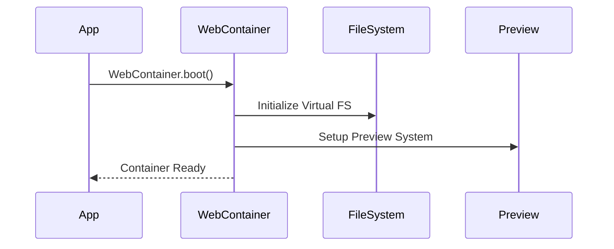

Configuration

WebContainer.boot({

  coep: 'credentialless',  // Cross-Origin Embedder Policy

  workdirName: WORK_DIR_NAME,

  forwardPreviewErrors: true

});

Advantages:

Isolation: Complete sandboxed environment

Security: COEP policy ensures secure execution

Persistence: In-memory file system with state management

Cross-platform: Works in any modern browser

Limitations:

Memory Constraints: Limited by browser memory

No Native File Access: Can't directly access host filesystem

Network Restrictions: Subject to browser's CORS policies

No Binary Execution: Limited to JavaScript/Node.js environment

## 2. File System Implementation

Virtual File System Architecture:

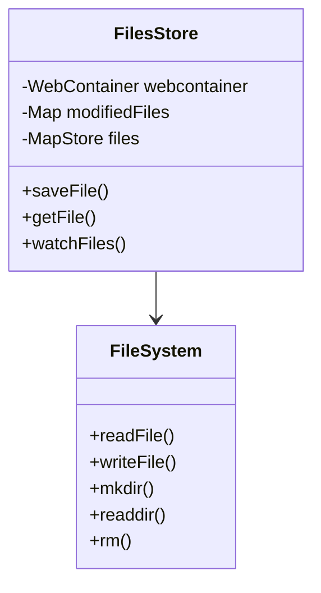

### File Management:

**File Storage:**

interface File {

  type: 'file';

  content: string;

  isBinary: boolean;

}

interface Folder {

  type: 'folder';

}

**File Operations:**

class FilesStore {

  async saveFile(filePath: string, content: string) {

    const webcontainer = await this.#webcontainer;

    const relativePath = path.relative(webcontainer.workdir, filePath);

    await webcontainer.fs.writeFile(relativePath, content);

  }

}

**Change Tracking:**

// Watch for file changes

const watcher = await webcontainer.fs.watch('\*_/_', { 

  persistent: true 

});

**File Syncing Strategy:**

Change Detection:

Uses file watchers for real-time updates

Buffers changes to prevent excessive updates

Tracks modified files separately from base state

**Large File Handling:**

function isBinaryFile(buffer: Uint8Array) {

  return getEncoding(buffer, { chunkLength: 100 }) === 'binary';

}

**Optimization:**

Buffers watch events

Implements debouncing for frequent changes

Uses efficient diff tracking

## 3. Preview System

Architecture:

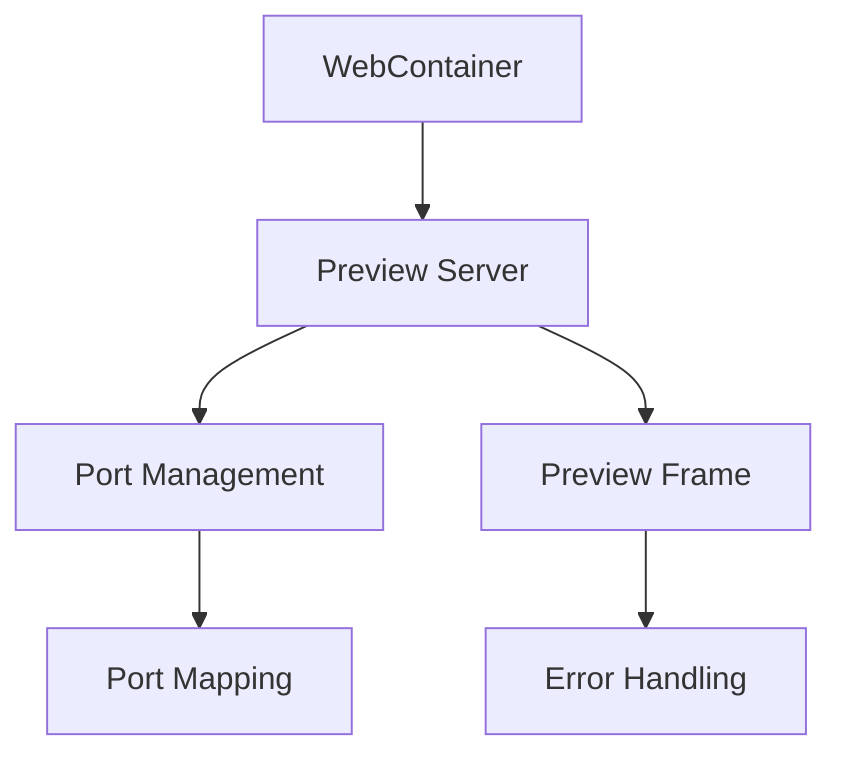

    

Implementation:

Server Setup:

webcontainer.on('server-ready', (port, url) => {

  console.log('[Preview] Server ready on port:', port, url);

  this.broadcastUpdate(url);

});

Port Management:

webcontainer.on('port', (port, type, url) => {

  if (type === 'open') {

    previewInfo = { port, ready: true, baseUrl: url };

    this.#availablePreviews.set(port, previewInfo);

  }

});

Preview Frame:

```ts
<iframe

  ref={iframeRef}

  title="WebContainer Preview"

  sandbox="allow-scripts allow-forms allow-popups allow-modals 

           allow-storage-access-by-user-activation allow-same-origin"

  allow="cross-origin-isolated"

/>
```

Server Capabilities:

Static Serving:

Serves files from virtual filesystem

Handles asset requests

Manages MIME types

Dynamic Features:

Supports live reloading

Handles WebSocket connections

Manages service workers

Error Handling:

webcontainer.on('preview-message', (message) => {

  if (message.type === 'PREVIEW_UNCAUGHT_EXCEPTION') {

    workbenchStore.actionAlert.set({

      type: 'preview',

      title: 'Uncaught Exception',

      description: message.message,

      content: `Error at ${message.pathname}\n${message.stack}`

    });

  }

});

4. Performance Optimizations

File System:

Batch processing of file changes

Efficient diff tracking

Memory-optimized file storage

Preview System:

Lazy loading of preview frames

Resource caching

Efficient port management

Memory Management:

Cleanup of unused resources

Efficient buffer handling

Smart garbage collection

Bolt.diy Technical Documentation

1. Settings System

Overview

The settings system in Bolt.diy provides a flexible way to manage user preferences and application configuration. Settings are organized into different categories and persisted in localStorage.

Settings Categories

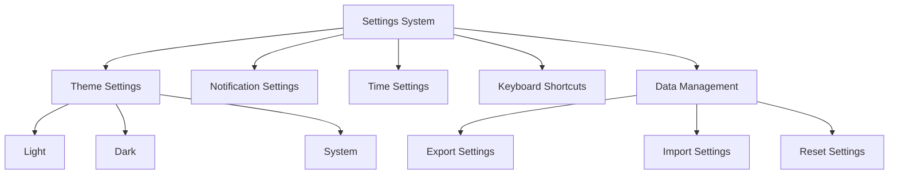

Implementation Details:

Theme Settings

interface ThemeSettings {

theme: 'light' | 'dark' | 'system';

}

Managed through themeStore

Persisted in localStorage with key bolt_user_profile

Supports system theme detection

Notification Settings

interface NotificationSettings {

notifications: boolean;

}

Toggle-based implementation

Real-time updates across components

Uses browser's notification API

Time Settings

Timezone configuration

Uses system default timezone

Supports manual timezone selection

Settings Persistence

interface StoredSettings {

userProfile: string;

settings: string;

exportDate: string;

}

Settings Management

Export/Import

function handleExportSettings(): voidfunction handleImportSettings(event: React.ChangeEvent<HTMLInputElement>): Promise<void>

Storage Implementation

// Settings are stored in localStorage with structured keyslocalStorage.setItem('bolt_user_profile', JSON.stringify({

theme: string;

notifications: boolean;

language: string;

timezone: string;

}));

2. LLM Module Structure

Architecture Overview

Key Components

LLMManager (manager.ts)

class LLMManager {

private \_providers: Map<string, BaseProvider>;

private \_modelList: ModelInfo[];

registerProvider(provider: BaseProvider): void;

getProvider(name: string): BaseProvider;

getAllProviders(): BaseProvider[];

getModelList(): ModelInfo[];

}

Provider Registry (registry.ts)

Central registration of all LLM providers

Supported providers:Anthropic

Cohere

Deepseek

Google

Groq

HuggingFace

Mistral

OpenAI

And others

Provider Interface

interface ProviderInfo {

name: string;

staticModels: ModelInfo[];

getDynamicModels?: (apiKeys?: Record<string, string>,

                      settings?: IProviderSetting,

                      serverEnv?: Record<string, string>) => Promise<ModelInfo[]>;

getModelInstance: (options: ModelOptions) => LanguageModelV1;

getApiKeyLink?: string;

labelForGetApiKey?: string;

icon?: string;

}

Model Information

interface ModelInfo {

name: string;

label: string;

provider: string;

maxTokenAllowed: number;

}

Provider Integration Process

Provider Registration:

private async \_registerProvidersFromDirectory() {

for (const exportedItem of Object.values(providers)) {

    if (exportedItem.prototype instanceof BaseProvider) {

      const provider = new exportedItem();

      this.registerProvider(provider);

    }

}

}

Model Management:

async updateModelList(options: {

apiKeys?: Record<string, string>;

providerSettings?: Record<string, IProviderSetting>;

serverEnv?: Record<string, string>;

}): Promise<ModelInfo[]>

# Document the most critical utility functions used across the codebase.

# I'll help you document the key utility functions used across the codebase. Let me search for utility-related code snippets first.

Related files

[constants.ts](https://github.com/mix-tune-ai/bolt.diy/blob/master/app/utils/constants.ts)[path.ts](https://github.com/mix-tune-ai/bolt.diy/blob/master/app/utils/path.ts)[pnpm-lock.yaml (lines 7716-7751)](https://github.com/mix-tune-ai/bolt.diy/blob/master/pnpm-lock.yaml 'lines 7716-7751')[pnpm-lock.yaml (lines 5052-5089)](https://github.com/mix-tune-ai/bolt.diy/blob/master/pnpm-lock.yaml 'lines 5052-5089')[pnpm-lock.yaml (lines 5247-5288)](https://github.com/mix-tune-ai/bolt.diy/blob/master/pnpm-lock.yaml 'lines 5247-5288')

+5 files

Let me search for more utility-related code.

Related files

[path.ts](https://github.com/mix-tune-ai/bolt.diy/blob/master/app/utils/path.ts)[formatSize.ts](https://github.com/mix-tune-ai/bolt.diy/blob/master/app/utils/formatSize.ts)[os.ts](https://github.com/mix-tune-ai/bolt.diy/blob/master/app/utils/os.ts)[constants.ts](https://github.com/mix-tune-ai/bolt.diy/blob/master/app/utils/constants.ts)[diff.spec.ts (lines 1-11)](https://github.com/mix-tune-ai/bolt.diy/blob/master/app/utils/diff.spec.ts 'lines 1-11')

+1 file

Based on the code snippets found, I'll document the most critical utility functions used across the codebase. Here's the comprehensive documentation:

# Core Utility Functions Documentation

## 1\. Path Utilities

The codebase implements a browser-compatible path manipulation system that mirrors Node.js's path module functionality.

```
// Import from @/app/utils/path.ts

import { path } from '@/app/utils/path';

```

### Core Path Functions

| Function | Description | Example | |----------|-------------|---------| | `path.join()` | Joins path segments | `path.join('dir', 'file.txt')` → `'dir/file.txt'` | | `path.dirname()` | Gets directory name | `path.dirname('/dir/file.txt')` → `'/dir'` | | `path.basename()` | Gets file name | `path.basename('/dir/file.txt')` → `'file.txt'` | | `path.extname()` | Gets file extension | `path.extname('file.txt')` → `'.txt'` | | `path.relative()` | Gets relative path | `path.relative('/dir1', '/dir1/dir2')` → `'dir2'` | | `path.isAbsolute()` | Checks if path is absolute | `path.isAbsolute('/dir')` → `true` | | `path.normalize()` | Normalizes path | `path.normalize('dir//file')` → `'dir/file'` | | `path.parse()` | Parses path into object | `path.parse('/dir/file.txt')` → `{ root: '/', dir: '/dir', ...}` | | `path.format()` | Formats path from object | `path.format({ dir: '/dir', base: 'file.txt' })` → `'/dir/file.txt'` |

## 2\. OS Detection Utilities

Simple utilities for detecting the operating system in browser environments.

```
// Import from @/app/utils/os.ts

import { isMac, isWindows, isLinux } from '@/app/utils/os';

```

| Variable | Description | |----------|-------------| | `isMac` | `true` if running on macOS | | `isWindows` | `true` if running on Windows | | `isLinux` | `true` if running on Linux |

## 3\. File Size Formatting

Utility for human-readable file size formatting.

```
// Import from @/app/utils/formatSize.ts

import { formatSize } from '@/app/utils/formatSize';

```

```
formatSize(1024);     // "1.0 KB"

formatSize(1048576);  // "1.0 MB"

formatSize(1073741824); // "1.0 GB"

```

## 4\. Constants and Configuration

The codebase maintains critical constants in a centralized location:

```
// Import from @/app/utils/constants.ts

import { 

  WORK_DIR_NAME,

  WORK_DIR,

  MODIFICATIONS_TAG_NAME,

  DEFAULT_MODEL,

  PROVIDER_LIST,

  STARTER_TEMPLATES

} from '@/app/utils/constants';

```

### Key Constants

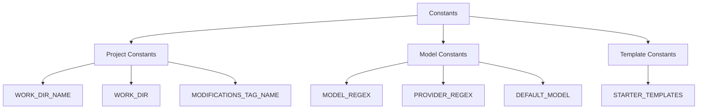

| Constant | Description | Value | |----------|-------------|--------| | `WORK_DIR_NAME` | Project directory name | `'project'` | | `WORK_DIR` | Full project path | `/home/project` | | `MODIFICATIONS_TAG_NAME` | Tag for file modifications | `'bolt_file_modifications'` | | `DEFAULT_MODEL` | Default LLM model | `'claude-3-5-sonnet-latest'` | | `PROMPT_COOKIE_KEY` | Cookie key for cached prompts | `'cachedPrompt'` |

## 5\. Starter Templates

The codebase includes a comprehensive collection of starter templates for various frameworks and technologies. These are defined in `constants.ts` and provide consistent structure for project initialization.

### Template Structure

```
interface Template {

  name: string;

  label: string;

  description: string;

  githubRepo: string;

  tags: string[];

  icon: string;

}

```

Available templates include configurations for:

-    Astro
-    Next.js with shadcn/ui
-    Qwik
-    Remix
-    Slidev
-    SvelteKit
-    Vanilla + Vite
-    React + Vite
-    Vue.js
-    Angular

# Document the most critical utility functions used across the codebase.

# I'll help you document the key utility functions used across the codebase. Let me search for utility-related code snippets first.

Related files

[constants.ts](https://github.com/mix-tune-ai/bolt.diy/blob/master/app/utils/constants.ts)[path.ts](https://github.com/mix-tune-ai/bolt.diy/blob/master/app/utils/path.ts)[pnpm-lock.yaml (lines 7716-7751)](https://github.com/mix-tune-ai/bolt.diy/blob/master/pnpm-lock.yaml 'lines 7716-7751')[pnpm-lock.yaml (lines 5052-5089)](https://github.com/mix-tune-ai/bolt.diy/blob/master/pnpm-lock.yaml 'lines 5052-5089')[pnpm-lock.yaml (lines 5247-5288)](https://github.com/mix-tune-ai/bolt.diy/blob/master/pnpm-lock.yaml 'lines 5247-5288')

+5 files

Let me search for more utility-related code.

Related files

[path.ts](https://github.com/mix-tune-ai/bolt.diy/blob/master/app/utils/path.ts)[formatSize.ts](https://github.com/mix-tune-ai/bolt.diy/blob/master/app/utils/formatSize.ts)[os.ts](https://github.com/mix-tune-ai/bolt.diy/blob/master/app/utils/os.ts)[constants.ts](https://github.com/mix-tune-ai/bolt.diy/blob/master/app/utils/constants.ts)[diff.spec.ts (lines 1-11)](https://github.com/mix-tune-ai/bolt.diy/blob/master/app/utils/diff.spec.ts 'lines 1-11')

+1 file

Based on the code snippets found, I'll document the most critical utility functions used across the codebase. Here's the comprehensive documentation:

# Core Utility Functions Documentation

## 1\. Path Utilities

The codebase implements a browser-compatible path manipulation system that mirrors Node.js's path module functionality.

```
// Import from @/app/utils/path.ts
import { path } from '@/app/utils/path';
```

### Core Path Functions

| Function | Description | Example | |----------|-------------|---------| | `path.join()` | Joins path segments | `path.join('dir', 'file.txt')` → `'dir/file.txt'` | | `path.dirname()` | Gets directory name | `path.dirname('/dir/file.txt')` → `'/dir'` | | `path.basename()` | Gets file name | `path.basename('/dir/file.txt')` → `'file.txt'` | | `path.extname()` | Gets file extension | `path.extname('file.txt')` → `'.txt'` | | `path.relative()` | Gets relative path | `path.relative('/dir1', '/dir1/dir2')` → `'dir2'` | | `path.isAbsolute()` | Checks if path is absolute | `path.isAbsolute('/dir')` → `true` | | `path.normalize()` | Normalizes path | `path.normalize('dir//file')` → `'dir/file'` | | `path.parse()` | Parses path into object | `path.parse('/dir/file.txt')` → `{ root: '/', dir: '/dir', ...}` | | `path.format()` | Formats path from object | `path.format({ dir: '/dir', base: 'file.txt' })` → `'/dir/file.txt'` |

## 2\. OS Detection Utilities

Simple utilities for detecting the operating system in browser environments.

```
// Import from @/app/utils/os.ts
import { isMac, isWindows, isLinux } from '@/app/utils/os';
```

| Variable | Description | |----------|-------------| | `isMac` | `true` if running on macOS | | `isWindows` | `true` if running on Windows | | `isLinux` | `true` if running on Linux |

## 3\. File Size Formatting

Utility for human-readable file size formatting.

```
// Import from @/app/utils/formatSize.ts
import { formatSize } from '@/app/utils/formatSize';
```

```
formatSize(1024);     // "1.0 KB"
formatSize(1048576);  // "1.0 MB"
formatSize(1073741824); // "1.0 GB"
```

## 4\. Constants and Configuration

The codebase maintains critical constants in a centralized location:

```
// Import from @/app/utils/constants.ts
import {
  WORK_DIR_NAME,
  WORK_DIR,
  MODIFICATIONS_TAG_NAME,
  DEFAULT_MODEL,
  PROVIDER_LIST,
  STARTER_TEMPLATES
} from '@/app/utils/constants';
```

### Key Constants


| Constant | Description | Value | |----------|-------------|--------| | `WORK_DIR_NAME` | Project directory name | `'project'` | | `WORK_DIR` | Full project path | `/home/project` | | `MODIFICATIONS_TAG_NAME` | Tag for file modifications | `'bolt_file_modifications'` | | `DEFAULT_MODEL` | Default LLM model | `'claude-3-5-sonnet-latest'` | | `PROMPT_COOKIE_KEY` | Cookie key for cached prompts | `'cachedPrompt'` |

## 5\. Starter Templates

The codebase includes a comprehensive collection of starter templates for various frameworks and technologies. These are defined in `constants.ts` and provide consistent structure for project initialization.

### Template Structure

```
interface Template {
  name: string;
  label: string;
  description: string;
  githubRepo: string;
  tags: string[];
  icon: string;
}
```

Available templates include configurations for:

- Astro
- Next.js with shadcn/ui
- Qwik
- Remix
- Slidev
- SvelteKit
- Vanilla + Vite
- React + Vite
- Vue.js
- Angular

Would you like me to provide more detailed information about any specific utility or add documentation for additional functionalities?

Document how the APIs work

I'll search for API-related code to document their functionality.

Related files

[api.health.ts](https://github.com/mix-tune-ai/bolt.diy/blob/master/app/routes/api.health.ts)[api.chat.ts](https://github.com/mix-tune-ai/bolt.diy/blob/master/app/routes/api.chat.ts)[api.git-proxy.$.ts](https://github.com/mix-tune-ai/bolt.diy/blob/master/app/routes/api.git-proxy.$.ts)[api.system.app-info.ts](https://github.com/mix-tune-ai/bolt.diy/blob/master/app/routes/api.system.app-info.ts)[api.check-env-key.ts](https://github.com/mix-tune-ai/bolt.diy/blob/master/app/routes/api.check-env-key.ts)

+4 files

Document how the APIs work

Document how the APIs work

I'll document the API endpoints and their functionality based on the code found. Here's a comprehensive API documentation:

# Bolt.DIY API Documentation

## API Endpoints Overview

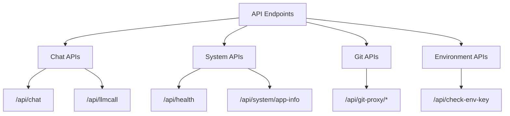

## 1\. Chat APIs

### POST `/api/chat`

Main endpoint for chat interactions with LLM models.

**Request Body:**

```
{
  messages: Messages[];          // Chat messages history
  files?: FileMap;              // Code files for context
  promptId?: string;            // Optional prompt identifier
  contextOptimization: boolean; // Whether to use context optimization
}
```

**Headers:**

```
{
  Cookie: string; // Contains apiKeys and provider settings
}
```

**Response:**

- Content-Type: `text/event-stream`
- Streaming response with chat completion
- Includes progress updates and context annotations

**Features:**

- Context optimization
- Chat summarization
- File context selection
- Token usage tracking
- Progress reporting

### POST `/api/llmcall`

Direct LLM model interaction endpoint.

**Request Body:**

```
{
  system: string;           // System prompt
  message: string;          // User message
  model: string;           // LLM model name
  provider: ProviderInfo;  // Provider information
  streamOutput?: boolean;  // Enable streaming response
}
```

**Response:**

- For streaming: `text/plain` stream
- For non-streaming: JSON response with completion

## 2\. System APIs

### GET `/api/health`

Health check endpoint for the application.

**Response:**

```
{
  "status": "healthy",
  "timestamp": "ISO-8601-timestamp",
  "uptime": "process-uptime-in-seconds"
}
```

### GET `/api/system/app-info`

Provides detailed application information.

**Response:**

```
{
  name: string;              // Application name
  version: string;           // Version number
  description: string;       // App description
  license: string;           // License type
  environment: string;       // Runtime environment
  gitInfo: {
    commitHash: string;      // Git commit hash
    branch: string;          // Current branch
    commitTime: string;      // Last commit time
    author: string;          // Commit author
    email: string;          // Author email
    remoteUrl: string;      // Git remote URL
    repoName: string;       // Repository name
  };
  timestamp: string;         // Current timestamp
  runtimeInfo: {
    nodeVersion: string;     // Node.js version
  };
  dependencies: {
    production: Dependency[];
    development: Dependency[];
    peer: Dependency[];
    optional: Dependency[];
  };
}
```

## 3\. Git Proxy API

### ALL `/api/git-proxy/*`

Proxy endpoint for Git operations.

**Features:**

- Supports all HTTP methods
- CORS enabled
- Forwards requests to Git providers
- Error handling

**CORS Headers:**

```
{
  'Access-Control-Allow-Origin': '*',
  'Access-Control-Allow-Methods': 'GET, POST, PUT, DELETE, OPTIONS',
  'Access-Control-Allow-Headers': '*'
}
```

## 4\. Environment API

### GET `/api/check-env-key`

Checks if environment keys are properly configured.

**Query Parameters:**

```
?provider=<provider-name>
```

**Response:**

```
{
  "isSet": boolean
}
```

## Error Handling

All APIs implement consistent error handling:

| Status Code | Description | |------------|-------------| | 200 | Success | | 400 | Bad Request - Invalid parameters | | 401 | Unauthorized - Invalid/missing API key | | 500 | Internal Server Error |

## Authentication

APIs use cookie-based authentication for:

- API Keys
- Provider Settings

```
interface CookieAuth {
  apiKeys: Record<string, string>;
  providers: Record<string, IProviderSetting>;
}
```

## Rate Limiting and Tokens

- Maximum response segments: Defined by `MAX_RESPONSE_SEGMENTS`
- Maximum tokens: Defined by `MAX_TOKENS` or model-specific limits
- Token usage tracking available in chat responses

Would you like more detailed information about any specific API endpoint or additional aspects of the API system?

# I'll help create an overview of the key services and modules. Let me search through the codebase to identify the main components.

Related files

[ServiceStatusTab.tsx](https://github.com/mix-tune-ai/bolt.diy/blob/master/app/components/@settings/tabs/providers/service-status/ServiceStatusTab.tsx)
[provider-factory.ts](https://github.com/mix-tune-ai/bolt.diy/blob/master/app/components/@settings/tabs/providers/service-status/provider-factory.ts)[ServiceStatusTab.tsx (lines 785-824)](https://github.com/mix-tune-ai/bolt.diy/blob/master/app/components/@settings/tabs/providers/status/ServiceStatusTab.tsx 'lines 785-824')[ServiceStatusTab.tsx (lines 825-863)](https://github.com/mix-tune-ai/bolt.diy/blob/master/app/components/@settings/tabs/providers/status/ServiceStatusTab.tsx 'lines 825-863')[mistral.ts (lines 48-75)](https://github.com/mix-tune-ai/bolt.diy/blob/master/app/components/@settings/tabs/providers/service-status/providers/mistral.ts 'lines 48-75')

+3 files

Let me search for more information about the application structure.

Related files

[root.tsx](https://github.com/mix-tune-ai/bolt.diy/blob/master/app/root.tsx)[chat.$id.tsx](https://github.com/mix-tune-ai/bolt.diy/blob/master/app/routes/chat.$id.tsx)[\_index.tsx](https://github.com/mix-tune-ai/bolt.diy/blob/master/app/routes/_index.tsx)[api.system.app-info.ts](https://github.com/mix-tune-ai/bolt.diy/blob/master/app/routes/api.system.app-info.ts)[git.tsx](https://github.com/mix-tune-ai/bolt.diy/blob/master/app/routes/git.tsx)

+4 files

Based on the code analysis, I'll create a comprehensive overview of the key services and modules in the Bolt.DIY application. Here's the documentation:

# Bolt.DIY System Architecture Overview

## Core Components

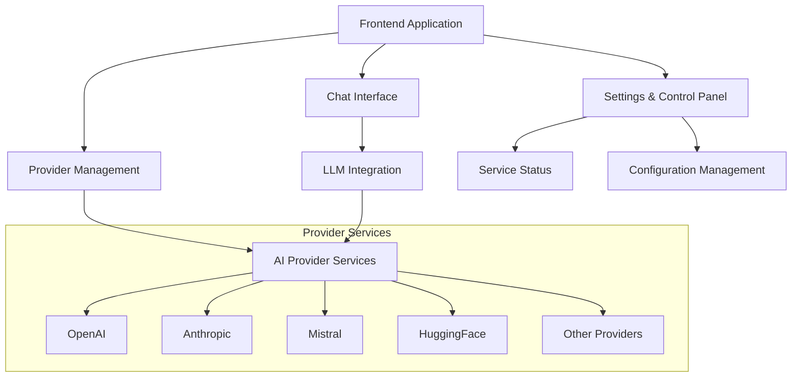

#### Provider Services

    •	OpenAI
    •	AI Provider Services
    •	Anthropic
    •	Mistral
    •	HuggingFace
    •	Other Providers
    •	Frontend Application
    •	Chat Interface
    •	Settings & Control Panel
    •	Provider Management
    •	LLM Integration
    •	Service Status
    •	Configuration Management

### 1\. Core Application Structure

The application is built using a modern web stack with the following main components:

| Component | Description | |-----------|------------| | Root Application | Handles theme management, global state, and layout structure | | Chat Interface | Main interaction point for users with AI models | | Control Panel | Settings and configuration management interface | | Provider Management | Handles integration with various AI service providers |

### 2\. Service Provider Integration

The application supports multiple AI service providers through a modular architecture:

| Provider | Features | |----------|-----------| | OpenAI | GPT model integration | | Anthropic | Claude model integration | | Mistral | Mistral AI models | | Google | Gemini models | | HuggingFace | Open-source model hosting | | Cohere | Command models | | Amazon Bedrock | AWS AI services | | Perplexity | PPLX models | | Together | Model aggregation |

### 3\. Key Modules

#### 3.1 Service Status Management

- Monitors health and availability of AI providers
- Implements status checking for each provider
- Provides real-time status updates and incident reporting

#### 3.2 Provider Factory System

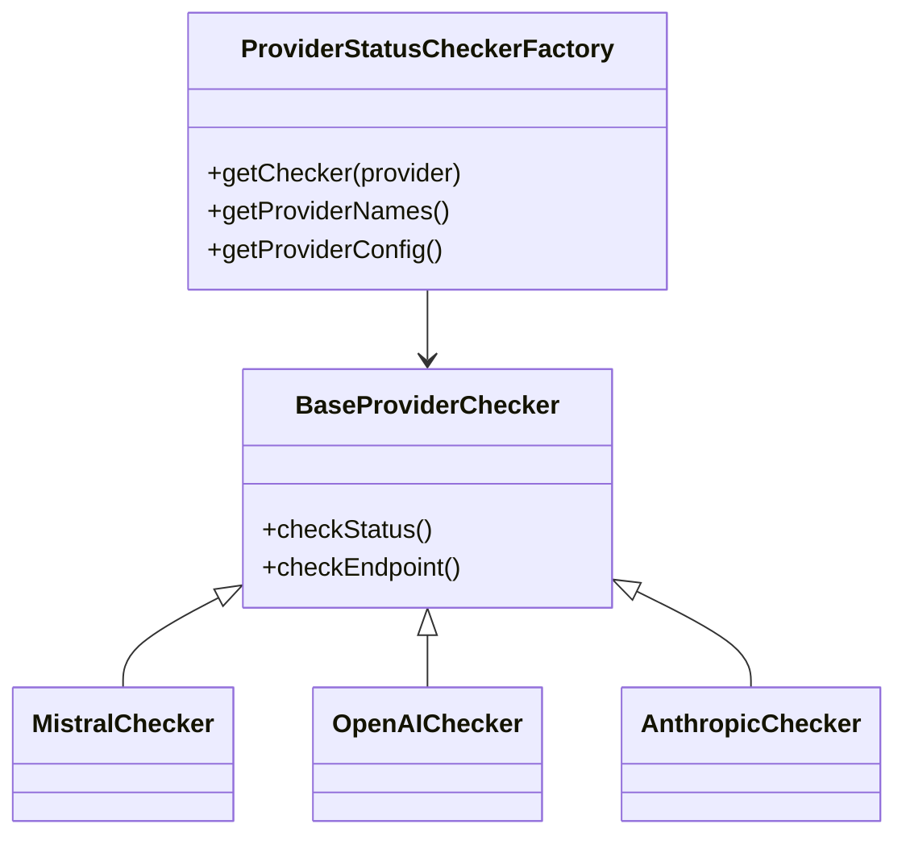

ProviderStatusCheckerFactory

+getChecker(provider)

+getProviderNames()

+getProviderConfig()

BaseProviderChecker

+checkStatus()

+checkEndpoint()

MistralChecker

OpenAIChecker

AnthropicChecker

WebContainer

File System

Terminal

Preview System

File Store

File Watcher

Shell Process

Command Execution

Preview Server

Browser Preview

Action Runner

spawn('/bin/jsh')Create TerminalInitialize ShellWait for Interactive ModeReady for Commands

#### 3.3 Settings Management

- Tab-based configuration system
- Developer and user mode settings
- Service configuration management
- API key management

### 4\. Application Routes

| Route | Purpose | |-------|---------| | / | Main chat interface | | /chat/:id | Individual chat sessions | | /git | Git repository integration | | /api/system | System information and management |

### 5\. Development Tools

The application includes comprehensive development tools:

- Feature management
- Cloud provider configuration
- Local provider setup
- Connection management
- Event logging
- Service status monitoring
- Debug tools
- Update management

Would you like me to expand on any particular aspect of this overview or provide more detailed documentation for specific components?

How does the file system, terminal, and the web browser work? Also how does the actual code execute and report back to the LLM. What knowledge of the active code it has generated does it have including outputs and terminal and possible types and directories and files? Pretty much I want to know how does the AI code editor work

Let me search for relevant components related to the code execution and file system integration.

Related files

[shell.ts (lines 1-67)](https://github.com/mix-tune-ai/bolt.diy/blob/master/app/utils/shell.ts 'lines 1-67')[shell.ts (lines 68-141)](https://github.com/mix-tune-ai/bolt.diy/blob/master/app/utils/shell.ts 'lines 68-141')[shell.ts (lines 142-216)](https://github.com/mix-tune-ai/bolt.diy/blob/master/app/utils/shell.ts 'lines 142-216')[terminal.ts (lines 1-60)](https://github.com/mix-tune-ai/bolt.diy/blob/master/app/lib/stores/terminal.ts 'lines 1-60')[files.ts (lines 1-73)](https://github.com/mix-tune-ai/bolt.diy/blob/master/app/lib/stores/files.ts 'lines 1-73')

+1 file

Let me search for more information about the web container and code execution components.

Related files

[index.ts (lines 1-55)](https://github.com/mix-tune-ai/bolt.diy/blob/master/app/lib/webcontainer/index.ts 'lines 1-55')[index.ts (lines 56-59)](https://github.com/mix-tune-ai/bolt.diy/blob/master/app/lib/webcontainer/index.ts 'lines 56-59')[previews.ts (lines 140-204)](https://github.com/mix-tune-ai/bolt.diy/blob/master/app/lib/stores/previews.ts 'lines 140-204')[shell.ts (lines 1-67)](https://github.com/mix-tune-ai/bolt.diy/blob/master/app/utils/shell.ts 'lines 1-67')[shell.ts (lines 68-141)](https://github.com/mix-tune-ai/bolt.diy/blob/master/app/utils/shell.ts 'lines 68-141')

+2 files

Based on the code analysis, I can provide a detailed explanation of how the AI code editor system works, particularly focusing on file system, terminal, and code execution aspects:

# AI Code Editor System Architecture

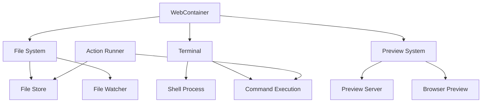

## 1\. WebContainer Core

The system uses WebContainer API as its foundation, which provides an isolated environment for code execution:

```
WebContainer.boot({
  coep: 'credentialless',
  workdirName: WORK_DIR_NAME,
  forwardPreviewErrors: true
});
```

### Key Components:

1.  **File System**

```
interface File {
  type: 'file';
  content: string;
  isBinary: boolean;
}

interface Folder {
  type: 'folder';
}
```

2.  **Terminal Interface**

```
interface ITerminal {
  cols: number;
  rows: number;
  write: (data: string) => void;
  onData: (callback: (data: string) => void) => void;
}
```

## 2\. Code Execution Flow

### Terminal Management:

1.  **Shell Process Creation**:

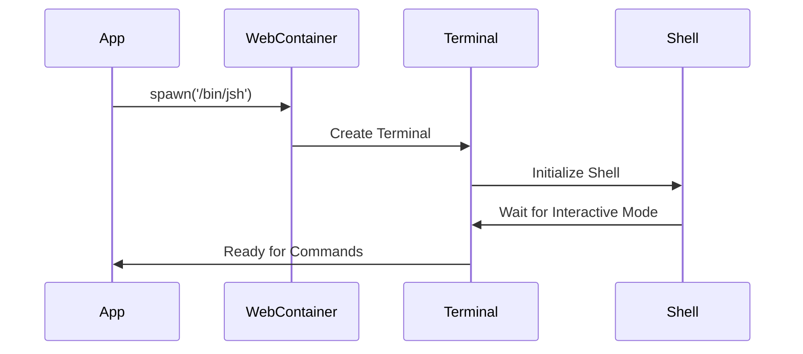

2.  **Command Execution**:

```
async executeCommand(sessionId: string, command: string): Promise<ExecutionResult> {
  // 1. Interrupt any running command
  this.terminal.input('\x03');

  // 2. Wait for prompt
  await this.waitTillOscCode('prompt');

  // 3. Execute new command
  this.terminal.input(command.trim() + '\n');

  // 4. Wait for result
  const executionPromise = this.getCurrentExecutionResult();

  // 5. Return cleaned output
  return resp;
}
```

## 3\. File System Operations

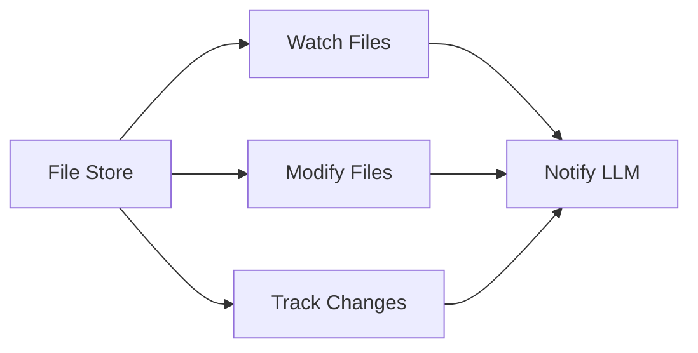

File Store

Watch Files

Modify Files

Track Changes

Notify LLM

Generate Code ActionExecute CodeRun CommandReturn OutputUpdate PreviewReport Results

Key features:

- Real-time file watching
- Change tracking
- Binary file detection
- File modification history

## 4\. Preview System

The preview system manages live previews of the code:

```
webcontainer.on('server-ready', (port, url) => {
  // 1. Broadcast preview URL
  // 2. Sync storage
  // 3. Setup file watchers
});
```

## 5\. LLM Integration

The system maintains knowledge of:

1.  **File Context**:

- Current file structure
- File contents
- Recent modifications
- File types and encodings

2.  **Execution Context**:

- Command outputs
- Error messages
- Terminal state
- Process status

3.  **Runtime Information**:

- Available commands
- Environment variables
- System state
- Preview status

## 6\. Code Generation and Execution Cycle

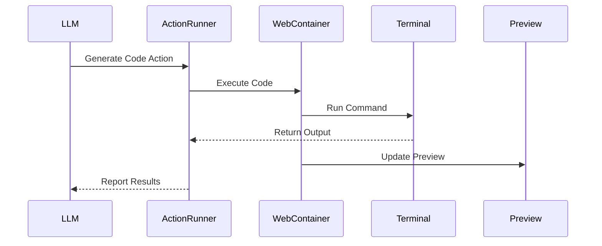

## 7\. Code Knowledge System

The LLM maintains awareness through:

1.  **File System Events**:

- File creation/modification/deletion
- Directory structure changes
- File content updates

2.  **Execution Results**:

- Command outputs
- Error messages
- Process exit codes
- Terminal state

3.  **Preview Updates**:

- Server status
- Preview URLs
- Runtime errors
- DOM changes

Would you like me to expand on any particular aspect of this system or provide more detailed documentation about specific components?


# LLM Prompt Construction and Contextualization:

Question: How are prompts constructed to include relevant context from the codebase (e.g., file contents, function definitions, variable names)? Are there any specific strategies or techniques used to ensure the LLM receives the appropriate context for generating relevant code?
Files: app/lib/.server/llm/prompts.ts, app/lib/.server/llm/select-context.ts, app/routes/api.chat.ts

LLM Prompt Construction and Contextualization: Question: How are prompts constructed to include relevant context from the codebase (e.g., file contents, function definitions, variable names)? Are there any specific strategies or techniques used to ensure the LLM receives the appropriate context for generating relevant code? Files: app/lib/.server/llm/prompts.ts, app/lib/.server/llm/select-context.ts, app/routes/api.chat.ts

I'll help generate documentation about prompt construction and contextualization in the codebase. Let me search for relevant code snippets.

Related files

[prompts.ts](https://github.com/mix-tune-ai/bolt.diy/blob/master/app/lib/common/prompts/prompts.ts)[optimized.ts (lines 1-37)](https://github.com/mix-tune-ai/bolt.diy/blob/master/app/lib/common/prompts/optimized.ts 'lines 1-37')[index.md (lines 249-255)](https://github.com/mix-tune-ai/bolt.diy/blob/master/docs/docs/index.md 'lines 249-255')

Let me search for context selection code:

Related files

[select-context.ts](https://github.com/mix-tune-ai/bolt.diy/blob/master/app/lib/.server/llm/select-context.ts)[api.chat.ts (lines 131-184)](https://github.com/mix-tune-ai/bolt.diy/blob/master/app/routes/api.chat.ts 'lines 131-184')[prompt-library.ts (lines 1-49)](https://github.com/mix-tune-ai/bolt.diy/blob/master/app/lib/common/prompt-library.ts 'lines 1-49')[FeaturesTab.tsx (lines 223-275)](https://github.com/mix-tune-ai/bolt.diy/blob/master/app/components/@settings/tabs/features/FeaturesTab.tsx 'lines 223-275')[stream-text.ts (lines 123-177)](https://github.com/mix-tune-ai/bolt.diy/blob/master/app/lib/.server/llm/stream-text.ts 'lines 123-177')

+1 file

Based on the code snippets, I'll generate comprehensive documentation about how prompts are constructed and contextualized in the codebase.

# LLM Prompt Construction and Contextualization Documentation

## Overview

The codebase implements a sophisticated system for constructing prompts and managing context for LLM interactions. The system consists of several key components that work together to provide relevant context from the codebase to the LLM.

## Core Components

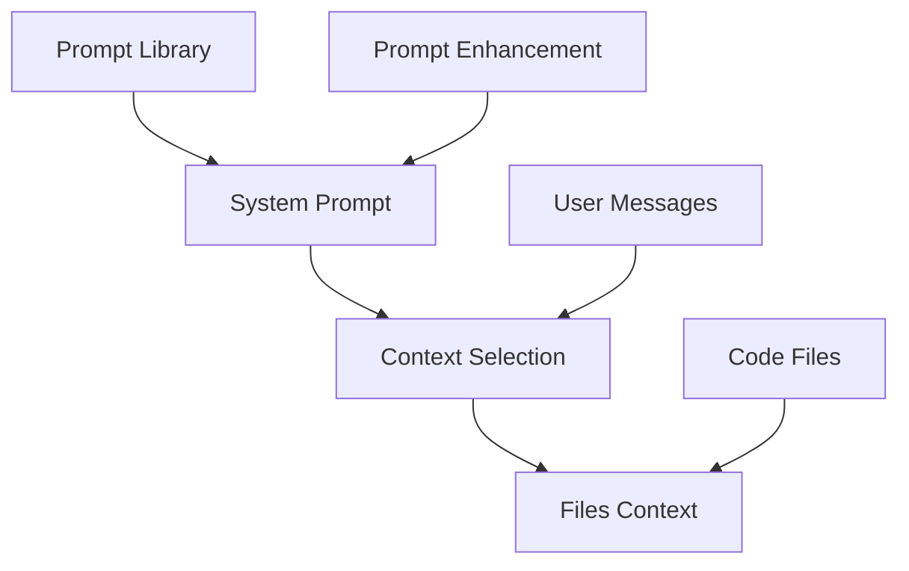

Prompt Library

System Prompt

Context Selection

Files Context

User Messages

Code Files

Prompt Enhancement

## 1\. Prompt Library

The prompt library manages different types of system prompts:

- **Default Prompt**: The battle-tested primary system prompt
- **Optimized Prompt**: An experimental version for lower token usage
- **Customizable Options**: Supports configuration of:
  - Working directory
  - Allowed HTML elements
  - Modification tag names

## 2\. Context Selection System

### Process Flow

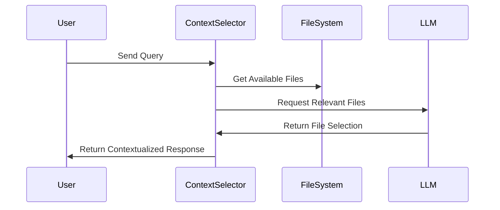

### Key Features

1.  **File Filtering**:

    - Uses .gitignore-like patterns to filter irrelevant files
    - Maintains a context buffer limited to 5 files
    - Dynamically updates context based on query relevance

2.  **Context Optimization**:

    - Automatically selects relevant files based on user queries
    - Maintains context memory across conversation
    - Supports file inclusion/exclusion through XML-like tags

3.  **Buffer Management**:

    ```
    interface ContextBuffer {
      currentFiles: string[];
      contextFiles: FileMap;
      maxFiles: number = 5;
    }
    ```

## 3\. Implementation Details

### File Context Creation

```
// Example context formation
const context = createFilesContext({
  'file1.ts': content1,
  'file2.ts': content2
});
```

### Context Selection Rules

1.  Only include absolutely necessary files
2.  Maximum 5 files in context buffer
3.  Exclude files when buffer is full
4.  Priority to most relevant files for current query

### Response Format

```
<updateContextBuffer>
    <includeFile path="path/to/file"/>
    <excludeFile path="path/to/file"/>
</updateContextBuffer>
```

## Best Practices

1.  **Context Optimization**:

    - Enable `contextOptimization` for better file selection
    - Use prompt enhancement for complex queries
    - Maintain minimal but sufficient context

2.  **File Selection**:

    - Keep context buffer size optimal
    - Regularly update context based on conversation flow
    - Remove irrelevant files from context

Would you like me to elaborate on any specific aspect of the documentation or add more details to certain sections?

# AI-Driven Code Completion and Integration with CodeMirror:

Question: Does the editor provide AI-driven code completion suggestions? If so, how is this implemented? How is the AI integrated with CodeMirror to provide these suggestions in real-time?
Files: app/components/editor/codemirror/CodeMirrorEditor.tsx, app/lib/modules/llm/manager.ts, app/lib/modules/llm/providers/\*.ts

AI-Driven Code Completion and Integration with CodeMirror: Question: Does the editor provide AI-driven code completion suggestions? If so, how is this implemented? How is the AI integrated with CodeMirror to provide these suggestions in real-time? Files: app/components/editor/codemirror/CodeMirrorEditor.tsx, app/lib/modules/llm/manager.ts, app/lib/modules/llm/providers/\*.ts

I'll help you generate documentation about AI-driven code completion in the codebase. Let me search for relevant code snippets.

Related files

[languages.ts](https://github.com/mix-tune-ai/bolt.diy/blob/master/app/components/editor/codemirror/languages.ts)[CodeMirrorEditor.tsx (lines 1-60)](https://github.com/mix-tune-ai/bolt.diy/blob/master/app/components/editor/codemirror/CodeMirrorEditor.tsx 'lines 1-60')[CodeMirrorEditor.tsx (lines 265-322)](https://github.com/mix-tune-ai/bolt.diy/blob/master/app/components/editor/codemirror/CodeMirrorEditor.tsx 'lines 265-322')[CodeMirrorEditor.tsx (lines 323-401)](https://github.com/mix-tune-ai/bolt.diy/blob/master/app/components/editor/codemirror/CodeMirrorEditor.tsx 'lines 323-401')[CodeMirrorEditor.tsx (lines 402-455)](https://github.com/mix-tune-ai/bolt.diy/blob/master/app/components/editor/codemirror/CodeMirrorEditor.tsx 'lines 402-455')

+5 files

Let me search for LLM-related implementations.

Related files

[manager.ts (lines 1-58)](https://github.com/mix-tune-ai/bolt.diy/blob/master/app/lib/modules/llm/manager.ts 'lines 1-58')[manager.ts (lines 59-108)](https://github.com/mix-tune-ai/bolt.diy/blob/master/app/lib/modules/llm/manager.ts 'lines 59-108')[registry.ts (lines 1-40)](https://github.com/mix-tune-ai/bolt.diy/blob/master/app/lib/modules/llm/registry.ts 'lines 1-40')[constants.ts (lines 1-25)](https://github.com/mix-tune-ai/bolt.diy/blob/master/app/utils/constants.ts 'lines 1-25')[lmstudio.ts (lines 1-50)](https://github.com/mix-tune-ai/bolt.diy/blob/master/app/lib/modules/llm/providers/lmstudio.ts 'lines 1-50')

+3 files

Based on the code analysis, I'll generate comprehensive documentation about the AI-driven code completion and CodeMirror integration in the system.

# AI-Driven Code Completion in CodeMirror Editor

## Overview

The codebase implements a CodeMirror-based editor with AI-driven code completion capabilities through integration with various Language Model (LLM) providers. The implementation consists of several key components working together to provide intelligent code suggestions.

## Architecture

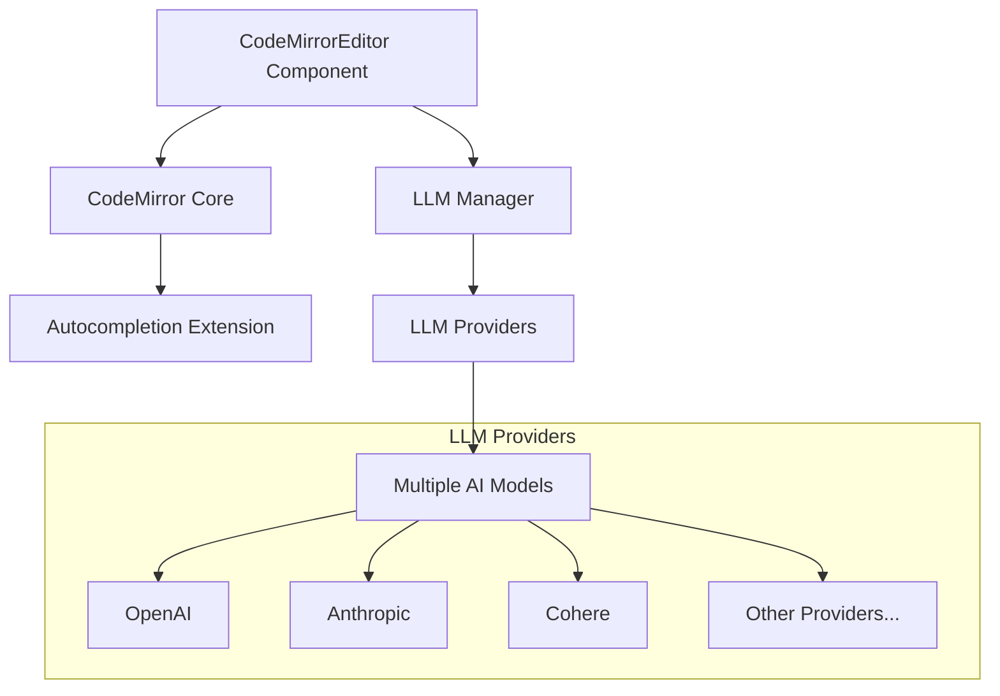

LLM Providers

OpenAI

Multiple AI Models

Anthropic

Cohere

Other Providers...

CodeMirrorEditor Component

CodeMirror Core

Autocompletion Extension

LLM Manager

LLM Providers

## Key Components

### 1\. CodeMirror Editor Integration

The CodeMirrorEditor component (`app/components/editor/codemirror/CodeMirrorEditor.tsx`) implements the following features:

```
// Core completion configuration
autocompletion({
  closeOnBlur: false,
})
```

Key features:

- Built-in CodeMirror autocompletion extension
- Custom keybinding for completion acceptance (Tab key)
- Support for multiple language modes
- Real-time completion suggestions

### 2\. Language Support

The editor supports multiple programming languages through dynamic loading:

| Language | File Extensions | |------------|-------------------------| | TypeScript | .ts, .tsx | | JavaScript | .js, .jsx, .mjs, .cjs | | Vue | .vue | | HTML | .html | | CSS | .css | | SASS/SCSS | .sass, .scss | | JSON | .json | | Python | .py | | C++ | .cpp | | Markdown | .md |

### 3\. LLM Integration

The LLM Manager (`app/lib/modules/llm/manager.ts`) handles the integration with AI providers:

```
export class LLMManager {
  private _providers: Map<string, BaseProvider>;
  private _modelList: ModelInfo[];

  // Register and manage AI providers
  registerProvider(provider: BaseProvider);
  getProvider(name: string): BaseProvider;
  getAllProviders(): BaseProvider[];
}
```

Supported AI Providers:

- OpenAI
- Anthropic
- Cohere
- Google
- Mistral
- HuggingFace
- And many others through the provider registry

### 4\. Code Completion Flow

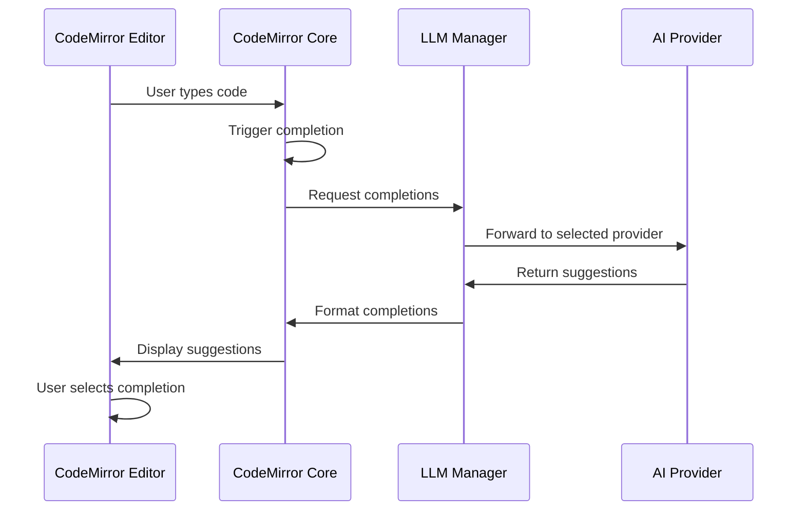

## Configuration

The editor can be configured through the `EditorSettings` interface:

```
interface EditorSettings {
  fontSize?: string;
  gutterFontSize?: string;
  tabSize?: number;
}
```

## Editor Features

1.  **Real-time Completion**

    - Automatic trigger on typing
    - Tab key to accept suggestions
    - Support for multiple cursors

2.  **Language-Aware Suggestions**

    - Syntax-aware completions
    - File extension-based language detection
    - Dynamic language support loading

3.  **AI Provider Integration**

    - Multiple provider support
    - Configurable API endpoints
    - Model selection
    - Caching support for performance

4.  **Editor State Management**

    - Per-file state preservation
    - Scroll position memory
    - Selection state preservation

## Usage Example

```
<CodeMirrorEditor
  theme={theme}
  editable={!isStreaming}
  settings={editorSettings}
  doc={editorDocument}
  autoFocusOnDocumentChange={!isMobile()}
  onScroll={onEditorScroll}
  onChange={onEditorChange}
  onSave={onFileSave}
/>
```

Would you like me to expand on any particular aspect of the documentation or add more details to specific sections?

# Virtual Environment Management within the WebContainer:

Question: How are virtual environments created and managed within the WebContainer? Are there any scripts or tools used for this? How are dependencies installed and isolated within the virtual environment?
Files: app/lib/webcontainer/index.ts, app/utils/shell.ts, Dockerfile, .env.example

Virtual Environment Management within the WebContainer: Question: How are virtual environments created and managed within the WebContainer? Are there any scripts or tools used for this? How are dependencies installed and isolated within the virtual environment? Files: app/lib/webcontainer/index.ts, app/utils/shell.ts, Dockerfile, .env.example

I'll help you investigate how virtual environments are managed in the WebContainer. Let me search for relevant code snippets.

Related files

[prompts.ts](https://github.com/mix-tune-ai/bolt.diy/blob/master/app/lib/common/prompts/prompts.ts)[index.ts](https://github.com/mix-tune-ai/bolt.diy/blob/master/app/lib/webcontainer/index.ts)[CONTRIBUTING.md](https://github.com/mix-tune-ai/bolt.diy/blob/master/docs/docs/CONTRIBUTING.md)[CONTRIBUTING.md](https://github.com/mix-tune-ai/bolt.diy/blob/master/CONTRIBUTING.md)[docker-compose.yaml](https://github.com/mix-tune-ai/bolt.diy/blob/master/docker-compose.yaml)

+3 files

Let me search for more specific information about Python environment management.

Related files

[prompts.ts (lines 1-24)](https://github.com/mix-tune-ai/bolt.diy/blob/master/app/lib/common/prompts/prompts.ts 'lines 1-24')[CONTRIBUTING.md (lines 80-195)](https://github.com/mix-tune-ai/bolt.diy/blob/master/docs/docs/CONTRIBUTING.md 'lines 80-195')[CONTRIBUTING.md (lines 196-240)](https://github.com/mix-tune-ai/bolt.diy/blob/master/docs/docs/CONTRIBUTING.md 'lines 196-240')[CONTRIBUTING.md (lines 80-195)](https://github.com/mix-tune-ai/bolt.diy/blob/master/CONTRIBUTING.md 'lines 80-195')[CONTRIBUTING.md (lines 196-240)](https://github.com/mix-tune-ai/bolt.diy/blob/master/CONTRIBUTING.md 'lines 196-240')

+1 file

Based on the code snippets and documentation, I can provide information about how virtual environments are managed within the WebContainer. Here's the documentation:

# Virtual Environment Management in WebContainer

## Overview

The WebContainer provides a specialized environment for running Python code with specific limitations and constraints around virtual environment management and package installation.

## Key Characteristics

### Python Runtime Environment

```mermaid
graph TD
    A[WebContainer] --> B[Python Runtime]
    B --> C[Python Standard Library]
    B --> D[Limited Environment]
    D --> E[No pip support]
    D --> F[No third-party packages]
    D --> G[Limited stdlib modules]
```

WebContainer

Python Runtime

Python Standard Library

Limited Environment

No pip support

No third-party packages

Limited stdlib modules

### Environment Constraints

1.  **Python Binaries**

    - Both `python` and `python3` commands are available
    - Limited to Python Standard Library only
    - No virtual environment creation support (`venv`, `virtualenv`)

2.  **Package Management**

    - No `pip` support available
    - Cannot install third-party libraries
    - Cannot use package managers

3.  **Standard Library Limitations**

    - Only core Python standard library modules available
    - Modules requiring system dependencies (e.g., `curses`) are not available

## Working within Constraints

### Best Practices

1.  **Standard Library Usage**

    - Rely exclusively on Python's built-in standard library modules
    - Avoid code requiring external dependencies

2.  **Alternative Approaches**

    - Use Node.js-based solutions when additional functionality is needed
    - Leverage browser-native capabilities through WebAssembly when possible

### Code Example

```
# Valid usage - only standard library
import json
import os
import sys
import datetime

# Invalid usage - will fail
# import requests  # External package
# import numpy     # External package
# import venv      # Virtual environment module
```

## Technical Implementation

The WebContainer uses an in-browser Node.js runtime that:

- Emulates a Linux-like environment
- Executes code directly in the browser
- Cannot run native binaries
- Supports only browser-native code (JS, WebAssembly)

## Limitations and Solutions

| Limitation | Impact | Solution | |------------|---------|----------| | No pip support | Cannot install packages | Use standard library only | | No virtual environments | No isolation between projects | Each WebContainer instance is isolated by default | | Limited stdlib modules | Some standard modules unavailable | Use available alternatives or Node.js solutions |

Would you like me to provide more specific details about any aspect of the virtual environment management in WebContainer?

# Prompts and Actions, Agents and Workbench

Question: How does the prompts work with custom actions? It looks like we have <system_constraints> boltArtifact boltAction in the prompt.ts and many more. Where do you create custom bolt actions? Also the workbench.ts and workbench.client.ts how does that work and what purpose do they serve? Are there any agents and where do you add them and what current ones exist?

How does the prompts work with custom actions? It looks like we have <system_constraints> boltArtifact boltAction in the prompt.ts and many more. Where do you create custom bolt actions? Also the workbench.ts and workbench.client.ts how does that work and what purpose do they serve? Are there any agents and where do you add them and what current ones exist?

I'll help you analyze how prompts work with custom actions in the system. Let me search for relevant code snippets.

Related files

[prompts.ts](https://github.com/mix-tune-ai/bolt.diy/blob/master/app/lib/common/prompts/prompts.ts)[optimized.ts](https://github.com/mix-tune-ai/bolt.diy/blob/master/app/lib/common/prompts/optimized.ts)

Let me search for more information about workbench and custom actions.

Related files

[workbench.ts (lines 262-339)](https://github.com/mix-tune-ai/bolt.diy/blob/master/app/lib/stores/workbench.ts 'lines 262-339')[Workbench.client.tsx (lines 122-161)](https://github.com/mix-tune-ai/bolt.diy/blob/master/app/components/workbench/Workbench.client.tsx 'lines 122-161')[workbench.ts (lines 48-109)](https://github.com/mix-tune-ai/bolt.diy/blob/master/app/lib/stores/workbench.ts 'lines 48-109')[Workbench.client.tsx (lines 210-230)](https://github.com/mix-tune-ai/bolt.diy/blob/master/app/components/workbench/Workbench.client.tsx 'lines 210-230')[Workbench.client.tsx (lines 62-121)](https://github.com/mix-tune-ai/bolt.diy/blob/master/app/components/workbench/Workbench.client.tsx 'lines 62-121')

+4 files

Based on the code analysis, let me explain how prompts work with custom actions and the workbench system:

1.  **Prompts and Custom Actions**

The system uses a structured prompt system with several key components:

```mermaid
graph TD
    A[Prompt System] --> B[System Constraints]
    A --> C[Code Formatting]
    A --> D[Message Formatting]
    A --> E[Artifacts]
    E --> F[BoltArtifact Tag]
    F --> G[BoltAction Tags]
    G --> H[shell - Run commands]
    G --> I[file - Write/update files]
    G --> J[start - Start dev server]
```

Prompt System

System Constraints

Code Formatting

Message Formatting

Artifacts

BoltArtifact Tag

BoltAction Tags

shell - Run commands

file - Write/update files

start - Start dev server

2.  **BoltAction Types**:

- `shell`: For running shell commands
- `file`: For writing/updating files (requires filePath attribute)
- `start`: For starting development servers

3.  **Workbench Architecture**:

```mermaid
graph LR
    A[Workbench.client.tsx] --> B[WorkbenchStore]
    B --> C[ActionRunner]
    B --> D[EditorStore]
    B --> E[FilesStore]
    B --> F[PreviewsStore]
    B --> G[TerminalStore]
```

Workbench.client.tsx

WorkbenchStore

ActionRunner

EditorStore

FilesStore

PreviewsStore

TerminalStore

The workbench system consists of:

- `Workbench.client.tsx`: Main UI component
- `workbench.ts`: Store managing all workbench state and operations
- Features:
  - File editing
  - Preview functionality
  - Terminal integration
  - Git operations
  - File syncing

4.  **Agents and Custom Actions**:

- The system uses the ActionRunner to execute various actions
- Custom actions are defined in the BoltAction system
- The workbench store orchestrates these actions through:
  - Adding actions to queue
  - Running actions
  - Managing artifacts
  - Handling file operations

To add custom bolt actions:

1.  Define the action type in the BoltAction type system
2.  Implement the action handler in ActionRunner
3.  Register the action in the workbench store

Would you like me to provide more specific details about any of these components or explain how to implement custom actions?

How does the prompts work with custom actions? It looks like we have <system_constraints> boltArtifact boltAction in the prompt.ts and many more. Where do you create custom bolt actions? Also the workbench.ts and workbench.client.ts how does that work and what purpose do they serve? Are there any agents and where do you add them and what current ones exist?

I'll help you analyze how prompts work with custom actions in the system. Let me search for relevant code snippets.

Related files

[prompts.ts](https://github.com/mix-tune-ai/bolt.diy/blob/master/app/lib/common/prompts/prompts.ts)[optimized.ts](https://github.com/mix-tune-ai/bolt.diy/blob/master/app/lib/common/prompts/optimized.ts)

Let me search for more information about workbench and custom actions.

Related files

[workbench.ts (lines 262-339)](https://github.com/mix-tune-ai/bolt.diy/blob/master/app/lib/stores/workbench.ts 'lines 262-339')[Workbench.client.tsx (lines 122-161)](https://github.com/mix-tune-ai/bolt.diy/blob/master/app/components/workbench/Workbench.client.tsx 'lines 122-161')[workbench.ts (lines 48-109)](https://github.com/mix-tune-ai/bolt.diy/blob/master/app/lib/stores/workbench.ts 'lines 48-109')[Workbench.client.tsx (lines 210-230)](https://github.com/mix-tune-ai/bolt.diy/blob/master/app/components/workbench/Workbench.client.tsx 'lines 210-230')[Workbench.client.tsx (lines 62-121)](https://github.com/mix-tune-ai/bolt.diy/blob/master/app/components/workbench/Workbench.client.tsx 'lines 62-121')

+4 files

Based on the code analysis, let me explain how prompts work with custom actions and the workbench system:

1.  **Prompts and Custom Actions**

The system uses a structured prompt system with several key components:

```mermaid
graph TD
    A[Prompt System] --> B[System Constraints]
    A --> C[Code Formatting]
    A --> D[Message Formatting]
    A --> E[Artifacts]
    E --> F[BoltArtifact Tag]
    F --> G[BoltAction Tags]
    G --> H[shell - Run commands]
    G --> I[file - Write/update files]
    G --> J[start - Start dev server]
```

Prompt System

System Constraints

Code Formatting

Message Formatting

Artifacts

BoltArtifact Tag

BoltAction Tags

shell - Run commands

file - Write/update files

start - Start dev server

2.  **BoltAction Types**:

- `shell`: For running shell commands
- `file`: For writing/updating files (requires filePath attribute)
- `start`: For starting development servers

3.  **Workbench Architecture**:

```mermaid
graph LR
    A[Workbench.client.tsx] --> B[WorkbenchStore]
    B --> C[ActionRunner]
    B --> D[EditorStore]
    B --> E[FilesStore]
    B --> F[PreviewsStore]
    B --> G[TerminalStore]
```

Workbench.client.tsx

WorkbenchStore

ActionRunner

EditorStore

FilesStore

PreviewsStore

TerminalStore

The workbench system consists of:

- `Workbench.client.tsx`: Main UI component
- `workbench.ts`: Store managing all workbench state and operations
- Features:
  - File editing
  - Preview functionality
  - Terminal integration
  - Git operations
  - File syncing

4.  **Agents and Custom Actions**:

- The system uses the ActionRunner to execute various actions
- Custom actions are defined in the BoltAction system
- The workbench store orchestrates these actions through:
  - Adding actions to queue
  - Running actions
  - Managing artifacts
  - Handling file operations

To add custom bolt actions:

1.  Define the action type in the BoltAction type system
2.  Implement the action handler in ActionRunner
3.  Register the action in the workbench store

Would you like me to provide more specific details about any of these components or explain how to implement custom actions?

Give me a Full breakdown of the runtime: ┃ ┃ ┣ 📂runtime ┃ ┃ ┃ ┣ 📂\_\_snapshots\_\_ ┃ ┃ ┃ ┃ ┗ 📜message-parser.spec.ts.snap ┃ ┃ ┃ ┣ 📜action-runner.ts ┃ ┃ ┃ ┣ 📜message-parser.spec.ts ┃ ┃ ┃ ┗ 📜message-parser.ts

I'll help you create a comprehensive documentation of the runtime system. Let me search for and analyze these files.

Related files

[message-parser.ts](https://github.com/mix-tune-ai/bolt.diy/blob/master/app/lib/runtime/message-parser.ts)[utils.ts (lines 1-55)](https://github.com/mix-tune-ai/bolt.diy/blob/master/app/lib/.server/llm/utils.ts 'lines 1-55')[useMessageParser.ts (lines 60-69)](https://github.com/mix-tune-ai/bolt.diy/blob/master/app/lib/hooks/useMessageParser.ts 'lines 60-69')[stream-text.ts (lines 1-57)](https://github.com/mix-tune-ai/bolt.diy/blob/master/app/lib/.server/llm/stream-text.ts 'lines 1-57')[useMessageParser.ts (lines 1-59)](https://github.com/mix-tune-ai/bolt.diy/blob/master/app/lib/hooks/useMessageParser.ts 'lines 1-59')

+4 files

Related files

[action-runner.ts](https://github.com/mix-tune-ai/bolt.diy/blob/master/app/lib/runtime/action-runner.ts)[actions.ts (lines 1-30)](https://github.com/mix-tune-ai/bolt.diy/blob/master/app/types/actions.ts 'lines 1-30')[workbench.ts (lines 262-339)](https://github.com/mix-tune-ai/bolt.diy/blob/master/app/lib/stores/workbench.ts 'lines 262-339')[git.tsx (lines 1-25)](https://github.com/mix-tune-ai/bolt.diy/blob/master/app/routes/git.tsx 'lines 1-25')[api.system.app-info.ts (lines 111-144)](https://github.com/mix-tune-ai/bolt.diy/blob/master/app/routes/api.system.app-info.ts 'lines 111-144')

+1 file

Based on the code analysis, I'll create a comprehensive documentation of the runtime system. Here's the breakdown:

# Runtime System Documentation

## Overview

The runtime system is a critical component that handles message parsing, action execution, and artifact management in the Bolt.DIY application. It consists of several key components that work together to process and execute actions from LLM responses.

## Core Components

### 1\. Message Parser (`message-parser.ts`)

```mermaid
classDiagram
    class StreamingMessageParser {
        -messages: Map<string, MessageState>
        -options: StreamingMessageParserOptions
        +parse(messageId: string, input: string)
        +reset()
        -parseActionTag()
        -extractAttribute()
    }
    class MessageState {
        +position: number
        +insideArtifact: boolean
        +insideAction: boolean
        +currentArtifact?: BoltArtifactData
        +currentAction: BoltActionData
        +actionId: number
    }
    StreamingMessageParser --> MessageState
```

StreamingMessageParser

\-messages: Map

\-options: StreamingMessageParserOptions

+parse(messageId: string, input: string)

+reset()

\-parseActionTag()

\-extractAttribute()

MessageState

+position: number

+insideArtifact: boolean

+insideAction: boolean

+currentArtifact?: BoltArtifactData

+currentAction: BoltActionData

+actionId: number

**Purpose**: Handles the parsing of streaming messages containing artifacts and actions.

**Key Features**:

- Real-time message parsing
- Support for nested artifacts and actions
- Tag-based parsing system
- Callback system for artifact/action events

### 2\. Action Runner (`action-runner.ts`)

```mermaid
classDiagram
    class ActionRunner {
        -webcontainer: Promise<WebContainer>
        -currentExecutionPromise: Promise<void>
        -shellTerminal: () => BoltShell
        +runnerId: Atom<string>
        +actions: MapStore
        +addAction(data: ActionCallbackData)
        +runAction(data: ActionCallbackData, isStreaming: boolean)
        -executeAction(actionId: string, isStreaming: boolean)
        -runShellAction(action: ActionState)
        -runFileAction(action: ActionState)
        -runStartAction(action: ActionState)
    }
```

ActionRunner

\-webcontainer: Promise

\-currentExecutionPromise: Promise

+runnerId: Atom

+actions: MapStore

\-shellTerminal:() : => BoltShell

+addAction(data: ActionCallbackData)

+runAction(data: ActionCallbackData, isStreaming: boolean)

\-executeAction(actionId: string, isStreaming: boolean)

\-runShellAction(action: ActionState)

\-runFileAction(action: ActionState)

\-runStartAction(action: ActionState)

pending

running

complete

failed

aborted

Parse MessageProcess TagsTrigger ActionExecute ActionAction ResultStatus Update

**Purpose**: Manages the execution of different types of actions within the system.

**Supported Action Types**: | Action Type | Description | |------------|-------------| | `file` | Handles file creation and modification | | `shell` | Executes shell commands | | `start` | Manages application startup commands |

### 3\. Action States

```mermaid
stateDiagram-v2
    [*] --> pending
    pending --> running
    running --> complete
    running --> failed
    running --> aborted
    complete --> [*]
    failed --> [*]
    aborted --> [*]
```

## Data Types

### Artifacts

```
interface BoltArtifactData {
    id: string
    title: string
    type: string
}
```

### Actions

```
interface BoltAction {
    type: 'file' | 'shell' | 'start'
    content: string
    filePath?: string // for file actions
}
```

## Message Flow

```mermaid
sequenceDiagram
    participant Client
    participant MessageParser
    participant ActionRunner
    participant WebContainer

    Client->>MessageParser: Parse Message
    MessageParser->>MessageParser: Process Tags
    MessageParser->>ActionRunner: Trigger Action
    ActionRunner->>WebContainer: Execute Action
    WebContainer-->>ActionRunner: Action Result
    ActionRunner-->>Client: Status Update
```

## Parser Tags

| Tag | Description | |-----|-------------| | `<boltArtifact>` | Defines a new artifact block | | `<boltAction>` | Defines an action within an artifact |

## Error Handling

The system implements a comprehensive error handling system through the `ActionCommandError` class which provides:

- Detailed error messages
- Command output capture
- Error categorization
- Alert system integration

## Usage Example

```
const parser = new StreamingMessageParser({
  callbacks: {
    onArtifactOpen: (data) => {
      // Handle artifact opening
    },
    onActionOpen: (data) => {
      // Handle action opening
    },
    onActionClose: (data) => {
      // Handle action completion
    }
  }
});

// Parse incoming message
const result = parser.parse(messageId, messageContent);
```

Give me a Full breakdown of the persistance folder for the vector store text chunker, db localstorage chat history and these files. ┃ ┃ ┣ 📂persistence ┃ ┃ ┃ ┣ 📂document-store ┃ ┃ ┃ ┃ ┣ 📜text-chunker.ts ┃ ┃ ┃ ┃ ┗ 📜vector-store.ts ┃ ┃ ┃ ┣ 📜ChatDescription.client.tsx ┃ ┃ ┃ ┣ 📜db.ts ┃ ┃ ┃ ┣ 📜index.ts ┃ ┃ ┃ ┣ 📜localStorage.ts ┃ ┃ ┃ ┗ 📜useChatHistory.ts

I'll help you generate comprehensive documentation for the persistence folder and its components. Let me search for the relevant code snippets.

Related files

[text-chunker.ts](https://github.com/mix-tune-ai/bolt.diy/blob/master/app/lib/persistence/document-store/text-chunker.ts)[stream-text.ts (lines 1-57)](https://github.com/mix-tune-ai/bolt.diy/blob/master/app/lib/.server/llm/stream-text.ts 'lines 1-57')[api.chat.ts (lines 309-370)](https://github.com/mix-tune-ai/bolt.diy/blob/master/app/routes/api.chat.ts 'lines 309-370')[stream-text.ts (lines 123-177)](https://github.com/mix-tune-ai/bolt.diy/blob/master/app/lib/.server/llm/stream-text.ts 'lines 123-177')[message-parser.spec.ts (lines 115-136)](https://github.com/mix-tune-ai/bolt.diy/blob/master/app/lib/runtime/message-parser.spec.ts 'lines 115-136')

+5 files

Let me search for more relevant code snippets:

Related files

[vector-store.ts](https://github.com/mix-tune-ai/bolt.diy/blob/master/app/lib/persistence/document-store/vector-store.ts)[chat.ts (lines 1-7)](https://github.com/mix-tune-ai/bolt.diy/blob/master/app/lib/stores/chat.ts 'lines 1-7')[store.ts (lines 1-3)](https://github.com/mix-tune-ai/bolt.diy/blob/master/electron/main/utils/store.ts 'lines 1-3')[files.ts (lines 1-73)](https://github.com/mix-tune-ai/bolt.diy/blob/master/app/lib/stores/files.ts 'lines 1-73')[files.ts (lines 130-201)](https://github.com/mix-tune-ai/bolt.diy/blob/master/app/lib/stores/files.ts 'lines 130-201')

+3 files

Let me search for more files:

Related files

[index.ts (lines 1-3)](https://github.com/mix-tune-ai/bolt.diy/blob/master/app/lib/persistence/index.ts 'lines 1-3')[db.ts (lines 1-52)](https://github.com/mix-tune-ai/bolt.diy/blob/master/app/lib/persistence/db.ts 'lines 1-52')[useChatHistory.ts (lines 1-55)](https://github.com/mix-tune-ai/bolt.diy/blob/master/app/lib/persistence/useChatHistory.ts 'lines 1-55')[useChatHistory.ts (lines 121-184)](https://github.com/mix-tune-ai/bolt.diy/blob/master/app/lib/persistence/useChatHistory.ts 'lines 121-184')[db.ts (lines 53-110)](https://github.com/mix-tune-ai/bolt.diy/blob/master/app/lib/persistence/db.ts 'lines 53-110')

+5 files

Based on the code snippets, I'll create a comprehensive documentation of the persistence folder and its components. Here's the breakdown:

# Persistence System Documentation

## Overview

The persistence system in the bolt.diy project is responsible for managing data storage across different layers, including document storage, chat history, and local storage. The system is organized into several key components:

```mermaid
graph TD
    A[Persistence Layer] --> B[Document Store]
    A --> C[Chat History]
    A --> D[Local Storage]
    B --> E[Text Chunker]
    B --> F[Vector Store]
    C --> G[IndexedDB]
    D --> H[Browser LocalStorage]
```

Persistence Layer

Document Store

Chat History

Local Storage

Text Chunker

Vector Store

IndexedDB

Browser LocalStorage

## 1\. Document Store

### 1.1 Text Chunker (`text-chunker.ts`)

The TextChunker is responsible for breaking down large text documents into smaller, manageable chunks with configurable overlap.

```
interface ChunkOptions {
  chunkSize?: number;      // Default: 500
  chunkOverlap?: number;   // Default: 50
  separators?: string[];   // Default: ['\n\n', '\n', '. ', ' ']
}
```

Key features:

- Intelligent text splitting using natural separators
- Configurable chunk size and overlap
- Maintains context between chunks
- Handles edge cases and binary content

### 1.2 Vector Store (`vector-store.ts`)

The VectorStore provides document embedding and similarity search capabilities using the following schema:

```
interface VectorDocument {
  id: string;
  content: string;
  embedding: number[];
  metadata?: Record<string, any>;
}
```

Key features:

- Document embedding using MiniLM-L6-v2 model
- Cosine similarity search
- Persistent storage using RxDB/IndexedDB
- Chunking integration with TextChunker

## 2\. Chat History System

### 2.1 Database Layer (`db.ts`)

The chat history database uses IndexedDB with the following structure:

```mermaid
classDiagram
    class ChatHistoryItem {
        +string id
        +string urlId
        +string description
        +Message[] messages
        +string timestamp
        +IChatMetadata metadata
    }

    class IChatMetadata {
        +string gitUrl
        +string gitBranch
    }
```

ChatHistoryItem

+string id

+string urlId

+string description

+Message\[\] messages

+string timestamp

+IChatMetadata metadata

IChatMetadata

+string gitUrl

+string gitBranch

Local Storage

Settings

Temporary Data

User Preferences

Key operations:

- `openDatabase()`: Initializes the IndexedDB database
- `getMessages()`: Retrieves chat messages by ID or URL ID
- `setMessages()`: Stores chat messages with metadata
- `getAll()`: Retrieves all chat history items

### 2.2 Chat History Hook (`useChatHistory.ts`)

Provides React hooks for chat history management:

```
const {
  ready,                     // Database ready state
  initialMessages,           // Initial chat messages
  storeMessageHistory,       // Store new messages
  updateChatMetadata,        // Update chat metadata
  importChat,                // Import chat history
  exportChat,                // Export chat history
} = useChatHistory();
```

Features:

- Real-time chat synchronization
- Import/Export functionality
- Metadata management
- URL-based navigation

## 3\. Local Storage (`localStorage.ts`)

Handles browser-based local storage for persistent settings and temporary data:

```mermaid
graph LR
    A[Local Storage] --> B[Settings]
    A --> C[Temporary Data]
    A --> D[User Preferences]
```

## File Structure

```
📂persistence/
┣ 📂document-store/
┃ ┣ 📜text-chunker.ts    # Text splitting utilities
┃ ┗ 📜vector-store.ts    # Document embedding and search
┣ 📜ChatDescription.client.tsx  # Chat description UI component
┣ 📜db.ts               # IndexedDB database operations
┣ 📜index.ts            # Public API exports
┣ 📜localStorage.ts     # Browser storage utilities
┗ 📜useChatHistory.ts   # Chat history React hooks
```

## Usage Examples

### 1\. Text Chunking

```
const chunker = new TextChunker({ chunkSize: 1000, chunkOverlap: 100 });
const chunks = chunker.chunk(longText);
```

### 2\. Vector Store Operations

```
const vectorStore = new VectorStore();
await vectorStore.initialize();

// Add document
await vectorStore.addDocument(content, metadata);

// Search similar documents
const results = await vectorStore.similaritySearch(query, 5);
```

### 3\. Chat History Management

```
const { storeMessageHistory, exportChat } = useChatHistory();

// Store new messages
await storeMessageHistory(messages);

// Export chat
await exportChat(chatId);
```

Give me a Full breakdown of the .server folder for the llm. /lib/.server/llm/ ┃ ┣ 📂lib ┃ ┃ ┣ 📂.server ┃ ┃ ┃ ┗ 📂llm ┃ ┃ ┃ ┃ ┣ 📜constants.ts ┃ ┃ ┃ ┃ ┣ 📜create-summary.ts ┃ ┃ ┃ ┃ ┣ 📜generate-suggestions.ts ┃ ┃ ┃ ┃ ┣ 📜select-context.ts ┃ ┃ ┃ ┃ ┣ 📜stream-text.ts ┃ ┃ ┃ ┃ ┣ 📜switchable-stream.ts ┃ ┃ ┃ ┃ ┗ 📜utils.ts

I'll help you create a comprehensive documentation for the .server/llm folder. Let me search through the relevant files and create a detailed breakdown.

Related files

[constants.ts](https://github.com/mix-tune-ai/bolt.diy/blob/master/app/lib/.server/llm/constants.ts)[constants.ts (lines 1-25)](https://github.com/mix-tune-ai/bolt.diy/blob/master/app/utils/constants.ts 'lines 1-25')[utils.ts (lines 116-136)](https://github.com/mix-tune-ai/bolt.diy/blob/master/app/lib/.server/llm/utils.ts 'lines 116-136')[select-context.ts (lines 223-231)](https://github.com/mix-tune-ai/bolt.diy/blob/master/app/lib/.server/llm/select-context.ts 'lines 223-231')[lmstudio.ts (lines 51-93)](https://github.com/mix-tune-ai/bolt.diy/blob/master/app/lib/modules/llm/providers/lmstudio.ts 'lines 51-93')

+5 files

Let me search for more details about the other files:

Related files

[create-summary.ts](https://github.com/mix-tune-ai/bolt.diy/blob/master/app/lib/.server/llm/create-summary.ts)[utils.ts (lines 116-136)](https://github.com/mix-tune-ai/bolt.diy/blob/master/app/lib/.server/llm/utils.ts 'lines 116-136')[api.chat.ts (lines 92-130)](https://github.com/mix-tune-ai/bolt.diy/blob/master/app/routes/api.chat.ts 'lines 92-130')[select-context.ts (lines 49-107)](https://github.com/mix-tune-ai/bolt.diy/blob/master/app/lib/.server/llm/select-context.ts 'lines 49-107')[select-context.ts (lines 159-222)](https://github.com/mix-tune-ai/bolt.diy/blob/master/app/lib/.server/llm/select-context.ts 'lines 159-222')

+2 files

Based on the code analysis, I'll create a comprehensive documentation for the `.server/llm` folder. Here's the breakdown:

# LLM Server Module Documentation

## Overview

The `.server/llm` folder contains core functionality for handling Large Language Model (LLM) interactions in the application. This module is responsible for managing different LLM providers, handling context, creating summaries, and streaming responses.

## Folder Structure

```mermaid
graph TD
    A[.server/llm] --> B[constants.ts]
    A --> C[create-summary.ts]
    A --> D[generate-suggestions.ts]
    A --> E[select-context.ts]
    A --> F[stream-text.ts]
    A --> G[switchable-stream.ts]
    A --> H[utils.ts]
```

.server/llm

constants.ts

create-summary.ts

generate-suggestions.ts

select-context.ts

stream-text.ts

switchable-stream.ts

utils.ts

## Core Components

### 1\. Constants (`constants.ts`)

```
interface Constants {
    MAX_TOKENS: number;              // 8000
    MAX_RESPONSE_SEGMENTS: number;   // 2
    IGNORE_PATTERNS: string[];       // Patterns to ignore in file processing
}

interface File {
    type: 'file';
    content: string;
    isBinary: boolean;
}

interface Folder {
    type: 'folder';
}

type FileMap = Record<string, File | Folder | undefined>;
```

### 2\. Create Summary (`create-summary.ts`)

Handles the generation of chat summaries and context management.

```
interface SummaryProps {
    messages: Message[];
    env?: Env;
    apiKeys?: Record<string, string>;
    providerSettings?: Record<string, IProviderSetting>;
    promptId?: string;
    contextOptimization?: boolean;
    onFinish?: (resp: GenerateTextResult) => void;
}
```

Key Features:

- Processes and simplifies message content
- Maintains chat history and context
- Generates structured summaries with project overview, context, and status

### 3\. Select Context (`select-context.ts`)

Manages the selection and filtering of relevant code context for LLM interactions.

Key Features:

- File path filtering and management
- Context buffer management (max 5 files)
- Integration with ignore patterns
- Context optimization

### 4\. Generate Suggestions (`generate-suggestions.ts`)

Handles the generation of responses and suggestions from LLM providers.

```
interface GenerateProps {
    messages: Message[];
    assistantResponse: string;
    env?: Env;
    apiKeys?: Record<string, string>;
    providerSettings?: Record<string, IProviderSetting>;
    promptId?: string;
    contextOptimization?: boolean;
    summary: string;
    onFinish?: (resp: GenerateTextResult) => void;
}
```

### 5\. Utils (`utils.ts`)

Utility functions for processing messages and managing context.

Key Functions:

- `extractCurrentContext`: Extracts context from messages
- `extractPropertiesFromMessage`: Parses message properties
- `simplifyBoltActions`: Processes bolt actions in messages

## Provider Integration

```mermaid
graph TD
    A[LLM Manager] --> B[Base Provider]
    B --> C[Provider Implementation]
    C --> D[LMStudio]
    C --> E[Other Providers]
    A --> F[Model Registry]
    A --> G[Provider Settings]
```

LLM Manager

Base Provider

Provider Implementation

LMStudio

Other Providers

Model Registry

Provider Settings

### Provider Interface

```
interface ProviderInfo {
    name: string;
    staticModels: ModelInfo[];
    getDynamicModels?: Function;
    getModelInstance: Function;
    getApiKeyLink?: string;
    labelForGetApiKey?: string;
    icon?: string;
}
```

## Usage Example

```
// Initialize LLM Manager
const llmManager = LLMManager.getInstance(env);

// Create a summary
const summary = await createSummary({
    messages: messages,
    env: env,
    apiKeys: apiKeys,
    providerSettings: settings
});

// Generate response
const response = await generateResponses({
    messages: messages,
    assistantResponse: previousResponse,
    summary: summary,
    env: env
});
```

## Key Features

1.  Provider Management

    - Multiple provider support
    - Dynamic model loading
    - Provider-specific configurations

2.  Context Management

    - Intelligent file selection
    - Context buffer optimization
    - History tracking

3.  Response Generation

    - Structured summaries
    - Suggestion generation
    - Stream support

4.  Error Handling

    - Provider fallbacks
    - Model validation
    - Context validation

Let me provide a detailed breakdown of the utils folder's files and their purposes in the context of the AI code editor:

### Core Utilities

1.  `buffer.ts`

```
// Handles event buffering for file system operations
export function bufferWatchEvents<T>(timeInMs: number, cb: (events: T[]) => unknown) {
  // Buffers events and processes them in batches
  // Used for file system watching and optimization
}
```

2.  `classNames.ts`

- Utility for managing CSS class names
- Combines multiple class names with conditional logic
- Used throughout the UI components

3.  `constants.ts`

```
// Core configuration constants
export const WORK_DIR_NAME = 'project';
export const WORK_DIR = `/home/${WORK_DIR_NAME}`;
export const DEFAULT_MODEL = 'claude-3-5-sonnet-latest';
// AI provider configurations and environment settings
```

4.  `debounce.ts`

```
// Performance optimization utility
export function debounce<Args extends any[]>(fn: (...args: Args) => void, delay = 100) {
  // Prevents rapid-fire execution of functions
  // Used in search, input handling, and file operations
}
```

### File Operations

5.  `diff.ts` & `diff.spec.ts`

```
// File comparison utilities
export function diffFiles(fileName: string, oldContent: string, newContent: string) {
  // Computes differences between file versions
  // Used for version control and change tracking
}
```

6.  `fileUtils.ts`

```
// File handling utilities
export const IGNORE_PATTERNS = [
  'node_modules/**',
  '.git/**',
  // ... more patterns
];
// File type detection and management
// Project structure analysis
```

7.  `folderImport.ts`

```
// Handles folder import operations
export const createChatFromFolder = async (
  files: File[],
  binaryFiles: string[],
  folderName: string,
): Promise<Message[]> {
  // Creates chat context from imported folders
  // Processes files for AI analysis
}
```

### Project Management

8.  `path.ts`

```
// Browser-compatible path utilities
export const path = {
  join: (...paths: string[]): string => pathBrowserify.join(...paths),
  dirname: (path: string): string => pathBrowserify.dirname(path),
  // ... more path operations
}
```

9.  `projectCommands.ts`

```
// Project setup and management
export async function detectProjectCommands(files: FileContent[]): Promise<ProjectCommands> {
  // Analyzes project structure
  // Determines setup commands
  // Handles package.json and other config files
}
```

### System Utilities

10. `logger.ts`

- Logging system for debugging and monitoring
- Different log levels (info, error, debug)
- Used throughout the application

11. `markdown.ts`

- Markdown processing for chat messages
- Code block handling
- Syntax highlighting

12. `mobile.ts`

- Mobile device detection
- Responsive design utilities

13. `os.ts`

- Operating system detection
- Platform-specific functionality

### Development Utilities

14. `sampler.ts`

- Performance sampling utilities
- Metrics collection

15. `stacktrace.ts`

- Error stack trace handling
- Debug information formatting

16. `terminal.ts`

```
// Terminal emulation utilities
// Handles command execution
// Manages terminal output
```

17. `types.ts`

- TypeScript type definitions
- Common interfaces and types used across the application

18. `unreachable.ts`

```
// Type safety utility
export function unreachable(message: string): never {
  // Helps with exhaustive type checking
  throw new Error(`Unreachable: ${message}`);
}
```

The utils folder serves as the foundation for the AI code editor's functionality, providing essential tools for:

- File system operations
- Code analysis and comparison
- Project management
- System operations
- Development tools
- Type safety

Would you like me to elaborate on any specific utility or provide more implementation details?

Here's a detailed breakdown of each hook and its functionality in the AI code editor:

### Core Communication Hooks

1.  `useConnectionStatus.ts`

```
// Monitors network connection and API status
export const useConnectionStatus = () => {
  // Checks connection every 10 seconds
  // Handles connection issues (disconnected/high-latency)
  // Provides acknowledgment system for issues
  return { hasConnectionIssues, currentIssue, acknowledgeIssue };
}
```

2.  `useMessageParser.ts`

```
// Parses AI messages and code responses
export const useMessageParser = () => {
  // Handles code blocks, markdown, and special syntax
  // Processes AI responses into readable format
  return { parsedMessages, parseMessages };
}
```

### AI Enhancement Hooks

3.  `usePromptEnhancer.ts`

```
// Enhances user prompts for better AI responses
export function usePromptEnhancer() {
  const enhancePrompt = async (input: string, setInput, model, provider) => {
    // Streams enhanced prompt back to input
    // Handles API communication for enhancement
  };
  return { enhancingPrompt, promptEnhanced, enhancePrompt };
}
```

4.  `useLocalProviders.ts`

```
// Manages local AI model providers (Ollama, LMStudio)
export function useLocalProviders(): UseLocalProvidersReturn {
  // Refreshes available local AI providers
  // Manages provider configurations
  return { localProviders, refreshLocalProviders };
}
```

### UI/UX Hooks

5.  `useSnapScroll.ts`

```
// Handles smooth scrolling in chat interface
// Auto-scrolls to new messages
// Manages scroll position memory
```

6.  `useShortcuts.ts`

```
// Keyboard shortcut management
// Handles command palette
// Quick actions for code editing
```

7.  `useDebugStatus.ts`

```
// Debugging tools and status
// Error tracking and reporting
// Performance monitoring
```

### Feature Management Hooks

8.  `useFeatures.ts`

```
// Feature flag management
// New feature notifications
// Feature enablement tracking
```

9.  `useSettings.ts`

```
export interface UseSettingsReturn {
  // Theme and UI settings
  setTheme: (theme: Settings['theme']) => void;
  // Provider settings
  providers: Record<string, IProviderConfig>;
  // Debug settings
  debug: boolean;
  enableDebugMode: (enabled: boolean) => void;
}
```

### System Hooks

10. `useUpdateCheck.ts`

```
// Checks for application updates
// Manages update notifications
// Handles update installation
```

11. `useNotifications.ts`

```
export const useNotifications = () => {
  // Manages system notifications
  // Handles notification read status
  // Groups notifications by type
  return { hasUnreadNotifications, markAsRead, markAllAsRead };
}
```

### Git Integration Hooks

12. `useGit.ts`

```
// Git operations management
// Repository sync
// Branch and commit handling
```

### Search and Filter Hooks

13. `useSearchFilter.ts`

```
// Search functionality across code
// Filter management for files/messages
// Search history tracking
```

14. `useEditChatDescription.ts`

```
// Chat context management
// Chat title and description editing
// Chat metadata handling
```

### Usage Flow

```mermaid
graph TD
    A[User Interface] --> B[useConnectionStatus]
    A --> C[useMessageParser]
    C --> D[usePromptEnhancer]
    D --> E[AI Provider Hooks]
    E --> F[useLocalProviders]
    E --> G[External Providers]
    A --> H[UI/UX Hooks]
    H --> I[useSnapScroll]
    H --> J[useShortcuts]
    A --> K[System Hooks]
    K --> L[useUpdateCheck]
    K --> M[useNotifications]
```

The hooks system forms the backbone of the AI code editor's functionality, providing:

- Real-time communication with AI models
- Smooth user experience
- System management
- Feature control
- Development tools

Would you like me to elaborate on any specific hook or provide more implementation details?

Model: Claude 3.5 Sonnet

Based on the code analysis, here's a brief overview of the folders and their contents:

### 1\. Hooks Folder

Contains React custom hooks for various functionalities:

- `useConnectionStatus.ts`: Manages network connection status
- `useDebugStatus.ts`: Handles debug mode state
- `useFeatures.ts`: Manages feature flags and settings
- `useGit.ts`: Git operations and state management
- `useLocalProviders.ts`: Handles local AI model providers
- `useMessageParser.ts`: Parses chat messages
- `usePromptEnhancer.ts`: Enhances user prompts
- `useSettings.ts`: Manages application settings
- `useShortcuts.ts`: Keyboard shortcuts
- `useSnapScroll.ts`: Scroll behavior management

### 2\. Routes Folder

Contains application routes and API endpoints:

- `_index.tsx`: Main application route
- `api.chat.ts`: Chat API endpoint handling
- `api.health.ts`: Health check endpoint
- `api.models.ts`: AI models management
- `api.system.*`: System-related endpoints
- `chat.$id.tsx`: Individual chat routes
- `git.tsx`: Git integration routes
- `webcontainer.preview.$id.tsx`: Preview functionality

### 3\. Utils Folder

Utility functions and helpers:

- `buffer.ts`, `path.ts`: File system utilities
- `classNames.ts`: CSS class management
- `diff.ts`: Difference comparison
- `logger.ts`: Logging utilities
- `markdown.ts`: Markdown processing
- `mobile.ts`: Mobile device helpers
- `types.ts`: TypeScript type definitions
- `terminal.ts`: Terminal emulation
- `promises.ts`: Promise utilities

### 4\. prompt-library.ts

Contains predefined prompts and templates for the AI chat system.

User Interface

Hooks

Routes/API

Utils

I'll help you understand the structure and purpose of these folders and files. Let me search for more details about these files.

Related files

[index.ts (lines 1-11)](https://github.com/mix-tune-ai/bolt.diy/blob/master/app/lib/hooks/index.ts 'lines 1-11')[constants.ts (lines 72-86)](https://github.com/mix-tune-ai/bolt.diy/blob/master/app/components/@settings/core/constants.ts 'lines 72-86')[logs.ts (lines 219-279)](https://github.com/mix-tune-ai/bolt.diy/blob/master/app/lib/stores/logs.ts 'lines 219-279')[ConnectionsTab.tsx (lines 329-373)](https://github.com/mix-tune-ai/bolt.diy/blob/master/app/components/@settings/tabs/connections/ConnectionsTab.tsx 'lines 329-373')[useSettings.ts (lines 105-159)](https://github.com/mix-tune-ai/bolt.diy/blob/master/app/lib/hooks/useSettings.ts 'lines 105-159')

Let me search for more details about the routes:

Related files

[api.health.ts (lines 1-18)](https://github.com/mix-tune-ai/bolt.diy/blob/master/app/routes/api.health.ts 'lines 1-18')[chat.$id.tsx (lines 1-8)](https://github.com/mix-tune-ai/bolt.diy/blob/master/app/routes/chat.$id.tsx 'lines 1-8')[Chat.client.tsx (lines 138-210)](https://github.com/mix-tune-ai/bolt.diy/blob/master/app/components/chat/Chat.client.tsx 'lines 138-210')[api.chat.ts (lines 371-383)](https://github.com/mix-tune-ai/bolt.diy/blob/master/app/routes/api.chat.ts 'lines 371-383')[api.chat.ts (lines 46-91)](https://github.com/mix-tune-ai/bolt.diy/blob/master/app/routes/api.chat.ts 'lines 46-91')

+5 files

Based on the code analysis, here's a brief overview of the folders and their contents:

### 1\. Hooks Folder

Contains React custom hooks for various functionalities:

- `useConnectionStatus.ts`: Manages network connection status
- `useDebugStatus.ts`: Handles debug mode state
- `useFeatures.ts`: Manages feature flags and settings
- `useGit.ts`: Git operations and state management
- `useLocalProviders.ts`: Handles local AI model providers
- `useMessageParser.ts`: Parses chat messages
- `usePromptEnhancer.ts`: Enhances user prompts
- `useSettings.ts`: Manages application settings
- `useShortcuts.ts`: Keyboard shortcuts
- `useSnapScroll.ts`: Scroll behavior management

### 2\. Routes Folder

Contains application routes and API endpoints:

- `_index.tsx`: Main application route
- `api.chat.ts`: Chat API endpoint handling
- `api.health.ts`: Health check endpoint
- `api.models.ts`: AI models management
- `api.system.*`: System-related endpoints
- `chat.$id.tsx`: Individual chat routes
- `git.tsx`: Git integration routes
- `webcontainer.preview.$id.tsx`: Preview functionality

### 3\. Utils Folder

Utility functions and helpers:

- `buffer.ts`, `path.ts`: File system utilities
- `classNames.ts`: CSS class management
- `diff.ts`: Difference comparison
- `logger.ts`: Logging utilities
- `markdown.ts`: Markdown processing
- `mobile.ts`: Mobile device helpers
- `types.ts`: TypeScript type definitions
- `terminal.ts`: Terminal emulation
- `promises.ts`: Promise utilities

### 4\. prompt-library.ts

Contains predefined prompts and templates for the AI chat system.

Usage Flow:

#mermaid-1739700610088{font-family:"trebuchet ms",verdana,arial,sans-serif;font-size:16px;fill:#ccc;}#mermaid-1739700610088 .error-icon{fill:#a44141;}#mermaid-1739700610088 .error-text{fill:#ddd;stroke:#ddd;}#mermaid-1739700610088 .edge-thickness-normal{stroke-width:2px;}#mermaid-1739700610088 .edge-thickness-thick{stroke-width:3.5px;}#mermaid-1739700610088 .edge-pattern-solid{stroke-dasharray:0;}#mermaid-1739700610088 .edge-pattern-dashed{stroke-dasharray:3;}#mermaid-1739700610088 .edge-pattern-dotted{stroke-dasharray:2;}#mermaid-1739700610088 .marker{fill:lightgrey;stroke:lightgrey;}#mermaid-1739700610088 .marker.cross{stroke:lightgrey;}#mermaid-1739700610088 svg{font-family:"trebuchet ms",verdana,arial,sans-serif;font-size:16px;}#mermaid-1739700610088 .label{font-family:"trebuchet ms",verdana,arial,sans-serif;color:#ccc;}#mermaid-1739700610088 .cluster-label text{fill:#F9FFFE;}#mermaid-1739700610088 .cluster-label span,#mermaid-1739700610088 p{color:#F9FFFE;}#mermaid-1739700610088 .label text,#mermaid-1739700610088 span,#mermaid-1739700610088 p{fill:#ccc;color:#ccc;}#mermaid-1739700610088 .node rect,#mermaid-1739700610088 .node circle,#mermaid-1739700610088 .node ellipse,#mermaid-1739700610088 .node polygon,#mermaid-1739700610088 .node path{fill:#1f2020;stroke:#81B1DB;stroke-width:1px;}#mermaid-1739700610088 .flowchart-label text{text-anchor:middle;}#mermaid-1739700610088 .node .katex path{fill:#000;stroke:#000;stroke-width:1px;}#mermaid-1739700610088 .node .label{text-align:center;}#mermaid-1739700610088 .node.clickable{cursor:pointer;}#mermaid-1739700610088 .arrowheadPath{fill:lightgrey;}#mermaid-1739700610088 .edgePath .path{stroke:lightgrey;stroke-width:2.0px;}#mermaid-1739700610088 .flowchart-link{stroke:lightgrey;fill:none;}#mermaid-1739700610088 .edgeLabel{background-color:hsl(0, 0%, 34.4117647059%);text-align:center;}#mermaid-1739700610088 .edgeLabel rect{opacity:0.5;background-color:hsl(0, 0%, 34.4117647059%);fill:hsl(0, 0%, 34.4117647059%);}#mermaid-1739700610088 .labelBkg{background-color:rgba(87.75, 87.75, 87.75, 0.5);}#mermaid-1739700610088 .cluster rect{fill:hsl(180, 1.5873015873%, 28.3529411765%);stroke:rgba(255, 255, 255, 0.25);stroke-width:1px;}#mermaid-1739700610088 .cluster text{fill:#F9FFFE;}#mermaid-1739700610088 .cluster span,#mermaid-1739700610088 p{color:#F9FFFE;}#mermaid-1739700610088 div.mermaidTooltip{position:absolute;text-align:center;max-width:200px;padding:2px;font-family:"trebuchet ms",verdana,arial,sans-serif;font-size:12px;background:hsl(20, 1.5873015873%, 12.3529411765%);border:1px solid rgba(255, 255, 255, 0.25);border-radius:2px;pointer-events:none;z-index:100;}#mermaid-1739700610088 .flowchartTitleText{text-anchor:middle;font-size:18px;fill:#ccc;}#mermaid-1739700610088 :root{--mermaid-font-family:"trebuchet ms",verdana,arial,sans-serif;}

User Interface

Hooks

Routes/API

Utils

Prompt Library

Would you like me to provide more detailed information about any specific part of this structure?

Give me a brief description of all these folders, and then for each file a brief summary of what it does but instead of being vague actually explain what it does in context of the AI code editor functionality it provides to achieve the goal. Like when its used for example. app/components: @settings/core (AvatarDropdown.tsx, ControlPanel.tsx, constants.ts, types.ts), @settings/shared/components (DraggableTabList.tsx, TabManagement.tsx, TabTile.tsx), @settings/tabs (connections, data, debug, event-logs, features, notifications, profile, providers, settings, task-manager, update), connections/components (ConnectionForm.tsx, CreateBranchDialog.tsx, PushToGitHubDialog.tsx, RepositorySelectionDialog.tsx), providers/service-status/providers (amazon-bedrock.ts, anthropic.ts, cohere.ts, deepseek.ts, google.ts, groq.ts, huggingface.ts, hyperbolic.ts, mistral.ts, openai.ts, openrouter.ts, perplexity.ts, together.ts, xai.ts), chat (APIKeyManager.tsx, Chat.client.tsx, FilePreview.tsx, ImportFolderButton.tsx, ModelSelector.tsx, ThoughtBox.tsx), editor/codemirror (BinaryContent.tsx, CodeMirrorEditor.tsx, cm-theme.ts, indent.ts, languages.ts), git (GitUrlImport.client.tsx), header (Header.tsx, HeaderActionButtons.client.tsx), sidebar (HistoryItem.tsx, Menu.client.tsx, date-binning.ts), ui (Badge.tsx, Button.tsx, Card.tsx, Dialog.tsx, Dropdown.tsx, Tooltip.tsx, use-toast.ts), workbench/terminal (Terminal.tsx, TerminalTabs.tsx, theme.ts), workbench (EditorPanel.tsx, FileBreadcrumb.tsx, FileTree.tsx, PortDropdown.tsx, Preview.tsx, Workbench.client.tsx). lib: .server/llm (constants.ts, create-summary.ts, generate-suggestions.ts, stream-text.ts, utils.ts), api (connection.ts, cookies.ts, debug.ts, features.ts, notifications.ts, updates.ts), common/prompts (optimized.ts, prompts.ts, prompt-library.ts), hooks (useConnectionStatus.ts, useDebugStatus.ts, useFeatures.ts, useNotifications.ts, usePromptEnhancer.ts, useSettings.ts, useShortcuts.ts), modules/llm/providers (amazon-bedrock.ts, anthropic.ts, cohere.ts, deepseek.ts, google.ts, huggingface.ts, mistral.ts, openai.ts, together.ts), persistence (text-chunker.ts, vector-store.ts, db.ts, localStorage.ts, useChatHistory.ts), runtime (message-parser.ts, action-runner.ts), stores (chat.ts, editor.ts, files.ts, logs.ts, previews.ts, profile.ts, settings.ts, terminal.ts, workbench.ts), webcontainer (auth.client.ts, index.ts). routes: API (api.chat.ts, api.check-env-key.ts, api.enhancer.ts, api.git-proxy.$.ts, api.health.ts, api.llmcall.ts, api.models.ts, api.system.app-info.ts, api.system.git-info.ts, api.update.ts), UI (chat.$id.tsx, git.tsx, webcontainer.preview.$id.tsx). types: (GitHub.ts, actions.ts, artifact.ts, context.ts, model.ts, template.ts, terminal.ts, theme.ts).

I'll help break this down into understandable components in the context of an AI code editor. Let me organize and explain each part systematically.

### High-Level Folder Structure Overview

#mermaid-1739700610089{font-family:"trebuchet ms",verdana,arial,sans-serif;font-size:16px;fill:#ccc;}#mermaid-1739700610089 .error-icon{fill:#a44141;}#mermaid-1739700610089 .error-text{fill:#ddd;stroke:#ddd;}#mermaid-1739700610089 .edge-thickness-normal{stroke-width:2px;}#mermaid-1739700610089 .edge-thickness-thick{stroke-width:3.5px;}#mermaid-1739700610089 .edge-pattern-solid{stroke-dasharray:0;}#mermaid-1739700610089 .edge-pattern-dashed{stroke-dasharray:3;}#mermaid-1739700610089 .edge-pattern-dotted{stroke-dasharray:2;}#mermaid-1739700610089 .marker{fill:lightgrey;stroke:lightgrey;}#mermaid-1739700610089 .marker.cross{stroke:lightgrey;}#mermaid-1739700610089 svg{font-family:"trebuchet ms",verdana,arial,sans-serif;font-size:16px;}#mermaid-1739700610089 .label{font-family:"trebuchet ms",verdana,arial,sans-serif;color:#ccc;}#mermaid-1739700610089 .cluster-label text{fill:#F9FFFE;}#mermaid-1739700610089 .cluster-label span,#mermaid-1739700610089 p{color:#F9FFFE;}#mermaid-1739700610089 .label text,#mermaid-1739700610089 span,#mermaid-1739700610089 p{fill:#ccc;color:#ccc;}#mermaid-1739700610089 .node rect,#mermaid-1739700610089 .node circle,#mermaid-1739700610089 .node ellipse,#mermaid-1739700610089 .node polygon,#mermaid-1739700610089 .node path{fill:#1f2020;stroke:#81B1DB;stroke-width:1px;}#mermaid-1739700610089 .flowchart-label text{text-anchor:middle;}#mermaid-1739700610089 .node .katex path{fill:#000;stroke:#000;stroke-width:1px;}#mermaid-1739700610089 .node .label{text-align:center;}#mermaid-1739700610089 .node.clickable{cursor:pointer;}#mermaid-1739700610089 .arrowheadPath{fill:lightgrey;}#mermaid-1739700610089 .edgePath .path{stroke:lightgrey;stroke-width:2.0px;}#mermaid-1739700610089 .flowchart-link{stroke:lightgrey;fill:none;}#mermaid-1739700610089 .edgeLabel{background-color:hsl(0, 0%, 34.4117647059%);text-align:center;}#mermaid-1739700610089 .edgeLabel rect{opacity:0.5;background-color:hsl(0, 0%, 34.4117647059%);fill:hsl(0, 0%, 34.4117647059%);}#mermaid-1739700610089 .labelBkg{background-color:rgba(87.75, 87.75, 87.75, 0.5);}#mermaid-1739700610089 .cluster rect{fill:hsl(180, 1.5873015873%, 28.3529411765%);stroke:rgba(255, 255, 255, 0.25);stroke-width:1px;}#mermaid-1739700610089 .cluster text{fill:#F9FFFE;}#mermaid-1739700610089 .cluster span,#mermaid-1739700610089 p{color:#F9FFFE;}#mermaid-1739700610089 div.mermaidTooltip{position:absolute;text-align:center;max-width:200px;padding:2px;font-family:"trebuchet ms",verdana,arial,sans-serif;font-size:12px;background:hsl(20, 1.5873015873%, 12.3529411765%);border:1px solid rgba(255, 255, 255, 0.25);border-radius:2px;pointer-events:none;z-index:100;}#mermaid-1739700610089 .flowchartTitleText{text-anchor:middle;font-size:18px;fill:#ccc;}#mermaid-1739700610089 :root{--mermaid-font-family:"trebuchet ms",verdana,arial,sans-serif;}

App Root

components

lib

routes

types

@settings

chat

editor

workbench

server/llm

modules

stores

User Interface

useConnectionStatus

useMessageParser

usePromptEnhancer

AI Provider Hooks

useLocalProviders

External Providers

UI/UX Hooks

useSnapScroll

useShortcuts

System Hooks

useUpdateCheck

useNotifications

Let me search for more specific implementation details:

Related files

[ControlPanel.tsx](https://github.com/mix-tune-ai/bolt.diy/blob/master/app/components/@settings/core/ControlPanel.tsx)[CodeMirrorEditor.tsx](https://github.com/mix-tune-ai/bolt.diy/blob/master/app/components/editor/codemirror/CodeMirrorEditor.tsx)[BaseChat.tsx (lines 1-39)](https://github.com/mix-tune-ai/bolt.diy/blob/master/app/components/chat/BaseChat.tsx 'lines 1-39')[Chat.client.tsx (lines 474-532)](https://github.com/mix-tune-ai/bolt.diy/blob/master/app/components/chat/Chat.client.tsx 'lines 474-532')

Let me break down the repository structure and explain each component in the context of an AI code editor:

### App Components (@settings)

Core settings management for the AI code editor:

1.  Core Components:

- `AvatarDropdown.tsx`: User profile and settings menu
- `ControlPanel.tsx`: Main settings control panel with developer/user modes
- `constants.ts`: Configuration constants
- `types.ts`: TypeScript definitions

2.  Settings Tabs:

- Connections: Git repository management
- Debug: Development debugging tools
- Features: Feature toggles and management
- Notifications: System notifications
- Providers: AI model provider configurations (Cloud/Local)

### Chat Components

Core chat interface with AI:

1.  Main Components:

- `Chat.client.tsx`: Core chat implementation with AI
- `APIKeyManager.tsx`: Manages API keys for different AI providers
- `ModelSelector.tsx`: AI model selection interface
- `FilePreview.tsx`: Code file preview in chat

2.  Features:

- Speech recognition
- Chat export/import
- Git integration
- Starter templates
- Progress tracking

### Editor Components

Code editor implementation:

1.  CodeMirror Integration:

```
// CodeMirrorEditor.tsx core features
interface EditorDocument {
  value: string;
  isBinary: boolean;
  filePath: string;
  scroll?: ScrollPosition;
}

// Key features:
- Syntax highlighting
- Auto-completion
- Code folding
- Multiple language support
- Theme customization
```

### Library Structure

1.  Server-side LLM:

```
lib/.server/llm/
- create-summary.ts: Code summarization
- generate-suggestions.ts: AI code suggestions
- stream-text.ts: Streaming AI responses
```

2.  Hooks:

```
lib/hooks/
- useConnectionStatus: Git connection management
- useFeatures: Feature flag management
- usePromptEnhancer: AI prompt enhancement
- useSettings: App settings management
```

3.  Modules:

```
lib/modules/llm/providers/
- Different AI provider implementations
- Vector store integration
- Text chunking for large files
```

4.  Stores:

```
lib/stores/
- chat.ts: Chat state management
- editor.ts: Editor state
- files.ts: File system
- settings.ts: App settings
```

### Routes Structure

1.  API Routes:

```
routes/api/
- chat.ts: AI chat endpoints
- models.ts: AI model management
- git-proxy: Git operations
- health.ts: System health checks
```

2.  UI Routes:

```
routes/
- chat.$id.tsx: Chat interface
- git.tsx: Git management
- webcontainer.preview: Code preview
```

Would you like me to elaborate on any specific part of this structure or provide more details about specific functionalities?

Give more explanation for each file. Lets just do the utils: utils: buffer.ts classNames.ts constants.ts debounce.ts diff.spec.ts diff.ts easings.ts fileUtils.ts folderImport.ts formatSize.ts logger.ts markdown.ts mobile.ts os.ts path.ts projectCommands.ts promises.ts react.ts sampler.ts selectStarterTemplate.ts shell.ts stacktrace.ts stripIndent.ts terminal.ts types.ts unreachable.ts

I'll search for details about these utility files.

Related files

[debounce.ts (lines 1-17)](https://github.com/mix-tune-ai/bolt.diy/blob/master/app/utils/debounce.ts 'lines 1-17')[buffer.ts (lines 1-29)](https://github.com/mix-tune-ai/bolt.diy/blob/master/app/utils/buffer.ts 'lines 1-29')[diff.ts (lines 1-62)](https://github.com/mix-tune-ai/bolt.diy/blob/master/app/utils/diff.ts 'lines 1-62')[files.ts (lines 130-201)](https://github.com/mix-tune-ai/bolt.diy/blob/master/app/lib/stores/files.ts 'lines 130-201')[diff.spec.ts (lines 1-11)](https://github.com/mix-tune-ai/bolt.diy/blob/master/app/utils/diff.spec.ts 'lines 1-11')

+5 files

Let me search for more utility files:

Related files

[projectCommands.ts (lines 1-64)](https://github.com/mix-tune-ai/bolt.diy/blob/master/app/utils/projectCommands.ts 'lines 1-64')[fileUtils.ts (lines 75-104)](https://github.com/mix-tune-ai/bolt.diy/blob/master/app/utils/fileUtils.ts 'lines 75-104')[constants.ts (lines 1-25)](https://github.com/mix-tune-ai/bolt.diy/blob/master/app/utils/constants.ts 'lines 1-25')[fileUtils.ts (lines 1-74)](https://github.com/mix-tune-ai/bolt.diy/blob/master/app/utils/fileUtils.ts 'lines 1-74')[folderImport.ts (lines 62-72)](https://github.com/mix-tune-ai/bolt.diy/blob/master/app/utils/folderImport.ts 'lines 62-72')

+5 files

Let me provide a detailed breakdown of the utils folder's files and their purposes in the context of the AI code editor:

### Core Utilities

1.  `buffer.ts`

```
// Handles event buffering for file system operations
export function bufferWatchEvents<T>(timeInMs: number, cb: (events: T[]) => unknown) {
  // Buffers events and processes them in batches
  // Used for file system watching and optimization
}
```

2.  `classNames.ts`

- Utility for managing CSS class names
- Combines multiple class names with conditional logic
- Used throughout the UI components

3.  `constants.ts`

```
// Core configuration constants
export const WORK_DIR_NAME = 'project';
export const WORK_DIR = `/home/${WORK_DIR_NAME}`;
export const DEFAULT_MODEL = 'claude-3-5-sonnet-latest';
// AI provider configurations and environment settings
```

4.  `debounce.ts`

```
// Performance optimization utility
export function debounce<Args extends any[]>(fn: (...args: Args) => void, delay = 100) {
  // Prevents rapid-fire execution of functions
  // Used in search, input handling, and file operations
}
```

### File Operations

5.  `diff.ts` & `diff.spec.ts`

```
// File comparison utilities
export function diffFiles(fileName: string, oldContent: string, newContent: string) {
  // Computes differences between file versions
  // Used for version control and change tracking
}
```

6.  `fileUtils.ts`

```
// File handling utilities
export const IGNORE_PATTERNS = [
  'node_modules/**',
  '.git/**',
  // ... more patterns
];
// File type detection and management
// Project structure analysis
```

7.  `folderImport.ts`

```
// Handles folder import operations
export const createChatFromFolder = async (
  files: File[],
  binaryFiles: string[],
  folderName: string,
): Promise<Message[]> {
  // Creates chat context from imported folders
  // Processes files for AI analysis
}
```

### Project Management

8.  `path.ts`

```
// Browser-compatible path utilities
export const path = {
  join: (...paths: string[]): string => pathBrowserify.join(...paths),
  dirname: (path: string): string => pathBrowserify.dirname(path),
  // ... more path operations
}
```

9.  `projectCommands.ts`

```
// Project setup and management
export async function detectProjectCommands(files: FileContent[]): Promise<ProjectCommands> {
  // Analyzes project structure
  // Determines setup commands
  // Handles package.json and other config files
}
```

### System Utilities

10. `logger.ts`

- Logging system for debugging and monitoring
- Different log levels (info, error, debug)
- Used throughout the application

11. `markdown.ts`

- Markdown processing for chat messages
- Code block handling
- Syntax highlighting

12. `mobile.ts`

- Mobile device detection
- Responsive design utilities

13. `os.ts`

- Operating system detection
- Platform-specific functionality

### Development Utilities

14. `sampler.ts`

- Performance sampling utilities
- Metrics collection

15. `stacktrace.ts`

- Error stack trace handling
- Debug information formatting

16. `terminal.ts`

```
// Terminal emulation utilities
// Handles command execution
// Manages terminal output
```

17. `types.ts`

- TypeScript type definitions
- Common interfaces and types used across the application

18. `unreachable.ts`

```
// Type safety utility
export function unreachable(message: string): never {
  // Helps with exhaustive type checking
  throw new Error(`Unreachable: ${message}`);
}
```

The utils folder serves as the foundation for the AI code editor's functionality, providing essential tools for:

- File system operations
- Code analysis and comparison
- Project management
- System operations
- Development tools
- Type safety

Would you like me to elaborate on any specific utility or provide more implementation details?

Now lets do the hooks:

hooks: index.ts useConnectionStatus.ts useDebugStatus.ts useEditChatDescription.ts useFeatures.ts useGit.ts useLocalProviders.ts useMessageParser.ts useNotifications.ts usePromptEnhancer.ts useSearchFilter.ts useSettings.ts useShortcuts.ts useSnapScroll.ts useUpdateCheck.ts

I'll search for implementations of these hooks to provide detailed explanations.

Related files

[useSettings.ts (lines 105-159)](https://github.com/mix-tune-ai/bolt.diy/blob/master/app/lib/hooks/useSettings.ts 'lines 105-159')[index.ts (lines 1-11)](https://github.com/mix-tune-ai/bolt.diy/blob/master/app/lib/hooks/index.ts 'lines 1-11')[useSettings.ts (lines 54-104)](https://github.com/mix-tune-ai/bolt.diy/blob/master/app/lib/hooks/useSettings.ts 'lines 54-104')[useLocalProviders.ts (lines 1-25)](https://github.com/mix-tune-ai/bolt.diy/blob/master/app/lib/hooks/useLocalProviders.ts 'lines 1-25')[useConnectionStatus.ts (lines 1-61)](https://github.com/mix-tune-ai/bolt.diy/blob/master/app/lib/hooks/useConnectionStatus.ts 'lines 1-61')

+5 files

Let me search for more hooks:

Related files

[index.ts (lines 1-11)](https://github.com/mix-tune-ai/bolt.diy/blob/master/app/lib/hooks/index.ts 'lines 1-11')[Chat.client.tsx (lines 211-284)](https://github.com/mix-tune-ai/bolt.diy/blob/master/app/components/chat/Chat.client.tsx 'lines 211-284')[NotificationsTab.tsx (lines 1-63)](https://github.com/mix-tune-ai/bolt.diy/blob/master/app/components/@settings/tabs/notifications/NotificationsTab.tsx 'lines 1-63')[useNotifications.ts (lines 1-51)](https://github.com/mix-tune-ai/bolt.diy/blob/master/app/lib/hooks/useNotifications.ts 'lines 1-51')[Chat.client.tsx (lines 138-210)](https://github.com/mix-tune-ai/bolt.diy/blob/master/app/components/chat/Chat.client.tsx 'lines 138-210')

+5 files

Here's a detailed breakdown of each hook and its functionality in the AI code editor:

### Core Communication Hooks

1.  `useConnectionStatus.ts`

```
// Monitors network connection and API status
export const useConnectionStatus = () => {
  // Checks connection every 10 seconds
  // Handles connection issues (disconnected/high-latency)
  // Provides acknowledgment system for issues
  return { hasConnectionIssues, currentIssue, acknowledgeIssue };
}
```

2.  `useMessageParser.ts`

```
// Parses AI messages and code responses
export const useMessageParser = () => {
  // Handles code blocks, markdown, and special syntax
  // Processes AI responses into readable format
  return { parsedMessages, parseMessages };
}
```

### AI Enhancement Hooks

3.  `usePromptEnhancer.ts`

```
// Enhances user prompts for better AI responses
export function usePromptEnhancer() {
  const enhancePrompt = async (input: string, setInput, model, provider) => {
    // Streams enhanced prompt back to input
    // Handles API communication for enhancement
  };
  return { enhancingPrompt, promptEnhanced, enhancePrompt };
}
```

4.  `useLocalProviders.ts`

```
// Manages local AI model providers (Ollama, LMStudio)
export function useLocalProviders(): UseLocalProvidersReturn {
  // Refreshes available local AI providers
  // Manages provider configurations
  return { localProviders, refreshLocalProviders };
}
```

### UI/UX Hooks

5.  `useSnapScroll.ts`

```
// Handles smooth scrolling in chat interface
// Auto-scrolls to new messages
// Manages scroll position memory
```

6.  `useShortcuts.ts`

```
// Keyboard shortcut management
// Handles command palette
// Quick actions for code editing
```

7.  `useDebugStatus.ts`

```
// Debugging tools and status
// Error tracking and reporting
// Performance monitoring
```

### Feature Management Hooks

8.  `useFeatures.ts`

```
// Feature flag management
// New feature notifications
// Feature enablement tracking
```

9.  `useSettings.ts`

```
export interface UseSettingsReturn {
  // Theme and UI settings
  setTheme: (theme: Settings['theme']) => void;
  // Provider settings
  providers: Record<string, IProviderConfig>;
  // Debug settings
  debug: boolean;
  enableDebugMode: (enabled: boolean) => void;
}
```

### System Hooks

10. `useUpdateCheck.ts`

```
// Checks for application updates
// Manages update notifications
// Handles update installation
```

11. `useNotifications.ts`

```
export const useNotifications = () => {
  // Manages system notifications
  // Handles notification read status
  // Groups notifications by type
  return { hasUnreadNotifications, markAsRead, markAllAsRead };
}
```

### Git Integration Hooks

12. `useGit.ts`

```
// Git operations management
// Repository sync
// Branch and commit handling
```

### Search and Filter Hooks

13. `useSearchFilter.ts`

```
// Search functionality across code
// Filter management for files/messages
// Search history tracking
```

14. `useEditChatDescription.ts`

```
// Chat context management
// Chat title and description editing
// Chat metadata handling
```

### Usage Flow

```mermaid
graph TD
    A[App Root] --> B[components]
    A --> C[lib]
    A --> D[routes]
    A --> E[types]
    B --> F[@settings]
    B --> G[chat]
    B --> H[editor]
    B --> I[workbench]
    C --> J[server/llm]
    C --> K[modules]
    C --> L[stores]
```

The hooks system forms the backbone of the AI code editor's functionality, providing:

- Real-time communication with AI models
- Smooth user experience
- System management
- Feature control
- Development tools

Now lets do the stores: ┃ ┃ ┣ 📂stores ┃ ┃ ┃ ┣ 📜chat.ts ┃ ┃ ┃ ┣ 📜editor.ts ┃ ┃ ┃ ┣ 📜files.ts ┃ ┃ ┃ ┣ 📜logs.ts ┃ ┃ ┃ ┣ 📜previews.ts ┃ ┃ ┃ ┣ 📜profile.ts ┃ ┃ ┃ ┣ 📜settings.ts ┃ ┃ ┃ ┣ 📜tabConfigurationStore.ts ┃ ┃ ┃ ┣ 📜terminal.ts ┃ ┃ ┃ ┣ 📜theme.ts ┃ ┃ ┃ ┗ 📜workbench.ts

Now lets do these: routes: \_index.tsx api.chat.ts api.check-env-key.ts api.enhancer.ts api.git-proxy.$.ts api.health.ts api.llmcall.ts api.models.$provider.ts api.models.ts api.system.app-info.ts api.system.git-info.ts api.update.ts chat.$id.tsx git.tsx webcontainer.preview.$id.tsx prompt-library.ts Give me a brief breakdown of what each file does and all of the exports it has.

I'll help you search and document each of these files. Let me gather the information in parts.

Let's start by searching for these files:

Related files

[api.chat.ts](https://github.com/mix-tune-ai/bolt.diy/blob/master/app/routes/api.chat.ts)

Let me continue searching for more files:

Related files

[api.check-env-key.ts](https://github.com/mix-tune-ai/bolt.diy/blob/master/app/routes/api.check-env-key.ts)[api.enhancer.ts](https://github.com/mix-tune-ai/bolt.diy/blob/master/app/routes/api.enhancer.ts)[APIKeyManager.tsx (lines 57-85)](https://github.com/mix-tune-ai/bolt.diy/blob/master/app/components/chat/APIKeyManager.tsx 'lines 57-85')[APIKeyManager.tsx (lines 86-112)](https://github.com/mix-tune-ai/bolt.diy/blob/master/app/components/chat/APIKeyManager.tsx 'lines 86-112')[worker-configuration.d.ts (lines 1-21)](https://github.com/mix-tune-ai/bolt.diy/blob/master/worker-configuration.d.ts 'lines 1-21')

+4 files

Let me continue searching for the remaining files. Let me break down what we have so far and then search for more:

1.  **api.chat.ts**

- Main chat API endpoint handler
- Exports: `action` function (ActionFunction)
- Handles chat streaming, context management, and response generation
- Manages API keys and provider settings

2.  **api.check-env-key.ts**

- API endpoint to check if environment API keys are set
- Exports: `loader` function (LoaderFunction)
- Verifies if specific provider API keys are set in environment variables

3.  **api.enhancer.ts**

- Prompt enhancement API endpoint
- Exports: `action` function (ActionFunction)
- Takes a prompt and improves it using AI

Let me search for more files:

Related files

[api.git-proxy.$.ts](https://github.com/mix-tune-ai/bolt.diy/blob/master/app/routes/api.git-proxy.$.ts)[api.health.ts](https://github.com/mix-tune-ai/bolt.diy/blob/master/app/routes/api.health.ts)[api.llmcall.ts](https://github.com/mix-tune-ai/bolt.diy/blob/master/app/routes/api.llmcall.ts)[api.system.git-info.ts (lines 99-136)](https://github.com/mix-tune-ai/bolt.diy/blob/master/app/routes/api.system.git-info.ts 'lines 99-136')[api.system.app-info.ts (lines 1-56)](https://github.com/mix-tune-ai/bolt.diy/blob/master/app/routes/api.system.app-info.ts 'lines 1-56')

+3 files

Let me continue to break down what we've found and search for the remaining files. Here's what we have so far:

4.  **api.git-proxy.$.ts**

- Generic Git proxy endpoint for handling Git operations
- Exports: `action` and `loader` functions
- Handles proxy requests to Git services with CORS support

5.  **api.health.ts**

- Health check endpoint
- Exports: `loader` function
- Returns basic health information about the application

6.  **api.llmcall.ts**

- LLM (Language Model) call endpoint
- Exports: `action` function
- Handles direct LLM interactions with streaming support

Let me search for the remaining files:

Related files

[api.models.$provider.ts](https://github.com/mix-tune-ai/bolt.diy/blob/master/app/routes/api.models.$provider.ts)[api.models.ts](https://github.com/mix-tune-ai/bolt.diy/blob/master/app/routes/api.models.ts)[model.ts (lines 1-26)](https://github.com/mix-tune-ai/bolt.diy/blob/master/app/types/model.ts 'lines 1-26')[base-provider.ts (lines 1-64)](https://github.com/mix-tune-ai/bolt.diy/blob/master/app/lib/modules/llm/base-provider.ts 'lines 1-64')[types.ts (lines 1-33)](https://github.com/mix-tune-ai/bolt.diy/blob/master/app/lib/modules/llm/types.ts 'lines 1-33')

+5 files

Let me search for the remaining files:

Related files

[api.system.app-info.ts (lines 57-110)](https://github.com/mix-tune-ai/bolt.diy/blob/master/app/routes/api.system.app-info.ts 'lines 57-110')[api.system.app-info.ts (lines 111-144)](https://github.com/mix-tune-ai/bolt.diy/blob/master/app/routes/api.system.app-info.ts 'lines 111-144')[api.update.ts (lines 379-438)](https://github.com/mix-tune-ai/bolt.diy/blob/master/app/routes/api.update.ts 'lines 379-438')[prompt-library.ts (lines 1-49)](https://github.com/mix-tune-ai/bolt.diy/blob/master/app/lib/common/prompt-library.ts 'lines 1-49')[api.system.app-info.ts (lines 1-56)](https://github.com/mix-tune-ai/bolt.diy/blob/master/app/routes/api.system.app-info.ts 'lines 1-56')

Now I can provide a comprehensive breakdown of all the requested files and their exports:

1.  **\_index.tsx** (Not found in searches, likely the main route index)
2.  **api.chat.ts**

- Exports: `action` function (ActionFunction)
- Handles chat functionality with streaming support
- Manages chat context, file selection, and streaming responses

3.  **api.check-env-key.ts**

- Exports: `loader` function (LoaderFunction)
- Checks if environment API keys are set for providers
- Returns `{isSet: boolean}`

4.  **api.enhancer.ts**

- Exports: `action` function (ActionFunction)
- Enhances prompts using AI
- Processes and improves user prompts

5.  **api.git-proxy.$.ts**

- Exports: `action` and `loader` functions
- Generic Git proxy endpoint
- Handles CORS and Git service requests

6.  **api.health.ts**

- Exports: `loader` function
- Health check endpoint
- Returns basic application health information

7.  **api.llmcall.ts**

- Exports: `action` function
- Direct LLM interaction endpoint
- Supports both streaming and non-streaming responses

8.  **api.models.$provider.ts**

- Exports: Re-exports the loader from api.models.ts
- Dynamic route for provider-specific model lists

9.  **api.models.ts**

- Exports: `loader` function
- Manages available LLM models
- Returns model list, providers, and default provider info

10. **api.system.app-info.ts**

- Exports: `loader` and `action` functions
- Returns application information including:
  - Version info
  - Git info
  - Dependencies
  - Runtime info

11. **api.system.git-info.ts**

- Returns Git repository information
- Includes local and GitHub repo details

12. **api.update.ts**

- Handles application updates
- Manages pulling changes and updating dependencies

13. **chat.$id.tsx** (Not found in searches)

- Likely a dynamic chat route handler

14. **git.tsx**

- Exports:
  - `meta` function (MetaFunction)
  - `loader` function
  - Default component
- Git repository interface page

15. **webcontainer.preview.$id.tsx** (Not found in searches)

- Likely handles web container previews

16. **prompt-library.ts**

- Exports: `PromptLibrary` class
- Manages predefined prompts
- Functions:
  - `getList()`
  - `getPropmtFromLibrary()`
  - Static prompt library definitions

Would you like me to dive deeper into any specific file or provide more details about certain functionality?

Model: Claude 3.5 Sonnet

Repository indexed 🎉

Repository successfully indexed (by Brandon Howard)

# Providers Module

This module manages the configuration and status of various AI providers in the Bolt application, including both cloud and local providers.

## Directory Structure

```
providers/
├── cloud/
│   └── CloudProvidersTab.tsx
├── local/
│   ├── LocalProvidersTab.tsx
│   └── OllamaModelInstaller.tsx
└── service-status/
    ├── providers/
    │   ├── amazon-bedrock.ts
    │   ├── anthropic.ts
    │   ├── cohere.ts
    │   ├── deepseek.ts
    │   ├── google.ts
    │   ├── groq.ts
    │   ├── huggingface.ts
    │   ├── hyperbolic.ts
    │   ├── mistral.ts
    │   ├── openai.ts
    │   ├── openrouter.ts
    │   ├── perplexity.ts
    │   ├── together.ts
    │   └── xai.ts
    ├── ServiceStatusTab.tsx
    ├── base-provider.ts
    ├── provider-factory.ts
    └── types.ts
```

## Overview

The providers module consists of three main components:

1. Cloud Providers Management
2. Local Providers Management
3. Service Status Monitoring

Detailed documentation for each component can be found in their respective directories:

- [Cloud Providers](./cloud/README.md)
- [Local Providers](./local/README.md)
- [Service Status](./service-status/README.md)

# Header Components

This module provides the main application header components, including the application logo, chat description, and action buttons.

## Files

### Header.tsx

Main header component implementation.

**Exports:**

- `Header`: React.FC
  - Main header component
  - Features:
    - Application logo display
    - Conditional chat description rendering
    - Responsive layout
    - Dark/light mode logo switching
    - Integration with chat store
  - Props: None

### HeaderActionButtons.client.tsx

Client-side action buttons for header controls.

**Exports:**

- `interface HeaderActionButtonsProps`

  - Empty interface for future extensibility

- `HeaderActionButtons`: React.FC<HeaderActionButtonsProps>
  - Features:
    - Chat visibility toggle
    - Workbench visibility toggle
    - Responsive design
    - Viewport-based adaptations
    - Disabled states management

**Internal Components:**

- `interface ButtonProps`

  - `active?`: boolean
  - `disabled?`: boolean
  - `children?`: any
  - `onClick?`: VoidFunction

- `Button`: React.FC<ButtonProps>
  - Internal button component
  - Handles:
    - Active states
    - Disabled states
    - Theme-aware styling
    - Click handlers

## Usage

The header module provides the main application header bar with:

1. Application branding
2. Navigation controls
3. Chat visibility management
4. Workbench visibility management
5. Responsive design adaptations

## Integration Points

The header components integrate with:

- Chat store for state management
- Workbench store for visibility control
- Theme system for dark/light mode
- Viewport hooks for responsive behavior
- Client-side only components for hydration management

# Editor Module

The editor module provides a powerful code editing experience using CodeMirror 6 as its foundation. This module is split into two main parts: the core CodeMirror integration and the editor components.

## Directory Structure

```
editor/
├── codemirror/
│   ├── BinaryContent.tsx
│   ├── CodeMirrorEditor.tsx
│   ├── cm-theme.ts
│   ├── indent.ts
│   └── languages.ts
```

## Core Components

### CodeMirrorEditor (`codemirror/CodeMirrorEditor.tsx`)

The main editor component that integrates CodeMirror 6 with React.

#### Exports

- `EditorDocument`: Interface for document metadata

  ```typescript
  interface EditorDocument {
    value: string;
    isBinary: boolean;
    filePath: string;
    scroll?: ScrollPosition;
  }
  ```

- `EditorSettings`: Interface for editor configuration

  ```typescript
  interface EditorSettings {
    fontSize?: string;
    gutterFontSize?: string;
    tabSize?: number;
  }
  ```

- `ScrollPosition`: Interface for scroll state

  ```typescript
  interface ScrollPosition {
    top: number;
    left: number;
  }
  ```

- `EditorUpdate`: Interface for editor change events

  ```typescript
  interface EditorUpdate {
    selection: EditorSelection;
    content: string;
  }
  ```

- Callback Types:
  - `OnChangeCallback`: For content changes
  - `OnScrollCallback`: For scroll position updates
  - `OnSaveCallback`: For save operations

#### Features

- Debounced change and scroll events
- Auto-focus support
- Read-only mode with tooltips
- Document state persistence
- Theme customization
- Language-specific syntax highlighting
- Undo/redo history
- Search functionality
- Auto-completion
- Bracket matching
- Code folding
- Line numbers
- Active line highlighting

### BinaryContent (`codemirror/BinaryContent.tsx`)

A simple component that displays a message when a file cannot be displayed in the editor (binary files).

### Theme Configuration (`codemirror/cm-theme.ts`)

Manages editor theming with support for light and dark modes.

#### Exports

- `darkTheme`: Base dark theme configuration
- `themeSelection`: Theme compartment for dynamic switching
- `getTheme()`: Function to generate theme extensions
- `reconfigureTheme()`: Function to update theme configuration

#### Features

- VSCode-like theme variants
- Customizable editor appearance
- Dynamic theme switching
- Support for custom font sizes
- Selection highlighting
- Cursor customization

### Language Support (`codemirror/languages.ts`)

Provides language-specific syntax highlighting and features.

#### Supported Languages

- Vue
- TypeScript
- JavaScript
- TSX/JSX
- HTML
- CSS
- And more...

#### Features

- Lazy loading of language support
- File extension-based language detection
- Language-specific syntax highlighting
- Language-specific indentation rules

### Indentation (`codemirror/indent.ts`)

Handles code indentation behavior.

#### Features

- Tab key handling
- Multi-line indentation
- Selection-aware indentation
- Shift+Tab for unindenting
- Preserves cursor/selection state

## Usage

```tsx
import { CodeMirrorEditor } from './codemirror/CodeMirrorEditor';

function MyEditor() {
  return (
    <CodeMirrorEditor
      theme="dark"
      doc={{
        value: "console.log('Hello, World!');",
        isBinary: false,
        filePath: 'example.ts',
      }}
      settings={{
        fontSize: '14px',
        tabSize: 2,
      }}
      onChange={(update) => {
        console.log('Content changed:', update.content);
      }}
      onSave={() => {
        console.log('Save requested');
      }}
    />
  );
}
```

## Integration with Bolt

The editor module is a core part of the Bolt IDE, providing:

1. Code editing capabilities for the workbench
2. Syntax highlighting for multiple languages
3. Theme integration with the rest of the application
4. State management for open files
5. Integration with the file system
6. Support for binary file handling

## Best Practices

1. Always provide a theme prop to ensure proper styling
2. Use the settings prop to customize editor appearance
3. Implement onChange handlers for state management
4. Provide onSave handlers for file persistence
5. Use appropriate debounce values for performance
6. Consider editable prop for read-only views
7. Handle binary files appropriately

## Dependencies

- @codemirror/autocomplete
- @codemirror/commands
- @codemirror/language
- @codemirror/search
- @codemirror/state
- @codemirror/view
- @uiw/codemirror-theme-vscode
- Various language-specific packages

# Workbench Components

This module provides the main development workspace components for the Bolt application, including file management, code editing, and preview functionality.

## Files

### FileTree.tsx

File system navigation component.

**Exports:**

- `interface Props`

  - `files?`: FileMap
  - `selectedFile?`: string
  - `onFileSelect?`: (filePath: string) => void
  - `rootFolder?`: string
  - `hideRoot?`: boolean
  - `collapsed?`: boolean
  - `allowFolderSelection?`: boolean
  - `hiddenFiles?`: Array<string | RegExp>
  - `unsavedFiles?`: Set<string>
  - `className?`: string

- `FileTree`: React.FC<Props>
  - Memoized component for rendering file system structure
  - Features:
    - File/folder navigation
    - Selection handling
    - Collapsible folders
    - Context menu actions
    - File upload support

### Workbench.client.tsx

Main workbench container component.

**Exports:**

- `interface WorkspaceProps`

  - `chatStarted?`: boolean
  - `isStreaming?`: boolean

- `Workbench`: React.FC<WorkspaceProps>
  - Features:
    - Code/Preview view switching
    - File syncing
    - Terminal toggle
    - GitHub integration
    - File management
    - Editor integration

### EditorPanel.tsx

Code editor panel component.

**Exports:**

- Component for code editing functionality
- Integrates with CodeMirror
- Handles file selection and editing

### Preview.tsx

Preview panel component.

**Exports:**

- Component for previewing web applications
- Handles preview rendering and updates

### FileBreadcrumb.tsx

File path navigation component.

**Exports:**

- Component for displaying current file path
- Provides navigation through path segments

### PortDropdown.tsx

Port selection component.

**Exports:**

- Component for managing preview ports
- Handles port selection and switching

### ScreenshotSelector.tsx

Screenshot capture component.

**Exports:**

- Component for capturing and managing screenshots
- Handles screenshot selection and preview

### terminal/

Directory containing terminal-related components.

## Usage

The workbench module provides:

1. Integrated development environment
2. File system management
3. Code editing capabilities
4. Preview functionality
5. Terminal integration
6. GitHub integration

This module is central to Bolt's development environment, providing all necessary tools for code editing and project management.

# Hooks

This directory contains custom React hooks used throughout the application. These hooks encapsulate reusable logic related to state management, side effects, and interactions with external services.

## Available Hooks

| Hook                     | Description                                                                                                                                                                                                                                                      | Exports                                                                                                                                                                                                                                                                                                                                                                                                                                                                                              |
| ------------------------ | ---------------------------------------------------------------------------------------------------------------------------------------------------------------------------------------------------------------------------------------------------------------- | ---------------------------------------------------------------------------------------------------------------------------------------------------------------------------------------------------------------------------------------------------------------------------------------------------------------------------------------------------------------------------------------------------------------------------------------------------------------------------------------------------- |
| `useConnectionStatus`    | Manages and monitors the network connection status, providing information about disconnections and latency issues. It allows acknowledging and resetting connection issues.                                                                                      | `useConnectionStatus(): { hasConnectionIssues: boolean, currentIssue: ConnectionIssueType, acknowledgeIssue: () => void, resetAcknowledgment: () => void }`                                                                                                                                                                                                                                                                                                                                          |
| `useDebugStatus`         | Tracks and manages debug-related issues (warnings and errors) within the application. It provides functionality to acknowledge individual issues or all issues at once, storing acknowledged issues in local storage to prevent them from reappearing.           | `useDebugStatus(): { hasActiveWarnings: boolean, activeIssues: DebugIssue[], acknowledgeIssue: (issueId: string) => Promise<void>, acknowledgeAllIssues: () => Promise<void> }`                                                                                                                                                                                                                                                                                                                      |
| `useEditChatDescription` | Manages the state and behavior for editing chat descriptions, offering functions to switch between edit and view modes, handle input changes, and save updates to IndexedDB and optionally to the global application state.                                      | `useEditChatDescription({ initialDescription?: string, customChatId?: string, syncWithGlobalStore?: boolean }): EditChatDescriptionHook` where `EditChatDescriptionHook` is `{ editing: boolean, handleChange: (e: React.ChangeEvent<HTMLInputElement>) => void, handleBlur: () => Promise<void>, handleSubmit: (event: React.FormEvent) => Promise<void>, handleKeyDown: (event: React.KeyboardEvent<HTMLInputElement>) => Promise<void>, currentDescription: string, toggleEditMode: () => void }` |
| `useFeatures`            | Manages feature flags, allowing the application to check for new features and mark them as viewed. Viewed features are stored in local storage to track which features have been seen by the user.                                                               | `useFeatures(): { hasNewFeatures: boolean, unviewedFeatures: Feature[], acknowledgeFeature: (featureId: string) => Promise<void>, acknowledgeAllFeatures: () => Promise<void> }`                                                                                                                                                                                                                                                                                                                     |
| `useGit`                 | Provides functionality for interacting with Git repositories within a WebContainer. It allows cloning repositories, handling authentication, and reading/writing files. It uses isomorphic-git and provides a custom file system interface for the WebContainer. | `useGit(): { ready: boolean, gitClone: (url: string) => Promise<{ workdir: string, data: Record<string, string> }> }`                                                                                                                                                                                                                                                                                                                                                                                |
| `useLocalProviders`      | Manages local AI providers (like Ollama and LM Studio). Currently, it's a placeholder and returns an empty array of providers.                                                                                                                                   | `useLocalProviders(): { localProviders: IProviderConfig[], refreshLocalProviders: () => void }`                                                                                                                                                                                                                                                                                                                                                                                                      |
| `useMessageParser`       | Parses streaming messages from AI assistants, handling artifact opening/closing, and updating parsed messages in the UI. It uses a `StreamingMessageParser` to process the messages.                                                                             | `useMessageParser(): { parsedMessages: Record<number, string>, parseMessages: (messages: Message[], reset?: boolean) => void }`                                                                                                                                                                                                                                                                                                                                                                      |
| `useNotifications`       | Manages and displays notifications, allowing the application to check for unread notifications and mark them as read. It integrates with a log store to track read status.                                                                                       | `useNotifications(): { hasUnreadNotifications: boolean, unreadNotifications: Notification[], markAsRead: (id: string) => Promise<void>, markAllAsRead: () => Promise<void> }`                                                                                                                                                                                                                                                                                                                        |
| `usePromptEnhancer`      | Enhances user prompts using a specified AI model. It manages the state of the enhancement process and provides functions to reset the enhancer and enhance the prompt.                                                                                           | `usePromptEnhancer(): { enhancingPrompt: boolean, promptEnhanced: boolean, enhancePrompt: (prompt: string, input: string, model: string, provider: ProviderInfo, context: string, onEnhancedPrompt: (enhancedPrompt: string) => void) => Promise<void>, resetEnhancer: () => void }`                                                                                                                                                                                                                 |
| `useSearchFilter`        | Provides search filtering functionality for a list of chat history items. It allows specifying the fields to search and uses debouncing to improve performance.                                                                                                  | `useSearchFilter({ items: ChatHistoryItem[], searchFields?: (keyof ChatHistoryItem)[], debounceMs?: number }): { searchQuery: string, filteredItems: ChatHistoryItem[], handleSearchChange: (event: React.ChangeEvent<HTMLInputElement>) => void }`                                                                                                                                                                                                                                                  |
| `useSettings`            | Manages application settings, including theme, language, notifications, and provider configurations. It uses stores to manage the settings and provides functions to update them.                                                                                | `useSettings(): UseSettingsReturn` (See code for full `UseSettingsReturn` type)                                                                                                                                                                                                                                                                                                                                                                                                                      |
| `useShortcuts`           | Manages keyboard shortcuts, allowing users to trigger actions using key combinations. It prevents default browser behavior for specified shortcuts and provides an event emitter for shortcut events.                                                            | `useShortcuts(): void`                                                                                                                                                                                                                                                                                                                                                                                                                                                                               |
| `useSnapScroll`          | Provides smooth scrolling and snap-to-bottom functionality for scrollable areas. It handles auto-scrolling, scroll direction detection, and re-enabling auto-scroll when the user manually scrolls to the bottom.                                                | `useSnapScroll(options?: ScrollOptions): readonly [typeof messageRef, typeof scrollRef]` where ScrollOptions is `{ duration?: number, easing?: 'ease' \| 'ease-in' \| 'ease-out' \| 'ease-in-out' \| 'cubic-bezier', cubicBezier?: [number, number, number, number], bottomThreshold?: number }`                                                                                                                                                                                                     |
| `useUpdateCheck`         | Checks for application updates and manages the update acknowledgment process. It stores the last acknowledged version in local storage.                                                                                                                          | `useUpdateCheck(): { hasUpdate: boolean, currentVersion: string, acknowledgeUpdate: (version: string) => Promise<void> }`                                                                                                                                                                                                                                                                                                                                                                            |
| `useViewport`            | Tracks the viewport size and provides a boolean indicating whether the viewport is considered small (less than a specified threshold).                                                                                                                           | `useViewport(threshold?: number): boolean`                                                                                                                                                                                                                                                                                                                                                                                                                                                           |
| `useSearchFilter`        | Provides search filtering functionality for a list of chat history items. It allows specifying the fields to search and uses debouncing to improve performance.                                                                                                  | `useSearchFilter(options: UseSearchFilterOptions): { searchQuery: string; filteredItems: ChatHistoryItem[]; handleSearchChange: (event: React.ChangeEvent<HTMLInputElement>) => void; }`                                                                                                                                                                                                                                                                                                             |

## Adding a New Hook

1.  Create a new file named `useYourHookName.ts` within this directory.
2.  Implement your custom hook logic.
3.  Export your hook from `index.ts`.
4.  Update this README to include your new hook in the table above.
5.  Consider adding tests for your hook in a separate `.spec.ts` file.

# Persistence Module

This module handles data persistence and storage functionality for the Bolt application, including chat history, local storage, and database operations.

## Files

### ChatDescription.client.tsx

Client-side component for displaying and editing chat descriptions.

**Exports:**

- `ChatDescription`: React component
  - Purpose: Renders and manages the editable chat description UI
  - Props: None
  - Uses hooks: useStore, useEditChatDescription

### db.ts

Handles IndexedDB database operations for chat history persistence.

**Exports:**

- `interface IChatMetadata`
  - `gitUrl`: string
  - `gitBranch?`: string

**Functions:**

- `openDatabase(): Promise<IDBDatabase | undefined>`
  - Opens or creates the IndexedDB database
- `getAll(db: IDBDatabase): Promise<ChatHistoryItem[]>`
  - Retrieves all chat history items
- `setMessages(db: IDBDatabase, id: string, messages: Message[], urlId?: string, description?: string, timestamp?: string, metadata?: IChatMetadata): Promise<void>`
  - Stores chat messages and metadata
- `getMessages(db: IDBDatabase, id: string): Promise<ChatHistoryItem>`
  - Retrieves messages by either ID or URL ID
- `getMessagesByUrlId(db: IDBDatabase, id: string): Promise<ChatHistoryItem>`
  - Retrieves messages using URL ID
- `getMessagesById(db: IDBDatabase, id: string): Promise<ChatHistoryItem>`
  - Retrieves messages using regular ID
- `deleteById(db: IDBDatabase, id: string): Promise<void>`
  - Deletes a chat history item
- `getNextId(db: IDBDatabase): Promise<string>`
  - Generates the next available ID
- `getUrlId(db: IDBDatabase, id: string): Promise<string>`
  - Generates a unique URL ID
- `forkChat(db: IDBDatabase, chatId: string, messageId: string): Promise<string>`
  - Creates a fork of an existing chat
- `duplicateChat(db: IDBDatabase, id: string): Promise<string>`
  - Creates a copy of an existing chat
- `createChatFromMessages(db: IDBDatabase, description: string, messages: Message[], metadata?: IChatMetadata): Promise<string>`
  - Creates a new chat from existing messages
- `updateChatDescription(db: IDBDatabase, id: string, description: string): Promise<void>`
  - Updates a chat's description
- `updateChatMetadata(db: IDBDatabase, id: string, metadata: IChatMetadata | undefined): Promise<void>`
  - Updates a chat's metadata

### localStorage.ts

Provides utilities for browser's localStorage operations.

**Exports:**

- `getLocalStorage(key: string): any | null`
  - Retrieves data from localStorage
- `setLocalStorage(key: string, value: any): void`
  - Stores data in localStorage

### useChatHistory.ts

Custom hook for managing chat history state and operations.

**Exports:**

- `interface ChatHistoryItem`

  - `id`: string
  - `urlId?`: string
  - `description?`: string
  - `messages`: Message[]
  - `timestamp`: string
  - `metadata?`: IChatMetadata

- `db`: IDBDatabase | undefined
- `chatId`: Atom<string | undefined>
- `description`: Atom<string | undefined>
- `chatMetadata`: Atom<IChatMetadata | undefined>

- `useChatHistory()`: Hook
  Returns:
  - `ready`: boolean
  - `initialMessages`: Message[]
  - `updateChatMestaData(metadata: IChatMetadata)`: Promise<void>
  - `storeMessageHistory(messages: Message[])`: Promise<void>
  - `duplicateCurrentChat(listItemId: string)`: Promise<void>
  - `importChat(description: string, messages: Message[], metadata?: IChatMetadata)`: Promise<void>
  - `exportChat(id?: string)`: Promise<void>

### document-store/

Directory containing document storage related functionality.

## Usage

The persistence module provides a complete solution for storing and managing chat history and related data in the Bolt application. It uses IndexedDB for persistent storage and provides hooks and utilities for easy integration with the React components.

# Runtime Module

This module handles the runtime execution environment for Bolt, including message parsing and action execution.

## Files

### message-parser.ts

Handles parsing of streaming messages and artifacts in the application.

**Exports:**

- `interface ArtifactCallbackData`

  - `messageId`: string
  - Extends `BoltArtifactData`

- `interface ActionCallbackData`

  - `artifactId`: string
  - `messageId`: string
  - `actionId`: string
  - `action`: BoltAction

- `type ArtifactCallback = (data: ArtifactCallbackData) => void`
- `type ActionCallback = (data: ActionCallbackData) => void`

- `interface ParserCallbacks`

  - `onArtifactOpen?`: ArtifactCallback
  - `onArtifactClose?`: ArtifactCallback
  - `onActionOpen?`: ActionCallback
  - `onActionStream?`: ActionCallback
  - `onActionClose?`: ActionCallback

- `interface StreamingMessageParserOptions`

  - `callbacks?`: ParserCallbacks
  - `artifactElement?`: ElementFactory

- `class StreamingMessageParser`
  - Constructor: `(options: StreamingMessageParserOptions)`
  - Methods:
    - `parse(messageId: string, input: string)`
    - `reset()`

### action-runner.ts

Manages the execution of actions within the application.

**Exports:**

- `type ActionStatus = 'pending' | 'running' | 'complete' | 'aborted' | 'failed'`

- `type BaseActionState`

  - Extends `BoltAction`
  - `status`: Exclude<ActionStatus, 'failed'>
  - `abort`: () => void
  - `executed`: boolean
  - `abortSignal`: AbortSignal

- `type FailedActionState`

  - Extends `BoltAction` & `BaseActionState`
  - `status`: 'failed'
  - `error`: string

- `type ActionState = BaseActionState | FailedActionState`

- `type ActionStateUpdate`

  - Base update or failure update with error

- `class ActionRunner`
  Properties:

  - `runnerId`: Atom<string>
  - `actions`: ActionsMap
  - `onAlert?`: (alert: ActionAlert) => void

  Methods:

  - Constructor: `(webcontainerPromise: Promise<WebContainer>, getShellTerminal: () => BoltShell, onAlert?: (alert: ActionAlert) => void)`
  - `addAction(data: ActionCallbackData): void`
  - `runAction(data: ActionCallbackData, isStreaming?: boolean): Promise<void>`

### message-parser.spec.ts

Contains unit tests for the message parser functionality.

## Usage

The runtime module provides core functionality for:

1. Parsing streaming messages and artifacts
2. Managing and executing actions
3. Handling shell commands and file operations
4. Error handling and status management

The module is essential for the real-time execution environment of Bolt, handling both synchronous and asynchronous operations in a controlled manner.

# @settings Module

The @settings module provides a comprehensive settings management system for the Bolt application, featuring a modular tab-based interface with support for both user and developer modes.

## Directory Structure

```
@settings/
├── core/
│   ├── AvatarDropdown.tsx
│   ├── ControlPanel.tsx
│   ├── constants.ts
│   ├── types.ts
│   └── index.ts
├── shared/
│   └── components/
│       ├── DraggableTabList.tsx
│       ├── TabManagement.tsx
│       └── TabTile.tsx
└── tabs/
    ├── connections/
    ├── data/
    ├── debug/
    ├── event-logs/
    ├── features/
    ├── notifications/
    ├── profile/
    ├── providers/
    ├── settings/
    ├── task-manager/
    └── update/
```

## Core Components

### ControlPanel (`core/ControlPanel.tsx`)

The main settings interface that manages tab visibility, animations, and user interactions.

#### Features

- Dynamic tab management
- Developer mode toggle
- Animated transitions
- Status indicators
- Beta feature labels
- Responsive layout
- Tab visibility control
- Window type switching (user/developer)

### Types (`core/types.ts`)

Core type definitions for the settings module.

```typescript
export type SettingCategory = 'profile' | 'file_sharing' | 'connectivity' | 'system' | 'services' | 'preferences';

export type TabType =
  | 'profile'
  | 'settings'
  | 'notifications'
  | 'features'
  | 'data'
  | 'cloud-providers'
  | 'local-providers'
  | 'service-status'
  | 'connection'
  | 'debug'
  | 'event-logs'
  | 'update'
  | 'task-manager'
  | 'tab-management';

export interface UserProfile {
  name: string;
  email: string;
  avatar?: string;
  theme: 'light' | 'dark' | 'system';
  notifications: boolean;
  language: string;
  timezone: string;
  // ... additional fields
}
```

### Constants (`core/constants.ts`)

Defines static configuration for tabs and UI elements.

- Tab icons
- Tab labels
- Tab descriptions
- Default configurations
- Beta feature flags

## Shared Components

### TabManagement (`shared/components/TabManagement.tsx`)

Handles tab organization and visibility settings.

#### Features

- Drag and drop reordering
- Tab visibility toggles
- Window type assignment
- Order persistence
- Reset capabilities

### TabTile (`shared/components/TabTile.tsx`)

Individual tab representation with status indicators.

#### Features

- Status badges
- Beta labels
- Icon display
- Click handlers
- Animation support

## Tab Modules

### Profile Tab

- User profile management
- Avatar settings
- Theme preferences
- Language settings

### Settings Tab

- Application preferences
- System settings
- Interface customization
- Performance options

### Notifications Tab

- Notification preferences
- Alert management
- Read/unread status
- Notification history

### Features Tab

- Feature flags
- Beta features
- Experimental options
- Feature updates

### Providers Tab

- AI provider configuration
- Model settings
- API key management
- Service status

## State Management

The module uses several stores for state management:

```typescript
interface TabWindowConfig {
  userTabs: UserTabConfig[];
  developerTabs: DevTabConfig[];
}

interface TabVisibilityConfig {
  id: TabType;
  visible: boolean;
  window: WindowType;
  order: number;
  isExtraDevTab?: boolean;
  locked?: boolean;
}
```

## Usage Example

```tsx
import { ControlPanel } from './core/ControlPanel';

function App() {
  const [settingsOpen, setSettingsOpen] = useState(false);

  return <ControlPanel open={settingsOpen} onClose={() => setSettingsOpen(false)} />;
}
```

## Best Practices

1. Tab Management

   - Keep tab order consistent
   - Preserve user preferences
   - Handle window type appropriately
   - Validate tab configurations

2. State Persistence

   - Save user preferences
   - Handle migration gracefully
   - Validate stored data
   - Provide defaults

3. Performance

   - Optimize animations
   - Lazy load tab content
   - Memoize expensive calculations
   - Handle large configurations

4. Accessibility

   - Maintain keyboard navigation
   - Provide ARIA labels
   - Support screen readers
   - Handle focus management

5. Developer Mode
   - Clear indication of mode
   - Protected features
   - Proper error handling
   - Debug information

## Dependencies

- framer-motion
- @radix-ui/react-switch
- @radix-ui/react-dialog
- @nanostores/react
- And more...

## Styling

The module uses:

- CSS Modules
- UnoCSS
- CSS Variables
- Framer Motion animations

## Events and Callbacks

- Tab selection
- Mode switching
- Profile updates
- Setting changes
- Tab reordering
- Window type changes

## Error Handling

- Invalid configurations
- Missing tab components
- State persistence errors
- API failures
- Type validation

# Modules

This directory contains modular functionality for Bolt, with a focus on Language Model (LLM) integration.

## Directories

### llm/

Contains the core LLM integration functionality.

#### Files

##### types.ts

Type definitions for LLM integration.

**Exports:**

- `interface ModelInfo`

  - `name`: string
  - `label`: string
  - `provider`: string
  - `maxTokenAllowed`: number

- `interface ProviderInfo`

  - `name`: string
  - `staticModels`: ModelInfo[]
  - `getDynamicModels?`: Function for fetching dynamic models
  - `getModelInstance`: Function for creating model instances
  - `getApiKeyLink?`: string
  - `labelForGetApiKey?`: string
  - `icon?`: string

- `interface ProviderConfig`
  - `baseUrlKey?`: string
  - `baseUrl?`: string
  - `apiTokenKey?`: string

##### base-provider.ts

Abstract base class for LLM providers.

**Exports:**

- `abstract class BaseProvider`

  - Abstract Properties:
    - `name`: string
    - `staticModels`: ModelInfo[]
    - `config`: ProviderConfig
  - Methods:
    - `getProviderBaseUrlAndKey(options)`: Gets provider configuration
    - `getModelsFromCache(options)`: Retrieves cached models
    - `getDynamicModelsCacheKey(options)`: Generates cache key
    - `storeDynamicModels(options, models)`: Caches models
    - `abstract getModelInstance(options)`: Creates model instance

- `function getOpenAILikeModel(baseURL, apiKey, model)`
  - Creates OpenAI-compatible model instances

##### manager.ts

LLM provider management system.

**Exports:**

- `class LLMManager`
  - Static Methods:
    - `getInstance(env)`: Gets singleton instance
  - Methods:
    - `registerProvider(provider)`: Registers new provider
    - `getProvider(name)`: Gets provider by name
    - `getAllProviders()`: Lists all providers
    - `getModelList()`: Gets all available models
    - `updateModelList(options)`: Updates model list
    - `getStaticModelList()`: Gets static models
    - `getModelListFromProvider(provider, options)`: Gets provider models
    - `getDefaultProvider()`: Gets default provider

##### registry.ts

Provider registry and exports.

**Exports:**

- Multiple provider class exports including:
  - `AnthropicProvider`
  - `CohereProvider`
  - `DeepseekProvider`
  - `GoogleProvider`
  - `GroqProvider`
  - And many others...

##### providers/

Directory containing individual provider implementations.

## Usage

The modules directory, particularly the LLM module, provides:

1. Extensible provider system for LLM integration
2. Model management and caching
3. Provider configuration and authentication
4. Dynamic and static model support

This module is central to Bolt's AI capabilities, managing the integration with various LLM providers and handling model operations.

# app/routes

This directory contains the route handlers for the Bolt application. Each file corresponds to a specific route or API endpoint. Remix uses file-based routing, so the structure of this directory directly maps to the application's URL structure.

## Route Files

### `_index.tsx`

- **Purpose:** This is the main index route of the application, displayed when the user visits the root URL (`/`).
- **Exports:**
  - `meta`: (MetaFunction) - Provides metadata for the route (title, description).
  - `loader`: (LoaderFunction) - Fetches data for the route (currently returns an empty object).
  - `default`: (React Component) - The main React component rendered for this route. It includes the chat interface, header, and settings panel.

### `api.chat.ts`

- **Purpose:** Handles the main chat API endpoint (`/api/chat`). This is where the core logic for interacting with LLMs resides.
- **Exports:**
  - `action`: (ActionFunctionArgs) - Handles POST requests to the chat API. Processes user messages, selects context, streams responses from LLMs, and manages conversation state.
- **Internal Functions:**
  - `parseCookies`: Parses the cookie header string and returns a key-value object.
  - `chatAction`: The core logic for handling the chat action, including context selection, streaming, and error handling.

### `api.check-env-key.ts`

- **Purpose:** Checks if a specific environment variable (API key) for a given provider is set (`/api/check-env-key`).
- **Exports:**
  - `loader`: (LoaderFunction) - Checks for the existence of a provider-specific API key in the environment variables.

### `api.enhancer.ts`

- **Purpose:** Provides an API endpoint (`/api/enhancer`) to enhance user prompts using an LLM.
- **Exports:**
  - `action`: (ActionFunctionArgs) - Handles POST requests to enhance a given prompt.
- **Internal Functions:**
  - `enhancerAction`: Implements the prompt enhancement logic.

### `api.git-proxy.$.ts`

- **Purpose:** Acts as a proxy for Git requests, primarily used for interacting with the GitHub API (`/api/git-proxy/*`).
- **Exports:**
  - `action`: (ActionFunctionArgs) - Handles POST requests to the proxy.
  - `loader`: (LoaderFunctionArgs) - Handles GET requests to the proxy.
- **Internal Functions:**
  - `handleProxyRequest`: Handles the proxy logic, forwarding requests to GitHub and adding CORS headers.

### `api.health.ts`

- **Purpose:** Provides a simple health check endpoint (`/api/health`) for the application.
- **Exports:**
  - `loader`: (LoaderFunctionArgs) - Returns a 200 OK response with basic health information.

### `api.llmcall.ts`

- **Purpose:** Handles direct LLM calls without the chat interface (`/api/llmcall`). Useful for testing or specific LLM interactions.
- **Exports:**
  - `action`: (ActionFunctionArgs) - Handles POST requests for direct LLM calls.
- **Internal Functions:**
  - `getModelList`: Retrieves the list of available models from the LLM manager.
  - `llmCallAction`: Executes the LLM call based on the provided parameters.

### `api.models.$provider.ts`

- **Purpose:** A dynamic route that fetches models for a specific provider (`/api/models/[provider]`). It re-exports the loader from `api.models.ts`.
- **Exports:**
  - `loader`: Re-exports the loader function from `api.models.ts`.

### `api.models.ts`

- **Purpose:** Fetches the list of available LLM models and provider information (`/api/models`).
- **Exports:**
  - `loader`: (LoaderFunction) - Retrieves the model list and provider information, caching the provider info for efficiency.
- **Internal Functions:**
  - `getProviderInfo`: Retrieves and caches provider information.

### `api.system.app-info.ts`

- **Purpose:** Provides information about the application, including version, dependencies, and Git details (`/api/system/app-info`).
- **Exports:**
  - `action`: (ActionFunctionArgs) - Returns application information.
- **Internal Functions:**
  - `getGitInfo`: Retrieves Git information using `execSync`.
  - `formatDependencies`: Formats dependency information.
  - `getAppResponse`: Constructs the complete application information response.

### `api.system.git-info.ts`

- **Purpose:** Provides Git-related information, including local and remote (GitHub) repository details (`/api/system/git-info`).
- **Exports:**
  - `loader`: (LoaderFunction) - Returns Git information.
- **Internal Functions:**
  - `getLocalGitInfo`: Retrieves local Git information using `execSync`.
  - `getGitHubInfo`: Fetches GitHub repository information via the GitHub API.

### `api.update.ts`

- **Purpose:** Handles the application update process (`/api/update`). This includes fetching changes from the upstream repository, installing dependencies, and building the application.
- **Exports:**
  - `action`: (ActionFunction) - Manages the update process, streaming progress updates to the client.
- **Internal Functions:**
  - `fetchChangelog`: Fetches or generates a changelog for the update.

### `chat.$id.tsx`

- **Purpose:** This route handles individual chat sessions identified by an ID (`/chat/[id]`). It reuses the main index route component.
- **Exports:**
  - `loader`: (LoaderFunctionArgs) - Loads data for a specific chat session (currently just returns the chat ID).
  - `default`: (React Component) - Reuses the `IndexRoute` component, effectively rendering the same UI as the root route.

### `git.tsx`

- **Purpose:** This route is dedicated to importing projects from a Git URL (`/git`).
- **Exports:**
  - `meta`: (MetaFunction) - Provides metadata for the route.
  - `loader`: (LoaderFunctionArgs) - Loads data related to the Git URL import (currently returns the URL).
  - `default`: (React Component) - Renders the `GitUrlImport` component, allowing users to import projects.

### `webcontainer.preview.$id.tsx`

- **Purpose:** Displays a preview of the application running within a WebContainer (`/webcontainer/preview/[id]`).
- **Exports:**
  - `loader`: (LoaderFunctionArgs) - Loads data for the preview (the preview ID).
  - `default`: (React Component) - Renders the iframe that displays the WebContainer preview.
- **Internal Functions:**
  - `handleRefresh`: Refreshes the preview iframe.
  - `notifyPreviewReady`: Notifies the parent window that the preview is ready.

# Types

This directory contains TypeScript type definitions used throughout the application.

## Files

### `GitHub.ts`

**Summary:** Defines interfaces for interacting with the GitHub API, including user data, repository information, content, branches, events, and authentication.

**Exports:**

- `GitHubUserResponse`: Represents the response from the GitHub API for a user.
- `GitHubRepoInfo`: Represents information about a GitHub repository.
- `GitHubContent`: Represents a file or directory in a GitHub repository.
- `GitHubBranch`: Represents a branch in a GitHub repository.
- `GitHubBlobResponse`: Represents the response from the GitHub API for a blob (file content).
- `GitHubOrganization`: Represents a GitHub organization.
- `GitHubEvent`: Represents a GitHub event (e.g., push, pull request).
- `GitHubLanguageStats`: Represents language statistics for a repository.
- `GitHubStats`: Represents aggregated statistics for a user or organization.
- `GitHubConnection`: Represents a connection to GitHub, including user data and token.
- `GitHubTokenInfo`: Represents information about a GitHub access token.
- `GitHubRateLimits`: Represents GitHub API rate limits.
- `GitHubAuthState`: Represents the authentication state for GitHub.
- `RepositoryStats`: Represents statistics about a local repository.

### `actions.ts`

**Summary:** Defines types related to actions that can be performed within the application, such as file operations and shell commands.

**Exports:**

- `ActionType`: A union type representing the possible types of actions ('file' or 'shell').
- `BaseAction`: A base interface for all actions, containing the action content.
- `FileAction`: Represents an action that modifies a file.
- `ShellAction`: Represents an action that executes a shell command.
- `StartAction`: Represents a start action.
- `BoltAction`: A union type of all possible action types.
- `BoltActionData`: Represents data for a Bolt action.
- `ActionAlert`: Represents an alert related to an action, including error messages.

### `artifact.ts`

**Summary:** Defines the structure for artifacts generated by the application.

**Exports:**

- `BoltArtifactData`: Represents data for a Bolt artifact, including its ID, title, and type.

### `context.ts`

**Summary:** Defines types for context annotations used in the application, such as code context and chat summaries.

**Exports:**

- `ContextAnnotation`: A union type representing different types of context annotations.
- `ProgressAnnotation`: Represents a progress update with a label, status, order, and message.

### `global.d.ts`

**Summary:** Declares global types and augments existing interfaces, such as the `Window` interface, to include Web APIs like `showDirectoryPicker` and `SpeechRecognition`.

**Exports:**

- Extends the `Window` interface.
- Extends the `Performance` interface.

### `model.ts`

**Summary:** Defines types related to LLM providers and models, including provider information and settings.

**Exports:**

- `ProviderInfo`: Represents information about an LLM provider, including its models and API access details.
- `IProviderSetting`: Represents settings for an LLM provider, such as base URL and API keys.
- `IProviderConfig`: Represents the complete configuration for an LLM provider.

### `template.ts`

**Summary:** Defines the structure for starter templates.

**Exports:**

- `Template`: Represents a starter template, including its name, description, GitHub repository, and other metadata.

### `terminal.ts`

**Summary:** Defines types for interacting with a terminal, including input/output methods.

**Exports:**

- `ITerminal`: Represents a terminal interface with methods for writing, handling data, and resetting.

### `theme.ts`

**Summary:** Defines the possible themes for the application.

**Exports:**

- `Theme`: A union type representing the available themes ('dark' or 'light').

# Common Module

This module contains common utilities and shared functionality for the Bolt application, particularly focusing on prompt management and system prompts.

## Files

### prompt-library.ts

Manages a collection of system prompts for the application.

**Exports:**

- `interface PromptOptions`

  - `cwd`: string
  - `allowedHtmlElements`: string[]
  - `modificationTagName`: string

- `class PromptLibrary`
  - Static Properties:
    - `library`: Record of prompt configurations
      - `default`: Default system prompt
      - `optimized`: Experimental optimized prompt
  - Static Methods:
    - `getList()`: Returns list of available prompts
    - `getPropmtFromLibrary(promptId: string, options: PromptOptions)`: Retrieves specific prompt

### prompts/

Directory containing prompt implementations.

#### prompts.ts

Contains the main system prompt implementation.

**Exports:**

- `getSystemPrompt(cwd: string)`: Function
  - Returns the default system prompt
  - Includes:
    - System constraints
    - Code formatting rules
    - Message formatting guidelines
    - Chain of thought instructions
    - Artifact information and examples

#### optimized.ts

Contains an optimized version of the system prompt.

**Exports:**

- `default(options: PromptOptions)`: Function
  - Returns optimized system prompt
  - Includes condensed versions of:
    - System constraints
    - Formatting rules
    - Critical rules
    - Usage examples

## Usage

The common module provides:

1. Centralized prompt management
2. System prompt variations
3. Consistent formatting rules
4. Development guidelines

This module is essential for maintaining consistent interaction patterns and development standards across the application.

# WebContainer Module

This module manages the WebContainer integration for Bolt, providing containerized web development environments.

## Files

### index.ts

Main WebContainer initialization and configuration file.

**Exports:**

- `interface WebContainerContext`

  - `loaded`: boolean

- `webcontainerContext`: WebContainerContext

  - Manages the loading state of the WebContainer

- `webcontainer`: Promise<WebContainer>
  - Promise that resolves to the WebContainer instance
  - Configures WebContainer with:
    - COEP: 'credentialless'
    - Custom work directory
    - Preview error forwarding
  - Handles preview error messages:
    - Uncaught exceptions
    - Unhandled promise rejections
  - Integrates with workbench store for error alerts

### auth.client.ts

Client-side authentication module for WebContainer.

**Exports:**

- `auth`: Re-export from '@webcontainer/api'
- `type AuthAPI`: Re-export from '@webcontainer/api'

## Usage

The WebContainer module provides:

1. Isolated development environment setup
2. Preview error handling and reporting
3. Authentication integration
4. Hot module replacement support

This module is crucial for providing a secure and isolated development environment within the browser.

# API Library (`app/lib/api`)

This directory contains utility functions for interacting with various APIs and managing application state related to those APIs. This includes checking connection status, parsing cookies, handling debug information, managing feature flags, processing notifications, and checking for updates.

## Files

### `connection.ts`

Provides functions for checking the network connection status.

- **`checkConnection()`:** Checks the network connection and returns the status.
  - **Returns:** `Promise<ConnectionStatus>` - An object containing `connected` (boolean), `latency` (number), and `lastChecked` (string).

### `cookies.ts`

Provides functions for parsing cookies from HTTP headers.

- **`parseCookies(cookieHeader: string | null)`:** Parses a cookie header string into a key-value object.
  - `cookieHeader`: The HTTP cookie header string.
  - **Returns:** `Record<string, string>` - An object where keys are cookie names and values are cookie values.
- **`getApiKeysFromCookie(cookieHeader: string | null)`:** Extracts API keys from a cookie header.
  - `cookieHeader`: The HTTP cookie header string.
  - **Returns:** `Record<string, string>` - An object containing the API keys.
- **`getProviderSettingsFromCookie(cookieHeader: string | null)`:** Extracts provider settings from a cookie header.
  - `cookieHeader`: The HTTP cookie header string.
  - **Returns:** `Record<string, any>` - An object containing the provider settings.

### `debug.ts`

Provides functions for retrieving and managing debug status, including warnings and errors.

- **`getDebugStatus()`:** Retrieves the current debug status, including warnings and errors.
  - **Returns:** `Promise<DebugStatus>` - An object containing arrays of `warnings` and `errors`.
- **`acknowledgeWarning(id: string)`:** Acknowledges a specific warning by its ID.
  - `id`: The ID of the warning to acknowledge.
  - **Returns:** `Promise<void>`
- **`acknowledgeError(id: string)`:** Acknowledges a specific error by its ID.
  - `id`: The ID of the error to acknowledge.
  - **Returns:** `Promise<void>`

### `features.ts`

Provides functions for managing feature flags.

- **`getFeatureFlags()`:** Retrieves a list of available feature flags.
  - **Returns:** `Promise<Feature[]>` - An array of `Feature` objects.
- **`markFeatureViewed(featureId: string)`:** Marks a feature flag as viewed.
  - `featureId`: The ID of the feature to mark as viewed.
  - **Returns:** `Promise<void>`

### `notifications.ts`

Provides functions for managing user notifications, including retrieving, marking as read, and clearing notifications.

- **`getNotifications()`:** Retrieves a list of notifications.
  - **Returns:** `Promise<Notification[]>` - An array of `Notification` objects.
- **`markNotificationRead(notificationId: string)`:** Marks a notification as read.
  - `notificationId`: The ID of the notification to mark as read.
  - **Returns:** `Promise<void>`
- **`clearNotifications()`:** Clears all notifications.
  - **Returns:** `Promise<void>`
- **`getUnreadCount()`:** Gets the number of unread notifications.
  - **Returns:** `number` - The number of unread notifications.

### `updates.ts`

Provides functions for checking for application updates.

- **`compareVersions(v1: string, v2: string)`:** Compares two version strings.
  - `v1`: The first version string.
  - `v2`: The second version string.
  - **Returns:** `number` - A negative number if v1 < v2, a positive number if v1 > v2, and 0 if v1 == v2.
- **`checkForUpdates()`:** Checks for available application updates.
  - **Returns:** `Promise<UpdateCheckResult>` - An object indicating if an update is `available`, the `version` of the update, and optional `releaseNotes`.
- **`acknowledgeUpdate(version: string)`:** Acknowledges an update, storing the acknowledged version.
  - `version`: The version string to acknowledge.
  - **Returns:** `Promise<void>`

# Sidebar Module

The sidebar module provides a comprehensive chat history management interface with a sliding menu, chat organization, and various chat management features.

## Files

### Menu.client.tsx

The main sidebar menu component that provides chat history management and navigation.

**Exports:**

- `Menu`: React component for the main sliding sidebar menu

**Features:**

- Sliding menu with mouse-based activation
- Current date/time display
- User profile display
- Chat search functionality
- New chat creation
- Chat history organization by date
- Settings access
- Theme switching

**Key Components:**

- `CurrentDateTime`: Displays current date and time
- Motion-based animations for smooth transitions
- Integration with chat history management
- Search filtering for chat history

### HistoryItem.tsx

Component for rendering individual chat history items with management options.

**Exports:**

- `HistoryItem`: React component for individual chat history items
- `ChatActionButton`: Reusable button component for chat actions

**Features:**

- Chat item display with truncation
- Inline chat renaming
- Chat export functionality
- Chat duplication
- Chat deletion
- Active chat highlighting
- Tooltip support for long chat names

### date-binning.ts

Utility for organizing chat history items by date categories.

**Exports:**

- `binDates`: Function to categorize chat history items by date

**Features:**

- Smart date categorization:
  - Today
  - Yesterday
  - Current week (by day name)
  - Past 30 days
  - Current year (by month)
  - Past years (by month and year)
- Sorted chat history presentation
- Type-safe date handling

## Usage

The sidebar module is typically used as part of the main application layout:

```tsx
import { Menu } from './sidebar/Menu.client';

function AppLayout() {
  return (
    <div>
      <Menu />
      {/* Other app content */}
    </div>
  );
}
```

## Key Features

1. **Chat History Management**

   - View all previous chats
   - Search through chat history
   - Export chat conversations
   - Duplicate existing chats
   - Delete chat history
   - Rename chats

2. **User Interface**

   - Sliding menu with hover activation
   - Responsive design
   - Dark/light theme support
   - Smooth animations
   - Intuitive chat organization

3. **Date Organization**

   - Smart date categorization
   - Chronological ordering
   - Clear date headers
   - Intuitive grouping

4. **User Experience**
   - Tooltips for long chat names
   - Quick access to common actions
   - Keyboard shortcut support
   - Smooth transitions
   - Intuitive hover states

## Dependencies

- `framer-motion`: For smooth animations
- `date-fns`: For date manipulation and formatting
- `@radix-ui/react-dialog`: For dialog components
- React and related hooks
- Custom hooks and utilities from the application

## Styling

The module uses a combination of:

- Utility classes (likely Tailwind/UnoCSS)
- CSS modules for component-specific styles
- CSS variables for theme support
- Responsive design patterns

## Best Practices

1. **State Management**

   - Use appropriate React hooks for state
   - Implement proper cleanup in useEffect
   - Handle loading and error states

2. **Performance**

   - Implement proper memoization
   - Use efficient date calculations
   - Optimize rendering of large lists

3. **Accessibility**

   - Provide proper ARIA labels
   - Ensure keyboard navigation
   - Support screen readers

4. **Error Handling**
   - Graceful error handling for operations
   - User-friendly error messages
   - Proper error boundaries

## Integration Points

The sidebar module integrates with several other parts of the application:

- Chat history persistence layer
- Theme system
- Navigation system
- User profile management
- Settings management

# Chat Module

The chat module provides a sophisticated chat interface with support for multiple AI providers, real-time message streaming, file handling, and various interactive features.

## Directory Structure

```
chat/
├── chatExportAndImport/
│   ├── ExportChatButton.tsx
│   └── ImportButtons.tsx
├── APIKeyManager.tsx
├── Artifact.tsx
├── AssistantMessage.tsx
├── BaseChat.tsx
├── Chat.client.tsx
├── ChatAlert.tsx
├── CodeBlock.tsx
├── ExamplePrompts.tsx
├── FilePreview.tsx
├── GitCloneButton.tsx
├── ImportFolderButton.tsx
├── Markdown.tsx
├── Messages.client.tsx
├── ModelSelector.tsx
├── ProgressCompilation.tsx
├── ScreenshotStateManager.tsx
├── SendButton.client.tsx
├── SpeechRecognition.tsx
├── StarterTemplates.tsx
├── SupabaseAlert.tsx
├── ThoughtBox.tsx
└── UserMessage.tsx
```

## Core Components

### Chat.client.tsx

The main chat component that orchestrates the entire chat experience.

#### Features

- Real-time message streaming
- Multiple AI provider support
- File upload and handling
- Speech recognition
- Chat history management
- Message persistence
- Error handling with toast notifications
- Keyboard shortcuts
- Prompt enhancement
- Model selection
- Provider selection

### BaseChat.tsx

The foundational chat component that provides the chat interface structure.

#### Props Interface

```typescript
interface BaseChatProps {
  textareaRef?: React.RefObject<HTMLTextAreaElement>;
  messageRef?: RefCallback<HTMLDivElement>;
  scrollRef?: RefCallback<HTMLDivElement>;
  showChat?: boolean;
  chatStarted?: boolean;
  isStreaming?: boolean;
  messages?: Message[];
  description?: string;
  input?: string;
  model?: string;
  provider?: ProviderInfo;
  // ... and more
}
```

#### Features

- API key management
- Model loading and configuration
- Speech recognition integration
- File upload handling
- Clipboard integration
- Progress tracking
- Alert management
- Responsive design

### Messages.client.tsx

Handles the rendering of chat messages and their interactions.

#### Features

- Message threading
- User/Assistant message differentiation
- Message actions (rewind, fork)
- Streaming indicators
- Avatar support
- Suggestion handling
- Hidden message support

## Supporting Components

### APIKeyManager.tsx

- Manages API keys for different providers
- Secure storage in cookies
- Validation and error handling

### AssistantMessage.tsx & UserMessage.tsx

- Specialized message rendering
- Markdown support
- Code block handling
- Interactive elements

### CodeBlock.tsx

- Syntax highlighting
- Copy functionality
- Language detection
- Line numbers

### ModelSelector.tsx

- Model selection interface
- Provider filtering
- Dynamic model loading
- Loading states

### FilePreview.tsx

- File preview rendering
- Image support
- Binary file handling
- File size limits

## Integration Features

### Chat Export/Import

- Chat history export
- JSON format support
- Import validation
- Error handling

### Git Integration

- Repository cloning
- Branch management
- Error handling
- Progress tracking

### Speech Recognition

- Real-time transcription
- Multiple language support
- Error handling
- Start/Stop controls

## State Management

The chat module uses several stores:

- `chatStore`: Chat state and configuration
- `workbenchStore`: File and workspace state
- `profileStore`: User profile information
- `logStore`: Logging and debugging

## Usage Example

```tsx
import { Chat } from './Chat.client';

function App() {
  return (
    <Chat
      initialMessages={[]}
      storeMessageHistory={async (messages) => {
        // Store messages
      }}
      importChat={async (description, messages) => {
        // Import chat
      }}
      exportChat={() => {
        // Export chat
      }}
    />
  );
}
```

## Best Practices

1. API Key Management

   - Store API keys securely
   - Validate keys before use
   - Handle expired keys gracefully

2. Message Handling

   - Implement proper error handling
   - Use debouncing for real-time features
   - Handle large message histories efficiently

3. File Operations

   - Validate file types and sizes
   - Handle upload errors gracefully
   - Clean up temporary files

4. Performance

   - Implement virtualization for long chats
   - Optimize re-renders
   - Use proper loading states

5. Accessibility
   - Maintain keyboard navigation
   - Provide proper ARIA labels
   - Support screen readers

## Dependencies

- @nanostores/react
- ai
- framer-motion
- react-toastify
- js-cookie
- @radix-ui/react-tooltip
- And more...

## Styling

The module uses a combination of:

- CSS Modules
- UnoCSS utility classes
- CSS Variables for theming
- Responsive design patterns

## Error Handling

- Toast notifications for user feedback
- Proper error boundaries
- Graceful degradation
- Detailed error logging

## Events and Callbacks

- Message streaming
- File uploads
- Model changes
- Provider changes
- Chat imports/exports
- Speech recognition
- Keyboard shortcuts

# Utils

This directory contains utility functions used throughout the application.

## Files

### `buffer.ts`

**Summary:** Provides a utility function for buffering events and executing a callback after a specified delay. Useful for batch processing of events.

**Exports:**

- `bufferWatchEvents<T extends unknown[]>(timeInMs: number, cb: (events: T[]) => unknown)`: Buffers events of type `T` and executes the callback `cb` with the buffered events after `timeInMs`.

### `classNames.ts`

**Summary:** A utility for conditionally joining CSS class names together. It's a simplified version of the popular `classnames` library.

**Exports:**

- `classNames(...args: ClassNamesArg[]): string`: Accepts a variable number of arguments which can be strings, objects, or arrays. Returns a single class name string.

### `constants.ts`

**Summary:** Defines constants used across the application, including working directory paths, regular expressions, default models, and starter templates.

**Exports:**

- `WORK_DIR_NAME`: The name of the working directory ("project").
- `WORK_DIR`: The full path to the working directory ("/home/project").
- `MODIFICATIONS_TAG_NAME`: A tag used to identify file modifications ("bolt_file_modifications").
- `MODEL_REGEX`: A regular expression to extract the model name from a string.
- `PROVIDER_REGEX`: A regular expression to extract the provider name from a string.
- `DEFAULT_MODEL`: The default model to use if none is specified.
- `PROMPT_COOKIE_KEY`: The key for the cached prompt cookie.
- `PROVIDER_LIST`: A list of all available LLM providers.
- `DEFAULT_PROVIDER`: The default LLM provider.
- `STARTER_TEMPLATES`: An array of starter template definitions.

### `debounce.ts`

**Summary:** Implements a standard debounce function to limit the rate at which a function can fire.

**Exports:**

- `debounce<Args extends any[]>(fn: (...args: Args) => void, delay = 100)`: Creates a debounced version of the provided function `fn` that will only execute after `delay` milliseconds have elapsed since the last invocation.

### `diff.spec.ts`

**Summary:** Contains unit tests for the `diff.ts` utility functions.

**Exports:**

- None (Test file)

### `diff.ts`

**Summary:** Provides functions for generating and processing diffs of files, including converting unified diffs to HTML for display.

**Exports:**

- `modificationsRegex`: A regular expression to match the modifications tag in a string.
- `createUnifiedDiff(fileA: string, fileB: string, originalContent: string, updatedContent: string)`: Creates a unified diff between two files.
- `extractRelativePath(filePath: string)`: Removes the working directory prefix from a file path.
- `convertModificationsToHTML(modifications: FileModifications)`: Converts file modifications (diffs and file contents) into an HTML string representation.

### `easings.ts`

**Summary:** Defines easing functions for animations.

**Exports:**

- `cubicEasingFn`: A cubic bezier easing function.

### `fileUtils.ts`

**Summary:** Contains utility functions for working with files, including reading package.json and detecting project types.

**Exports:**

- `IGNORE_PATTERNS`: An array of file patterns to ignore (similar to .gitignore).
- `generateId()`: Generates a unique ID.
- `readPackageJson(files: File[])`: Reads and parses the `package.json` file from a list of `File` objects.
- `detectProjectType(files: File[])`: Detects the project type (e.g., Node.js, Static) based on the files present.

### `folderImport.ts`

**Summary:** Provides a function for creating chat messages from a folder of files, including detecting project commands.

**Exports:**

- `createChatFromFolder(files: File[], binaryFiles: string[], folderName: string)`: Creates an array of `Message` objects from a folder, suitable for initializing a chat session.

### `formatSize.ts`

**Summary:** Formats a file size in bytes into a human-readable string (e.g., "1.2 KB").

**Exports:**

- `formatSize(bytes: number)`: Formats the given number of bytes into a human-readable string with appropriate units (B, KB, MB, GB, TB).

### `logger.ts`

**Summary:** Implements a scoped logger with different log levels (trace, debug, info, warn, error).

**Exports:**

- `DebugLevel`: Type definition for log levels.
- `Logger`: Interface for the logger.
- `createScopedLogger(scope?: string)`: Creates a logger instance with an optional scope.
- `renderLogger`: A pre-configured logger instance with the scope "Render".

### `markdown.ts`

**Summary:** Provides utilities for working with Markdown, including configuring remark and rehype plugins for sanitization and custom handling of HTML.

**Exports:**

- `allowedHTMLElements`: An array of allowed HTML elements for sanitization.
- `rehypeSanitizeOptions`: Configuration options for `rehype-sanitize`.
- `remarkPlugins(html: boolean)`: Returns an array of remark plugins based on whether HTML is enabled.
- `rehypePlugins(html: boolean)`: Returns an array of rehype plugins based on whether HTML is enabled.
- `limitedMarkdownPlugin`: A custom rehype plugin to limit Markdown rendering to basic text formatting.

### `mobile.ts`

**Summary:** Provides a utility to detect if the current device is a mobile device (based on screen width).

**Exports:**

- `isMobile()`: Returns `true` if the screen width is less than 640px (the 'sm' breakpoint), indicating a mobile device.

### `os.ts`

**Summary:** Provides helper functions to detect the user's operating system (Mac, Windows, Linux).

**Exports:**

- `isMac`: `true` if the user's operating system is macOS.
- `isWindows`: `true` if the user's operating system is Windows.
- `isLinux`: `true` if the user's operating system is Linux.

### `path.ts`

**Summary:** Provides a browser-compatible implementation of Node.js's `path` module, using `path-browserify`.

**Exports:**

- `path`: An object containing path manipulation functions (join, dirname, basename, extname, relative, isAbsolute, normalize, parse, format).

### `projectCommands.ts`

**Summary:** Deals with detecting and creating project commands (setup, start) based on file contents, and escaping/unescaping special Bolt tags.

**Exports:**

- `ProjectCommands`: Interface defining the structure of project commands.
- `detectProjectCommands(files: FileContent[])`: Analyzes file contents to determine project type and commands.
- `createCommandsMessage(commands: ProjectCommands)`: Creates a `Message` object representing project commands.
- `escapeBoltArtifactTags(input: string)`: Escapes `<bolt_file_modifications>` tags in a string.
- `escapeBoltAActionTags(input: string)`: Escapes `<boltAction>` tags in a string.
- `escapeBoltTags(input: string)`: Escapes both `<bolt_file_modifications>` and `<boltAction>` tags.

### `promises.ts`

**Summary:** Provides utility functions for working with Promises, including a `withResolvers` function similar to the native `Promise.withResolvers`.

**Exports:**

- `withResolvers<T>(): PromiseWithResolvers<T>`: Creates a Promise along with its resolve and reject functions.

### `react.ts`

**Summary:** Provides React-related utility functions, primarily for memoization.

**Exports:**

- `genericMemo`: A memoization function for React components, similar to `React.memo`.

### `sampler.ts`

**Summary:** Implements a sampling function that limits the rate of function calls, captures trailing calls, and ensures execution at regular intervals.

**Exports:**

- `createSampler<T extends (...args: any[]) => any>(fn: T, sampleInterval: number)`: Creates a sampled version of the provided function `fn` that executes at most once every `sampleInterval` milliseconds.

### `selectStarterTemplate.ts`

**Summary:** Contains logic for selecting a starter template based on user input, fetching template files from GitHub, and preparing initial chat messages.

**Exports:**

- `getTemplates(templateName: string, title?: string)`: Fetches a starter template by name, retrieves its files from GitHub, filters them based on ignore rules, and returns an object containing assistant/user messages and the file contents.
- `selectStarterTemplate(prompt: string, provider: ProviderInfo)`: Selects a starter template using an LLM call based on the provided prompt.

### `shell.ts`

**Summary:** Provides a `BoltShell` class for interacting with the WebContainer's shell, executing commands, and managing input/output streams. Also includes functions for cleaning terminal output.

**Exports:**

- `newShellProcess(webcontainer: WebContainer, terminal: ITerminal)`: Spawns a new shell process (/bin/jsh) within the WebContainer.
- `ExecutionResult`: Type definition for the result of a shell command execution.
- `BoltShell`: A class that manages shell processes and command execution within the WebContainer.
- `newBoltShellProcess()`: Creates a new instance of the `BoltShell` class.
- `cleanTerminalOutput(input: string)`: Cleans and formats terminal output by removing ANSI escape sequences, OSC sequences, and extra whitespace, while preserving essential formatting.

### `stacktrace.ts`

**Summary:** Provides a function to clean stack traces by replacing WebContainer URLs with relative paths.

**Exports:**

- `cleanStackTrace(stackTrace: string)`: Cleans a stack trace string by replacing absolute WebContainer URLs with relative paths.

### `stripIndent.ts`

**Summary:** Provides a function to strip leading indentation from strings, useful for working with multiline strings and template literals.

**Exports:**

- `stripIndents(value: string): string`: Removes leading whitespace from each line in a string.
- `stripIndents(strings: TemplateStringsArray, ...values: any[]): string`: Works as a template tag to strip indents from template literals.

### `terminal.ts`

**Summary:** Defines constants and helper functions for working with terminal output, including escape codes and colored text.

**Exports:**

- `escapeCodes`: An object containing ANSI escape codes for resetting styles and clearing the screen.
- `coloredText`: An object containing functions for applying colored text using ANSI escape codes (currently only `red`).

### `types.ts`

**Summary:** Defines TypeScript types related to Ollama models and API responses.

**Exports:**

- `OllamaModelDetails`: Interface for details of an Ollama model.
- `OllamaModel`: Interface for an Ollama model.
- `OllamaApiResponse`: Interface for the response from the Ollama API.

# Terminal Components

This module provides terminal functionality for the Bolt workbench, integrating xterm.js for terminal emulation.

## Files

### Terminal.tsx

Core terminal component implementation.

**Exports:**

- `interface TerminalRef`

  - `reloadStyles`: () => void

- `interface TerminalProps`

  - `className?`: string
  - `theme`: Theme
  - `readonly?`: boolean
  - `id`: string
  - `onTerminalReady?`: (terminal: XTerm) => void
  - `onTerminalResize?`: (cols: number, rows: number) => void

- `Terminal`: React.FC<TerminalProps>
  - Memoized and forwarded ref component
  - Features:
    - XTerm integration
    - Fit addon support
    - Web links addon support
    - Theme customization
    - Resize handling

### TerminalTabs.tsx

Terminal tab management component.

**Exports:**

- `DEFAULT_TERMINAL_SIZE`: number
- `TerminalTabs`: React.FC
  - Features:
    - Multiple terminal support (up to 3)
    - Tab switching
    - Terminal resizing
    - Theme synchronization
    - Keyboard shortcut support
    - Panel collapse/expand

### theme.ts

Terminal theming utilities.

**Exports:**

- `getTerminalTheme(overrides?: ITheme): ITheme`
  - Generates terminal theme from CSS variables
  - Supports:
    - Cursor styling
    - Color scheme
    - Selection colors
    - ANSI colors
    - Theme overrides

## Usage

The terminal module provides:

1. Interactive terminal emulation
2. Multi-terminal support
3. Theme customization
4. Resize handling
5. Keyboard shortcut integration

This module is essential for providing command-line interface capabilities within the Bolt workbench.

FUTURE ADD HERE:

# README FROM REPO:

bolt.diy allows you to choose the LLM that you use for each prompt! Currently, you can use OpenAI, Anthropic, Ollama, OpenRouter, Gemini, LMStudio, Mistral, xAI, HuggingFace, DeepSeek, or Groq models - and it is easily extended to use any other model supported by the Vercel AI SDK! See the instructions below for running this locally and extending it to include more models.

## Table of Contents

- [Join the community!](#join-the-community)

- [Features](#features)

- [Setup](#setup)

  - [Prerequisites](#prerequisites)

  - [Clone the Repository](#clone-the-repository)

  - [Entering API Keys](#entering-api-keys)

    - [1. Set API Keys in the `.env.local` File](#1-set-api-keys-in-the-envlocal-file)

    - [2. Configure API Keys Directly in the Application](#2-configure-api-keys-directly-in-the-application)

- [Run the Application](#run-the-application)

  - [Option 1: Without Docker](#option-1-without-docker)

  - [Option 2: With Docker](#option-2-with-docker)

- [Update Your Local Version to the Latest](#update-your-local-version-to-the-latest)

- [Adding New LLMs](#adding-new-llms)

- [Available Scripts](#available-scripts)

- [Development](#development)

- [Tips and Tricks](#tips-and-tricks)

---

## Join the community!

[Join the community!](https://thinktank.ottomator.ai)

Also [this pinned post in our community](https://thinktank.ottomator.ai/t/videos-tutorial-helpful-content/3243) has a bunch of incredible resources for running and deploying bolt.diy yourself!

---

## Features

- **AI-powered full-stack web development** directly in your browser.

- **Support for multiple LLMs** with an extensible architecture to integrate additional models.

- **Attach images to prompts** for better contextual understanding.

- **Integrated terminal** to view output of LLM-run commands.

- **Revert code to earlier versions** for easier debugging and quicker changes.

- **Download projects as ZIP** for easy portability.

- **Integration-ready Docker support** for a hassle-free setup.

---

## Setup

If you're new to installing software from GitHub, don't worry! If you encounter any issues, feel free to submit an "issue" using the provided links or improve this documentation by forking the repository, editing the instructions, and submitting a pull request. The following instruction will help you get the stable branch up and running on your local machine in no time.

### Prerequisites

1. **Install Git**: [Download Git](https://git-scm.com/downloads)

2. **Install Node.js**: [Download Node.js](https://nodejs.org/en/download/)

   - After installation, the Node.js path is usually added to your system automatically. To verify:

     - **Windows**: Search for "Edit the system environment variables," click "Environment Variables," and check if `Node.js` is in the `Path` variable.

     - **Mac/Linux**: Open a terminal and run:

       ```bash

       echo $PATH

       ```

       Look for `/usr/local/bin` in the output.

### Clone the Repository

Alternatively, you can download the latest version of the project directly from the [Releases Page](https://github.com/stackblitz-labs/bolt.diy/releases/latest). Simply download the .zip file, extract it, and proceed with the setup instructions below. If you are comfertiable using git then run the command below.

Clone the repository using Git:

```bash

git clone -b stable https://github.com/stackblitz-labs/bolt.diy

```

---

### Entering API Keys

There are two ways to configure your API keys in bolt.diy:

#### 1. Set API Keys in the `.env.local` File

When setting up the application, you will need to add your API keys for the LLMs you wish to use. You can do this by renaming the `.env.example` file to `.env.local` and adding your API keys there.

- On **Mac**, you can find the file at `[your name]/bolt.diy/.env.example`.

- On **Windows/Linux**, the path will be similar.

If you can't see the file, it's likely because hidden files are not being shown. On **Mac**, open a Terminal window and enter the following command to show hidden files:

```bash

defaults write com.apple.finder AppleShowAllFiles YES

```

Make sure to add your API keys for each provider you want to use, for example:

```
GROQ_API_KEY=XXX

OPENAI_API_KEY=XXX

ANTHROPIC_API_KEY=XXX

```

Once you've set your keys, you can proceed with running the app. You will set these keys up during the initial setup, and you can revisit and update them later after the app is running.

- \*Note\*\*: Never commit your `.env.local` file to version control. It’s already included in the `.gitignore`.

#### 2. Configure API Keys Directly in the Application

Alternatively, you can configure your API keys directly in the application once it's running. To do this:

1. Launch the application and navigate to the provider selection dropdown.

2. Select the provider you wish to configure.

3. Click the pencil icon next to the selected provider.

4. Enter your API key in the provided field.

This method allows you to easily add or update your keys without needing to modify files directly.

Once you've configured your keys, the application will be ready to use the selected LLMs.

---

## Run the Application

### Option 1: Without Docker

1. **Install Dependencies**:

   ```bash

   pnpm install

   ```

   If `pnpm` is not installed, install it using:

   ```bash

   sudo npm install -g pnpm

   ```

2. **Start the Application**:

   ```bash

   pnpm run dev

   ```

   This will start the Remix Vite development server. You will need Google Chrome Canary to run this locally if you use Chrome! It's an easy install and a good browser for web development anyway.

### Option 2: With Docker

#### Prerequisites

- Ensure Git, Node.js, and Docker are installed: [Download Docker](https://www.docker.com/)

#### Steps

1. **Build the Docker Image**:

   Use the provided NPM scripts:

   ```bash

   npm run dockerbuild

   ```

   Alternatively, use Docker commands directly:

   ```bash

   docker build . --target bolt-ai-development

   ```

2. **Run the Container**:

   Use Docker Compose profiles to manage environments:

   ```bash

   docker compose --profile development up

   ```

   - With the development profile, changes to your code will automatically reflect in the running container (hot reloading).

---

### Update Your Local Version to the Latest

To keep your local version of bolt.diy up to date with the latest changes, follow these steps for your operating system:

#### 1. **Navigate to your project folder**

Navigate to the directory where you cloned the repository and open a terminal:

#### 2. **Fetch the Latest Changes**

Use Git to pull the latest changes from the main repository:

```bash

git pull origin main

```

#### 3. **Update Dependencies**

After pulling the latest changes, update the project dependencies by running the following command:

```bash

pnpm install

```

#### 4. **Rebuild and Start the Application**

- **If using Docker**, ensure you rebuild the Docker image to avoid using a cached version:

  ```bash

  docker compose --profile development up --build

  ```

- **If not using Docker**, you can start the application as usual with:

  ```bash

  pnpm run dev

  ```

This ensures that you're running the latest version of bolt.diy and can take advantage of all the newest features and bug fixes.

---

## Adding New LLMs:

To make new LLMs available to use in this version of bolt.diy, head on over to `app/utils/constants.ts` and find the constant MODEL_LIST. Each element in this array is an object that has the model ID for the name (get this from the provider's API documentation), a label for the frontend model dropdown, and the provider.

By default, Anthropic, OpenAI, Groq, and Ollama are implemented as providers, but the YouTube video for this repo covers how to extend this to work with more providers if you wish!

When you add a new model to the MODEL_LIST array, it will immediately be available to use when you run the app locally or reload it. For Ollama models, make sure you have the model installed already before trying to use it here!

---

## Available Scripts

- `pnpm run dev`: Starts the development server.

- `pnpm run build`: Builds the project.

- `pnpm run start`: Runs the built application locally using Wrangler Pages. This script uses `bindings.sh` to set up necessary bindings so you don't have to duplicate environment variables.

- `pnpm run preview`: Builds the project and then starts it locally, useful for testing the production build. Note, HTTP streaming currently doesn't work as expected with `wrangler pages dev`.

- `pnpm test`: Runs the test suite using Vitest.

- `pnpm run typecheck`: Runs TypeScript type checking.

- `pnpm run typegen`: Generates TypeScript types using Wrangler.

- `pnpm run deploy`: Builds the project and deploys it to Cloudflare Pages.

---

## Development

To start the development server:

```bash

pnpm run dev

```

This will start the Remix Vite development server. You will need Google Chrome Canary to run this locally if you use Chrome! It's an easy install and a good browser for web development anyway.

---

## Tips and Tricks

Here are some tips to get the most out of bolt.diy:

- **Be specific about your stack**: If you want to use specific frameworks or libraries (like Astro, Tailwind, ShadCN, or any other popular JavaScript framework), mention them in your initial prompt to ensure Bolt scaffolds the project accordingly.

- **Use the enhance prompt icon**: Before sending your prompt, try clicking the 'enhance' icon to have the AI model help you refine your prompt, then edit the results before submitting.

- **Scaffold the basics first, then add features**: Make sure the basic structure of your application is in place before diving into more advanced functionality. This helps Bolt understand the foundation of your project and ensure everything is wired up right before building out more advanced functionality.

- **Batch simple instructions**: Save time by combining simple instructions into one message. For example, you can ask Bolt to change the color scheme, add mobile responsiveness, and restart the dev server, all in one go saving you time and reducing API credit consumption significantly.

# bolt.diy (Previously oTToDev)

[](https://bolt.diy)

Welcome to bolt.diy, the official open source version of Bolt.new (previously known as oTToDev and bolt.new ANY LLM), which allows you to choose the LLM that you use for each prompt! Currently, you can use OpenAI, Anthropic, Ollama, OpenRouter, Gemini, LMStudio, Mistral, xAI, HuggingFace, DeepSeek, or Groq models - and it is easily extended to use any other model supported by the Vercel AI SDK! See the instructions below for running this locally and extending it to include more models.

---

Check the [bolt.diy Docs](https://stackblitz-labs.github.io/bolt.diy/) for more offical installation instructions and more informations.

---

Also [this pinned post in our community](https://thinktank.ottomator.ai/t/videos-tutorial-helpful-content/3243) has a bunch of incredible resources for running and deploying bolt.diy yourself!

We have also launched an experimental agent called the "bolt.diy Expert" that can answer common questions about bolt.diy. Find it here on the [oTTomator Live Agent Studio](https://studio.ottomator.ai/).

bolt.diy was originally started by [Cole Medin](https://www.youtube.com/@ColeMedin) but has quickly grown into a massive community effort to build the BEST open source AI coding assistant!

## Table of Contents

- [Join the Community](#join-the-community)

- [Requested Additions](#requested-additions)

- [Features](#features)

- [Setup](#setup)

- [Run the Application](#run-the-application)

- [Available Scripts](#available-scripts)

## Join the community

[Join the bolt.diy community here, in the oTTomator Think Tank!](https://thinktank.ottomator.ai)

## Project management

Bolt.diy is a community effort! Still, the core team of contributors aims at organizing the project in way that allows

you to understand where the current areas of focus are.

If you want to know what we are working on, what we are planning to work on, or if you want to contribute to the

project, please check the [project management guide](./PROJECT.md) to get started easily.

## Requested Additions

- ✅ OpenRouter Integration (@coleam00)

- ✅ Gemini Integration (@jonathands)

- ✅ Autogenerate Ollama models from what is downloaded (@yunatamos)

- ✅ Filter models by provider (@jasonm23)

- ✅ Download project as ZIP (@fabwaseem)

- ✅ Improvements to the main bolt.new prompt in `app\lib\.server\llm\prompts.ts` (@kofi-bhr)

- ✅ DeepSeek API Integration (@zenith110)

- ✅ Mistral API Integration (@ArulGandhi)

- ✅ "Open AI Like" API Integration (@ZerxZ)

- ✅ Ability to sync files (one way sync) to local folder (@muzafferkadir)

- ✅ Containerize the application with Docker for easy installation (@aaronbolton)

- ✅ Publish projects directly to GitHub (@goncaloalves)

- ✅ Ability to enter API keys in the UI (@ali00209)

- ✅ xAI Grok Beta Integration (@milutinke)

- ✅ LM Studio Integration (@karrot0)

- ✅ HuggingFace Integration (@ahsan3219)

- ✅ Bolt terminal to see the output of LLM run commands (@thecodacus)

- ✅ Streaming of code output (@thecodacus)

- ✅ Ability to revert code to earlier version (@wonderwhy-er)

- ✅ Chat history backup and restore functionality (@sidbetatester)

- ✅ Cohere Integration (@hasanraiyan)

- ✅ Dynamic model max token length (@hasanraiyan)

- ✅ Better prompt enhancing (@SujalXplores)

- ✅ Prompt caching (@SujalXplores)

- ✅ Load local projects into the app (@wonderwhy-er)

- ✅ Together Integration (@mouimet-infinisoft)

- ✅ Mobile friendly (@qwikode)

- ✅ Better prompt enhancing (@SujalXplores)

- ✅ Attach images to prompts (@atrokhym)(@stijnus)

- ✅ Added Git Clone button (@thecodacus)

- ✅ Git Import from url (@thecodacus)

- ✅ PromptLibrary to have different variations of prompts for different use cases (@thecodacus)

- ✅ Detect package.json and commands to auto install & run preview for folder and git import (@wonderwhy-er)

- ✅ Selection tool to target changes visually (@emcconnell)

- ✅ Detect terminal Errors and ask bolt to fix it (@thecodacus)

- ✅ Detect preview Errors and ask bolt to fix it (@wonderwhy-er)

- ✅ Add Starter Template Options (@thecodacus)

- ✅ Perplexity Integration (@meetpateltech)

- ✅ AWS Bedrock Integration (@kunjabijukchhe)

- ⬜ **HIGH PRIORITY** - Prevent bolt from rewriting files as often (file locking and diffs)

- ⬜ **HIGH PRIORITY** - Better prompting for smaller LLMs (code window sometimes doesn't start)

- ⬜ **HIGH PRIORITY** - Run agents in the backend as opposed to a single model call

- ⬜ Deploy directly to Vercel/Netlify/other similar platforms

- ⬜ Have LLM plan the project in a MD file for better results/transparency

- ⬜ VSCode Integration with git-like confirmations

- ⬜ Upload documents for knowledge - UI design templates, a code base to reference coding style, etc.

- ⬜ Voice prompting

- ⬜ Azure Open AI API Integration

- ⬜ Vertex AI Integration

- ⬜ Granite Integration

- ✅ Popout Window for Web Container(@stijnus)

- ✅ Ability to change Popout window size (@stijnus)

## Features

- **AI-powered full-stack web development** for **NodeJS based applications** directly in your browser.

- **Support for multiple LLMs** with an extensible architecture to integrate additional models.

- **Attach images to prompts** for better contextual understanding.

- **Integrated terminal** to view output of LLM-run commands.

- **Revert code to earlier versions** for easier debugging and quicker changes.

- **Download projects as ZIP** for easy portability.

- **Integration-ready Docker support** for a hassle-free setup.

## Setup

If you're new to installing software from GitHub, don't worry! If you encounter any issues, feel free to submit an "issue" using the provided links or improve this documentation by forking the repository, editing the instructions, and submitting a pull request. The following instruction will help you get the stable branch up and running on your local machine in no time.

Let's get you up and running with the stable version of Bolt.DIY!

## Quick Download

[](https://github.com/stackblitz-labs/bolt.diy/releases/latest) ← Click here to go the the latest release version!

- Next **click source.zip**

## Prerequisites

Before you begin, you'll need to install two important pieces of software:

### Install Node.js

Node.js is required to run the application.

1. Visit the [Node.js Download Page](https://nodejs.org/en/download/)

2. Download the "LTS" (Long Term Support) version for your operating system

3. Run the installer, accepting the default settings

4. Verify Node.js is properly installed:

   - **For Windows Users**:

     1. Press `Windows + R`

     2. Type "sysdm.cpl" and press Enter

     3. Go to "Advanced" tab → "Environment Variables"

     4. Check if `Node.js` appears in the "Path" variable

   - **For Mac/Linux Users**:

     1. Open Terminal

     2. Type this command:

        ```bash

        echo $PATH

        ```

     3. Look for `/usr/local/bin` in the output

## Running the Application

You have two options for running Bolt.DIY: directly on your machine or using Docker.

### Option 1: Direct Installation (Recommended for Beginners)

1. **Install Package Manager (pnpm)**:

   ```bash

   npm install -g pnpm

   ```

2. **Install Project Dependencies**:

   ```bash

   pnpm install

   ```

3. **Start the Application**:

   ```bash

   pnpm run dev

   ```

### Option 2: Using Docker

This option requires some familiarity with Docker but provides a more isolated environment.

#### Additional Prerequisite

- Install Docker: [Download Docker](https://www.docker.com/)

#### Steps:

1. **Build the Docker Image**:

   ```bash

   # Using npm script:

   npm run dockerbuild


   # OR using direct Docker command:

   docker build . --target bolt-ai-development

   ```

2. **Run the Container**:

   ```bash

   docker compose --profile development up

   ```

## Configuring API Keys and Providers

### Adding Your API Keys

Setting up your API keys in Bolt.DIY is straightforward:

1. Open the home page (main interface)

2. Select your desired provider from the dropdown menu

3. Click the pencil (edit) icon

4. Enter your API key in the secure input field


### Configuring Custom Base URLs

For providers that support custom base URLs (such as Ollama or LM Studio), follow these steps:

1. Click the settings icon in the sidebar to open the settings menu

   

2. Navigate to the "Providers" tab

3. Search for your provider using the search bar

4. Enter your custom base URL in the designated field

   

> **Note**: Custom base URLs are particularly useful when running local instances of AI models or using custom API endpoints.

### Supported Providers

- Ollama

- LM Studio

- OpenAILike

## Setup Using Git (For Developers only)

This method is recommended for developers who want to:

- Contribute to the project

- Stay updated with the latest changes

- Switch between different versions

- Create custom modifications

#### Prerequisites

1. Install Git: [Download Git](https://git-scm.com/downloads)

#### Initial Setup

1. **Clone the Repository**:

   ```bash

   # Using HTTPS

   git clone https://github.com/stackblitz-labs/bolt.diy.git

   ```

2. **Navigate to Project Directory**:

   ```bash

   cd bolt.diy

   ```

3. **Switch to the Main Branch**:

   ```bash

   git checkout main

   ```

4. **Install Dependencies**:

   ```bash

   pnpm install

   ```

5. **Start the Development Server**:

   ```bash

   pnpm run dev

   ```

#### Staying Updated

To get the latest changes from the repository:

1. **Save Your Local Changes** (if any):

   ```bash

   git stash

   ```

2. **Pull Latest Updates**:

   ```bash

   git pull origin main

   ```

3. **Update Dependencies**:

   ```bash

   pnpm install

   ```

4. **Restore Your Local Changes** (if any):

   ```bash

   git stash pop

   ```

#### Troubleshooting Git Setup

If you encounter issues:

1. **Clean Installation**:

   ```bash

   # Remove node modules and lock files

   rm -rf node_modules pnpm-lock.yaml


   # Clear pnpm cache

   pnpm store prune


   # Reinstall dependencies

   pnpm install

   ```

2. **Reset Local Changes**:

   ```bash

   # Discard all local changes

   git reset --hard origin/main

   ```

Remember to always commit your local changes or stash them before pulling updates to avoid conflicts.

---

## Available Scripts

- **`pnpm run dev`**: Starts the development server.

- **`pnpm run build`**: Builds the project.

- **`pnpm run start`**: Runs the built application locally using Wrangler Pages.

- **`pnpm run preview`**: Builds and runs the production build locally.

- **`pnpm test`**: Runs the test suite using Vitest.

- **`pnpm run typecheck`**: Runs TypeScript type checking.

- **`pnpm run typegen`**: Generates TypeScript types using Wrangler.

- **`pnpm run deploy`**: Deploys the project to Cloudflare Pages.

- **`pnpm run lint:fix`**: Automatically fixes linting issues.

---

## One-Click Deployment Options

[](https://repocloud.io/details/?app_id=321)

Tips and Tricks¶

Here are some tips to get the most out of bolt.diy:

Be specific about your stack: If you want to use specific frameworks or libraries (like Astro, Tailwind, ShadCN, or any other popular JavaScript framework), mention them in your initial prompt to ensure Bolt scaffolds the project accordingly.

Use the enhance prompt icon: Before sending your prompt, try clicking the 'enhance' icon to have the AI model help you refine your prompt, then edit the results before submitting.

Scaffold the basics first, then add features: Make sure the basic structure of your application is in place before diving into more advanced functionality. This helps Bolt understand the foundation of your project and ensure everything is wired up right before building out more advanced functionality.

Batch simple instructions: Save time by combining simple instructions into one message. For example, you can ask Bolt to change the color scheme, add mobile responsiveness, and restart the dev server, all in one go saving you time and reducing API credit consumption significantly.

# Roadmap Bolt.DIY

```mermaid
mindmap

  root((bolt.diy Roadmap))

    DONE

      Ability to use Different LLMs

      Publish Projects to GitHub

      Gamify the Application

      Create Core Maintainer Team

      Launch Think Tank Community

      FAQ & Documentation

      Setting up GHCA (issue templates, reviews, testing, advanced merges)

      Be the Official Open Source Software

      Initial HIGH-PROFICIENCY Features

          Load local & GitHub projects into the app

          Set API keys directly in interface

          Better prompting for smaller LLMs

          Attach images to prompts

          Settings page to toggle providers, debug mode, etc.

          Improved export of chats

          Revert code to earlier versions

    TODO

      Prompt Library: Different Prompts per LLM

      File Locking and Diff

      One Click Deploy to Netlify

    Built an Extension Marketplace for bolt.diy

      Self Connect – LLM Detects and Fixes Errors

      Frontend to Add Extensions w/o Having to Update

      Frontend for User-Facing Extension Marketplace

      Frontend to Disable/Enable Extensions for User

      Backend for Extension Library

      Automated Testing of New Extensions

    Upload Documents for LLM Knowledge

    Better Phoning (start with reasoning model, write plans in Markdown, etc.)

    Supabase Integration

    Implement Agents Instead of Single LLM Calls

```

```mermaid
graph TD

    Z(bolt.diy Roadmap)

    Z --> A(DONE)

    Z --> X(TODO)

    A(DONE)

    A --> B(DONE Ability to use Different LLMs)

    B --> C(DONE Publish Projects to GitHub)

    C --> D(DONE Containerize the Application)

    D --> E(DONE Create Core Maintainer Team)

    E --> F(DONE Launch Think Tank Community)

    F --> G(DONE FAQ & Documentation)

    G --> H(DONE Setting up CI/CD issue templates releases linting automated testing)

    H --> I(DONE Be the Official Open Source bolt.new)

    I --> J(DONE Initial HIGH PRIORITY Features)

    X(TODO)


    J --> J1(Load local & GitHub projects into the app)

    J --> J2(Set API keys directly in interface)

    J --> J3(Better prompting for smaller LLMs)

    J --> J4(Attach images to prompts)

    J --> J5(Settings page to toggle providers debug mode etc)

    J --> J6(Import/export of chats)

    J --> J7(Revert code to earlier versions)


    X --> K(Prompt Library Different Prompts per LLM)

    K --> L(File Locking and Diffs)

    L --> M(One Click Deploy to Netlify)

    M --> N(Self Correct - LLM Detects and Fixes Errors)

    N --> O(Build an Extension Marketplace for bolt.diy)


    O --> O1(Frontend to Add Extensions w/o Having to Update GitHub)

    O --> O2(Frontend for User-Facing Extension Marketplace)

    O --> O3(Frontend to Disable or Enable Extensions Per User)

    O --> O4(Backend for Extension Library)

    O --> O5(Automated Testing of New Extensions)


    N --> P(Upload Documents for LLM Knowledge)

    P --> Q(Better Planning start with reasoning model write plan in a markdown file etc)

    Q --> R(Supabase Integration)

    R --> S(Implement Agents instead of Single LLM Calls)

```

```mermaid
graph TD;

    A[bolt.diy Roadmap]

    

    A -->|DONE| B[Ability to use Different LLMs]

    A -->|DONE| C[Publish Projects to GitHub]

    A -->|DONE| D[Containerize the Application]

    A -->|DONE| E[Create Core Maintainer Team]

    A -->|DONE| F[Launch Think Tank Community]

    A -->|DONE| G[FAQ & Documentation]

    A -->|DONE| H[Setting up CI/CD, issue templates, releases, linting, automated testing]

    A -->|DONE| I[Be the Official Open Source bolt.new]

    A -->|DONE| J[Initial HIGH PRIORITY Features]


    J --> K[Load local & GitHub projects into the app]

    J --> L[Set API keys directly in interface]

    J --> M[Better prompting for smaller LLMs]

    J --> N[Attach images to prompts]

    J --> O[Settings page to toggle providers, debug mode, etc.]

    J --> P[Import/export of chats]

    J --> Q[Revert code to earlier versions]


    A --> R[Prompt Library - Different Prompts per LLM]

    A --> S[File Locking and Diffs]

    A --> T[One Click Deploy to Netlify]

    A --> U[Self Correct - LLM Detects and Fixes Errors]

    A --> V[Build an Extension Marketplace for bolt.diy]


    V --> W[Frontend to Add Extensions w/o Having to Update GitHub]

    V --> X[Frontend for User-Facing Extension Marketplace]

    V --> Y[Frontend to Disable/Enable Extensions Per User]

    V --> Z[Backend for Extension Library]

    V --> AA[Automated Testing of New Extensions]


    A --> AB[Upload Documents for LLM Knowledge]

    A --> AC[Better Planning]

    AC --> ACC[Reasoning Model]

    AC --> ACC[Markdown Files]

    AC --> ACC[Write a Pan]

    AC --> ACC[ETC]

    A --> AD[Supabase Integration]

    A --> AE[Implement Agents instead of Single LLM Calls]

```

# FILE QUESTIONS

app/components/@settings/...: What are the different settings categories, and how are they implemented? How are settings persisted? app/lib/modules/llm/...: How is the LLM module structured? How are different LLM providers integrated? What is the role of manager.ts and registry.ts? app/lib/persistence/...: How is chat history stored and retrieved? What is the role of document-store and vector-store? Is there any indexing or search functionality? app/lib/stores/...: What is the purpose of each store (e.g., chat.ts, editor.ts, files.ts)? How do they interact with each other? app/routes/api/...: What are the different API endpoints, and what functionality do they provide? How is authentication handled? app/utils/...: The utility functions are important. Documenting each one with a brief description and example usage would be beneficial. electron/...: How does the Electron application integrate with the core web application? How does the preload script work? How are updates handled?

I'll help you document these different parts of the codebase. Let's break this down into sections and gather information about each area.

1.  First, let's look at the settings components:

Related files

[SettingsTab.tsx (lines 106-142)](https://github.com/mix-tune-ai/bolt.diy/blob/master/app/components/@settings/tabs/settings/SettingsTab.tsx 'lines 106-142')[DataTab.tsx (lines 346-384)](https://github.com/mix-tune-ai/bolt.diy/blob/master/app/components/@settings/tabs/data/DataTab.tsx 'lines 346-384')[SettingsTab.tsx (lines 172-208)](https://github.com/mix-tune-ai/bolt.diy/blob/master/app/components/@settings/tabs/settings/SettingsTab.tsx 'lines 172-208')[SettingsTab.tsx (lines 60-105)](https://github.com/mix-tune-ai/bolt.diy/blob/master/app/components/@settings/tabs/settings/SettingsTab.tsx 'lines 60-105')[index.ts (lines 1-14)](https://github.com/mix-tune-ai/bolt.diy/blob/master/app/components/@settings/index.ts 'lines 1-14')

+5 files

[manager.ts (lines 1-58)](https://github.com/mix-tune-ai/bolt.diy/blob/master/app/lib/modules/llm/manager.ts 'lines 1-58')[constants.ts (lines 1-25)](https://github.com/mix-tune-ai/bolt.diy/blob/master/app/utils/constants.ts 'lines 1-25')[manager.ts (lines 59-108)](https://github.com/mix-tune-ai/bolt.diy/blob/master/app/lib/modules/llm/manager.ts 'lines 59-108')[types.ts (lines 1-33)](https://github.com/mix-tune-ai/bolt.diy/blob/master/app/lib/modules/llm/types.ts 'lines 1-33')[model.ts (lines 1-26)](https://github.com/mix-tune-ai/bolt.diy/blob/master/app/types/model.ts 'lines 1-26')

+5 files

Let's look at the persistence layer:

Related files

[index.ts (lines 1-3)](https://github.com/mix-tune-ai/bolt.diy/blob/master/app/lib/persistence/index.ts 'lines 1-3')[localStorage.ts (lines 1-28)](https://github.com/mix-tune-ai/bolt.diy/blob/master/app/lib/persistence/localStorage.ts 'lines 1-28')[db.ts (lines 253-254)](https://github.com/mix-tune-ai/bolt.diy/blob/master/app/lib/persistence/db.ts 'lines 253-254')[db.ts (lines 1-52)](https://github.com/mix-tune-ai/bolt.diy/blob/master/app/lib/persistence/db.ts 'lines 1-52')[useChatHistory.ts (lines 1-55)](https://github.com/mix-tune-ai/bolt.diy/blob/master/app/lib/persistence/useChatHistory.ts 'lines 1-55')

+5 files

Let me compile this information and create comprehensive documentation for each section. I'll start with the settings and LLM modules, then continue with the persistence layer.

# Bolt.diy Technical Documentation

## 1\. Settings System

### Overview

The settings system in Bolt.diy provides a flexible way to manage user preferences and application configuration. Settings are organized into different categories and persisted in localStorage.

### Settings Categories

```mermaid
graph TD
    A[Settings System] --> B[Theme Settings]
    A --> C[Notification Settings]
    A --> D[Time Settings]
    A --> E[Keyboard Shortcuts]
    A --> F[Data Management]

    B --> B1[Light]
    B --> B2[Dark]
    B --> B3[System]

    F --> F1[Export Settings]
    F --> F2[Import Settings]
    F --> F3[Reset Settings]
```

- Settings System
- Theme Settings
- Notification Settings
- Time Settings
- Keyboard Shortcuts
- Data Management
- Light
- Dark
- System
- Export Settings
- Import Settings
- Reset Settings
- LLMManager
- Provider Registry
- OpenAI Provider
- Anthropic Provider
- Custom Providers
- Model Management
- Static Models
- Dynamic Models
- Provider Config
- API Keys
- Base URLs

#### Implementation Details:

1.  **Theme Settings**

```
interface ThemeSettings {
  theme: 'light' | 'dark' | 'system';
}
```

- Managed through `themeStore`
- Persisted in localStorage with key `bolt_user_profile`
- Supports system theme detection

2.  **Notification Settings**

```
interface NotificationSettings {
  notifications: boolean;
}
```

- Toggle-based implementation
- Real-time updates across components
- Uses browser's notification API

3.  **Time Settings**

- Timezone configuration
- Uses system default timezone
- Supports manual timezone selection

4.  **Settings Persistence**

```
interface StoredSettings {
  userProfile: string;
  settings: string;
  exportDate: string;
}
```

### Settings Management

1.  **Export/Import**

```
function handleExportSettings(): void
function handleImportSettings(event: React.ChangeEvent<HTMLInputElement>): Promise<void>
```

2.  **Storage Implementation**

```
// Settings are stored in localStorage with structured keys
localStorage.setItem('bolt_user_profile', JSON.stringify({
  theme: string;
  notifications: boolean;
  language: string;
  timezone: string;
}));
```

## 2\. LLM Module Structure

### Architecture Overview

```mermaid
graph TD
    A[Prompt Library] --> B[System Prompt]
    B --> C[Context Selection]
    C --> D[Files Context]
    E[User Messages] --> C
    F[Code Files] --> D
    G[Prompt Enhancement] --> B
```

### Key Components

1.  **LLMManager (manager.ts)**

```
class LLMManager {
  private _providers: Map<string, BaseProvider>;
  private _modelList: ModelInfo[];

  registerProvider(provider: BaseProvider): void;
  getProvider(name: string): BaseProvider;
  getAllProviders(): BaseProvider[];
  getModelList(): ModelInfo[];
}
```

2.  **Provider Registry (registry.ts)**

- Central registration of all LLM providers
- Supported providers:
  - Anthropic
  - Cohere
  - Deepseek
  - Google
  - Groq
  - HuggingFace
  - Mistral
  - OpenAI
  - And others

3.  **Provider Interface**

```
interface ProviderInfo {
  name: string;
  staticModels: ModelInfo[];
  getDynamicModels?: (apiKeys?: Record<string, string>,
                      settings?: IProviderSetting,
                      serverEnv?: Record<string, string>) => Promise<ModelInfo[]>;
  getModelInstance: (options: ModelOptions) => LanguageModelV1;
  getApiKeyLink?: string;
  labelForGetApiKey?: string;
  icon?: string;
}
```

4.  **Model Information**

```
interface ModelInfo {
  name: string;
  label: string;
  provider: string;
  maxTokenAllowed: number;
}
```

### Provider Integration Process

1.  Provider Registration:

```
private async _registerProvidersFromDirectory() {
  for (const exportedItem of Object.values(providers)) {
    if (exportedItem.prototype instanceof BaseProvider) {
      const provider = new exportedItem();
      this.registerProvider(provider);
    }
  }
}
```

2.  Model Management:

```
async updateModelList(options: {
  apiKeys?: Record<string, string>;
  providerSettings?: Record<string, IProviderSetting>;
  serverEnv?: Record<string, string>;
}): Promise<ModelInfo[]>
```

# Roadmap Bolt.DIY

```mermaid
mindmap
  root((bolt.diy Roadmap))
    DONE
      Ability to use Different LLMs
      Publish Projects to GitHub
      Gamify the Application
      Create Core Maintainer Team
      Launch Think Tank Community
      FAQ & Documentation
      Setting up GHCA (issue templates, reviews, testing, advanced merges)
      Be the Official Open Source Software
      Initial HIGH-PROFICIENCY Features
          Load local & GitHub projects into the app
          Set API keys directly in interface
          Better prompting for smaller LLMs
          Attach images to prompts
          Settings page to toggle providers, debug mode, etc.
          Improved export of chats
          Revert code to earlier versions
    TODO
      Prompt Library: Different Prompts per LLM
      File Locking and Diff
      One Click Deploy to Netlify
    Built an Extension Marketplace for bolt.diy
      Self Connect – LLM Detects and Fixes Errors
      Frontend to Add Extensions w/o Having to Update
      Frontend for User-Facing Extension Marketplace
      Frontend to Disable/Enable Extensions for User
      Backend for Extension Library
      Automated Testing of New Extensions
    Upload Documents for LLM Knowledge
    Better Phoning (start with reasoning model, write plans in Markdown, etc.)
    Supabase Integration
    Implement Agents Instead of Single LLM Calls
```

```mermaid
graph TD
    Z(bolt.diy Roadmap)
    Z --> A(DONE)
    Z --> X(TODO)
    A(DONE)
    A --> B(DONE Ability to use Different LLMs)
    B --> C(DONE Publish Projects to GitHub)
    C --> D(DONE Containerize the Application)
    D --> E(DONE Create Core Maintainer Team)
    E --> F(DONE Launch Think Tank Community)
    F --> G(DONE FAQ & Documentation)
    G --> H(DONE Setting up CI/CD issue templates releases linting automated testing)
    H --> I(DONE Be the Official Open Source bolt.new)
    I --> J(DONE Initial HIGH PRIORITY Features)
    X(TODO)

    J --> J1(Load local & GitHub projects into the app)
    J --> J2(Set API keys directly in interface)
    J --> J3(Better prompting for smaller LLMs)
    J --> J4(Attach images to prompts)
    J --> J5(Settings page to toggle providers debug mode etc)
    J --> J6(Import/export of chats)
    J --> J7(Revert code to earlier versions)

    X --> K(Prompt Library Different Prompts per LLM)
    K --> L(File Locking and Diffs)
    L --> M(One Click Deploy to Netlify)
    M --> N(Self Correct - LLM Detects and Fixes Errors)
    N --> O(Build an Extension Marketplace for bolt.diy)

    O --> O1(Frontend to Add Extensions w/o Having to Update GitHub)
    O --> O2(Frontend for User-Facing Extension Marketplace)
    O --> O3(Frontend to Disable or Enable Extensions Per User)
    O --> O4(Backend for Extension Library)
    O --> O5(Automated Testing of New Extensions)

    N --> P(Upload Documents for LLM Knowledge)
    P --> Q(Better Planning start with reasoning model write plan in a markdown file etc)
    Q --> R(Supabase Integration)
    R --> S(Implement Agents instead of Single LLM Calls)
```

```mermaid
    graph TD;
        A[bolt.diy Roadmap]

        A -->|DONE| B[Ability to use Different LLMs]
        A -->|DONE| C[Publish Projects to GitHub]
        A -->|DONE| D[Containerize the Application]
        A -->|DONE| E[Create Core Maintainer Team]
        A -->|DONE| F[Launch Think Tank Community]
        A -->|DONE| G[FAQ & Documentation]
        A -->|DONE| H[Setting up CI/CD, issue templates, releases, linting, automated testing]
        A -->|DONE| I[Be the Official Open Source bolt.new]
        A -->|DONE| J[Initial HIGH PRIORITY Features]

        J --> K[Load local & GitHub projects into the app]
        J --> L[Set API keys directly in interface]
        J --> M[Better prompting for smaller LLMs]
        J --> N[Attach images to prompts]
        J --> O[Settings page to toggle providers, debug mode, etc.]
        J --> P[Import/export of chats]
        J --> Q[Revert code to earlier versions]

        A --> R[Prompt Library - Different Prompts per LLM]
        A --> S[File Locking and Diffs]
        A --> T[One Click Deploy to Netlify]
        A --> U[Self Correct - LLM Detects and Fixes Errors]
        A --> V[Build an Extension Marketplace for bolt.diy]

        V --> W[Frontend to Add Extensions w/o Having to Update GitHub]
        V --> X[Frontend for User-Facing Extension Marketplace]
        V --> Y[Frontend to Disable/Enable Extensions Per User]
        V --> Z[Backend for Extension Library]
        V --> AA[Automated Testing of New Extensions]

        A --> AB[Upload Documents for LLM Knowledge]
        A --> AC[Better Planning]
        AC --> ACC[Reasoning Model]
        AC --> ACC[Markdown Files]
        AC --> ACC[Write a Pan]
        AC --> ACC[ETC]
        A --> AD[Supabase Integration]
        A --> AE[Implement Agents instead of Single LLM Calls]
```

# Task Manager Module

The Task Manager module provides a comprehensive system for managing, monitoring, and controlling background tasks and processes in the Bolt application. It handles task scheduling, resource allocation, and process management.

## Files

### TaskManagerTab.tsx

Main component for managing and monitoring tasks and processes.

**Size**: 28KB
**Lines**: 734

**Exports:**

- `TaskManagerTab`: React component
  - Props: None
  - Features:
    - Task monitoring
    - Process management
    - Resource tracking
    - Performance optimization
    - Error handling

**Core Interfaces:**

```typescript
interface Task {
  id: string;
  type: TaskType;
  status: TaskStatus;
  priority: TaskPriority;
  progress: number;
  resources: ResourceUsage;
  startTime: Date;
  endTime?: Date;
  error?: Error;
}

interface Process {
  id: string;
  name: string;
  status: ProcessStatus;
  pid: number;
  resources: ResourceUsage;
  startTime: Date;
  command: string;
  args: string[];
}

interface ResourceUsage {
  cpu: number;
  memory: number;
  disk: number;
  network: {
    rx: number;
    tx: number;
  };
}

interface TaskSchedule {
  taskId: string;
  schedule: string;
  repeat: boolean;
  priority: TaskPriority;
  timeout?: number;
}
```

## Features

### 1. Task Management

```typescript
// Task operations
function createTask(task: TaskConfig): Promise<Task>;
function cancelTask(taskId: string): Promise<void>;
function pauseTask(taskId: string): Promise<void>;
function resumeTask(taskId: string): Promise<void>;

// Task monitoring
function getTaskStatus(taskId: string): Promise<TaskStatus>;
function getTaskProgress(taskId: string): Promise<number>;
function getTaskResources(taskId: string): Promise<ResourceUsage>;
```

### 2. Process Management

```typescript
// Process operations
function startProcess(config: ProcessConfig): Promise<Process>;
function stopProcess(processId: string): Promise<void>;
function restartProcess(processId: string): Promise<Process>;
function killProcess(processId: string): Promise<void>;

// Process monitoring
function getProcessInfo(processId: string): Promise<Process>;
function listProcesses(): Promise<Process[]>;
function getProcessLogs(processId: string): Promise<ProcessLogs>;
```

### 3. Resource Management

```typescript
// Resource monitoring
function getSystemResources(): Promise<SystemResources>;
function getTaskResources(taskId: string): Promise<ResourceUsage>;
function monitorResourceUsage(): Observable<ResourceMetrics>;

// Resource control
function setResourceLimits(taskId: string, limits: ResourceLimits): Promise<void>;
function optimizeResourceUsage(): Promise<OptimizationResult>;
```

### 4. Scheduling

```typescript
// Schedule management
function scheduleTask(schedule: TaskSchedule): Promise<void>;
function updateSchedule(scheduleId: string, updates: Partial<TaskSchedule>): Promise<void>;
function cancelSchedule(scheduleId: string): Promise<void>;

// Schedule queries
function getScheduledTasks(): Promise<TaskSchedule[]>;
function getNextRunTime(scheduleId: string): Promise<Date>;
```

## Usage

```typescript
import { TaskManagerTab } from './TaskManagerTab';

// Component usage
function SettingsPanel() {
  return (
    <div>
      <TaskManagerTab />
    </div>
  );
}

// Task management
const manageTask = async () => {
  // Create a new task
  const task = await createTask({
    type: 'background_process',
    priority: 'normal',
    command: 'npm',
    args: ['run', 'build']
  });

  // Monitor task progress
  const status = await getTaskStatus(task.id);
  const progress = await getTaskProgress(task.id);

  if (status === 'running' && progress < 100) {
    const resources = await getTaskResources(task.id);
    console.log(`Task ${task.id} resource usage:`, resources);
  }
};
```

## State Management

```typescript
interface TaskManagerStore {
  tasks: Record<string, Task>;
  processes: Record<string, Process>;
  schedules: Record<string, TaskSchedule>;
  resources: SystemResources;
}

interface SystemResources {
  cpu: {
    usage: number;
    available: number;
  };
  memory: {
    used: number;
    available: number;
  };
  disk: {
    used: number;
    available: number;
  };
}
```

## Events and Callbacks

- Task status changes
- Process lifecycle events
- Resource usage alerts
- Schedule triggers
- Error notifications
- Performance warnings

## Error Handling

- Task failures
- Process crashes
- Resource exhaustion
- Schedule conflicts
- System errors
- Timeout handling

## Best Practices

1. **Task Management**

   - Priority handling
   - Resource allocation
   - Progress tracking
   - Error recovery
   - Cleanup procedures

2. **Process Control**

   - Graceful shutdown
   - Resource cleanup
   - Signal handling
   - Exit code handling
   - Log management

3. **Resource Management**

   - Usage monitoring
   - Limit enforcement
   - Optimization
   - Load balancing
   - Cache management

4. **Scheduling**

   - Conflict resolution
   - Priority queuing
   - Retry handling
   - Timeout management
   - Dependencies

5. **Performance**
   - Resource efficiency
   - Task prioritization
   - Process optimization
   - Memory management
   - CPU utilization

## Integration

The Task Manager module integrates with:

1. **System Services**

   - Process manager
   - Resource monitor
   - Scheduler
   - Logger
   - File system

2. **Application Services**

   - Error handler
   - Event system
   - Configuration
   - Monitoring
   - Analytics

3. **UI Components**
   - Task list
   - Process viewer
   - Resource graphs
   - Schedule calendar
   - Log viewer

## Task Types

### Process Types

```typescript
type ProcessType =
  | 'system' // System processes
  | 'application' // Application processes
  | 'background' // Background tasks
  | 'service' // Service processes
  | 'worker'; // Worker processes
```

### Task Priority

```typescript
type TaskPriority =
  | 'low' // Background tasks
  | 'normal' // Standard tasks
  | 'high' // Important tasks
  | 'critical'; // Must-run tasks
```

### Task Status

```typescript
type TaskStatus =
  | 'pending' // Waiting to start
  | 'running' // Currently executing
  | 'paused' // Temporarily stopped
  | 'completed' // Successfully finished
  | 'failed' // Execution failed
  | 'cancelled'; // User cancelled
```

## Resource Management

1. **CPU Management**

   - Usage tracking
   - Core allocation
   - Priority scheduling
   - Load balancing
   - Throttling

2. **Memory Management**

   - Usage monitoring
   - Leak detection
   - Garbage collection
   - Swap management
   - Cache control

3. **Disk Management**

   - Space monitoring
   - I/O optimization
   - Cache management
   - Cleanup routines
   - Quota enforcement

4. **Network Management**
   - Bandwidth monitoring
   - Traffic shaping
   - Connection pooling
   - Protocol optimization
   - Queue management

## Monitoring

1. **Task Monitoring**

   - Status tracking
   - Progress updates
   - Resource usage
   - Error detection
   - Performance metrics

2. **Process Monitoring**

   - State tracking
   - Resource usage
   - Log collection
   - Error detection
   - Health checks

3. **Resource Monitoring**
   - System resources
   - Process resources
   - Network usage
   - Disk usage
   - Memory usage

## Visualization

1. **Task Views**

   - Task list
   - Task details
   - Progress tracking
   - Resource usage
   - Error display

2. **Process Views**

   - Process list
   - Process details
   - Resource usage
   - Log viewer
   - Performance graphs

3. **Resource Views**
   - System overview
   - Resource graphs
   - Usage trends
   - Alert indicators
   - Performance metrics

# WebContainer Module

This module manages the WebContainer integration for Bolt, providing containerized web development environments.

## Files

### index.ts

Main WebContainer initialization and configuration file.

**Exports:**

- `interface WebContainerContext`

  - `loaded`: boolean

- `webcontainerContext`: WebContainerContext

  - Manages the loading state of the WebContainer

- `webcontainer`: Promise<WebContainer>
  - Promise that resolves to the WebContainer instance
  - Configures WebContainer with:
    - COEP: 'credentialless'
    - Custom work directory
    - Preview error forwarding
  - Handles preview error messages:
    - Uncaught exceptions
    - Unhandled promise rejections
  - Integrates with workbench store for error alerts

### auth.client.ts

Client-side authentication module for WebContainer.

**Exports:**

- `auth`: Re-export from '@webcontainer/api'
- `type AuthAPI`: Re-export from '@webcontainer/api'

## Usage

The WebContainer module provides:

1. Isolated development environment setup
2. Preview error handling and reporting
3. Authentication integration
4. Hot module replacement support

This module is crucial for providing a secure and isolated development environment within the browser.

# Modules

This directory contains modular functionality for Bolt, with a focus on Language Model (LLM) integration.

## Directories

### llm/

Contains the core LLM integration functionality.

#### Files

##### types.ts

Type definitions for LLM integration.

**Exports:**

- `interface ModelInfo`

  - `name`: string
  - `label`: string
  - `provider`: string
  - `maxTokenAllowed`: number

- `interface ProviderInfo`

  - `name`: string
  - `staticModels`: ModelInfo[]
  - `getDynamicModels?`: Function for fetching dynamic models
  - `getModelInstance`: Function for creating model instances
  - `getApiKeyLink?`: string
  - `labelForGetApiKey?`: string
  - `icon?`: string

- `interface ProviderConfig`
  - `baseUrlKey?`: string
  - `baseUrl?`: string
  - `apiTokenKey?`: string

##### base-provider.ts

Abstract base class for LLM providers.

**Exports:**

- `abstract class BaseProvider`

  - Abstract Properties:
    - `name`: string
    - `staticModels`: ModelInfo[]
    - `config`: ProviderConfig
  - Methods:
    - `getProviderBaseUrlAndKey(options)`: Gets provider configuration
    - `getModelsFromCache(options)`: Retrieves cached models
    - `getDynamicModelsCacheKey(options)`: Generates cache key
    - `storeDynamicModels(options, models)`: Caches models
    - `abstract getModelInstance(options)`: Creates model instance

- `function getOpenAILikeModel(baseURL, apiKey, model)`
  - Creates OpenAI-compatible model instances

##### manager.ts

LLM provider management system.

**Exports:**

- `class LLMManager`
  - Static Methods:
    - `getInstance(env)`: Gets singleton instance
  - Methods:
    - `registerProvider(provider)`: Registers new provider
    - `getProvider(name)`: Gets provider by name
    - `getAllProviders()`: Lists all providers
    - `getModelList()`: Gets all available models
    - `updateModelList(options)`: Updates model list
    - `getStaticModelList()`: Gets static models
    - `getModelListFromProvider(provider, options)`: Gets provider models
    - `getDefaultProvider()`: Gets default provider

##### registry.ts

Provider registry and exports.

**Exports:**

- Multiple provider class exports including:
  - `AnthropicProvider`
  - `CohereProvider`
  - `DeepseekProvider`
  - `GoogleProvider`
  - `GroqProvider`
  - And many others...

##### providers/

Directory containing individual provider implementations.

## Usage

The modules directory, particularly the LLM module, provides:

1. Extensible provider system for LLM integration
2. Model management and caching
3. Provider configuration and authentication
4. Dynamic and static model support

This module is central to Bolt's AI capabilities, managing the integration with various LLM providers and handling model operations.

# Cloud Providers Module

The Cloud Providers module manages cloud-based AI providers and their configurations in the Bolt application. It handles provider authentication, model selection, and API integration for various cloud AI services.

## Files

### CloudProvidersTab.tsx

Main component for managing cloud AI provider configurations.

**Size**: 31KB
**Lines**: 892

**Exports:**

- `CloudProvidersTab`: React component
  - Props: None
  - Features:
    - Provider configuration
    - API key management
    - Model selection
    - Usage monitoring
    - Cost tracking

**Core Interfaces:**

```typescript
interface CloudProvider {
  id: string;
  name: string;
  type: ProviderType;
  status: ProviderStatus;
  models: CloudModel[];
  config: ProviderConfig;
  usage: UsageMetrics;
}

interface CloudModel {
  id: string;
  name: string;
  capabilities: ModelCapabilities;
  pricing: ModelPricing;
  status: ModelStatus;
  config: ModelConfig;
}

interface ProviderConfig {
  apiKey?: string;
  baseUrl?: string;
  organizationId?: string;
  customHeaders?: Record<string, string>;
  proxyConfig?: ProxyConfig;
}

interface UsageMetrics {
  tokensUsed: number;
  costIncurred: number;
  requestCount: number;
  lastUsed: Date;
}
```

## Features

### 1. Provider Management

```typescript
// Provider configuration
function configureProvider(providerId: string, config: ProviderConfig): Promise<void>;
function validateApiKey(providerId: string, apiKey: string): Promise<ValidationResult>;
function testConnection(providerId: string): Promise<ConnectionResult>;

// Provider information
function getProviderInfo(providerId: string): Promise<CloudProvider>;
function listAvailableProviders(): Promise<CloudProvider[]>;
function checkProviderStatus(providerId: string): Promise<ProviderStatus>;
```

### 2. Model Management

```typescript
// Model operations
function listAvailableModels(providerId: string): Promise<CloudModel[]>;
function getModelInfo(providerId: string, modelId: string): Promise<CloudModel>;
function configureModel(providerId: string, modelId: string, config: ModelConfig): Promise<void>;

// Model selection
function selectDefaultModel(providerId: string, modelId: string): Promise<void>;
function validateModelCompatibility(providerId: string, modelId: string): Promise<CompatibilityResult>;
```

### 3. Usage Tracking

```typescript
// Usage monitoring
function getUsageMetrics(providerId: string): Promise<UsageMetrics>;
function trackRequest(providerId: string, modelId: string, tokens: number): Promise<void>;
function getCostEstimate(providerId: string, modelId: string, tokens: number): Promise<CostEstimate>;

// Usage limits
function setUsageLimits(providerId: string, limits: UsageLimits): Promise<void>;
function checkUsageLimits(providerId: string): Promise<UsageLimitStatus>;
```

### 4. Security Management

```typescript
// Security operations
function encryptApiKey(apiKey: string): Promise<string>;
function validateSecurityConfig(config: SecurityConfig): Promise<ValidationResult>;
function rotateApiKey(providerId: string): Promise<void>;

// Access control
function checkPermissions(providerId: string): Promise<PermissionResult>;
function auditProviderAccess(providerId: string): Promise<AuditResult>;
```

## Usage

```typescript
import { CloudProvidersTab } from './CloudProvidersTab';

// Component usage
function SettingsPanel() {
  return (
    <div>
      <CloudProvidersTab />
    </div>
  );
}

// Provider configuration
const configureOpenAI = async () => {
  const config: ProviderConfig = {
    apiKey: 'sk-...',
    organizationId: 'org-...',
    customHeaders: {
      'User-Agent': 'Bolt/1.0'
    }
  };

  await configureProvider('openai', config);
};
```

## State Management

```typescript
interface CloudProviderStore {
  providers: Record<string, CloudProvider>;
  selectedProvider?: string;
  usage: Record<string, UsageMetrics>;
  limits: Record<string, UsageLimits>;
}

interface UsageLimits {
  maxTokens: number;
  maxCost: number;
  maxRequests: number;
  resetPeriod: 'daily' | 'monthly';
}
```

## Events and Callbacks

- Configuration changes
- API key updates
- Usage alerts
- Limit warnings
- Status changes
- Error notifications

## Error Handling

- Authentication failures
- Rate limiting
- Network errors
- Invalid configurations
- Usage limit exceeded
- Model unavailability

## Best Practices

1. **Security**

   - Secure API key storage
   - Key rotation
   - Access logging
   - Permission management
   - Encryption

2. **Usage Management**

   - Cost monitoring
   - Usage tracking
   - Limit enforcement
   - Resource optimization
   - Usage analytics

3. **Configuration**

   - Environment validation
   - Default settings
   - Backup configs
   - Version control
   - Migration support

4. **Performance**

   - Request caching
   - Connection pooling
   - Error retries
   - Load balancing
   - Timeout handling

5. **Monitoring**
   - Usage metrics
   - Error tracking
   - Performance stats
   - Cost analysis
   - Status monitoring

## Integration

The Cloud Providers module integrates with:

1. **External Services**

   - OpenAI API
   - Anthropic API
   - Google AI
   - Azure OpenAI
   - Other AI providers

2. **Application Services**

   - Authentication
   - Configuration
   - Monitoring
   - Logging
   - Analytics

3. **UI Components**
   - Configuration forms
   - Usage displays
   - Status indicators
   - Error messages
   - Cost trackers

## Provider-Specific Features

### OpenAI

- GPT-4 support
- Azure integration
- Fine-tuning
- Embeddings
- Image generation

### Anthropic

- Claude models
- Constitutional AI
- Safety features
- Custom prompts
- Context handling

### Google

- PaLM integration
- Vertex AI
- Custom models
- Enterprise features
- Security controls

### Azure OpenAI

- Resource management
- Deployment options
- Regional support
- Enterprise security
- Custom endpoints

## Security Considerations

1. **API Key Management**

   - Secure storage
   - Access control
   - Key rotation
   - Audit logging
   - Encryption

2. **Request Security**

   - TLS/SSL
   - Request signing
   - IP restrictions
   - Rate limiting
   - Input validation

3. **Compliance**
   - Data privacy
   - Audit trails
   - Policy enforcement
   - Geographic restrictions
   - Usage monitoring

# Header Components

This module provides the main application header components, including the application logo, chat description, and action buttons.

## Files

### Header.tsx

Main header component implementation.

**Exports:**

- `Header`: React.FC
  - Main header component
  - Features:
    - Application logo display
    - Conditional chat description rendering
    - Responsive layout
    - Dark/light mode logo switching
    - Integration with chat store
  - Props: None

### HeaderActionButtons.client.tsx

Client-side action buttons for header controls.

**Exports:**

- `interface HeaderActionButtonsProps`

  - Empty interface for future extensibility

- `HeaderActionButtons`: React.FC<HeaderActionButtonsProps>
  - Features:
    - Chat visibility toggle
    - Workbench visibility toggle
    - Responsive design
    - Viewport-based adaptations
    - Disabled states management

**Internal Components:**

- `interface ButtonProps`

  - `active?`: boolean
  - `disabled?`: boolean
  - `children?`: any
  - `onClick?`: VoidFunction

- `Button`: React.FC<ButtonProps>
  - Internal button component
  - Handles:
    - Active states
    - Disabled states
    - Theme-aware styling
    - Click handlers

## Usage

The header module provides the main application header bar with:

1. Application branding
2. Navigation controls
3. Chat visibility management
4. Workbench visibility management
5. Responsive design adaptations

## Integration Points

The header components integrate with:

- Chat store for state management
- Workbench store for visibility control
- Theme system for dark/light mode
- Viewport hooks for responsive behavior
- Client-side only components for hydration management

# Update Module

The Update module manages the application update process in the Bolt application. It handles version checking, update downloads, installation, and rollback procedures while ensuring a smooth user experience.

## Files

### UpdateTab.tsx

Main component for managing application updates.

**Size**: 22KB
**Lines**: 584

**Exports:**

- `UpdateTab`: React component
  - Props: None
  - Features:
    - Version management
    - Update checking
    - Download handling
    - Installation process
    - Rollback support

**Core Interfaces:**

```typescript
interface UpdateInfo {
  currentVersion: string;
  latestVersion: string;
  releaseNotes: string;
  downloadUrl: string;
  size: number;
  hash: string;
  mandatory: boolean;
}

interface UpdateProgress {
  status: UpdateStatus;
  progress: number;
  bytesDownloaded: number;
  estimatedTimeLeft: number;
  error?: Error;
}

interface UpdateConfig {
  channel: UpdateChannel;
  autoCheck: boolean;
  autoDownload: boolean;
  autoInstall: boolean;
  notifyOnAvailable: boolean;
}

interface UpdateHistory {
  version: string;
  installedAt: Date;
  status: 'success' | 'failed' | 'rolled-back';
  error?: string;
}
```

## Features

### 1. Version Management

```typescript
// Version checking
function checkForUpdates(): Promise<UpdateInfo>;
function compareVersions(a: string, b: string): number;
function validateVersion(version: string): boolean;

// Version information
function getCurrentVersion(): string;
function getUpdateHistory(): Promise<UpdateHistory[]>;
function getReleaseNotes(version: string): Promise<string>;
```

### 2. Update Process

```typescript
// Update operations
function downloadUpdate(version: string): Promise<void>;
function installUpdate(version: string): Promise<void>;
function cancelUpdate(): Promise<void>;
function rollbackUpdate(): Promise<void>;

// Progress tracking
function getUpdateProgress(): Observable<UpdateProgress>;
function getDownloadStatus(): Promise<DownloadStatus>;
function verifyDownload(hash: string): Promise<boolean>;
```

### 3. Update Configuration

```typescript
// Configuration management
function getUpdateConfig(): Promise<UpdateConfig>;
function setUpdateConfig(config: Partial<UpdateConfig>): Promise<void>;
function resetUpdateConfig(): Promise<void>;

// Channel management
function setUpdateChannel(channel: UpdateChannel): Promise<void>;
function getAvailableChannels(): Promise<UpdateChannel[]>;
```

### 4. Notification Management

```typescript
// Notification handling
function notifyUpdateAvailable(info: UpdateInfo): void;
function notifyUpdateProgress(progress: UpdateProgress): void;
function notifyUpdateComplete(success: boolean): void;

// User interaction
function promptForUpdate(info: UpdateInfo): Promise<boolean>;
function promptForRestart(): Promise<boolean>;
```

## Usage

```typescript
import { UpdateTab } from './UpdateTab';

// Component usage
function SettingsPanel() {
  return (
    <div>
      <UpdateTab />
    </div>
  );
}

// Update management
const manageUpdate = async () => {
  // Check for updates
  const updateInfo = await checkForUpdates();

  if (updateInfo.latestVersion !== updateInfo.currentVersion) {
    // Notify user and get confirmation
    const shouldUpdate = await promptForUpdate(updateInfo);

    if (shouldUpdate) {
      // Start update process
      await downloadUpdate(updateInfo.latestVersion);

      // Monitor progress
      getUpdateProgress().subscribe(progress => {
        notifyUpdateProgress(progress);

        if (progress.status === 'completed') {
          promptForRestart();
        }
      });
    }
  }
};
```

## State Management

```typescript
interface UpdateStore {
  currentVersion: string;
  latestVersion?: string;
  updateInfo?: UpdateInfo;
  progress?: UpdateProgress;
  config: UpdateConfig;
  history: UpdateHistory[];
}

interface DownloadStatus {
  inProgress: boolean;
  bytesDownloaded: number;
  totalBytes: number;
  speed: number;
  estimatedTimeLeft: number;
}
```

## Events and Callbacks

- Update available
- Download progress
- Installation progress
- Update completion
- Error notifications
- Restart required

## Error Handling

- Download failures
- Installation errors
- Version conflicts
- Network issues
- Verification failures
- Rollback errors

## Best Practices

1. **Version Management**

   - Semantic versioning
   - Version validation
   - Compatibility checks
   - History tracking
   - Release notes

2. **Update Process**

   - Background downloads
   - Progress tracking
   - Hash verification
   - Atomic updates
   - Rollback support

3. **User Experience**

   - Clear notifications
   - Progress indication
   - Error feedback
   - Update options
   - Minimal disruption

4. **Security**

   - Package verification
   - Signature validation
   - Secure downloads
   - Clean installation
   - Safe rollback

5. **Performance**
   - Efficient downloads
   - Resource management
   - Background processing
   - Cache utilization
   - Network optimization

## Integration

The Update module integrates with:

1. **System Services**

   - Package manager
   - File system
   - Network manager
   - Process manager
   - Security services

2. **Application Services**

   - Configuration manager
   - Notification system
   - Logger
   - Error handler
   - Analytics

3. **UI Components**
   - Version display
   - Progress bars
   - Update buttons
   - Settings panel
   - Notification alerts

## Update Channels

```typescript
type UpdateChannel =
  | 'stable' // Production-ready releases
  | 'beta' // Pre-release testing
  | 'alpha' // Early development
  | 'nightly'; // Daily builds
```

## Update Process Steps

1. **Check Phase**

   - Version comparison
   - Compatibility check
   - Size verification
   - Network check
   - User notification

2. **Download Phase**

   - Progress tracking
   - Hash verification
   - Resume support
   - Error handling
   - Cleanup

3. **Installation Phase**

   - Backup creation
   - File replacement
   - Permission handling
   - Service restart
   - Verification

4. **Rollback Phase**
   - Backup restoration
   - Service recovery
   - State reset
   - Error logging
   - User notification

## Security Considerations

1. **Package Security**

   - Digital signatures
   - Hash verification
   - Source validation
   - Integrity checks
   - Vulnerability scanning

2. **Installation Security**

   - Permission handling
   - Sandbox installation
   - Clean uninstall
   - Secure backup
   - Audit logging

3. **Network Security**
   - HTTPS downloads
   - Certificate validation
   - Proxy support
   - Rate limiting
   - IP validation

## Monitoring

1. **Update Monitoring**

   - Version tracking
   - Success rates
   - Error rates
   - Download stats
   - Installation time

2. **Performance Monitoring**

   - Download speed
   - Installation time
   - Resource usage
   - Network usage
   - Cache hits

3. **User Monitoring**
   - Update frequency
   - Channel preference
   - Error frequency
   - Rollback rate
   - User satisfaction

## Documentation

1. **Release Notes**

   - Version changes
   - New features
   - Bug fixes
   - Breaking changes
   - Known issues

2. **Update Guides**

   - Installation steps
   - Configuration options
   - Troubleshooting
   - Recovery procedures
   - Best practices

3. **API Documentation**
   - Function references
   - Type definitions
   - Example usage
   - Error handling
   - Integration guides

# Features Module

The Features module manages feature flags, experimental features, and feature announcements in the Bolt application.

## Files

### FeaturesTab.tsx

Main component for managing feature flags and announcements.

**Size**: 8.9KB
**Lines**: 286

This component provides the interface for managing feature flags, experimental features, and feature announcements.

## Overview

The Features module provides:

1. Feature Management

   - Feature flags
   - Feature toggles
   - Experimental features
   - Beta features

2. Feature Categories

   - Core features
   - Experimental features
   - Beta features
   - Developer features
   - Premium features

3. Feature Settings

   - Enable/disable features
   - Feature configuration
   - Access control
   - Usage tracking

4. Feature Announcements

   - New feature alerts
   - Feature updates
   - Deprecation notices
   - Feature documentation

5. Feature Status
   - Stability indicators
   - Usage statistics
   - Performance metrics
   - Feedback collection

Detailed documentation of exports and functionality will be added in subsequent updates.

# Data Module

The Data module manages data storage, persistence, and data management features in the Bolt application.

## Files

### DataTab.tsx

Main component for data management and storage settings.

**Size**: 17KB
**Lines**: 453

This component provides the interface for managing application data, storage settings, and data operations.

## Overview

The Data module provides:

1. Data Management

   - Data viewing
   - Data export
   - Data import
   - Data cleanup
   - Storage management

2. Storage Features

   - Storage usage
   - Cache management
   - Data persistence
   - Storage optimization
   - Backup management

3. Data Operations

   - Data migration
   - Data validation
   - Data compression
   - Data encryption
   - Data indexing

4. Data Settings

   - Storage limits
   - Cache settings
   - Backup settings
   - Sync options
   - Privacy settings

5. Data Analysis
   - Usage statistics
   - Storage trends
   - Data patterns
   - Performance metrics
   - Health checks

Detailed documentation of exports and functionality will be added in subsequent updates.

# Editor Module

The editor module provides a powerful code editing experience using CodeMirror 6 as its foundation. This module is split into two main parts: the core CodeMirror integration and the editor components.

## Directory Structure

```
editor/
├── codemirror/
│   ├── BinaryContent.tsx
│   ├── CodeMirrorEditor.tsx
│   ├── cm-theme.ts
│   ├── indent.ts
│   └── languages.ts
```

## Core Components

### CodeMirrorEditor (`codemirror/CodeMirrorEditor.tsx`)

The main editor component that integrates CodeMirror 6 with React.

#### Exports

- `EditorDocument`: Interface for document metadata

  ```typescript
  interface EditorDocument {
    value: string;
    isBinary: boolean;
    filePath: string;
    scroll?: ScrollPosition;
  }
  ```

- `EditorSettings`: Interface for editor configuration

  ```typescript
  interface EditorSettings {
    fontSize?: string;
    gutterFontSize?: string;
    tabSize?: number;
  }
  ```

- `ScrollPosition`: Interface for scroll state

  ```typescript
  interface ScrollPosition {
    top: number;
    left: number;
  }
  ```

- `EditorUpdate`: Interface for editor change events

  ```typescript
  interface EditorUpdate {
    selection: EditorSelection;
    content: string;
  }
  ```

- Callback Types:
  - `OnChangeCallback`: For content changes
  - `OnScrollCallback`: For scroll position updates
  - `OnSaveCallback`: For save operations

#### Features

- Debounced change and scroll events
- Auto-focus support
- Read-only mode with tooltips
- Document state persistence
- Theme customization
- Language-specific syntax highlighting
- Undo/redo history
- Search functionality
- Auto-completion
- Bracket matching
- Code folding
- Line numbers
- Active line highlighting

### BinaryContent (`codemirror/BinaryContent.tsx`)

A simple component that displays a message when a file cannot be displayed in the editor (binary files).

### Theme Configuration (`codemirror/cm-theme.ts`)

Manages editor theming with support for light and dark modes.

#### Exports

- `darkTheme`: Base dark theme configuration
- `themeSelection`: Theme compartment for dynamic switching
- `getTheme()`: Function to generate theme extensions
- `reconfigureTheme()`: Function to update theme configuration

#### Features

- VSCode-like theme variants
- Customizable editor appearance
- Dynamic theme switching
- Support for custom font sizes
- Selection highlighting
- Cursor customization

### Language Support (`codemirror/languages.ts`)

Provides language-specific syntax highlighting and features.

#### Supported Languages

- Vue
- TypeScript
- JavaScript
- TSX/JSX
- HTML
- CSS
- And more...

#### Features

- Lazy loading of language support
- File extension-based language detection
- Language-specific syntax highlighting
- Language-specific indentation rules

### Indentation (`codemirror/indent.ts`)

Handles code indentation behavior.

#### Features

- Tab key handling
- Multi-line indentation
- Selection-aware indentation
- Shift+Tab for unindenting
- Preserves cursor/selection state

## Usage

```tsx
import { CodeMirrorEditor } from './codemirror/CodeMirrorEditor';

function MyEditor() {
  return (
    <CodeMirrorEditor
      theme="dark"
      doc={{
        value: "console.log('Hello, World!');",
        isBinary: false,
        filePath: 'example.ts',
      }}
      settings={{
        fontSize: '14px',
        tabSize: 2,
      }}
      onChange={(update) => {
        console.log('Content changed:', update.content);
      }}
      onSave={() => {
        console.log('Save requested');
      }}
    />
  );
}
```

## Integration with Bolt

The editor module is a core part of the Bolt IDE, providing:

1. Code editing capabilities for the workbench
2. Syntax highlighting for multiple languages
3. Theme integration with the rest of the application
4. State management for open files
5. Integration with the file system
6. Support for binary file handling

## Best Practices

1. Always provide a theme prop to ensure proper styling
2. Use the settings prop to customize editor appearance
3. Implement onChange handlers for state management
4. Provide onSave handlers for file persistence
5. Use appropriate debounce values for performance
6. Consider editable prop for read-only views
7. Handle binary files appropriately

## Dependencies

- @codemirror/autocomplete
- @codemirror/commands
- @codemirror/language
- @codemirror/search
- @codemirror/state
- @codemirror/view
- @uiw/codemirror-theme-vscode
- Various language-specific packages

# Core Settings Module

The Core Settings module provides the foundational components and types for the Bolt application's settings system.

## Files

### ControlPanel.tsx

Main settings panel component.

**Size**: 19KB
**Lines**: 535

Provides the main settings interface with tab management and animations.

### constants.ts

Constants and configuration values.

**Size**: 4.1KB
**Lines**: 89

Defines static configuration for the settings system.

### types.ts

Type definitions for settings functionality.

**Size**: 2.5KB
**Lines**: 115

Core type definitions for the settings system.

### AvatarDropdown.tsx

User avatar and profile dropdown component.

**Size**: 6.2KB
**Lines**: 159

Provides user profile menu and actions.

## Overview

The Core Settings module provides:

1. Settings Framework

   - Tab management
   - Settings persistence
   - Configuration handling
   - State management

2. UI Components

   - Control panel
   - Avatar dropdown
   - Settings navigation
   - Tab rendering

3. Type System

   - Setting categories
   - Tab types
   - User profiles
   - Configuration types

4. Constants

   - Tab icons
   - Tab labels
   - Default configurations
   - Static values

5. Core Features
   - Settings navigation
   - Profile management
   - Theme handling
   - Window management

Detailed documentation of exports and functionality will be added in subsequent updates.

# Service Status Module

The Service Status module monitors and manages the operational status of AI providers in the Bolt application. It provides real-time status updates, health checks, and performance metrics for both cloud and local providers.

## Files

### ServiceStatusTab.tsx

Main component for displaying and managing service status information.

**Size**: 25KB
**Lines**: 642

**Exports:**

- `ServiceStatusTab`: React component
  - Props: None
  - Features:
    - Status monitoring
    - Health checks
    - Performance metrics
    - Incident tracking
    - Alert management

**Core Interfaces:**

```typescript
interface ServiceStatus {
  providerId: string;
  status: ProviderStatus;
  lastCheck: Date;
  metrics: PerformanceMetrics;
  incidents: Incident[];
  alerts: Alert[];
}

interface PerformanceMetrics {
  latency: number;
  uptime: number;
  successRate: number;
  requestCount: number;
  errorRate: number;
}

interface Incident {
  id: string;
  type: IncidentType;
  severity: 'low' | 'medium' | 'high' | 'critical';
  status: 'active' | 'resolved' | 'investigating';
  startTime: Date;
  endTime?: Date;
  description: string;
}

interface Alert {
  id: string;
  type: AlertType;
  level: 'info' | 'warning' | 'error';
  message: string;
  timestamp: Date;
  acknowledged: boolean;
}
```

## Features

### 1. Status Monitoring

```typescript
// Status checks
function checkProviderStatus(providerId: string): Promise<ProviderStatus>;
function monitorProviderHealth(providerId: string): Observable<HealthStatus>;
function getServiceMetrics(providerId: string): Promise<PerformanceMetrics>;

// Status history
function getStatusHistory(providerId: string): Promise<StatusHistory[]>;
function trackStatusChange(providerId: string, status: ProviderStatus): Promise<void>;
```

### 2. Incident Management

```typescript
// Incident tracking
function reportIncident(providerId: string, incident: Incident): Promise<void>;
function updateIncidentStatus(incidentId: string, status: IncidentStatus): Promise<void>;
function resolveIncident(incidentId: string, resolution: string): Promise<void>;

// Incident queries
function getActiveIncidents(): Promise<Incident[]>;
function getIncidentHistory(providerId: string): Promise<Incident[]>;
```

### 3. Alert System

```typescript
// Alert management
function createAlert(providerId: string, alert: Alert): Promise<void>;
function acknowledgeAlert(alertId: string): Promise<void>;
function dismissAlert(alertId: string): Promise<void>;

// Alert queries
function getActiveAlerts(): Promise<Alert[]>;
function getAlertHistory(providerId: string): Promise<Alert[]>;
```

### 4. Performance Monitoring

```typescript
// Performance tracking
function trackPerformance(providerId: string, metrics: PerformanceMetrics): Promise<void>;
function analyzePerformanceTrend(providerId: string): Promise<PerformanceAnalysis>;
function detectAnomalies(providerId: string): Promise<Anomaly[]>;

// Health checks
function runHealthCheck(providerId: string): Promise<HealthCheckResult>;
function validateEndpoints(providerId: string): Promise<EndpointValidation>;
```

## Usage

```typescript
import { ServiceStatusTab } from './ServiceStatusTab';

// Component usage
function SettingsPanel() {
  return (
    <div>
      <ServiceStatusTab />
    </div>
  );
}

// Status monitoring
const monitorProvider = async (providerId: string) => {
  const status = await checkProviderStatus(providerId);
  const metrics = await getServiceMetrics(providerId);

  if (status === 'degraded') {
    await reportIncident(providerId, {
      type: 'performance_degradation',
      severity: 'medium',
      description: 'Increased latency detected'
    });
  }
};
```

## State Management

```typescript
interface ServiceStatusStore {
  statuses: Record<string, ServiceStatus>;
  incidents: Record<string, Incident[]>;
  alerts: Record<string, Alert[]>;
  metrics: Record<string, PerformanceMetrics>;
}

interface StatusHistory {
  timestamp: Date;
  status: ProviderStatus;
  metrics: PerformanceMetrics;
}
```

## Events and Callbacks

- Status changes
- Incident reports
- Alert triggers
- Performance updates
- Health check results
- Endpoint validations

## Error Handling

- Connection failures
- Timeout errors
- Invalid responses
- Metric collection errors
- Alert processing failures
- Incident tracking issues

## Best Practices

1. **Monitoring**

   - Regular health checks
   - Metric collection
   - Trend analysis
   - Anomaly detection
   - Performance tracking

2. **Incident Response**

   - Quick detection
   - Proper categorization
   - Timely updates
   - Resolution tracking
   - Post-mortem analysis

3. **Alert Management**

   - Priority levels
   - Clear messaging
   - Proper routing
   - Acknowledgment tracking
   - Alert aggregation

4. **Performance Analysis**

   - Baseline metrics
   - Trend monitoring
   - Threshold alerts
   - Resource tracking
   - Optimization recommendations

5. **Documentation**
   - Status history
   - Incident records
   - Alert logs
   - Performance reports
   - Resolution steps

## Integration

The Service Status module integrates with:

1. **Provider Services**

   - Cloud providers
   - Local providers
   - API endpoints
   - Health checks
   - Metrics collection

2. **Application Services**

   - Monitoring system
   - Alert manager
   - Logging service
   - Analytics engine
   - Reporting system

3. **UI Components**
   - Status displays
   - Incident views
   - Alert notifications
   - Metric dashboards
   - Health indicators

## Status Types

### Provider Status

```typescript
type ProviderStatus =
  | 'operational' // Fully functional
  | 'degraded' // Performance issues
  | 'maintenance' // Scheduled downtime
  | 'outage' // Complete failure
  | 'unknown'; // Status unclear
```

### Incident Types

```typescript
type IncidentType =
  | 'outage' // Complete service failure
  | 'performance_degradation' // Slow response times
  | 'api_error' // API endpoint issues
  | 'authentication_failure' // Auth problems
  | 'rate_limiting' // Quota exceeded
  | 'maintenance' // Planned downtime
  | 'security_issue'; // Security concerns
```

### Alert Types

```typescript
type AlertType =
  | 'status_change' // Provider status updates
  | 'performance_alert' // Performance issues
  | 'security_alert' // Security concerns
  | 'quota_alert' // Usage limits
  | 'maintenance_alert' // Scheduled maintenance
  | 'error_alert'; // General errors
```

## Metrics Collection

1. **Performance Metrics**

   - Response time
   - Request latency
   - Success rate
   - Error rate
   - Throughput

2. **Resource Metrics**

   - CPU usage
   - Memory usage
   - Network I/O
   - Disk usage
   - Connection count

3. **Business Metrics**
   - Uptime percentage
   - Service availability
   - User impact
   - Cost implications
   - SLA compliance

## Visualization

1. **Status Indicators**

   - Provider status
   - Incident status
   - Alert status
   - Health status
   - Performance status

2. **Performance Graphs**

   - Response time
   - Error rate
   - Request volume
   - Resource usage
   - Trend analysis

3. **Alert Displays**
   - Active alerts
   - Alert history
   - Alert severity
   - Alert trends
   - Resolution status

# Event Logs Module

The Event Logs module manages system event logging, monitoring, and analysis in the Bolt application.

## Files

### EventLogsTab.tsx

Main component for viewing and managing system event logs.

**Size**: 34KB
**Lines**: 1014

This component provides the interface for viewing, filtering, and analyzing system event logs.

## Overview

The Event Logs module provides:

1. Log Management

   - Log viewing
   - Log filtering
   - Log search
   - Log export
   - Log analysis

2. Event Categories

   - System events
   - User actions
   - Error events
   - Performance events
   - Security events

3. Log Features

   - Real-time logging
   - Log levels
   - Timestamp tracking
   - Context capture
   - Stack traces

4. Log Analysis

   - Log patterns
   - Event correlation
   - Performance analysis
   - Error tracking
   - Usage analytics

5. Log Settings
   - Log retention
   - Log format
   - Log levels
   - Log destinations
   - Log rotation

Detailed documentation of exports and functionality will be added in subsequent updates.

# API Library (`app/lib/api`)

This directory contains utility functions for interacting with various APIs and managing application state related to those APIs. This includes checking connection status, parsing cookies, handling debug information, managing feature flags, processing notifications, and checking for updates.

## Files

### `connection.ts`

Provides functions for checking the network connection status.

- **`checkConnection()`:** Checks the network connection and returns the status.
  - **Returns:** `Promise<ConnectionStatus>` - An object containing `connected` (boolean), `latency` (number), and `lastChecked` (string).

### `cookies.ts`

Provides functions for parsing cookies from HTTP headers.

- **`parseCookies(cookieHeader: string | null)`:** Parses a cookie header string into a key-value object.
  - `cookieHeader`: The HTTP cookie header string.
  - **Returns:** `Record<string, string>` - An object where keys are cookie names and values are cookie values.
- **`getApiKeysFromCookie(cookieHeader: string | null)`:** Extracts API keys from a cookie header.
  - `cookieHeader`: The HTTP cookie header string.
  - **Returns:** `Record<string, string>` - An object containing the API keys.
- **`getProviderSettingsFromCookie(cookieHeader: string | null)`:** Extracts provider settings from a cookie header.
  - `cookieHeader`: The HTTP cookie header string.
  - **Returns:** `Record<string, any>` - An object containing the provider settings.

### `debug.ts`

Provides functions for retrieving and managing debug status, including warnings and errors.

- **`getDebugStatus()`:** Retrieves the current debug status, including warnings and errors.
  - **Returns:** `Promise<DebugStatus>` - An object containing arrays of `warnings` and `errors`.
- **`acknowledgeWarning(id: string)`:** Acknowledges a specific warning by its ID.
  - `id`: The ID of the warning to acknowledge.
  - **Returns:** `Promise<void>`
- **`acknowledgeError(id: string)`:** Acknowledges a specific error by its ID.
  - `id`: The ID of the error to acknowledge.
  - **Returns:** `Promise<void>`

### `features.ts`

Provides functions for managing feature flags.

- **`getFeatureFlags()`:** Retrieves a list of available feature flags.
  - **Returns:** `Promise<Feature[]>` - An array of `Feature` objects.
- **`markFeatureViewed(featureId: string)`:** Marks a feature flag as viewed.
  - `featureId`: The ID of the feature to mark as viewed.
  - **Returns:** `Promise<void>`

### `notifications.ts`

Provides functions for managing user notifications, including retrieving, marking as read, and clearing notifications.

- **`getNotifications()`:** Retrieves a list of notifications.
  - **Returns:** `Promise<Notification[]>` - An array of `Notification` objects.
- **`markNotificationRead(notificationId: string)`:** Marks a notification as read.
  - `notificationId`: The ID of the notification to mark as read.
  - **Returns:** `Promise<void>`
- **`clearNotifications()`:** Clears all notifications.
  - **Returns:** `Promise<void>`
- **`getUnreadCount()`:** Gets the number of unread notifications.
  - **Returns:** `number` - The number of unread notifications.

### `updates.ts`

Provides functions for checking for application updates.

- **`compareVersions(v1: string, v2: string)`:** Compares two version strings.
  - `v1`: The first version string.
  - `v2`: The second version string.
  - **Returns:** `number` - A negative number if v1 < v2, a positive number if v1 > v2, and 0 if v1 == v2.
- **`checkForUpdates()`:** Checks for available application updates.
  - **Returns:** `Promise<UpdateCheckResult>` - An object indicating if an update is `available`, the `version` of the update, and optional `releaseNotes`.
- **`acknowledgeUpdate(version: string)`:** Acknowledges an update, storing the acknowledged version.
  - `version`: The version string to acknowledge.
  - **Returns:** `Promise<void>`

# Common Module

This module contains common utilities and shared functionality for the Bolt application, particularly focusing on prompt management and system prompts.

## Files

### prompt-library.ts

Manages a collection of system prompts for the application.

**Exports:**

- `interface PromptOptions`

  - `cwd`: string
  - `allowedHtmlElements`: string[]
  - `modificationTagName`: string

- `class PromptLibrary`
  - Static Properties:
    - `library`: Record of prompt configurations
      - `default`: Default system prompt
      - `optimized`: Experimental optimized prompt
  - Static Methods:
    - `getList()`: Returns list of available prompts
    - `getPropmtFromLibrary(promptId: string, options: PromptOptions)`: Retrieves specific prompt

### prompts/

Directory containing prompt implementations.

#### prompts.ts

Contains the main system prompt implementation.

**Exports:**

- `getSystemPrompt(cwd: string)`: Function
  - Returns the default system prompt
  - Includes:
    - System constraints
    - Code formatting rules
    - Message formatting guidelines
    - Chain of thought instructions
    - Artifact information and examples

#### optimized.ts

Contains an optimized version of the system prompt.

**Exports:**

- `default(options: PromptOptions)`: Function
  - Returns optimized system prompt
  - Includes condensed versions of:
    - System constraints
    - Formatting rules
    - Critical rules
    - Usage examples

## Usage

The common module provides:

1. Centralized prompt management
2. System prompt variations
3. Consistent formatting rules
4. Development guidelines

This module is essential for maintaining consistent interaction patterns and development standards across the application.

# Chat Export and Import Module

The Chat Export and Import module provides functionality for exporting and importing chat conversations in the Bolt application.

## Files

### ExportChatButton.tsx

Button component for exporting chat conversations.

**Size**: 448B
**Lines**: 14

Provides a button interface for exporting chat conversations.

### ImportButtons.tsx

Components for importing chat conversations.

**Size**: 3.4KB
**Lines**: 97

Provides buttons and functionality for importing chat conversations.

## Overview

The Chat Export and Import module provides:

1. Export Features

   - Chat conversation export
   - Export format selection
   - File naming
   - Metadata inclusion

2. Import Features

   - Chat conversation import
   - File validation
   - Format detection
   - Error handling

3. File Operations

   - File reading
   - File writing
   - Format conversion
   - Data validation

4. Data Handling

   - Message formatting
   - Metadata preservation
   - Version compatibility
   - Data integrity

5. User Interface
   - Export button
   - Import buttons
   - Progress indicators
   - Error messages

Detailed documentation of exports and functionality will be added in subsequent updates.

# Terminal Components

This module provides terminal functionality for the Bolt workbench, integrating xterm.js for terminal emulation.

## Files

### Terminal.tsx

Core terminal component implementation.

**Exports:**

- `interface TerminalRef`

  - `reloadStyles`: () => void

- `interface TerminalProps`

  - `className?`: string
  - `theme`: Theme
  - `readonly?`: boolean
  - `id`: string
  - `onTerminalReady?`: (terminal: XTerm) => void
  - `onTerminalResize?`: (cols: number, rows: number) => void

- `Terminal`: React.FC<TerminalProps>
  - Memoized and forwarded ref component
  - Features:
    - XTerm integration
    - Fit addon support
    - Web links addon support
    - Theme customization
    - Resize handling

### TerminalTabs.tsx

Terminal tab management component.

**Exports:**

- `DEFAULT_TERMINAL_SIZE`: number
- `TerminalTabs`: React.FC
  - Features:
    - Multiple terminal support (up to 3)
    - Tab switching
    - Terminal resizing
    - Theme synchronization
    - Keyboard shortcut support
    - Panel collapse/expand

### theme.ts

Terminal theming utilities.

**Exports:**

- `getTerminalTheme(overrides?: ITheme): ITheme`
  - Generates terminal theme from CSS variables
  - Supports:
    - Cursor styling
    - Color scheme
    - Selection colors
    - ANSI colors
    - Theme overrides

## Usage

The terminal module provides:

1. Interactive terminal emulation
2. Multi-terminal support
3. Theme customization
4. Resize handling
5. Keyboard shortcut integration

This module is essential for providing command-line interface capabilities within the Bolt workbench.

# UI Components Module

The UI Components module provides a comprehensive set of reusable UI components for the Bolt application, following modern React patterns and accessibility best practices.

## Directory Structure

```
ui/
├── BackgroundRays/
│   ├── index.tsx
│   └── styles.module.scss
├── Badge.tsx
├── Button.tsx
├── Card.tsx
├── Collapsible.tsx
├── Dialog.tsx
├── Dropdown.tsx
├── IconButton.tsx
├── Input.tsx
├── Label.tsx
├── LoadingDots.tsx
├── LoadingOverlay.tsx
├── PanelHeader.tsx
├── PanelHeaderButton.tsx
├── Popover.tsx
├── Progress.tsx
├── ScrollArea.tsx
├── Separator.tsx
├── SettingsButton.tsx
├── Slider.tsx
├── Switch.tsx
├── Tabs.tsx
├── ThemeSwitch.tsx
└── use-toast.ts
```

## Component Documentation

### Button (`Button.tsx`)

A versatile button component with support for multiple variants and sizes.

#### Exports

```typescript
export interface ButtonProps extends React.ButtonHTMLAttributes<HTMLButtonElement> {
  variant?: 'default' | 'destructive' | 'outline' | 'secondary' | 'ghost' | 'link';
  size?: 'default' | 'sm' | 'lg' | 'icon';
  _asChild?: boolean;
  className?: string;
}

export const Button: React.ForwardRefExoticComponent<ButtonProps>;
export const buttonVariants: (props: ButtonProps) => string;
```

#### Variants

- `default`: Standard button with background
- `destructive`: Red background for dangerous actions
- `outline`: Transparent with border
- `secondary`: Slightly different background
- `ghost`: No background until hover
- `link`: Appears as a link with underline on hover

#### Sizes

- `default`: Standard size (h-9 px-4 py-2)
- `sm`: Small size (h-8 px-3)
- `lg`: Large size (h-10 px-8)
- `icon`: Square icon button (h-9 w-9)

#### Features

- Full keyboard accessibility
- Focus ring styling
- Disabled state handling
- Hover and active states
- Flexible content support
- Theme-aware styling

#### Usage

```tsx
import { Button } from '~/components/ui/Button';

// Basic usage
<Button>Click me</Button>

// Variant usage
<Button variant="destructive">Delete</Button>

// Size usage
<Button size="sm">Small Button</Button>

// Combined usage
<Button variant="outline" size="lg">
  Large Outline Button
</Button>

// With icon
<Button variant="ghost" size="icon">
  <IconComponent />
</Button>
```

#### Styling

The button uses CSS variables for theming:

- `--bolt-elements-background`: Button background
- `--bolt-elements-textPrimary`: Text color
- `--bolt-elements-background-depth-2`: Hover background
- `--bolt-elements-borderColor`: Focus ring color

#### Accessibility

- Proper focus management
- ARIA attributes
- Keyboard navigation
- Screen reader support
- Disabled state handling

### Input (`Input.tsx`)

A flexible input component that supports all standard HTML input types with enhanced styling and accessibility.

#### Exports

```typescript
export interface InputProps extends React.InputHTMLAttributes<HTMLInputElement> {
  // Extends all standard HTML input attributes
}

export const Input: React.ForwardRefExoticComponent<InputProps>;
```

#### Features

- Full HTML input type support
- Consistent styling across types
- Focus state management
- File input styling
- Placeholder styling
- Disabled state handling
- Error state support
- Theme-aware styling

#### Styling

The input uses CSS variables for theming:

- `--bolt-elements-border`: Border color
- `--bolt-elements-background`: Input background
- `--bolt-elements-textSecondary`: Placeholder text color
- `--bolt-elements-ring`: Focus ring color

#### States

- **Default**: Clean border with background
- **Focus**: Ring effect with offset
- **Disabled**: Reduced opacity with not-allowed cursor
- **File Input**: Custom file input styling
- **Error**: (via className) Red border and text
- **Success**: (via className) Green border and text

#### Usage

```tsx
import { Input } from '~/components/ui/Input';

// Basic text input
<Input type="text" placeholder="Enter your name" />

// Password input
<Input type="password" placeholder="Enter password" />

// Number input
<Input type="number" min={0} max={100} />

// File input
<Input type="file" accept="image/*" />

// With error state
<Input
  type="email"
  className="border-red-500 text-red-500"
  placeholder="Enter email"
/>

// Disabled state
<Input disabled placeholder="Cannot edit" />
```

#### Accessibility

- Proper labeling support
- Focus management
- Error message association
- Screen reader compatibility
- Keyboard navigation
- ARIA attributes support

#### Best Practices

1. **Form Usage**

   - Always use with form labels
   - Provide clear placeholder text
   - Include validation feedback
   - Use appropriate input types
   - Handle error states properly

2. **Accessibility**

   - Associate with labels using htmlFor
   - Provide aria-describedby for errors
   - Use required attribute appropriately
   - Include validation messages
   - Support keyboard navigation

3. **Styling**

   - Maintain consistent heights
   - Use theme variables
   - Follow spacing guidelines
   - Handle responsive widths
   - Support dark/light modes

4. **Validation**
   - Use HTML5 validation attributes
   - Provide clear error messages
   - Show validation state
   - Handle custom validation
   - Support form-level validation

#### Integration Example

```tsx
import { Input } from '~/components/ui/Input';
import { Label } from '~/components/ui/Label';

function FormField({
  label,
  error,
  ...props
}: {
  label: string;
  error?: string;
} & InputProps) {
  const id = useId();

  return (
    <div className="space-y-2">
      <Label htmlFor={id}>{label}</Label>
      <Input
        id={id}
        aria-describedby={error ? `${id}-error` : undefined}
        className={error ? 'border-red-500' : undefined}
        {...props}
      />
      {error && (
        <p id={`${id}-error`} className="text-sm text-red-500">
          {error}
        </p>
      )}
    </div>
  );
}
```

### Dialog (`Dialog.tsx`)

A flexible dialog component built on top of Radix UI's Dialog primitive with motion animations and theme support.

#### Exports

```typescript
export interface DialogProps {
  children: ReactNode;
  className?: string;
  showCloseButton?: boolean;
  onClose?: () => void;
  onBackdrop?: () => void;
}

export interface DialogButtonProps {
  type: 'primary' | 'secondary' | 'danger';
  children: ReactNode;
  onClick?: (event: React.MouseEvent) => void;
  disabled?: boolean;
}

export const Dialog: React.FC<DialogProps>;
export const DialogButton: React.FC<DialogButtonProps>;
export const DialogTitle: React.FC<RadixDialog.DialogTitleProps>;
export const DialogDescription: React.FC<RadixDialog.DialogDescriptionProps>;
export const DialogClose: typeof RadixDialog.Close;
export const DialogRoot: typeof RadixDialog.Root;
```

#### Features

- Modal dialog with backdrop
- Animated transitions
- Focus management
- Keyboard navigation (Esc to close)
- Theme-aware styling
- Custom close button
- Flexible content layout
- Multiple button variants
- Responsive design

#### Button Types

- `primary`: Purple background, white text
- `secondary`: Transparent with hover effect
- `danger`: Red text with hover effect

#### Styling

The dialog uses CSS variables for theming:

- `--bolt-elements-textPrimary`: Title text color
- `--bolt-elements-textSecondary`: Description text color
- `--bolt-elements-background`: Dialog background
- `--bolt-elements-border`: Border color

#### Usage

```tsx
import { Dialog, DialogRoot, DialogTitle, DialogDescription, DialogButton, DialogClose } from '~/components/ui/Dialog';

function MyDialog() {
  return (
    <DialogRoot>
      <Dialog showCloseButton onClose={() => console.log('closed')}>
        <DialogTitle>Confirm Action</DialogTitle>
        <DialogDescription>Are you sure you want to proceed with this action?</DialogDescription>

        <div className="mt-4 flex gap-3">
          <DialogClose asChild>
            <DialogButton type="secondary">Cancel</DialogButton>
          </DialogClose>

          <DialogButton type="primary" onClick={() => handleConfirm()}>
            Confirm
          </DialogButton>
        </div>
      </Dialog>
    </DialogRoot>
  );
}
```

#### Animations

The dialog uses Framer Motion for smooth transitions:

- Fade in/out backdrop
- Scale and fade for dialog content
- Smooth easing functions
- Exit animations

#### Accessibility

- Focus trap within dialog
- ARIA role="dialog"
- ARIA labeling
- Keyboard navigation
- Screen reader support
- Focus restoration

#### Best Practices

1. **Content Structure**

   - Use clear titles
   - Provide descriptive text
   - Organize actions logically
   - Keep content concise
   - Use appropriate button types

2. **User Experience**

   - Handle close events
   - Provide clear actions
   - Support keyboard shortcuts
   - Show loading states
   - Prevent background interaction

3. **Accessibility**

   - Label all interactive elements
   - Maintain focus management
   - Support screen readers
   - Handle keyboard navigation
   - Provide ARIA attributes

4. **Responsive Design**
   - Adapt to screen sizes
   - Handle mobile views
   - Manage content overflow
   - Support touch interactions
   - Consider viewport changes

#### Integration Example

```tsx
function ConfirmationDialog({
  open,
  onOpenChange,
  onConfirm,
  title,
  description,
}: {
  open: boolean;
  onOpenChange: (open: boolean) => void;
  onConfirm: () => void;
  title: string;
  description: string;
}) {
  return (
    <DialogRoot open={open} onOpenChange={onOpenChange}>
      <Dialog showCloseButton>
        <DialogTitle>{title}</DialogTitle>
        <DialogDescription>{description}</DialogDescription>

        <div className="mt-4 flex justify-end gap-3">
          <DialogClose asChild>
            <DialogButton type="secondary">Cancel</DialogButton>
          </DialogClose>

          <DialogButton
            type="primary"
            onClick={() => {
              onConfirm();
              onOpenChange(false);
            }}
          >
            Confirm
          </DialogButton>
        </div>
      </Dialog>
    </DialogRoot>
  );
}
```

### Dropdown (`Dropdown.tsx`)

A flexible dropdown menu component built on top of Radix UI's DropdownMenu primitive with animations and theme support.

#### Exports

```typescript
export interface DropdownProps {
  trigger: ReactNode;
  children: ReactNode;
  align?: 'start' | 'center' | 'end';
  sideOffset?: number;
}

export interface DropdownItemProps {
  children: ReactNode;
  onSelect?: () => void;
  className?: string;
}

export const Dropdown: React.FC<DropdownProps>;
export const DropdownItem: React.FC<DropdownItemProps>;
export const DropdownSeparator: React.FC;
```

#### Features

- Customizable trigger element
- Multiple alignment options
- Animated transitions
- Theme-aware styling
- Keyboard navigation
- Item selection handling
- Separator support
- Portal rendering
- Focus management

#### Alignment Options

- `start`: Align to start of trigger
- `center`: Center align with trigger
- `end`: Align to end of trigger (default)

#### Styling

The dropdown uses CSS variables for theming:

- `--bolt-elements-textPrimary`: Item text color
- `--bolt-elements-background-depth-2`: Dropdown background
- `--bolt-elements-background-depth-3`: Item hover background
- `--bolt-elements-borderColor`: Border and separator color

#### Usage

```tsx
import { Dropdown, DropdownItem, DropdownSeparator } from '~/components/ui/Dropdown';

function MyDropdown() {
  return (
    <Dropdown trigger={<button>Open Menu</button>} align="start" sideOffset={8}>
      <DropdownItem onSelect={() => console.log('Edit')}>Edit</DropdownItem>

      <DropdownItem onSelect={() => console.log('Duplicate')}>Duplicate</DropdownItem>

      <DropdownSeparator />

      <DropdownItem onSelect={() => console.log('Delete')} className="text-red-500 hover:text-red-600">
        Delete
      </DropdownItem>
    </Dropdown>
  );
}
```

#### Animations

The dropdown uses CSS animations for smooth transitions:

- Fade in/out
- Scale in/out
- Slide animations based on position
- Smooth easing functions

#### Accessibility

- Keyboard navigation (arrow keys)
- Focus management
- ARIA attributes
- Screen reader support
- Type-ahead functionality
- Escape to close

#### Best Practices

1. **Content Structure**

   - Group related items
   - Use separators logically
   - Keep items concise
   - Provide clear actions
   - Use consistent styling

2. **User Experience**

   - Handle selection events
   - Provide visual feedback
   - Support keyboard shortcuts
   - Show loading states
   - Close on selection

3. **Accessibility**

   - Label all items
   - Maintain focus
   - Support screen readers
   - Handle keyboard input
   - Provide ARIA labels

4. **Responsive Design**
   - Handle overflow
   - Adjust positioning
   - Support touch
   - Consider viewport edges
   - Manage long content

#### Integration Example

```tsx
function UserMenu({ user, onSignOut }: { user: User; onSignOut: () => void }) {
  return (
    <Dropdown
      trigger={
        <button className="flex items-center gap-2 p-2 rounded-lg hover:bg-gray-100">
          
          <span>{user.name}</span>
        </button>
      }
    >
      <DropdownItem onSelect={() => navigate('/profile')}>Profile Settings</DropdownItem>

      <DropdownItem onSelect={() => navigate('/preferences')}>Preferences</DropdownItem>

      <DropdownSeparator />

      <DropdownItem onSelect={onSignOut} className="text-red-500 hover:text-red-600">
        Sign Out
      </DropdownItem>
    </Dropdown>
  );
}
```

### Switch (`Switch.tsx`)

A toggle switch component built on top of Radix UI's Switch primitive with smooth transitions and theme support.

#### Exports

```typescript
export interface SwitchProps {
  className?: string;
  checked?: boolean;
  onCheckedChange?: (event: boolean) => void;
}

export const Switch: React.FC<SwitchProps>;
```

#### Features

- Controlled and uncontrolled modes
- Smooth transitions
- Focus management
- Theme-aware styling
- Keyboard navigation
- Disabled state support
- Custom styling support
- Accessibility built-in

#### Styling

The switch uses CSS variables for theming:

- `--bolt-elements-button-primary-background`: Unchecked background
- `--bolt-elements-item-contentAccent`: Checked background
- Custom shadow and transition effects
- Focus ring styling

#### States

- **Unchecked**: Default state with primary background
- **Checked**: Accent background with translated thumb
- **Focused**: Blue ring with offset
- **Disabled**: Reduced opacity with not-allowed cursor

#### Usage

```tsx
import { Switch } from '~/components/ui/Switch';

// Basic usage
function ToggleSwitch() {
  const [enabled, setEnabled] = useState(false);

  return <Switch checked={enabled} onCheckedChange={setEnabled} />;
}

// With label
function LabeledSwitch() {
  const [enabled, setEnabled] = useState(false);

  return (
    <div className="flex items-center gap-2">
      <Switch checked={enabled} onCheckedChange={setEnabled} />
      <span className="text-sm">{enabled ? 'Enabled' : 'Disabled'}</span>
    </div>
  );
}

// Disabled state
function DisabledSwitch() {
  return <Switch checked={true} disabled className="opacity-50 cursor-not-allowed" />;
}
```

#### Animations

The switch uses CSS transitions for smooth state changes:

- Background color transition
- Thumb translation
- Focus ring transition
- Smooth easing functions

#### Accessibility

- Keyboard focus management
- ARIA switch role
- ARIA checked state
- Screen reader support
- Keyboard activation (Space)
- Focus visible styling

#### Best Practices

1. **State Management**

   - Use controlled mode for complex forms
   - Handle state changes properly
   - Provide clear feedback
   - Maintain consistent state
   - Consider form context

2. **User Experience**

   - Provide visual feedback
   - Use clear labels
   - Support keyboard input
   - Show loading states
   - Handle errors gracefully

3. **Accessibility**

   - Label switches properly
   - Group related switches
   - Maintain focus states
   - Support screen readers
   - Use ARIA attributes

4. **Styling**
   - Follow color guidelines
   - Maintain consistent sizes
   - Use proper spacing
   - Handle dark mode
   - Consider mobile touch targets

#### Integration Example

```tsx
function FeatureToggle({
  feature,
  onChange,
}: {
  feature: {
    id: string;
    name: string;
    enabled: boolean;
    description: string;
  };
  onChange: (enabled: boolean) => void;
}) {
  return (
    <div className="flex items-start justify-between p-4 border rounded-lg">
      <div className="space-y-1">
        <div className="font-medium">{feature.name}</div>
        <div className="text-sm text-gray-500">{feature.description}</div>
      </div>

      <Switch checked={feature.enabled} onCheckedChange={onChange} className="mt-1" />
    </div>
  );
}
```

### Tabs (`Tabs.tsx`)

A flexible tabbed interface component built on top of Radix UI's Tabs primitive with theme support and accessibility features.

#### Exports

```typescript
export const Tabs: typeof TabsPrimitive.Root;
export const TabsList: React.ForwardRefExoticComponent<React.ComponentPropsWithoutRef<typeof TabsPrimitive.List>>;
export const TabsTrigger: React.ForwardRefExoticComponent<React.ComponentPropsWithoutRef<typeof TabsPrimitive.Trigger>>;
export const TabsContent: React.ForwardRefExoticComponent<React.ComponentPropsWithoutRef<typeof TabsPrimitive.Content>>;
```

#### Features

- Compound component pattern
- Keyboard navigation
- Focus management
- Theme-aware styling
- Active state handling
- Disabled state support
- Custom styling support
- Accessibility built-in
- Responsive design

#### Styling

The tabs use CSS variables for theming:

- `--bolt-elements-background`: Tab background
- `--bolt-elements-textSecondary`: Inactive tab text
- `--bolt-elements-textPrimary`: Active tab text
- `--bolt-elements-ring`: Focus ring color

#### States

- **Default**: Secondary text color
- **Active**: Primary text with background and shadow
- **Hover**: Subtle background change
- **Focus**: Ring with offset
- **Disabled**: Reduced opacity

#### Usage

```tsx
import { Tabs, TabsList, TabsTrigger, TabsContent } from '~/components/ui/Tabs';

function TabsExample() {
  return (
    <Tabs defaultValue="account">
      <TabsList>
        <TabsTrigger value="account">Account</TabsTrigger>
        <TabsTrigger value="password">Password</TabsTrigger>
        <TabsTrigger value="settings" disabled>
          Settings
        </TabsTrigger>
      </TabsList>

      <TabsContent value="account">
        <h3>Account Settings</h3>
        {/* Account settings content */}
      </TabsContent>

      <TabsContent value="password">
        <h3>Change Password</h3>
        {/* Password change form */}
      </TabsContent>

      <TabsContent value="settings">
        <h3>Preferences</h3>
        {/* Settings content */}
      </TabsContent>
    </Tabs>
  );
}
```

#### Accessibility

- Proper ARIA roles
- Keyboard navigation
- Focus management
- Screen reader support
- Active state announcements
- Disabled state handling

#### Best Practices

1. **Content Organization**

   - Group related content
   - Use clear tab labels
   - Keep content focused
   - Handle loading states
   - Consider mobile views

2. **User Experience**

   - Maintain tab order
   - Show active state clearly
   - Support keyboard navigation
   - Handle content transitions
   - Preserve scroll position

3. **Accessibility**

   - Use descriptive labels
   - Maintain focus order
   - Support screen readers
   - Handle keyboard input
   - Provide ARIA labels

4. **Styling**
   - Follow design system
   - Use consistent heights
   - Handle overflow
   - Support responsive layouts
   - Consider mobile touch targets

#### Integration Example

```tsx
function SettingsTabs({
  sections,
}: {
  sections: Array<{
    id: string;
    label: string;
    icon: ReactNode;
    content: ReactNode;
    disabled?: boolean;
  }>;
}) {
  return (
    <Tabs defaultValue={sections[0].id}>
      <TabsList className="w-full border-b">
        {sections.map((section) => (
          <TabsTrigger
            key={section.id}
            value={section.id}
            disabled={section.disabled}
            className="flex items-center gap-2"
          >
            {section.icon}
            <span>{section.label}</span>
          </TabsTrigger>
        ))}
      </TabsList>

      {sections.map((section) => (
        <TabsContent key={section.id} value={section.id} className="p-4">
          {section.content}
        </TabsContent>
      ))}
    </Tabs>
  );
}
```

### ScrollArea (`ScrollArea.tsx`)

A custom scrollable container component built on top of Radix UI's ScrollArea primitive with custom scrollbar styling and touch support.

#### Exports

```typescript
export const ScrollArea: React.ForwardRefExoticComponent<
  React.ComponentPropsWithoutRef<typeof ScrollAreaPrimitive.Root>
>;
export const ScrollBar: React.ForwardRefExoticComponent<
  React.ComponentPropsWithoutRef<typeof ScrollAreaPrimitive.ScrollAreaScrollbar>
>;
```

#### Features

- Custom scrollbar styling
- Touch device support
- Horizontal and vertical scrolling
- Smooth scrolling
- Theme-aware styling
- Corner handling
- Responsive design
- Accessibility support
- Viewport management

#### Styling

The scroll area uses CSS variables for theming:

- `--bolt-elements-border`: Scrollbar thumb color
- Custom transitions and animations
- Responsive sizing
- Touch-friendly dimensions

#### Props

- `orientation`: 'vertical' | 'horizontal'
- `className`: Custom class names
- All standard ScrollArea props from Radix UI

#### Usage

```tsx
import { ScrollArea } from '~/components/ui/ScrollArea';

// Basic usage
function ScrollableContent() {
  return (
    <ScrollArea className="h-[200px] w-[350px] rounded-md border p-4">
      <div className="space-y-4">
        {/* Content that might overflow */}
        <h4>Section 1</h4>
        <p>Some content that might overflow...</p>
        <h4>Section 2</h4>
        <p>More content that might overflow...</p>
      </div>
    </ScrollArea>
  );
}

// With both scrollbars
function TwoDimensionalScroll() {
  return (
    <ScrollArea className="h-[400px] w-[600px]">
      <div className="h-[800px] w-[800px] p-4">{/* Content that overflows in both directions */}</div>
    </ScrollArea>
  );
}

// Custom scrollbar styling
function CustomScrollbar() {
  return (
    <ScrollArea className="h-[300px]" scrollBarClassName="bg-gray-100 hover:bg-gray-200">
      {/* Content */}
    </ScrollArea>
  );
}
```

#### Accessibility

- Keyboard scrolling support
- Screen reader compatibility
- Focus management
- ARIA attributes
- Touch device support
- Scroll announcements

#### Best Practices

1. **Content Management**

   - Handle overflow gracefully
   - Provide clear boundaries
   - Consider content updates
   - Manage scroll position
   - Handle dynamic content

2. **User Experience**

   - Smooth scrolling
   - Clear scroll indicators
   - Touch-friendly targets
   - Responsive behavior
   - Performance optimization

3. **Accessibility**

   - Keyboard navigation
   - Screen reader support
   - Focus containment
   - Scroll announcements
   - Touch gestures

4. **Styling**
   - Consistent scrollbar size
   - Clear visual feedback
   - Theme compatibility
   - Mobile considerations
   - High DPI support

#### Integration Example

```tsx
function ContentPanel({
  title,
  children,
  maxHeight = '400px',
}: {
  title: string;
  children: ReactNode;
  maxHeight?: string;
}) {
  return (
    <div className="rounded-lg border">
      <div className="border-b p-4">
        <h3 className="font-medium">{title}</h3>
      </div>

      <ScrollArea className={classNames('p-4', maxHeight && `max-h-[${maxHeight}]`)}>
        <div className="space-y-4">{children}</div>
      </ScrollArea>
    </div>
  );
}
```

### Card (`Card.tsx`)

A flexible card component that provides a container with consistent styling and structure for content organization.

#### Exports

```typescript
export interface CardProps extends React.HTMLAttributes<HTMLDivElement> {}

export const Card: React.ForwardRefExoticComponent<CardProps>;
export const CardHeader: React.ForwardRefExoticComponent<CardProps>;
export const CardTitle: React.ForwardRefExoticComponent<React.HTMLAttributes<HTMLHeadingElement>>;
export const CardDescription: React.ForwardRefExoticComponent<React.HTMLAttributes<HTMLParagraphElement>>;
export const CardContent: React.ForwardRefExoticComponent<CardProps>;
export const CardFooter: React.ForwardRefExoticComponent<React.HTMLAttributes<HTMLDivElement>>;
```

#### Features

- Compound component pattern
- Consistent spacing
- Theme-aware styling
- Border and shadow effects
- Rounded corners
- Flexible content areas
- Header/footer organization
- Title and description support
- Custom styling support

#### Styling

The card uses CSS variables for theming:

- `--bolt-elements-borderColor`: Card border color
- `--bolt-elements-background-depth-1`: Card background
- `--bolt-elements-textPrimary`: Primary text color
- `--bolt-elements-textSecondary`: Secondary text color

#### Components

- **Card**: Main container component
- **CardHeader**: Header section with spacing
- **CardTitle**: Title element with typography
- **CardDescription**: Description text with styling
- **CardContent**: Main content area
- **CardFooter**: Footer section with spacing

#### Usage

```tsx
import { Card, CardHeader, CardTitle, CardDescription, CardContent, CardFooter } from '~/components/ui/Card';

// Basic usage
function SimpleCard() {
  return (
    <Card>
      <CardHeader>
        <CardTitle>Card Title</CardTitle>
        <CardDescription>This is a description of the card content.</CardDescription>
      </CardHeader>

      <CardContent>
        <p>Main content goes here...</p>
      </CardContent>

      <CardFooter>
        <button>Action</button>
      </CardFooter>
    </Card>
  );
}

// Interactive card
function InteractiveCard() {
  return (
    <Card className="hover:shadow-md transition-shadow">
      <CardHeader>
        <CardTitle>Interactive Card</CardTitle>
      </CardHeader>

      <CardContent>
        <p>Hover to see shadow effect...</p>
      </CardContent>
    </Card>
  );
}

// Custom styled card
function CustomCard() {
  return (
    <Card className="bg-gradient-to-r from-purple-500 to-blue-500 text-white">
      <CardHeader>
        <CardTitle className="text-white">Custom Styled</CardTitle>
      </CardHeader>

      <CardContent>
        <p>Content with custom background...</p>
      </CardContent>
    </Card>
  );
}
```

#### Best Practices

1. **Content Structure**

   - Use consistent spacing
   - Follow visual hierarchy
   - Group related content
   - Maintain padding
   - Consider content flow

2. **Visual Design**

   - Consistent elevation
   - Clear boundaries
   - Proper spacing
   - Responsive sizing
   - Theme consistency

3. **Accessibility**

   - Semantic structure
   - Proper headings
   - Focus management
   - Color contrast
   - Screen reader support

4. **Responsive Design**
   - Mobile-first approach
   - Flexible widths
   - Content wrapping
   - Image handling
   - Touch targets

#### Integration Example

```tsx
function FeatureCard({
  feature,
}: {
  feature: {
    title: string;
    description: string;
    icon: ReactNode;
    action?: {
      label: string;
      onClick: () => void;
    };
  };
}) {
  return (
    <Card className="hover:shadow-lg transition-all">
      <CardHeader>
        <div className="flex items-center gap-3">
          <div className="rounded-lg bg-purple-100 p-2 dark:bg-purple-900">{feature.icon}</div>

          <CardTitle>{feature.title}</CardTitle>
        </div>

        <CardDescription>{feature.description}</CardDescription>
      </CardHeader>

      <CardContent>{/* Additional content */}</CardContent>

      {feature.action && (
        <CardFooter>
          <button onClick={feature.action.onClick} className="text-sm text-purple-600 hover:text-purple-700">
            {feature.action.label}
          </button>
        </CardFooter>
      )}
    </Card>
  );
}
```

### Label (`Label.tsx`)

A form label component built on top of Radix UI's Label primitive with support for form control association and accessibility features.

#### Exports

```typescript
export const Label: React.ForwardRefExoticComponent<React.ComponentPropsWithoutRef<typeof LabelPrimitive.Root>>;
```

#### Features

- Form control association
- Peer element styling
- Disabled state handling
- Theme-aware styling
- Font customization
- Leading control
- Accessibility support
- Custom styling support

#### Styling

The label uses CSS variables and utility classes:

- Font size: text-sm
- Font weight: font-medium
- Line height: leading-none
- Disabled state opacity: opacity-70
- Cursor handling for disabled peers

#### Usage

```tsx
import { Label } from '~/components/ui/Label';

// Basic usage
function FormField() {
  return (
    <div className="space-y-2">
      <Label htmlFor="name">Name</Label>
      <input id="name" type="text" />
    </div>
  );
}

// With required field
function RequiredField() {
  return (
    <div className="space-y-2">
      <Label htmlFor="email" className="after:content-['*'] after:ml-0.5 after:text-red-500">
        Email
      </Label>
      <input id="email" type="email" required />
    </div>
  );
}

// With disabled state
function DisabledField() {
  return (
    <div className="space-y-2">
      <Label htmlFor="disabled" className="text-gray-500">
        Disabled Field
      </Label>
      <input id="disabled" disabled />
    </div>
  );
}
```

#### Accessibility

- Proper label-for association
- Screen reader support
- Keyboard focus handling
- ARIA attributes
- Required field indication
- Disabled state handling

#### Best Practices

1. **Form Association**

   - Use htmlFor attribute
   - Match input IDs
   - Group related fields
   - Handle required states
   - Support validation

2. **Visual Design**

   - Clear typography
   - Consistent spacing
   - Required indicators
   - Error states
   - Disabled styling

3. **Accessibility**

   - Proper associations
   - Clear instructions
   - Error messages
   - Required fields
   - Focus management

4. **Content Guidelines**
   - Clear, concise text
   - Consistent casing
   - Helpful hints
   - Error clarity
   - Action labels

#### Integration Example

```tsx
function FormGroup({
  label,
  required,
  error,
  children,
  helpText,
}: {
  label: string;
  required?: boolean;
  error?: string;
  children: ReactNode;
  helpText?: string;
}) {
  const id = useId();

  return (
    <div className="space-y-2">
      <Label
        htmlFor={id}
        className={classNames(
          required && "after:content-['*'] after:ml-0.5 after:text-red-500",
          error && 'text-red-500',
        )}
      >
        {label}
      </Label>

      {React.cloneElement(children as React.ReactElement, {
        id,
        'aria-describedby': error ? `${id}-error` : helpText ? `${id}-help` : undefined,
        'aria-invalid': error ? true : undefined,
        required,
      })}

      {helpText && !error && (
        <p id={`${id}-help`} className="text-sm text-gray-500">
          {helpText}
        </p>
      )}

      {error && (
        <p id={`${id}-error`} className="text-sm text-red-500">
          {error}
        </p>
      )}
    </div>
  );
}
```

### Badge (`Badge.tsx`)

A versatile badge component for displaying status, labels, and counts with multiple variants and theme support.

#### Exports

```typescript
export interface BadgeProps extends React.HTMLAttributes<HTMLDivElement> {
  variant?: 'default' | 'secondary' | 'destructive' | 'outline';
}

export const Badge: React.FC<BadgeProps>;
export const badgeVariants: (props: BadgeProps) => string;
```

#### Features

- Multiple variants
- Theme-aware styling
- Focus management
- Border customization
- Font control
- Transition effects
- Hover states
- Custom styling support
- Responsive design

#### Variants

- `default`: Primary background with primary text
- `secondary`: Primary background with secondary text
- `destructive`: Red background with red text
- `outline`: Transparent with border

#### Styling

The badge uses CSS variables for theming:

- `--bolt-elements-background`: Badge background
- `--bolt-elements-textPrimary`: Primary text color
- `--bolt-elements-textSecondary`: Secondary text color
- `--bolt-elements-ring`: Focus ring color

#### Usage

```tsx
import { Badge } from '~/components/ui/Badge';

// Basic usage
function BasicBadge() {
  return <Badge>New</Badge>;
}

// With variants
function VariantBadges() {
  return (
    <div className="space-x-2">
      <Badge variant="default">Default</Badge>
      <Badge variant="secondary">Secondary</Badge>
      <Badge variant="destructive">Error</Badge>
      <Badge variant="outline">Outline</Badge>
    </div>
  );
}

// With custom styling
function CustomBadge() {
  return (
    <Badge variant="outline" className="border-2 border-purple-500 text-purple-500">
      Custom
    </Badge>
  );
}
```

#### Best Practices

1. **Visual Design**

   - Use appropriate variants
   - Maintain consistency
   - Consider contrast
   - Keep text concise
   - Handle overflow

2. **Content Guidelines**

   - Short, clear text
   - Consistent terminology
   - Meaningful labels
   - Proper capitalization
   - Number formatting

3. **Accessibility**

   - Proper contrast
   - Clear meaning
   - Screen reader support
   - Focus states
   - ARIA labels

4. **Usage Context**
   - Status indicators
   - Category labels
   - Count displays
   - Feature flags
   - Version tags

#### Integration Example

```tsx
function FeatureStatus({
  feature,
}: {
  feature: {
    name: string;
    status: 'stable' | 'beta' | 'deprecated';
    isNew?: boolean;
  };
}) {
  return (
    <div className="flex items-center gap-2">
      <span>{feature.name}</span>

      {feature.isNew && (
        <Badge variant="default" className="bg-green-500/10 text-green-500">
          New
        </Badge>
      )}

      <Badge
        variant={feature.status === 'stable' ? 'default' : feature.status === 'beta' ? 'secondary' : 'destructive'}
      >
        {feature.status}
      </Badge>
    </div>
  );
}

// Usage
function FeatureList() {
  return (
    <div className="space-y-2">
      <FeatureStatus
        feature={{
          name: 'Dark Mode',
          status: 'stable',
        }}
      />

      <FeatureStatus
        feature={{
          name: 'AI Assistant',
          status: 'beta',
          isNew: true,
        }}
      />

      <FeatureStatus
        feature={{
          name: 'Legacy Export',
          status: 'deprecated',
        }}
      />
    </div>
  );
}
```

### Progress (`Progress.tsx`)

A progress indicator component that provides visual feedback for loading states and progress tracking.

#### Exports

```typescript
export interface ProgressProps extends React.HTMLAttributes<HTMLDivElement> {
  value?: number;
}

export const Progress: React.ForwardRefExoticComponent<ProgressProps>;
```

#### Features

- Smooth transitions
- Theme-aware styling
- Custom value support
- Rounded corners
- Overflow handling
- Custom sizing
- Background customization
- Accessibility support
- Responsive design

#### Styling

The progress bar uses CSS variables for theming:

- `--bolt-elements-background`: Track background
- `--bolt-elements-textPrimary`: Progress indicator color
- Custom transitions and transforms
- Responsive sizing

#### Usage

```tsx
import { Progress } from '~/components/ui/Progress';

// Basic usage
function BasicProgress() {
  return <Progress value={60} />;
}

// With custom styling
function CustomProgress() {
  return <Progress value={75} className="h-3 bg-gray-100" />;
}

// Animated progress
function AnimatedProgress() {
  const [progress, setProgress] = useState(0);

  useEffect(() => {
    const timer = setInterval(() => {
      setProgress((prev) => (prev >= 100 ? 0 : prev + 10));
    }, 1000);

    return () => clearInterval(timer);
  }, []);

  return <Progress value={progress} />;
}
```

#### Best Practices

1. **Visual Design**

   - Clear progress indication
   - Smooth animations
   - Appropriate sizing
   - Consistent styling
   - Loading states

2. **User Experience**

   - Show progress clearly
   - Provide context
   - Handle edge cases
   - Smooth transitions
   - Loading feedback

3. **Accessibility**

   - ARIA attributes
   - Progress updates
   - Screen reader support
   - Color contrast
   - State changes

4. **Implementation**
   - Value validation
   - Error handling
   - Performance
   - Animation control
   - State management

#### Integration Example

```tsx
function FileUpload({ file, onComplete }: { file: File; onComplete: () => void }) {
  const [progress, setProgress] = useState(0);
  const [status, setStatus] = useState<'idle' | 'uploading' | 'complete' | 'error'>('idle');

  useEffect(() => {
    if (status !== 'uploading') return;

    const upload = async () => {
      try {
        // Simulated upload with progress
        for (let i = 0; i <= 100; i += 10) {
          await new Promise((r) => setTimeout(r, 500));
          setProgress(i);
        }

        setStatus('complete');
        onComplete();
      } catch (error) {
        setStatus('error');
      }
    };

    upload();
  }, [status, onComplete]);

  return (
    <div className="space-y-2">
      <div className="flex items-center justify-between">
        <span className="text-sm">{file.name}</span>
        <span className="text-sm text-gray-500">{progress}%</span>
      </div>

      <Progress
        value={progress}
        className={classNames(
          'h-2',
          status === 'error' && 'bg-red-100 [&>div]:bg-red-500',
          status === 'complete' && 'bg-green-100 [&>div]:bg-green-500',
        )}
      />

      {status === 'error' && <p className="text-sm text-red-500">Upload failed. Please try again.</p>}
    </div>
  );
}
```

### LoadingDots (`LoadingDots.tsx`)

A simple animated loading indicator that displays dots in sequence after text.

#### Exports

```typescript
interface LoadingDotsProps {
  text: string;
}

export const LoadingDots: React.NamedExoticComponent<LoadingDotsProps>;
```

#### Features

- Animated loading dots
- Custom text support
- Memoized for performance
- Centered layout
- Automatic animation
- Clean unmounting
- Consistent timing
- Responsive design
- Flexible styling
- Proper spacing

#### Styling

The component uses utility classes for layout:

- Flexbox centering
- Full height support
- Relative positioning
- Invisible placeholder
- Custom spacing

#### Usage

```tsx
import { LoadingDots } from '~/components/ui/LoadingDots';

// Basic usage
function BasicLoading() {
  return <LoadingDots text="Loading" />;
}

// Custom text
function CustomLoading() {
  return <LoadingDots text="Processing" />;
}

// In a button
function LoadingButton() {
  return (
    <button disabled className="px-4 py-2 rounded-lg bg-purple-500 text-white">
      <LoadingDots text="Saving" />
    </button>
  );
}
```

#### Best Practices

1. **Visual Design**

   - Clear loading state
   - Consistent animation
   - Proper spacing
   - Text alignment
   - Dot visibility

2. **User Experience**

   - Meaningful text
   - Smooth animation
   - Clear indication
   - Proper timing
   - Context awareness

3. **Accessibility**

   - Loading announcements
   - Screen reader support
   - Focus management
   - ARIA attributes
   - Text alternatives

4. **Implementation**
   - Proper cleanup
   - Memory management
   - Animation timing
   - Component memoization
   - Efficient updates

#### Integration Example

```tsx
function AsyncOperation({ operation, onComplete }: { operation: () => Promise<void>; onComplete: () => void }) {
  const [status, setStatus] = useState<'idle' | 'loading' | 'complete' | 'error'>('idle');

  const handleOperation = async () => {
    try {
      setStatus('loading');
      await operation();
      setStatus('complete');
      onComplete();
    } catch (error) {
      setStatus('error');
    }
  };

  return (
    <div className="space-y-4">
      <button
        onClick={handleOperation}
        disabled={status === 'loading'}
        className={classNames('w-full px-4 py-2 rounded-lg', 'bg-purple-500 text-white', 'disabled:opacity-50')}
      >
        {status === 'loading' ? (
          <LoadingDots text="Processing" />
        ) : status === 'error' ? (
          'Try Again'
        ) : status === 'complete' ? (
          'Complete'
        ) : (
          'Start Operation'
        )}
      </button>

      {status === 'error' && <p className="text-sm text-red-500">Operation failed. Please try again.</p>}
    </div>
  );
}
```

### LoadingOverlay (`LoadingOverlay.tsx`)

A full-screen loading overlay component that displays a loading spinner, message, and optional progress bar.

#### Exports

```typescript
export interface LoadingOverlayProps {
  message?: string;
  progress?: number;
  progressText?: string;
}

export const LoadingOverlay: React.FC<LoadingOverlayProps>;
```

#### Features

- Full-screen overlay
- Backdrop blur effect
- Loading spinner animation
- Custom message support
- Progress bar support
- Progress text support
- Theme-aware styling
- Centered layout
- Shadow effects
- Responsive design

#### Styling

The overlay uses CSS variables for theming:

- `--bolt-elements-background-depth-2`: Overlay background
- `--bolt-elements-loader-progress`: Progress bar color
- `--bolt-elements-textTertiary`: Text color
- Custom transitions and animations

#### Usage

```tsx
import { LoadingOverlay } from '~/components/ui/LoadingOverlay';

// Basic usage
function BasicOverlay() {
  return <LoadingOverlay />;
}

// With custom message
function CustomMessageOverlay() {
  return <LoadingOverlay message="Preparing your download..." />;
}

// With progress
function ProgressOverlay() {
  return <LoadingOverlay message="Uploading files" progress={75} progressText="3 of 4 files uploaded" />;
}
```

#### Best Practices

1. **Visual Design**

   - Clear loading indication
   - Readable message text
   - Appropriate spacing
   - Consistent styling
   - Proper backdrop

2. **User Experience**

   - Block interactions properly
   - Show meaningful progress
   - Provide clear context
   - Handle transitions
   - Prevent scrolling

3. **Accessibility**

   - Loading announcements
   - Progress updates
   - Screen reader support
   - Focus management
   - ARIA attributes

4. **Implementation**
   - Handle mounting/unmounting
   - Manage z-index
   - Control backdrop
   - Update progress smoothly
   - Cleanup properly

#### Integration Example

```tsx
function FileUploader({ files, onComplete }: { files: File[]; onComplete: () => void }) {
  const [isUploading, setIsUploading] = useState(false);
  const [progress, setProgress] = useState(0);
  const [uploadedCount, setUploadedCount] = useState(0);

  const handleUpload = async () => {
    setIsUploading(true);

    try {
      for (let i = 0; i < files.length; i++) {
        // Simulated file upload
        await new Promise((r) => setTimeout(r, 1000));
        setUploadedCount(i + 1);
        setProgress(((i + 1) / files.length) * 100);
      }

      onComplete();
    } catch (error) {
      console.error('Upload failed:', error);
    } finally {
      setIsUploading(false);
    }
  };

  return (
    <>
      <button onClick={handleUpload} disabled={isUploading} className="px-4 py-2 rounded-lg bg-purple-500 text-white">
        Upload {files.length} Files
      </button>

      {isUploading && (
        <LoadingOverlay
          message="Uploading Files"
          progress={progress}
          progressText={`${uploadedCount} of ${files.length} files uploaded`}
        />
      )}
    </>
  );
}
```

## Dependencies

- framer-motion
- @radix-ui/react-\*
- react-toastify
- UnoCSS
- And more...

Detailed documentation of exports and functionality will be added in subsequent updates.

```

```

# Workbench Components

This module provides the main development workspace components for the Bolt application, including file management, code editing, and preview functionality.

## Files

### FileTree.tsx

File system navigation component.

**Exports:**

- `interface Props`

  - `files?`: FileMap
  - `selectedFile?`: string
  - `onFileSelect?`: (filePath: string) => void
  - `rootFolder?`: string
  - `hideRoot?`: boolean
  - `collapsed?`: boolean
  - `allowFolderSelection?`: boolean
  - `hiddenFiles?`: Array<string | RegExp>
  - `unsavedFiles?`: Set<string>
  - `className?`: string

- `FileTree`: React.FC<Props>
  - Memoized component for rendering file system structure
  - Features:
    - File/folder navigation
    - Selection handling
    - Collapsible folders
    - Context menu actions
    - File upload support

### Workbench.client.tsx

Main workbench container component.

**Exports:**

- `interface WorkspaceProps`

  - `chatStarted?`: boolean
  - `isStreaming?`: boolean

- `Workbench`: React.FC<WorkspaceProps>
  - Features:
    - Code/Preview view switching
    - File syncing
    - Terminal toggle
    - GitHub integration
    - File management
    - Editor integration

### EditorPanel.tsx

Code editor panel component.

**Exports:**

- Component for code editing functionality
- Integrates with CodeMirror
- Handles file selection and editing

### Preview.tsx

Preview panel component.

**Exports:**

- Component for previewing web applications
- Handles preview rendering and updates

### FileBreadcrumb.tsx

File path navigation component.

**Exports:**

- Component for displaying current file path
- Provides navigation through path segments

### PortDropdown.tsx

Port selection component.

**Exports:**

- Component for managing preview ports
- Handles port selection and switching

### ScreenshotSelector.tsx

Screenshot capture component.

**Exports:**

- Component for capturing and managing screenshots
- Handles screenshot selection and preview

### terminal/

Directory containing terminal-related components.

## Usage

The workbench module provides:

1. Integrated development environment
2. File system management
3. Code editing capabilities
4. Preview functionality
5. Terminal integration
6. GitHub integration

This module is central to Bolt's development environment, providing all necessary tools for code editing and project management.

# app/routes

This directory contains the route handlers for the Bolt application. Each file corresponds to a specific route or API endpoint. Remix uses file-based routing, so the structure of this directory directly maps to the application's URL structure.

## Route Files

### `_index.tsx`

- **Purpose:** This is the main index route of the application, displayed when the user visits the root URL (`/`).
- **Exports:**
  - `meta`: (MetaFunction) - Provides metadata for the route (title, description).
  - `loader`: (LoaderFunction) - Fetches data for the route (currently returns an empty object).
  - `default`: (React Component) - The main React component rendered for this route. It includes the chat interface, header, and settings panel.

### `api.chat.ts`

- **Purpose:** Handles the main chat API endpoint (`/api/chat`). This is where the core logic for interacting with LLMs resides.
- **Exports:**
  - `action`: (ActionFunctionArgs) - Handles POST requests to the chat API. Processes user messages, selects context, streams responses from LLMs, and manages conversation state.
- **Internal Functions:**
  - `parseCookies`: Parses the cookie header string and returns a key-value object.
  - `chatAction`: The core logic for handling the chat action, including context selection, streaming, and error handling.

### `api.check-env-key.ts`

- **Purpose:** Checks if a specific environment variable (API key) for a given provider is set (`/api/check-env-key`).
- **Exports:**
  - `loader`: (LoaderFunction) - Checks for the existence of a provider-specific API key in the environment variables.

### `api.enhancer.ts`

- **Purpose:** Provides an API endpoint (`/api/enhancer`) to enhance user prompts using an LLM.
- **Exports:**
  - `action`: (ActionFunctionArgs) - Handles POST requests to enhance a given prompt.
- **Internal Functions:**
  - `enhancerAction`: Implements the prompt enhancement logic.

### `api.git-proxy.$.ts`

- **Purpose:** Acts as a proxy for Git requests, primarily used for interacting with the GitHub API (`/api/git-proxy/*`).
- **Exports:**
  - `action`: (ActionFunctionArgs) - Handles POST requests to the proxy.
  - `loader`: (LoaderFunctionArgs) - Handles GET requests to the proxy.
- **Internal Functions:**
  - `handleProxyRequest`: Handles the proxy logic, forwarding requests to GitHub and adding CORS headers.

### `api.health.ts`

- **Purpose:** Provides a simple health check endpoint (`/api/health`) for the application.
- **Exports:**
  - `loader`: (LoaderFunctionArgs) - Returns a 200 OK response with basic health information.

### `api.llmcall.ts`

- **Purpose:** Handles direct LLM calls without the chat interface (`/api/llmcall`). Useful for testing or specific LLM interactions.
- **Exports:**
  - `action`: (ActionFunctionArgs) - Handles POST requests for direct LLM calls.
- **Internal Functions:**
  - `getModelList`: Retrieves the list of available models from the LLM manager.
  - `llmCallAction`: Executes the LLM call based on the provided parameters.

### `api.models.$provider.ts`

- **Purpose:** A dynamic route that fetches models for a specific provider (`/api/models/[provider]`). It re-exports the loader from `api.models.ts`.
- **Exports:**
  - `loader`: Re-exports the loader function from `api.models.ts`.

### `api.models.ts`

- **Purpose:** Fetches the list of available LLM models and provider information (`/api/models`).
- **Exports:**
  - `loader`: (LoaderFunction) - Retrieves the model list and provider information, caching the provider info for efficiency.
- **Internal Functions:**
  - `getProviderInfo`: Retrieves and caches provider information.

### `api.system.app-info.ts`

- **Purpose:** Provides information about the application, including version, dependencies, and Git details (`/api/system/app-info`).
- **Exports:**
  - `action`: (ActionFunctionArgs) - Returns application information.
- **Internal Functions:**
  - `getGitInfo`: Retrieves Git information using `execSync`.
  - `formatDependencies`: Formats dependency information.
  - `getAppResponse`: Constructs the complete application information response.

### `api.system.git-info.ts`

- **Purpose:** Provides Git-related information, including local and remote (GitHub) repository details (`/api/system/git-info`).
- **Exports:**
  - `loader`: (LoaderFunction) - Returns Git information.
- **Internal Functions:**
  - `getLocalGitInfo`: Retrieves local Git information using `execSync`.
  - `getGitHubInfo`: Fetches GitHub repository information via the GitHub API.

### `api.update.ts`

- **Purpose:** Handles the application update process (`/api/update`). This includes fetching changes from the upstream repository, installing dependencies, and building the application.
- **Exports:**
  - `action`: (ActionFunction) - Manages the update process, streaming progress updates to the client.
- **Internal Functions:**
  - `fetchChangelog`: Fetches or generates a changelog for the update.

### `chat.$id.tsx`

- **Purpose:** This route handles individual chat sessions identified by an ID (`/chat/[id]`). It reuses the main index route component.
- **Exports:**
  - `loader`: (LoaderFunctionArgs) - Loads data for a specific chat session (currently just returns the chat ID).
  - `default`: (React Component) - Reuses the `IndexRoute` component, effectively rendering the same UI as the root route.

### `git.tsx`

- **Purpose:** This route is dedicated to importing projects from a Git URL (`/git`).
- **Exports:**
  - `meta`: (MetaFunction) - Provides metadata for the route.
  - `loader`: (LoaderFunctionArgs) - Loads data related to the Git URL import (currently returns the URL).
  - `default`: (React Component) - Renders the `GitUrlImport` component, allowing users to import projects.

### `webcontainer.preview.$id.tsx`

- **Purpose:** Displays a preview of the application running within a WebContainer (`/webcontainer/preview/[id]`).
- **Exports:**
  - `loader`: (LoaderFunctionArgs) - Loads data for the preview (the preview ID).
  - `default`: (React Component) - Renders the iframe that displays the WebContainer preview.
- **Internal Functions:**
  - `handleRefresh`: Refreshes the preview iframe.
  - `notifyPreviewReady`: Notifies the parent window that the preview is ready.

# Bolt Application Core

The main application directory containing all core functionality, components, and modules for the Bolt IDE.

## Directory Structure

```
app/
├── components/     # UI components and feature modules
├── lib/           # Core libraries and utilities
├── routes/        # Application routes and API endpoints
├── styles/        # Global styles and theme definitions
├── types/         # TypeScript type definitions
├── utils/         # Utility functions and helpers
├── entry.client.tsx   # Client-side entry point
├── entry.server.tsx   # Server-side entry point
├── root.tsx           # Root application component
└── vite-env.d.ts     # Vite environment types
```

## Core Modules

### Components (`/components`)

Contains all UI components and feature modules. See detailed documentation in:

- [UI Components](./components/ui/README.md)
- [Chat Components](./components/chat/README.md)
- [Settings Components](./@settings/README.md)
- [Editor Components](./components/editor/README.md)
- [Workbench Components](./components/workbench/README.md)
- [Header Components](./components/header/README.md)
- [Sidebar Components](./components/sidebar/README.md)

### Libraries (`/lib`)

Core functionality and service integrations:

- [API Integration](./lib/api/README.md)
- [Common Utilities](./lib/common/README.md)
- [Hooks](./lib/hooks/README.md)
- [Modules](./lib/modules/README.md)
- [Persistence](./lib/persistence/README.md)
- [Runtime](./lib/runtime/README.md)
- [WebContainer](./lib/webcontainer/README.md)

### Routes (`/routes`)

Application routing and API endpoints:

#### Page Routes

- `_index.tsx`: Main application page
- `chat.$id.tsx`: Individual chat pages
- `git.tsx`: Git integration page
- `webcontainer.preview.$id.tsx`: WebContainer preview pages

#### API Routes

- `api.chat.ts`: Chat functionality
- `api.check-env-key.ts`: Environment key validation
- `api.enhancer.ts`: Prompt enhancement
- `api.git-proxy.$.ts`: Git proxy functionality
- `api.health.ts`: Health checks
- `api.llmcall.ts`: LLM API calls
- `api.models.ts`: Model management
- `api.system.*.ts`: System information
- `api.update.ts`: Update management

### Styles (`/styles`)

Global styling and theme configuration:

#### Core Styles

- `index.scss`: Main stylesheet
- `variables.scss`: CSS variables and theming
- `animations.scss`: Global animations
- `z-index.scss`: Z-index management

#### Component Styles

- `components/code.scss`: Code block styling
- `components/editor.scss`: Editor styling
- `components/resize-handle.scss`: Resize handler styling
- `components/terminal.scss`: Terminal styling
- `components/toast.scss`: Toast notification styling

### Types (`/types`)

TypeScript type definitions:

- `actions.ts`: Action type definitions
- `artifact.ts`: Artifact type definitions
- `context.ts`: Context type definitions
- `GitHub.ts`: GitHub integration types
- `model.ts`: Model type definitions
- `template.ts`: Template type definitions
- `terminal.ts`: Terminal type definitions
- `theme.ts`: Theme type definitions
- `global.d.ts`: Global type declarations

### Utils (`/utils`)

Utility functions and helpers:

- `buffer.ts`: Buffer utilities
- `classNames.ts`: Class name management
- `constants.ts`: Global constants
- `debounce.ts`: Debounce functionality
- `diff.ts`: Diff utilities
- `easings.ts`: Easing functions
- `fileUtils.ts`: File handling utilities
- `folderImport.ts`: Folder import utilities
- `formatSize.ts`: Size formatting
- `logger.ts`: Logging utilities
- `markdown.ts`: Markdown processing
- `mobile.ts`: Mobile device utilities
- `os.ts`: OS-specific utilities
- `path.ts`: Path manipulation
- `promises.ts`: Promise utilities
- `react.ts`: React utilities
- `sampler.ts`: Sampling utilities
- `shell.ts`: Shell utilities
- `stacktrace.ts`: Stack trace utilities
- `terminal.ts`: Terminal utilities
- `types.ts`: Utility types
- `unreachable.ts`: Unreachable code utilities

## Entry Points

### Client Entry (`entry.client.tsx`)

Client-side application initialization:

- Hydrates the application
- Sets up client-side routing
- Initializes state management
- Configures error boundaries

### Server Entry (`entry.server.tsx`)

Server-side rendering setup:

- Handles server-side rendering
- Manages request context
- Configures server-side routing
- Sets up error handling

### Root Component (`root.tsx`)

Root application component:

- Provides theme context
- Sets up global providers
- Manages layout structure
- Handles global error boundaries

## Development

### Prerequisites

- Node.js >= 18.18.0
- pnpm package manager
- TypeScript knowledge
- React/Remix experience

### Setup

1. Install dependencies:

```bash
pnpm install
```

2. Set up environment:

```bash
cp .env.example .env.local
```

3. Start development server:

```bash
pnpm dev
```

### Building

```bash
pnpm build
```

### Testing

```bash
pnpm test
```

## Best Practices

1. **Code Organization**

   - Follow module structure
   - Use appropriate directories
   - Maintain clear separation
   - Document exports
   - Follow naming conventions

2. **Type Safety**

   - Use TypeScript strictly
   - Define clear interfaces
   - Document type exports
   - Maintain type coverage
   - Handle edge cases

3. **Performance**

   - Optimize bundle size
   - Use code splitting
   - Implement caching
   - Monitor performance
   - Profile regularly

4. **Security**

   - Validate inputs
   - Sanitize outputs
   - Handle secrets properly
   - Implement CORS
   - Follow best practices

5. **Testing**
   - Write unit tests
   - Add integration tests
   - Test edge cases
   - Maintain coverage
   - Document test cases

## Contributing

See [CONTRIBUTING.md](../CONTRIBUTING.md) for detailed contribution guidelines.

## License

This project is licensed under the terms specified in [LICENSE](../LICENSE).

# Debug Module

The Debug module provides debugging tools, system information, and diagnostic capabilities for the Bolt application.

## Files

### DebugTab.tsx

Main component for debugging and system diagnostics.

**Size**: 78KB
**Lines**: 2023

This component provides comprehensive debugging tools and system diagnostic capabilities.

## Overview

The Debug module provides:

1. System Information

   - System specs
   - Runtime environment
   - Version information
   - Dependencies
   - Configuration

2. Diagnostic Tools

   - Performance profiling
   - Memory analysis
   - Network diagnostics
   - Error tracking
   - State inspection

3. Debug Features

   - Console logging
   - Error reporting
   - State snapshots
   - Network monitoring
   - Performance metrics

4. Development Tools

   - Component inspection
   - State management
   - Event tracking
   - API debugging
   - Cache inspection

5. Troubleshooting

   - Error analysis
   - Log inspection
   - Stack traces
   - Performance bottlenecks
   - Memory leaks

6. Debug Settings
   - Log levels
   - Debug modes
   - Inspection tools
   - Profiling options
   - Diagnostic flags

Detailed documentation of exports and functionality will be added in subsequent updates.

# Connections Module

The Connections module manages external connections, integrations, and repository connections in the Bolt application.

## Directory Structure

```
connections/
├── components/
│   ├── ConnectionForm.tsx
│   ├── CreateBranchDialog.tsx
│   ├── PushToGitHubDialog.tsx
│   └── RepositorySelectionDialog.tsx
├── types/
│   └── GitHub.ts
└── ConnectionsTab.tsx
```

## Files

### ConnectionsTab.tsx

Main component for managing external connections and integrations.

**Size**: 24KB
**Lines**: 616

This component provides the interface for managing repository connections and external integrations.

### Components

#### ConnectionForm.tsx

- Form component for connection configuration
- Connection validation
- Error handling
- Connection testing

#### CreateBranchDialog.tsx

- Dialog for creating new repository branches
- Branch naming
- Branch options
- Creation confirmation

#### PushToGitHubDialog.tsx

- Dialog for pushing changes to GitHub
- Commit message handling
- Push options
- Status feedback

#### RepositorySelectionDialog.tsx

- Dialog for selecting repositories
- Repository search
- Repository filtering
- Selection confirmation

## Overview

The Connections module provides:

1. Repository Management

   - Repository connections
   - Branch management
   - Push/pull operations
   - Repository settings

2. Integration Features

   - GitHub integration
   - Authentication
   - Permissions management
   - Status monitoring

3. Connection Settings

   - Connection configuration
   - Credentials management
   - Connection testing
   - Error handling

4. Operation Management
   - Branch operations
   - Push operations
   - Pull operations
   - Sync management

Detailed documentation of exports and functionality will be added in subsequent updates.

# Styles Module

The styles module provides the global styling system for the Bolt application, including theme management, component styles, and animations.

## Directory Structure

```
styles/
├── components/
│   ├── code.scss        # Code block styling
│   ├── editor.scss      # Editor component styling
│   ├── resize-handle.scss # Resize handler styling
│   ├── terminal.scss    # Terminal component styling
│   └── toast.scss       # Toast notification styling
├── animations.scss      # Global animations
├── index.scss          # Main stylesheet
├── variables.scss      # CSS variables and theming
└── z-index.scss        # Z-index management
```

## Core Styles

### Main Stylesheet (`index.scss`)

The primary stylesheet that imports and organizes all other style modules.

```scss
@import 'variables';
@import 'animations';
@import 'z-index';
@import './components/code';
@import './components/editor';
@import './components/resize-handle';
@import './components/terminal';
@import './components/toast';

// Global styles
:root {
  @include light-theme;
}

[data-theme='dark'] {
  @include dark-theme;
}

// ... additional global styles
```

### Variables (`variables.scss`)

Defines CSS variables for theming and consistent styling.

```scss
:root {
  // Colors
  --bolt-elements-background: #ffffff;
  --bolt-elements-background-depth-1: #f5f5f5;
  --bolt-elements-background-depth-2: #e5e5e5;
  --bolt-elements-textPrimary: #1a1a1a;
  --bolt-elements-textSecondary: #666666;
  --bolt-elements-textTertiary: #999999;
  --bolt-elements-borderColor: #e0e0e0;

  // Spacing
  --bolt-spacing-1: 0.25rem;
  --bolt-spacing-2: 0.5rem;
  --bolt-spacing-3: 0.75rem;
  --bolt-spacing-4: 1rem;

  // Typography
  --bolt-font-sans: 'Inter', system-ui, sans-serif;
  --bolt-font-mono: 'JetBrains Mono', monospace;

  // ... additional variables
}
```

### Animations (`animations.scss`)

Defines global animations and transitions.

```scss
@keyframes fade-in {
  from {
    opacity: 0;
  }
  to {
    opacity: 1;
  }
}

@keyframes slide-in {
  from {
    transform: translateY(-10px);
  }
  to {
    transform: translateY(0);
  }
}

.animate-fade-in {
  animation: fade-in 0.2s ease-out;
}

.animate-slide-in {
  animation: slide-in 0.3s ease-out;
}

// ... additional animations
```

### Z-Index Management (`z-index.scss`)

Manages z-index layers for consistent stacking.

```scss
:root {
  --z-index-base: 0;
  --z-index-dropdown: 1000;
  --z-index-sticky: 1020;
  --z-index-fixed: 1030;
  --z-index-modal-backdrop: 1040;
  --z-index-modal: 1050;
  --z-index-popover: 1060;
  --z-index-tooltip: 1070;
}

// Usage classes
.z-dropdown {
  z-index: var(--z-index-dropdown);
}
.z-sticky {
  z-index: var(--z-index-sticky);
}
// ... additional z-index classes
```

## Component Styles

### Code Blocks (`components/code.scss`)

Styling for code blocks and syntax highlighting.

```scss
.code-block {
  font-family: var(--bolt-font-mono);
  background: var(--bolt-elements-background-depth-1);
  border-radius: var(--bolt-border-radius);
  padding: var(--bolt-spacing-4);

  // Syntax highlighting
  .token {
    &.comment {
      color: var(--bolt-syntax-comment);
    }
    &.string {
      color: var(--bolt-syntax-string);
    }
    &.keyword {
      color: var(--bolt-syntax-keyword);
    }
    // ... additional syntax tokens
  }
}
```

### Editor (`components/editor.scss`)

Styling for the code editor component.

```scss
.editor {
  // Base styles
  background: var(--bolt-elements-background);
  color: var(--bolt-elements-textPrimary);

  // Line numbers
  .line-numbers {
    color: var(--bolt-elements-textTertiary);
    border-right: 1px solid var(--bolt-elements-borderColor);
  }

  // Active line
  .active-line {
    background: var(--bolt-elements-background-depth-1);
  }

  // ... additional editor styles
}
```

### Resize Handle (`components/resize-handle.scss`)

Styling for resizable panel handles.

```scss
.resize-handle {
  &-horizontal {
    cursor: col-resize;
    width: 4px;

    &:hover {
      background: var(--bolt-elements-borderColor);
    }
  }

  &-vertical {
    cursor: row-resize;
    height: 4px;

    &:hover {
      background: var(--bolt-elements-borderColor);
    }
  }
}
```

### Terminal (`components/terminal.scss`)

Styling for the terminal component.

```scss
.terminal {
  font-family: var(--bolt-font-mono);
  background: var(--bolt-terminal-background);
  color: var(--bolt-terminal-text);

  // Cursor
  .terminal-cursor {
    background: var(--bolt-terminal-cursor);
  }

  // Selection
  .terminal-selection {
    background: var(--bolt-terminal-selection);
  }

  // ... additional terminal styles
}
```

### Toast Notifications (`components/toast.scss`)

Styling for toast notification components.

```scss
.toast {
  background: var(--bolt-elements-background-depth-2);
  border-radius: var(--bolt-border-radius);
  box-shadow: var(--bolt-shadow-lg);

  // Variants
  &-success {
    border-left: 4px solid var(--bolt-success);
  }

  &-error {
    border-left: 4px solid var(--bolt-error);
  }

  // ... additional toast styles
}
```

## Theme System

The application supports light and dark themes through CSS variables and theme mixins.

```scss
@mixin light-theme {
  // Light theme variables
}

@mixin dark-theme {
  // Dark theme variables
}

// Theme toggle
[data-theme='dark'] {
  @include dark-theme;
}

// System preference
@media (prefers-color-scheme: dark) {
  :root {
    @include dark-theme;
  }
}
```

## Best Practices

1. **Variable Usage**

   - Use CSS variables for theming
   - Maintain consistent naming
   - Document variable purpose
   - Group related variables
   - Provide fallbacks

2. **Component Styles**

   - Follow BEM methodology
   - Use semantic classes
   - Maintain specificity
   - Handle responsive design
   - Document complex styles

3. **Performance**

   - Minimize nesting
   - Use efficient selectors
   - Optimize animations
   - Handle vendor prefixes
   - Reduce duplicate code

4. **Maintenance**

   - Keep styles modular
   - Document changes
   - Follow conventions
   - Use preprocessor features
   - Maintain consistency

5. **Accessibility**
   - Support high contrast
   - Handle focus states
   - Provide visual cues
   - Consider color blindness
   - Test with tools

## Usage

Import styles in components:

```typescript
import '~/styles/index.scss';
import styles from './Component.module.scss';

function Component() {
  return (
    <div className={styles.container}>
      {/* Component content */}
    </div>
  );
}
```

## Dependencies

- SASS/SCSS
- PostCSS
- Autoprefixer
- UnoCSS
- CSS Modules

## Build Process

Styles are processed during build:

1. SCSS compilation
2. PostCSS processing
3. Autoprefixer
4. Minification
5. Source map generation

## Contributing

When adding or modifying styles:

1. Follow existing patterns
2. Document changes
3. Test all themes
4. Check performance
5. Verify accessibility

# Notifications Module

The Notifications module manages system notifications and alerts in the Bolt application.

## Files

### NotificationsTab.tsx

Main component for managing notifications and alerts.

**Size**: 11KB
**Lines**: 301

This component provides the interface for managing system notifications, alerts, and notification preferences.

## Overview

The Notifications module provides:

1. Notification Management

   - Notification listing
   - Read/unread status
   - Notification filtering
   - Bulk actions

2. Alert Types

   - System alerts
   - Update notifications
   - Error messages
   - Information notices
   - Success messages

3. Notification Settings

   - Notification preferences
   - Alert categories
   - Delivery methods
   - Frequency settings

4. Notification Features

   - Real-time updates
   - Notification history
   - Priority levels
   - Action buttons
   - Rich content support

5. Notification Actions
   - Mark as read/unread
   - Delete notifications
   - Archive notifications
   - Notification rules

Detailed documentation of exports and functionality will be added in subsequent updates.

# Local Providers Module

The Local Providers module manages locally hosted AI models and providers, with a focus on Ollama integration and model management.

## Files

### LocalProvidersTab.tsx

Main component for managing local AI providers.

**Size**: 27KB
**Lines**: 712

**Exports:**

- `LocalProvidersTab`: React component
  - Props: None
  - Features:
    - Model management
    - Provider configuration
    - Installation interface
    - Performance monitoring

**Core Interfaces:**

```typescript
interface LocalProvider {
  id: string;
  name: string;
  type: 'ollama' | 'custom';
  status: 'active' | 'inactive' | 'error';
  models: LocalModel[];
  config: ProviderConfig;
}

interface LocalModel {
  id: string;
  name: string;
  version: string;
  size: number;
  status: 'installed' | 'installing' | 'error';
  config: ModelConfig;
  performance: ModelPerformance;
}

interface ModelConfig {
  contextLength: number;
  temperature: number;
  topP: number;
  maxTokens: number;
  stopSequences: string[];
}

interface ModelPerformance {
  latency: number;
  throughput: number;
  memoryUsage: number;
  gpuUsage?: number;
}
```

### OllamaModelInstaller.tsx

Component for installing and managing Ollama models.

**Size**: 20KB
**Lines**: 598

**Exports:**

- `OllamaModelInstaller`: React component
  - Props:
    ```typescript
    interface OllamaModelInstallerProps {
      onInstallComplete: (modelId: string) => void;
      onError: (error: Error) => void;
      modelId?: string;
      autoInstall?: boolean;
    }
    ```
  - Features:
    - Model installation
    - Progress tracking
    - Error handling
    - Configuration

## Features

### 1. Model Management

```typescript
// Model operations
function installModel(modelId: string, config?: ModelConfig): Promise<void>;
function uninstallModel(modelId: string): Promise<void>;
function updateModel(modelId: string): Promise<void>;
function configureModel(modelId: string, config: Partial<ModelConfig>): Promise<void>;

// Model information
function getModelInfo(modelId: string): Promise<LocalModel>;
function listInstalledModels(): Promise<LocalModel[]>;
function checkModelCompatibility(modelId: string): Promise<CompatibilityResult>;
```

### 2. Provider Integration

```typescript
// Provider operations
function configureProvider(providerId: string, config: ProviderConfig): Promise<void>;
function testProviderConnection(providerId: string): Promise<ConnectionResult>;
function getProviderStatus(providerId: string): Promise<ProviderStatus>;

// Provider discovery
function discoverLocalProviders(): Promise<LocalProvider[]>;
function validateProviderConfig(config: ProviderConfig): ValidationResult;
```

### 3. Performance Monitoring

```typescript
// Performance tracking
function monitorModelPerformance(modelId: string): Observable<ModelPerformance>;
function getResourceUsage(modelId: string): Promise<ResourceUsage>;
function optimizeModelPerformance(modelId: string): Promise<OptimizationResult>;

// System compatibility
function checkSystemRequirements(): Promise<SystemRequirements>;
function validateHardwareSupport(): Promise<HardwareSupport>;
```

### 4. Installation Management

```typescript
// Installation process
function startInstallation(modelId: string): Promise<void>;
function pauseInstallation(modelId: string): void;
function resumeInstallation(modelId: string): Promise<void>;
function cancelInstallation(modelId: string): Promise<void>;

// Progress tracking
function getInstallationProgress(modelId: string): number;
function getInstallationStatus(modelId: string): InstallationStatus;
```

## Usage

```typescript
import { LocalProvidersTab } from './LocalProvidersTab';
import { OllamaModelInstaller } from './OllamaModelInstaller';

// Component usage
function SettingsPanel() {
  const handleInstallComplete = (modelId: string) => {
    console.log(`Model ${modelId} installed successfully`);
  };

  return (
    <div>
      <LocalProvidersTab />
      <OllamaModelInstaller
        onInstallComplete={handleInstallComplete}
        onError={console.error}
        modelId="llama2"
        autoInstall={true}
      />
    </div>
  );
}
```

## State Management

```typescript
interface LocalProviderStore {
  providers: Record<string, LocalProvider>;
  selectedProvider?: string;
  installations: Record<string, InstallationStatus>;
  performance: Record<string, ModelPerformance>;
}

interface InstallationStatus {
  status: 'pending' | 'downloading' | 'installing' | 'complete' | 'error';
  progress: number;
  error?: string;
  startTime: Date;
  endTime?: Date;
}
```

## Events and Callbacks

- Installation progress
- Model status changes
- Performance updates
- Provider status
- Error notifications
- Configuration changes

## Error Handling

- Installation failures
- Compatibility issues
- Resource constraints
- Network errors
- Configuration errors

## Best Practices

1. **Model Management**

   - Version control
   - Dependency tracking
   - Space management
   - Update policies
   - Backup strategies

2. **Performance**

   - Resource monitoring
   - Load balancing
   - Memory management
   - GPU optimization
   - Cache utilization

3. **Installation**

   - Prerequisite checks
   - Space verification
   - Progress tracking
   - Error recovery
   - Cleanup procedures

4. **User Experience**

   - Clear progress indication
   - Status updates
   - Error feedback
   - Performance insights
   - Configuration guidance

5. **Security**
   - Model verification
   - Access control
   - Resource isolation
   - Safe defaults
   - Audit logging

## Integration

The Local Providers module integrates with:

1. **System Services**

   - Ollama service
   - Resource monitor
   - File system
   - GPU drivers
   - Network stack

2. **Application Services**

   - Model registry
   - Configuration manager
   - Performance monitor
   - Error handler
   - Event system

3. **UI Components**
   - Progress indicators
   - Performance graphs
   - Configuration forms
   - Status displays
   - Error messages

Detailed documentation of exports and functionality will be added in subsequent updates.

# Persistence Module

This module handles data persistence and storage functionality for the Bolt application, including chat history, local storage, and database operations.

## Files

### ChatDescription.client.tsx

Client-side component for displaying and editing chat descriptions.

**Exports:**

- `ChatDescription`: React component
  - Purpose: Renders and manages the editable chat description UI
  - Props: None
  - Uses hooks: useStore, useEditChatDescription

### db.ts

Handles IndexedDB database operations for chat history persistence.

**Exports:**

- `interface IChatMetadata`
  - `gitUrl`: string
  - `gitBranch?`: string

**Functions:**

- `openDatabase(): Promise<IDBDatabase | undefined>`
  - Opens or creates the IndexedDB database
- `getAll(db: IDBDatabase): Promise<ChatHistoryItem[]>`
  - Retrieves all chat history items
- `setMessages(db: IDBDatabase, id: string, messages: Message[], urlId?: string, description?: string, timestamp?: string, metadata?: IChatMetadata): Promise<void>`
  - Stores chat messages and metadata
- `getMessages(db: IDBDatabase, id: string): Promise<ChatHistoryItem>`
  - Retrieves messages by either ID or URL ID
- `getMessagesByUrlId(db: IDBDatabase, id: string): Promise<ChatHistoryItem>`
  - Retrieves messages using URL ID
- `getMessagesById(db: IDBDatabase, id: string): Promise<ChatHistoryItem>`
  - Retrieves messages using regular ID
- `deleteById(db: IDBDatabase, id: string): Promise<void>`
  - Deletes a chat history item
- `getNextId(db: IDBDatabase): Promise<string>`
  - Generates the next available ID
- `getUrlId(db: IDBDatabase, id: string): Promise<string>`
  - Generates a unique URL ID
- `forkChat(db: IDBDatabase, chatId: string, messageId: string): Promise<string>`
  - Creates a fork of an existing chat
- `duplicateChat(db: IDBDatabase, id: string): Promise<string>`
  - Creates a copy of an existing chat
- `createChatFromMessages(db: IDBDatabase, description: string, messages: Message[], metadata?: IChatMetadata): Promise<string>`
  - Creates a new chat from existing messages
- `updateChatDescription(db: IDBDatabase, id: string, description: string): Promise<void>`
  - Updates a chat's description
- `updateChatMetadata(db: IDBDatabase, id: string, metadata: IChatMetadata | undefined): Promise<void>`
  - Updates a chat's metadata

### localStorage.ts

Provides utilities for browser's localStorage operations.

**Exports:**

- `getLocalStorage(key: string): any | null`
  - Retrieves data from localStorage
- `setLocalStorage(key: string, value: any): void`
  - Stores data in localStorage

### useChatHistory.ts

Custom hook for managing chat history state and operations.

**Exports:**

- `interface ChatHistoryItem`

  - `id`: string
  - `urlId?`: string
  - `description?`: string
  - `messages`: Message[]
  - `timestamp`: string
  - `metadata?`: IChatMetadata

- `db`: IDBDatabase | undefined
- `chatId`: Atom<string | undefined>
- `description`: Atom<string | undefined>
- `chatMetadata`: Atom<IChatMetadata | undefined>

- `useChatHistory()`: Hook
  Returns:
  - `ready`: boolean
  - `initialMessages`: Message[]
  - `updateChatMestaData(metadata: IChatMetadata)`: Promise<void>
  - `storeMessageHistory(messages: Message[])`: Promise<void>
  - `duplicateCurrentChat(listItemId: string)`: Promise<void>
  - `importChat(description: string, messages: Message[], metadata?: IChatMetadata)`: Promise<void>
  - `exportChat(id?: string)`: Promise<void>

### document-store/

Directory containing document storage related functionality.

## Usage

The persistence module provides a complete solution for storing and managing chat history and related data in the Bolt application. It uses IndexedDB for persistent storage and provides hooks and utilities for easy integration with the React components.

# Providers Module

This module manages the configuration and status of various AI providers in the Bolt application, including both cloud and local providers.

## Directory Structure

```
providers/
├── cloud/
│   └── CloudProvidersTab.tsx
├── local/
│   ├── LocalProvidersTab.tsx
│   └── OllamaModelInstaller.tsx
└── service-status/
    ├── providers/
    │   ├── amazon-bedrock.ts
    │   ├── anthropic.ts
    │   ├── cohere.ts
    │   ├── deepseek.ts
    │   ├── google.ts
    │   ├── groq.ts
    │   ├── huggingface.ts
    │   ├── hyperbolic.ts
    │   ├── mistral.ts
    │   ├── openai.ts
    │   ├── openrouter.ts
    │   ├── perplexity.ts
    │   ├── together.ts
    │   └── xai.ts
    ├── ServiceStatusTab.tsx
    ├── base-provider.ts
    ├── provider-factory.ts
    └── types.ts
```

## Core Components

### Cloud Providers (`cloud/CloudProvidersTab.tsx`)

Manages cloud-based AI provider configurations.

**Exports:**

- `CloudProvidersTab`: React component
  - Props: None
  - Features:
    - API key management
    - Provider configuration
    - Model selection
    - Connection testing

### Local Providers (`local/`)

#### LocalProvidersTab.tsx

Manages locally hosted AI providers.

**Exports:**

- `LocalProvidersTab`: React component
  - Props: None
  - Features:
    - Local model management
    - Provider configuration
    - Installation status
    - Resource monitoring

#### OllamaModelInstaller.tsx

Handles Ollama model installation and management.

**Exports:**

- `OllamaModelInstaller`: React component
  - Props:
    - `onInstallComplete`: () => void
    - `modelId`: string
  - Features:
    - Model installation
    - Progress tracking
    - Error handling
    - Version management

### Service Status (`service-status/`)

#### ServiceStatusTab.tsx

Monitors provider service health and status.

**Exports:**

- `ServiceStatusTab`: React component
  - Props: None
  - Features:
    - Real-time status monitoring
    - Service health checks
    - Error reporting
    - Performance metrics

#### base-provider.ts

Base class for provider implementations.

**Exports:**

- `abstract class BaseProvider`
  - Methods:
    - `abstract getStatus(): Promise<ProviderStatus>`
    - `abstract testConnection(): Promise<boolean>`
    - `abstract getModels(): Promise<Model[]>`

#### provider-factory.ts

Factory for creating provider instances.

**Exports:**

- `createProvider(type: ProviderType): BaseProvider`
- `getProviderConfig(type: ProviderType): ProviderConfig`

#### types.ts

Type definitions for provider functionality.

**Exports:**

```typescript
export interface ProviderStatus {
  available: boolean;
  latency?: number;
  error?: string;
}

export interface ProviderConfig {
  type: ProviderType;
  baseUrl?: string;
  apiKey?: string;
  models?: Model[];
}

export type ProviderType = 'openai' | 'anthropic' | 'google' | 'mistral' | 'ollama';
```

## Provider Implementations

Each provider in `service-status/providers/` implements the `BaseProvider` class with specific functionality for that service:

- `amazon-bedrock.ts`: Amazon Bedrock integration
- `anthropic.ts`: Anthropic Claude integration
- `cohere.ts`: Cohere integration
- `deepseek.ts`: DeepSeek integration
- `google.ts`: Google AI integration
- `groq.ts`: Groq integration
- `huggingface.ts`: HuggingFace integration
- `hyperbolic.ts`: Hyperbolic integration
- `mistral.ts`: Mistral AI integration
- `openai.ts`: OpenAI integration
- `openrouter.ts`: OpenRouter integration
- `perplexity.ts`: Perplexity AI integration
- `together.ts`: Together AI integration
- `xai.ts`: xAI integration

Each provider implementation exports:

```typescript
export class ProviderImplementation extends BaseProvider {
  getStatus(): Promise<ProviderStatus>;
  testConnection(): Promise<boolean>;
  getModels(): Promise<Model[]>;
  // Provider-specific methods
}
```

## Usage

```typescript
import { CloudProvidersTab } from './cloud/CloudProvidersTab';
import { LocalProvidersTab } from './local/LocalProvidersTab';
import { ServiceStatusTab } from './service-status/ServiceStatusTab';

function ProviderSettings() {
  return (
    <div>
      <CloudProvidersTab />
      <LocalProvidersTab />
      <ServiceStatusTab />
    </div>
  );
}
```

## State Management

The module uses several stores:

```typescript
interface ProviderStore {
  providers: Record<ProviderType, ProviderConfig>;
  status: Record<ProviderType, ProviderStatus>;
  selectedProvider?: ProviderType;
}
```

## Events and Callbacks

- Provider configuration changes
- Status updates
- Model selection
- Installation progress
- Connection testing
- Error handling

## Error Handling

- Invalid configurations
- Connection failures
- Installation errors
- API errors
- Rate limiting

## Best Practices

1. **Provider Management**

   - Validate configurations
   - Handle rate limits
   - Monitor status
   - Cache responses
   - Handle errors gracefully

2. **Security**

   - Secure API key storage
   - Validate endpoints
   - Handle authentication
   - Protect sensitive data
   - Monitor access

3. **Performance**

   - Cache provider status
   - Optimize requests
   - Handle timeouts
   - Monitor resources
   - Implement retry logic

4. **User Experience**

   - Clear error messages
   - Status indicators
   - Progress feedback
   - Loading states
   - Responsive UI

5. **Testing**
   - Unit tests
   - Integration tests
   - Status monitoring
   - Error scenarios
   - Performance testing

# Sidebar Module

The sidebar module provides a comprehensive chat history management interface with a sliding menu, chat organization, and various chat management features.

## Files

### Menu.client.tsx

The main sidebar menu component that provides chat history management and navigation.

**Exports:**

- `Menu`: React component for the main sliding sidebar menu

**Features:**

- Sliding menu with mouse-based activation
- Current date/time display
- User profile display
- Chat search functionality
- New chat creation
- Chat history organization by date
- Settings access
- Theme switching

**Key Components:**

- `CurrentDateTime`: Displays current date and time
- Motion-based animations for smooth transitions
- Integration with chat history management
- Search filtering for chat history

### HistoryItem.tsx

Component for rendering individual chat history items with management options.

**Exports:**

- `HistoryItem`: React component for individual chat history items
- `ChatActionButton`: Reusable button component for chat actions

**Features:**

- Chat item display with truncation
- Inline chat renaming
- Chat export functionality
- Chat duplication
- Chat deletion
- Active chat highlighting
- Tooltip support for long chat names

### date-binning.ts

Utility for organizing chat history items by date categories.

**Exports:**

- `binDates`: Function to categorize chat history items by date

**Features:**

- Smart date categorization:
  - Today
  - Yesterday
  - Current week (by day name)
  - Past 30 days
  - Current year (by month)
  - Past years (by month and year)
- Sorted chat history presentation
- Type-safe date handling

## Usage

The sidebar module is typically used as part of the main application layout:

```tsx
import { Menu } from './sidebar/Menu.client';

function AppLayout() {
  return (
    <div>
      <Menu />
      {/* Other app content */}
    </div>
  );
}
```

## Key Features

1. **Chat History Management**

   - View all previous chats
   - Search through chat history
   - Export chat conversations
   - Duplicate existing chats
   - Delete chat history
   - Rename chats

2. **User Interface**

   - Sliding menu with hover activation
   - Responsive design
   - Dark/light theme support
   - Smooth animations
   - Intuitive chat organization

3. **Date Organization**

   - Smart date categorization
   - Chronological ordering
   - Clear date headers
   - Intuitive grouping

4. **User Experience**
   - Tooltips for long chat names
   - Quick access to common actions
   - Keyboard shortcut support
   - Smooth transitions
   - Intuitive hover states

## Dependencies

- `framer-motion`: For smooth animations
- `date-fns`: For date manipulation and formatting
- `@radix-ui/react-dialog`: For dialog components
- React and related hooks
- Custom hooks and utilities from the application

## Styling

The module uses a combination of:

- Utility classes (likely Tailwind/UnoCSS)
- CSS modules for component-specific styles
- CSS variables for theme support
- Responsive design patterns

## Best Practices

1. **State Management**

   - Use appropriate React hooks for state
   - Implement proper cleanup in useEffect
   - Handle loading and error states

2. **Performance**

   - Implement proper memoization
   - Use efficient date calculations
   - Optimize rendering of large lists

3. **Accessibility**

   - Provide proper ARIA labels
   - Ensure keyboard navigation
   - Support screen readers

4. **Error Handling**
   - Graceful error handling for operations
   - User-friendly error messages
   - Proper error boundaries

## Integration Points

The sidebar module integrates with several other parts of the application:

- Chat history persistence layer
- Theme system
- Navigation system
- User profile management
- Settings management

# Hooks

This directory contains custom React hooks used throughout the application. These hooks encapsulate reusable logic related to state management, side effects, and interactions with external services.

## Available Hooks

| Hook                     | Description                                                                                                                                                                                                                                                      | Exports                                                                                                                                                                                                                                                                                                                                                                                                                                                                                              |
| ------------------------ | ---------------------------------------------------------------------------------------------------------------------------------------------------------------------------------------------------------------------------------------------------------------- | ---------------------------------------------------------------------------------------------------------------------------------------------------------------------------------------------------------------------------------------------------------------------------------------------------------------------------------------------------------------------------------------------------------------------------------------------------------------------------------------------------- |
| `useConnectionStatus`    | Manages and monitors the network connection status, providing information about disconnections and latency issues. It allows acknowledging and resetting connection issues.                                                                                      | `useConnectionStatus(): { hasConnectionIssues: boolean, currentIssue: ConnectionIssueType, acknowledgeIssue: () => void, resetAcknowledgment: () => void }`                                                                                                                                                                                                                                                                                                                                          |
| `useDebugStatus`         | Tracks and manages debug-related issues (warnings and errors) within the application. It provides functionality to acknowledge individual issues or all issues at once, storing acknowledged issues in local storage to prevent them from reappearing.           | `useDebugStatus(): { hasActiveWarnings: boolean, activeIssues: DebugIssue[], acknowledgeIssue: (issueId: string) => Promise<void>, acknowledgeAllIssues: () => Promise<void> }`                                                                                                                                                                                                                                                                                                                      |
| `useEditChatDescription` | Manages the state and behavior for editing chat descriptions, offering functions to switch between edit and view modes, handle input changes, and save updates to IndexedDB and optionally to the global application state.                                      | `useEditChatDescription({ initialDescription?: string, customChatId?: string, syncWithGlobalStore?: boolean }): EditChatDescriptionHook` where `EditChatDescriptionHook` is `{ editing: boolean, handleChange: (e: React.ChangeEvent<HTMLInputElement>) => void, handleBlur: () => Promise<void>, handleSubmit: (event: React.FormEvent) => Promise<void>, handleKeyDown: (event: React.KeyboardEvent<HTMLInputElement>) => Promise<void>, currentDescription: string, toggleEditMode: () => void }` |
| `useFeatures`            | Manages feature flags, allowing the application to check for new features and mark them as viewed. Viewed features are stored in local storage to track which features have been seen by the user.                                                               | `useFeatures(): { hasNewFeatures: boolean, unviewedFeatures: Feature[], acknowledgeFeature: (featureId: string) => Promise<void>, acknowledgeAllFeatures: () => Promise<void> }`                                                                                                                                                                                                                                                                                                                     |
| `useGit`                 | Provides functionality for interacting with Git repositories within a WebContainer. It allows cloning repositories, handling authentication, and reading/writing files. It uses isomorphic-git and provides a custom file system interface for the WebContainer. | `useGit(): { ready: boolean, gitClone: (url: string) => Promise<{ workdir: string, data: Record<string, string> }> }`                                                                                                                                                                                                                                                                                                                                                                                |
| `useLocalProviders`      | Manages local AI providers (like Ollama and LM Studio). Currently, it's a placeholder and returns an empty array of providers.                                                                                                                                   | `useLocalProviders(): { localProviders: IProviderConfig[], refreshLocalProviders: () => void }`                                                                                                                                                                                                                                                                                                                                                                                                      |
| `useMessageParser`       | Parses streaming messages from AI assistants, handling artifact opening/closing, and updating parsed messages in the UI. It uses a `StreamingMessageParser` to process the messages.                                                                             | `useMessageParser(): { parsedMessages: Record<number, string>, parseMessages: (messages: Message[], reset?: boolean) => void }`                                                                                                                                                                                                                                                                                                                                                                      |
| `useNotifications`       | Manages and displays notifications, allowing the application to check for unread notifications and mark them as read. It integrates with a log store to track read status.                                                                                       | `useNotifications(): { hasUnreadNotifications: boolean, unreadNotifications: Notification[], markAsRead: (id: string) => Promise<void>, markAllAsRead: () => Promise<void> }`                                                                                                                                                                                                                                                                                                                        |
| `usePromptEnhancer`      | Enhances user prompts using a specified AI model. It manages the state of the enhancement process and provides functions to reset the enhancer and enhance the prompt.                                                                                           | `usePromptEnhancer(): { enhancingPrompt: boolean, promptEnhanced: boolean, enhancePrompt: (prompt: string, input: string, model: string, provider: ProviderInfo, context: string, onEnhancedPrompt: (enhancedPrompt: string) => void) => Promise<void>, resetEnhancer: () => void }`                                                                                                                                                                                                                 |
| `useSearchFilter`        | Provides search filtering functionality for a list of chat history items. It allows specifying the fields to search and uses debouncing to improve performance.                                                                                                  | `useSearchFilter({ items: ChatHistoryItem[], searchFields?: (keyof ChatHistoryItem)[], debounceMs?: number }): { searchQuery: string, filteredItems: ChatHistoryItem[], handleSearchChange: (event: React.ChangeEvent<HTMLInputElement>) => void }`                                                                                                                                                                                                                                                  |
| `useSettings`            | Manages application settings, including theme, language, notifications, and provider configurations. It uses stores to manage the settings and provides functions to update them.                                                                                | `useSettings(): UseSettingsReturn` (See code for full `UseSettingsReturn` type)                                                                                                                                                                                                                                                                                                                                                                                                                      |
| `useShortcuts`           | Manages keyboard shortcuts, allowing users to trigger actions using key combinations. It prevents default browser behavior for specified shortcuts and provides an event emitter for shortcut events.                                                            | `useShortcuts(): void`                                                                                                                                                                                                                                                                                                                                                                                                                                                                               |
| `useSnapScroll`          | Provides smooth scrolling and snap-to-bottom functionality for scrollable areas. It handles auto-scrolling, scroll direction detection, and re-enabling auto-scroll when the user manually scrolls to the bottom.                                                | `useSnapScroll(options?: ScrollOptions): readonly [typeof messageRef, typeof scrollRef]` where ScrollOptions is `{ duration?: number, easing?: 'ease' \| 'ease-in' \| 'ease-out' \| 'ease-in-out' \| 'cubic-bezier', cubicBezier?: [number, number, number, number], bottomThreshold?: number }`                                                                                                                                                                                                     |
| `useUpdateCheck`         | Checks for application updates and manages the update acknowledgment process. It stores the last acknowledged version in local storage.                                                                                                                          | `useUpdateCheck(): { hasUpdate: boolean, currentVersion: string, acknowledgeUpdate: (version: string) => Promise<void> }`                                                                                                                                                                                                                                                                                                                                                                            |
| `useViewport`            | Tracks the viewport size and provides a boolean indicating whether the viewport is considered small (less than a specified threshold).                                                                                                                           | `useViewport(threshold?: number): boolean`                                                                                                                                                                                                                                                                                                                                                                                                                                                           |
| `useSearchFilter`        | Provides search filtering functionality for a list of chat history items. It allows specifying the fields to search and uses debouncing to improve performance.                                                                                                  | `useSearchFilter(options: UseSearchFilterOptions): { searchQuery: string; filteredItems: ChatHistoryItem[]; handleSearchChange: (event: React.ChangeEvent<HTMLInputElement>) => void; }`                                                                                                                                                                                                                                                                                                             |

## Adding a New Hook

1.  Create a new file named `useYourHookName.ts` within this directory.
2.  Implement your custom hook logic.
3.  Export your hook from `index.ts`.
4.  Update this README to include your new hook in the table above.
5.  Consider adding tests for your hook in a separate `.spec.ts` file.

# Types

This directory contains TypeScript type definitions used throughout the application.

## Files

### `GitHub.ts`

**Summary:** Defines interfaces for interacting with the GitHub API, including user data, repository information, content, branches, events, and authentication.

**Exports:**

- `GitHubUserResponse`: Represents the response from the GitHub API for a user.
- `GitHubRepoInfo`: Represents information about a GitHub repository.
- `GitHubContent`: Represents a file or directory in a GitHub repository.
- `GitHubBranch`: Represents a branch in a GitHub repository.
- `GitHubBlobResponse`: Represents the response from the GitHub API for a blob (file content).
- `GitHubOrganization`: Represents a GitHub organization.
- `GitHubEvent`: Represents a GitHub event (e.g., push, pull request).
- `GitHubLanguageStats`: Represents language statistics for a repository.
- `GitHubStats`: Represents aggregated statistics for a user or organization.
- `GitHubConnection`: Represents a connection to GitHub, including user data and token.
- `GitHubTokenInfo`: Represents information about a GitHub access token.
- `GitHubRateLimits`: Represents GitHub API rate limits.
- `GitHubAuthState`: Represents the authentication state for GitHub.
- `RepositoryStats`: Represents statistics about a local repository.

### `actions.ts`

**Summary:** Defines types related to actions that can be performed within the application, such as file operations and shell commands.

**Exports:**

- `ActionType`: A union type representing the possible types of actions ('file' or 'shell').
- `BaseAction`: A base interface for all actions, containing the action content.
- `FileAction`: Represents an action that modifies a file.
- `ShellAction`: Represents an action that executes a shell command.
- `StartAction`: Represents a start action.
- `BoltAction`: A union type of all possible action types.
- `BoltActionData`: Represents data for a Bolt action.
- `ActionAlert`: Represents an alert related to an action, including error messages.

### `artifact.ts`

**Summary:** Defines the structure for artifacts generated by the application.

**Exports:**

- `BoltArtifactData`: Represents data for a Bolt artifact, including its ID, title, and type.

### `context.ts`

**Summary:** Defines types for context annotations used in the application, such as code context and chat summaries.

**Exports:**

- `ContextAnnotation`: A union type representing different types of context annotations.
- `ProgressAnnotation`: Represents a progress update with a label, status, order, and message.

### `global.d.ts`

**Summary:** Declares global types and augments existing interfaces, such as the `Window` interface, to include Web APIs like `showDirectoryPicker` and `SpeechRecognition`.

**Exports:**

- Extends the `Window` interface.
- Extends the `Performance` interface.

### `model.ts`

**Summary:** Defines types related to LLM providers and models, including provider information and settings.

**Exports:**

- `ProviderInfo`: Represents information about an LLM provider, including its models and API access details.
- `IProviderSetting`: Represents settings for an LLM provider, such as base URL and API keys.
- `IProviderConfig`: Represents the complete configuration for an LLM provider.

### `template.ts`

**Summary:** Defines the structure for starter templates.

**Exports:**

- `Template`: Represents a starter template, including its name, description, GitHub repository, and other metadata.

### `terminal.ts`

**Summary:** Defines types for interacting with a terminal, including input/output methods.

**Exports:**

- `ITerminal`: Represents a terminal interface with methods for writing, handling data, and resetting.

### `theme.ts`

**Summary:** Defines the possible themes for the application.

**Exports:**

- `Theme`: A union type representing the available themes ('dark' or 'light').

# Chat Module

The chat module provides a sophisticated chat interface with support for multiple AI providers, real-time message streaming, file handling, and various interactive features.

## Directory Structure

```
chat/
├── chatExportAndImport/
│   ├── ExportChatButton.tsx
│   └── ImportButtons.tsx
├── APIKeyManager.tsx
├── Artifact.tsx
├── AssistantMessage.tsx
├── BaseChat.tsx
├── Chat.client.tsx
├── ChatAlert.tsx
├── CodeBlock.tsx
├── ExamplePrompts.tsx
├── FilePreview.tsx
├── GitCloneButton.tsx
├── ImportFolderButton.tsx
├── Markdown.tsx
├── Messages.client.tsx
├── ModelSelector.tsx
├── ProgressCompilation.tsx
├── ScreenshotStateManager.tsx
├── SendButton.client.tsx
├── SpeechRecognition.tsx
├── StarterTemplates.tsx
├── SupabaseAlert.tsx
├── ThoughtBox.tsx
└── UserMessage.tsx
```

## Core Components

### Chat.client.tsx

The main chat component that orchestrates the entire chat experience.

#### Features

- Real-time message streaming
- Multiple AI provider support
- File upload and handling
- Speech recognition
- Chat history management
- Message persistence
- Error handling with toast notifications
- Keyboard shortcuts
- Prompt enhancement
- Model selection
- Provider selection

### BaseChat.tsx

The foundational chat component that provides the chat interface structure.

#### Props Interface

```typescript
interface BaseChatProps {
  textareaRef?: React.RefObject<HTMLTextAreaElement>;
  messageRef?: RefCallback<HTMLDivElement>;
  scrollRef?: RefCallback<HTMLDivElement>;
  showChat?: boolean;
  chatStarted?: boolean;
  isStreaming?: boolean;
  messages?: Message[];
  description?: string;
  input?: string;
  model?: string;
  provider?: ProviderInfo;
  // ... and more
}
```

#### Features

- API key management
- Model loading and configuration
- Speech recognition integration
- File upload handling
- Clipboard integration
- Progress tracking
- Alert management
- Responsive design

### Messages.client.tsx

Handles the rendering of chat messages and their interactions.

#### Features

- Message threading
- User/Assistant message differentiation
- Message actions (rewind, fork)
- Streaming indicators
- Avatar support
- Suggestion handling
- Hidden message support

## Supporting Components

### APIKeyManager.tsx

- Manages API keys for different providers
- Secure storage in cookies
- Validation and error handling

### AssistantMessage.tsx & UserMessage.tsx

- Specialized message rendering
- Markdown support
- Code block handling
- Interactive elements

### CodeBlock.tsx

- Syntax highlighting
- Copy functionality
- Language detection
- Line numbers

### ModelSelector.tsx

- Model selection interface
- Provider filtering
- Dynamic model loading
- Loading states

### FilePreview.tsx

- File preview rendering
- Image support
- Binary file handling
- File size limits

## Integration Features

### Chat Export/Import

- Chat history export
- JSON format support
- Import validation
- Error handling

### Git Integration

- Repository cloning
- Branch management
- Error handling
- Progress tracking

### Speech Recognition

- Real-time transcription
- Multiple language support
- Error handling
- Start/Stop controls

## State Management

The chat module uses several stores:

- `chatStore`: Chat state and configuration
- `workbenchStore`: File and workspace state
- `profileStore`: User profile information
- `logStore`: Logging and debugging

## Usage Example

```tsx
import { Chat } from './Chat.client';

function App() {
  return (
    <Chat
      initialMessages={[]}
      storeMessageHistory={async (messages) => {
        // Store messages
      }}
      importChat={async (description, messages) => {
        // Import chat
      }}
      exportChat={() => {
        // Export chat
      }}
    />
  );
}
```

## Best Practices

1. API Key Management

   - Store API keys securely
   - Validate keys before use
   - Handle expired keys gracefully

2. Message Handling

   - Implement proper error handling
   - Use debouncing for real-time features
   - Handle large message histories efficiently

3. File Operations

   - Validate file types and sizes
   - Handle upload errors gracefully
   - Clean up temporary files

4. Performance

   - Implement virtualization for long chats
   - Optimize re-renders
   - Use proper loading states

5. Accessibility
   - Maintain keyboard navigation
   - Provide proper ARIA labels
   - Support screen readers

## Dependencies

- @nanostores/react
- ai
- framer-motion
- react-toastify
- js-cookie
- @radix-ui/react-tooltip
- And more...

## Styling

The module uses a combination of:

- CSS Modules
- UnoCSS utility classes
- CSS Variables for theming
- Responsive design patterns

## Error Handling

- Toast notifications for user feedback
- Proper error boundaries
- Graceful degradation
- Detailed error logging

## Events and Callbacks

- Message streaming
- File uploads
- Model changes
- Provider changes
- Chat imports/exports
- Speech recognition
- Keyboard shortcuts

# Utils

This directory contains utility functions used throughout the application.

## Files

### `buffer.ts`

**Summary:** Provides a utility function for buffering events and executing a callback after a specified delay. Useful for batch processing of events.

**Exports:**

- `bufferWatchEvents<T extends unknown[]>(timeInMs: number, cb: (events: T[]) => unknown)`: Buffers events of type `T` and executes the callback `cb` with the buffered events after `timeInMs`.

### `classNames.ts`

**Summary:** A utility for conditionally joining CSS class names together. It's a simplified version of the popular `classnames` library.

**Exports:**

- `classNames(...args: ClassNamesArg[]): string`: Accepts a variable number of arguments which can be strings, objects, or arrays. Returns a single class name string.

### `constants.ts`

**Summary:** Defines constants used across the application, including working directory paths, regular expressions, default models, and starter templates.

**Exports:**

- `WORK_DIR_NAME`: The name of the working directory ("project").
- `WORK_DIR`: The full path to the working directory ("/home/project").
- `MODIFICATIONS_TAG_NAME`: A tag used to identify file modifications ("bolt_file_modifications").
- `MODEL_REGEX`: A regular expression to extract the model name from a string.
- `PROVIDER_REGEX`: A regular expression to extract the provider name from a string.
- `DEFAULT_MODEL`: The default model to use if none is specified.
- `PROMPT_COOKIE_KEY`: The key for the cached prompt cookie.
- `PROVIDER_LIST`: A list of all available LLM providers.
- `DEFAULT_PROVIDER`: The default LLM provider.
- `STARTER_TEMPLATES`: An array of starter template definitions.

### `debounce.ts`

**Summary:** Implements a standard debounce function to limit the rate at which a function can fire.

**Exports:**

- `debounce<Args extends any[]>(fn: (...args: Args) => void, delay = 100)`: Creates a debounced version of the provided function `fn` that will only execute after `delay` milliseconds have elapsed since the last invocation.

### `diff.spec.ts`

**Summary:** Contains unit tests for the `diff.ts` utility functions.

**Exports:**

- None (Test file)

### `diff.ts`

**Summary:** Provides functions for generating and processing diffs of files, including converting unified diffs to HTML for display.

**Exports:**

- `modificationsRegex`: A regular expression to match the modifications tag in a string.
- `createUnifiedDiff(fileA: string, fileB: string, originalContent: string, updatedContent: string)`: Creates a unified diff between two files.
- `extractRelativePath(filePath: string)`: Removes the working directory prefix from a file path.
- `convertModificationsToHTML(modifications: FileModifications)`: Converts file modifications (diffs and file contents) into an HTML string representation.

### `easings.ts`

**Summary:** Defines easing functions for animations.

**Exports:**

- `cubicEasingFn`: A cubic bezier easing function.

### `fileUtils.ts`

**Summary:** Contains utility functions for working with files, including reading package.json and detecting project types.

**Exports:**

- `IGNORE_PATTERNS`: An array of file patterns to ignore (similar to .gitignore).
- `generateId()`: Generates a unique ID.
- `readPackageJson(files: File[])`: Reads and parses the `package.json` file from a list of `File` objects.
- `detectProjectType(files: File[])`: Detects the project type (e.g., Node.js, Static) based on the files present.

### `folderImport.ts`

**Summary:** Provides a function for creating chat messages from a folder of files, including detecting project commands.

**Exports:**

- `createChatFromFolder(files: File[], binaryFiles: string[], folderName: string)`: Creates an array of `Message` objects from a folder, suitable for initializing a chat session.

### `formatSize.ts`

**Summary:** Formats a file size in bytes into a human-readable string (e.g., "1.2 KB").

**Exports:**

- `formatSize(bytes: number)`: Formats the given number of bytes into a human-readable string with appropriate units (B, KB, MB, GB, TB).

### `logger.ts`

**Summary:** Implements a scoped logger with different log levels (trace, debug, info, warn, error).

**Exports:**

- `DebugLevel`: Type definition for log levels.
- `Logger`: Interface for the logger.
- `createScopedLogger(scope?: string)`: Creates a logger instance with an optional scope.
- `renderLogger`: A pre-configured logger instance with the scope "Render".

### `markdown.ts`

**Summary:** Provides utilities for working with Markdown, including configuring remark and rehype plugins for sanitization and custom handling of HTML.

**Exports:**

- `allowedHTMLElements`: An array of allowed HTML elements for sanitization.
- `rehypeSanitizeOptions`: Configuration options for `rehype-sanitize`.
- `remarkPlugins(html: boolean)`: Returns an array of remark plugins based on whether HTML is enabled.
- `rehypePlugins(html: boolean)`: Returns an array of rehype plugins based on whether HTML is enabled.
- `limitedMarkdownPlugin`: A custom rehype plugin to limit Markdown rendering to basic text formatting.

### `mobile.ts`

**Summary:** Provides a utility to detect if the current device is a mobile device (based on screen width).

**Exports:**

- `isMobile()`: Returns `true` if the screen width is less than 640px (the 'sm' breakpoint), indicating a mobile device.

### `os.ts`

**Summary:** Provides helper functions to detect the user's operating system (Mac, Windows, Linux).

**Exports:**

- `isMac`: `true` if the user's operating system is macOS.
- `isWindows`: `true` if the user's operating system is Windows.
- `isLinux`: `true` if the user's operating system is Linux.

### `path.ts`

**Summary:** Provides a browser-compatible implementation of Node.js's `path` module, using `path-browserify`.

**Exports:**

- `path`: An object containing path manipulation functions (join, dirname, basename, extname, relative, isAbsolute, normalize, parse, format).

### `projectCommands.ts`

**Summary:** Deals with detecting and creating project commands (setup, start) based on file contents, and escaping/unescaping special Bolt tags.

**Exports:**

- `ProjectCommands`: Interface defining the structure of project commands.
- `detectProjectCommands(files: FileContent[])`: Analyzes file contents to determine project type and commands.
- `createCommandsMessage(commands: ProjectCommands)`: Creates a `Message` object representing project commands.
- `escapeBoltArtifactTags(input: string)`: Escapes `<bolt_file_modifications>` tags in a string.
- `escapeBoltAActionTags(input: string)`: Escapes `<boltAction>` tags in a string.
- `escapeBoltTags(input: string)`: Escapes both `<bolt_file_modifications>` and `<boltAction>` tags.

### `promises.ts`

**Summary:** Provides utility functions for working with Promises, including a `withResolvers` function similar to the native `Promise.withResolvers`.

**Exports:**

- `withResolvers<T>(): PromiseWithResolvers<T>`: Creates a Promise along with its resolve and reject functions.

### `react.ts`

**Summary:** Provides React-related utility functions, primarily for memoization.

**Exports:**

- `genericMemo`: A memoization function for React components, similar to `React.memo`.

### `sampler.ts`

**Summary:** Implements a sampling function that limits the rate of function calls, captures trailing calls, and ensures execution at regular intervals.

**Exports:**

- `createSampler<T extends (...args: any[]) => any>(fn: T, sampleInterval: number)`: Creates a sampled version of the provided function `fn` that executes at most once every `sampleInterval` milliseconds.

### `selectStarterTemplate.ts`

**Summary:** Contains logic for selecting a starter template based on user input, fetching template files from GitHub, and preparing initial chat messages.

**Exports:**

- `getTemplates(templateName: string, title?: string)`: Fetches a starter template by name, retrieves its files from GitHub, filters them based on ignore rules, and returns an object containing assistant/user messages and the file contents.
- `selectStarterTemplate(prompt: string, provider: ProviderInfo)`: Selects a starter template using an LLM call based on the provided prompt.

### `shell.ts`

**Summary:** Provides a `BoltShell` class for interacting with the WebContainer's shell, executing commands, and managing input/output streams. Also includes functions for cleaning terminal output.

**Exports:**

- `newShellProcess(webcontainer: WebContainer, terminal: ITerminal)`: Spawns a new shell process (/bin/jsh) within the WebContainer.
- `ExecutionResult`: Type definition for the result of a shell command execution.
- `BoltShell`: A class that manages shell processes and command execution within the WebContainer.
- `newBoltShellProcess()`: Creates a new instance of the `BoltShell` class.
- `cleanTerminalOutput(input: string)`: Cleans and formats terminal output by removing ANSI escape sequences, OSC sequences, and extra whitespace, while preserving essential formatting.

### `stacktrace.ts`

**Summary:** Provides a function to clean stack traces by replacing WebContainer URLs with relative paths.

**Exports:**

- `cleanStackTrace(stackTrace: string)`: Cleans a stack trace string by replacing absolute WebContainer URLs with relative paths.

### `stripIndent.ts`

**Summary:** Provides a function to strip leading indentation from strings, useful for working with multiline strings and template literals.

**Exports:**

- `stripIndents(value: string): string`: Removes leading whitespace from each line in a string.
- `stripIndents(strings: TemplateStringsArray, ...values: any[]): string`: Works as a template tag to strip indents from template literals.

### `terminal.ts`

**Summary:** Defines constants and helper functions for working with terminal output, including escape codes and colored text.

**Exports:**

- `escapeCodes`: An object containing ANSI escape codes for resetting styles and clearing the screen.
- `coloredText`: An object containing functions for applying colored text using ANSI escape codes (currently only `red`).

### `types.ts`

**Summary:** Defines TypeScript types related to Ollama models and API responses.

**Exports:**

- `OllamaModelDetails`: Interface for details of an Ollama model.
- `OllamaModel`: Interface for an Ollama model.
- `OllamaApiResponse`: Interface for the response from the Ollama API.

# Runtime Module

This module handles the runtime execution environment for Bolt, including message parsing and action execution.

## Files

### message-parser.ts

Handles parsing of streaming messages and artifacts in the application.

**Exports:**

- `interface ArtifactCallbackData`

  - `messageId`: string
  - Extends `BoltArtifactData`

- `interface ActionCallbackData`

  - `artifactId`: string
  - `messageId`: string
  - `actionId`: string
  - `action`: BoltAction

- `type ArtifactCallback = (data: ArtifactCallbackData) => void`
- `type ActionCallback = (data: ActionCallbackData) => void`

- `interface ParserCallbacks`

  - `onArtifactOpen?`: ArtifactCallback
  - `onArtifactClose?`: ArtifactCallback
  - `onActionOpen?`: ActionCallback
  - `onActionStream?`: ActionCallback
  - `onActionClose?`: ActionCallback

- `interface StreamingMessageParserOptions`

  - `callbacks?`: ParserCallbacks
  - `artifactElement?`: ElementFactory

- `class StreamingMessageParser`
  - Constructor: `(options: StreamingMessageParserOptions)`
  - Methods:
    - `parse(messageId: string, input: string)`
    - `reset()`

### action-runner.ts

Manages the execution of actions within the application.

**Exports:**

- `type ActionStatus = 'pending' | 'running' | 'complete' | 'aborted' | 'failed'`

- `type BaseActionState`

  - Extends `BoltAction`
  - `status`: Exclude<ActionStatus, 'failed'>
  - `abort`: () => void
  - `executed`: boolean
  - `abortSignal`: AbortSignal

- `type FailedActionState`

  - Extends `BoltAction` & `BaseActionState`
  - `status`: 'failed'
  - `error`: string

- `type ActionState = BaseActionState | FailedActionState`

- `type ActionStateUpdate`

  - Base update or failure update with error

- `class ActionRunner`
  Properties:

  - `runnerId`: Atom<string>
  - `actions`: ActionsMap
  - `onAlert?`: (alert: ActionAlert) => void

  Methods:

  - Constructor: `(webcontainerPromise: Promise<WebContainer>, getShellTerminal: () => BoltShell, onAlert?: (alert: ActionAlert) => void)`
  - `addAction(data: ActionCallbackData): void`
  - `runAction(data: ActionCallbackData, isStreaming?: boolean): Promise<void>`

### message-parser.spec.ts

Contains unit tests for the message parser functionality.

## Usage

The runtime module provides core functionality for:

1. Parsing streaming messages and artifacts
2. Managing and executing actions
3. Handling shell commands and file operations
4. Error handling and status management

The module is essential for the real-time execution environment of Bolt, handling both synchronous and asynchronous operations in a controlled manner.

# @settings Module

The @settings module provides a comprehensive settings management system for the Bolt application, featuring a modular tab-based interface with support for both user and developer modes.

## Directory Structure

```
@settings/
├── core/
│   ├── AvatarDropdown.tsx
│   ├── ControlPanel.tsx
│   ├── constants.ts
│   ├── types.ts
│   └── index.ts
├── shared/
│   └── components/
│       ├── DraggableTabList.tsx
│       ├── TabManagement.tsx
│       └── TabTile.tsx
└── tabs/
    ├── connections/
    ├── data/
    ├── debug/
    ├── event-logs/
    ├── features/
    ├── notifications/
    ├── profile/
    ├── providers/
    ├── settings/
    ├── task-manager/
    └── update/
```

## Core Components

### ControlPanel (`core/ControlPanel.tsx`)

The main settings interface that manages tab visibility, animations, and user interactions.

#### Features

- Dynamic tab management
- Developer mode toggle
- Animated transitions
- Status indicators
- Beta feature labels
- Responsive layout
- Tab visibility control
- Window type switching (user/developer)

### Types (`core/types.ts`)

Core type definitions for the settings module.

```typescript
export type SettingCategory = 'profile' | 'file_sharing' | 'connectivity' | 'system' | 'services' | 'preferences';

export type TabType =
  | 'profile'
  | 'settings'
  | 'notifications'
  | 'features'
  | 'data'
  | 'cloud-providers'
  | 'local-providers'
  | 'service-status'
  | 'connection'
  | 'debug'
  | 'event-logs'
  | 'update'
  | 'task-manager'
  | 'tab-management';

export interface UserProfile {
  name: string;
  email: string;
  avatar?: string;
  theme: 'light' | 'dark' | 'system';
  notifications: boolean;
  language: string;
  timezone: string;
  // ... additional fields
}
```

### Constants (`core/constants.ts`)

Defines static configuration for tabs and UI elements.

- Tab icons
- Tab labels
- Tab descriptions
- Default configurations
- Beta feature flags

## Shared Components

### TabManagement (`shared/components/TabManagement.tsx`)

Handles tab organization and visibility settings.

#### Features

- Drag and drop reordering
- Tab visibility toggles
- Window type assignment
- Order persistence
- Reset capabilities

### TabTile (`shared/components/TabTile.tsx`)

Individual tab representation with status indicators.

#### Features

- Status badges
- Beta labels
- Icon display
- Click handlers
- Animation support

## Tab Modules

### Profile Tab

- User profile management
- Avatar settings
- Theme preferences
- Language settings

### Settings Tab

- Application preferences
- System settings
- Interface customization
- Performance options

### Notifications Tab

- Notification preferences
- Alert management
- Read/unread status
- Notification history

### Features Tab

- Feature flags
- Beta features
- Experimental options
- Feature updates

### Providers Tab

- AI provider configuration
- Model settings
- API key management
- Service status

## State Management

The module uses several stores for state management:

```typescript
interface TabWindowConfig {
  userTabs: UserTabConfig[];
  developerTabs: DevTabConfig[];
}

interface TabVisibilityConfig {
  id: TabType;
  visible: boolean;
  window: WindowType;
  order: number;
  isExtraDevTab?: boolean;
  locked?: boolean;
}
```

## Usage Example

```tsx
import { ControlPanel } from './core/ControlPanel';

function App() {
  const [settingsOpen, setSettingsOpen] = useState(false);

  return <ControlPanel open={settingsOpen} onClose={() => setSettingsOpen(false)} />;
}
```

## Best Practices

1. Tab Management

   - Keep tab order consistent
   - Preserve user preferences
   - Handle window type appropriately
   - Validate tab configurations

2. State Persistence

   - Save user preferences
   - Handle migration gracefully
   - Validate stored data
   - Provide defaults

3. Performance

   - Optimize animations
   - Lazy load tab content
   - Memoize expensive calculations
   - Handle large configurations

4. Accessibility

   - Maintain keyboard navigation
   - Provide ARIA labels
   - Support screen readers
   - Handle focus management

5. Developer Mode
   - Clear indication of mode
   - Protected features
   - Proper error handling
   - Debug information

## Dependencies

- framer-motion
- @radix-ui/react-switch
- @radix-ui/react-dialog
- @nanostores/react
- And more...

## Styling

The module uses:

- CSS Modules
- UnoCSS
- CSS Variables
- Framer Motion animations

## Events and Callbacks

- Tab selection
- Mode switching
- Profile updates
- Setting changes
- Tab reordering
- Window type changes

## Error Handling

- Invalid configurations
- Missing tab components
- State persistence errors
- API failures
- Type validation

# Profile Module

The Profile module manages user profiles, preferences, and authentication in the Bolt application. It handles user data management, profile customization, and integration with authentication providers.

## Files

### ProfileTab.tsx

Main component for managing user profiles and settings.

**Size**: 18KB
**Lines**: 486

**Exports:**

- `ProfileTab`: React component
  - Props: None
  - Features:
    - Profile management
    - Preference settings
    - Authentication
    - Theme customization
    - Data synchronization

**Core Interfaces:**

```typescript
interface UserProfile {
  id: string;
  username: string;
  email: string;
  avatar?: string;
  preferences: UserPreferences;
  settings: UserSettings;
  metadata: ProfileMetadata;
}

interface UserPreferences {
  theme: ThemePreference;
  language: string;
  timezone: string;
  notifications: NotificationPreferences;
  accessibility: AccessibilitySettings;
}

interface UserSettings {
  privacy: PrivacySettings;
  security: SecuritySettings;
  sync: SyncSettings;
  display: DisplaySettings;
}

interface ProfileMetadata {
  createdAt: Date;
  lastLogin: Date;
  lastUpdated: Date;
  status: UserStatus;
  role: UserRole;
}
```

## Features

### 1. Profile Management

```typescript
// Profile operations
function updateProfile(updates: Partial<UserProfile>): Promise<void>;
function deleteProfile(): Promise<void>;
function exportProfile(): Promise<ProfileData>;
function importProfile(data: ProfileData): Promise<void>;

// Profile information
function getProfile(): Promise<UserProfile>;
function validateProfile(profile: UserProfile): ValidationResult;
```

### 2. Preference Management

```typescript
// Preference operations
function updatePreferences(updates: Partial<UserPreferences>): Promise<void>;
function resetPreferences(): Promise<void>;
function syncPreferences(): Promise<void>;

// Theme management
function setTheme(theme: ThemePreference): Promise<void>;
function toggleDarkMode(): Promise<void>;
function customizeTheme(customizations: ThemeCustomizations): Promise<void>;
```

### 3. Authentication

```typescript
// Auth operations
function login(credentials: LoginCredentials): Promise<void>;
function logout(): Promise<void>;
function resetPassword(email: string): Promise<void>;
function updatePassword(oldPassword: string, newPassword: string): Promise<void>;

// Session management
function validateSession(): Promise<boolean>;
function refreshToken(): Promise<void>;
function revokeSession(sessionId: string): Promise<void>;
```

### 4. Data Management

```typescript
// Data operations
function syncData(): Promise<void>;
function backupData(): Promise<void>;
function restoreData(backup: BackupData): Promise<void>;
function clearData(): Promise<void>;

// Data validation
function validateData(data: UserData): ValidationResult;
function repairData(): Promise<RepairResult>;
```

## Usage

```typescript
import { ProfileTab } from './ProfileTab';

// Component usage
function SettingsPanel() {
  return (
    <div>
      <ProfileTab />
    </div>
  );
}

// Profile management
const manageProfile = async () => {
  // Get current profile
  const profile = await getProfile();

  // Update preferences
  await updatePreferences({
    theme: 'dark',
    language: 'en-US',
    timezone: 'UTC'
  });

  // Sync data
  await syncData();

  // Export profile
  const backup = await exportProfile();
  localStorage.setItem('profile-backup', JSON.stringify(backup));
};
```

## State Management

```typescript
interface ProfileStore {
  profile: UserProfile;
  preferences: UserPreferences;
  settings: UserSettings;
  auth: AuthState;
  sync: SyncState;
}

interface AuthState {
  authenticated: boolean;
  token?: string;
  expiry?: Date;
  sessions: Session[];
}

interface SyncState {
  lastSync: Date;
  status: 'idle' | 'syncing' | 'error';
  progress: number;
  error?: Error;
}
```

## Events and Callbacks

- Profile updates
- Preference changes
- Authentication events
- Sync status
- Data changes
- Theme updates

## Error Handling

- Authentication failures
- Validation errors
- Sync conflicts
- Network issues
- Data corruption
- Import/Export errors

## Best Practices

1. **Profile Management**

   - Data validation
   - Privacy protection
   - Secure storage
   - Version control
   - Change tracking

2. **Authentication**

   - Secure credentials
   - Token management
   - Session control
   - Access levels
   - Audit logging

3. **Data Handling**

   - Secure storage
   - Regular backups
   - Data encryption
   - Conflict resolution
   - Data integrity

4. **User Experience**

   - Intuitive interface
   - Quick responses
   - Clear feedback
   - Easy navigation
   - Helpful guidance

5. **Performance**
   - Efficient storage
   - Quick loading
   - Background sync
   - Cache usage
   - Resource optimization

## Integration

The Profile module integrates with:

1. **Authentication Services**

   - OAuth providers
   - Identity services
   - Token management
   - Session control
   - Access control

2. **Storage Services**

   - Local storage
   - Cloud storage
   - Cache storage
   - Secure storage
   - Backup service

3. **UI Components**
   - Profile editor
   - Preference panel
   - Theme selector
   - Auth forms
   - Data manager

## User Roles

```typescript
type UserRole =
  | 'admin' // Full access
  | 'developer' // Development access
  | 'user' // Standard access
  | 'guest'; // Limited access
```

## Theme Management

1. **Theme Types**

   - Light theme
   - Dark theme
   - System theme
   - Custom theme
   - High contrast

2. **Theme Components**

   - Color scheme
   - Typography
   - Spacing
   - Animations
   - Icons

3. **Theme Features**
   - Auto switching
   - Custom colors
   - Font options
   - Animation control
   - Accessibility

## Data Synchronization

1. **Sync Types**

   - Full sync
   - Incremental sync
   - Manual sync
   - Auto sync
   - Background sync

2. **Sync Features**

   - Conflict resolution
   - Version control
   - Change tracking
   - Error recovery
   - Progress tracking

3. **Sync Data**
   - User preferences
   - Settings
   - Themes
   - History
   - Metadata

## Security

1. **Authentication**

   - Password hashing
   - Token encryption
   - Session management
   - 2FA support
   - OAuth integration

2. **Data Protection**

   - Encryption
   - Secure storage
   - Access control
   - Data masking
   - Audit trails

3. **Privacy**
   - Data minimization
   - User consent
   - Data retention
   - Export options
   - Delete options

## Accessibility

1. **Visual**

   - High contrast
   - Font scaling
   - Color blindness
   - Focus indicators
   - Screen reader

2. **Input**

   - Keyboard navigation
   - Voice control
   - Touch support
   - Mouse alternatives
   - Input assistance

3. **Content**
   - Clear labels
   - Error messages
   - Help text
   - Tooltips
   - Documentation
