# ALL NOTES COPIED INTO ONE

No Im expecting you to give me just a list of questions, But I need you to absorbe all of the knowledge I gave you so far and the file structure and the package.json to ask only questions we need more clarification on. Not just random big questions. The AI agent needs to be given context clues to find the right answer through RAG codebase indexing.

# Project Overview

bolt.diy (previously oTToDev) is an open-source AI-powered full-stack web development platform that allows users to choose different LLM providers for coding assistance. The project supports multiple AI providers including OpenAI, Anthropic, Ollama, OpenRouter, Gemini, LMStudio, Mistral, xAI, HuggingFace, DeepSeek, and Groq.

# Personality

- Professional and technically precise

- Focus on best practices and clean code

- Provide clear explanations for code changes

- Maintain consistent code style with the existing codebase

# Techstack

- Framework: Remix

- Runtime: Node.js (>=18.18.0)

- Package Manager: pnpm

- UI: React with TypeScript

- Styling: UnoCSS

- Development Environment: Vite

- Testing: Vitest

- Deployment: Cloudflare Pages

- Containerization: Docker

- Code Quality: ESLint, Prettier, TypeScript

# our .env file

- Follow .env.example for required environment variables

- Keep API keys and sensitive data in .env.local

- Never commit .env files (they are gitignored)

# Error Fixing Process

1. Identify the root cause through error messages and logs

2. Check relevant components and dependencies

3. Verify type safety and TypeScript compliance

4. Test changes locally before committing

5. Follow existing error handling patterns

# Our Codebase

- Main application code in /app directory

- Components follow a modular structure

- Server-side code in app/lib/.server

- Client-side utilities in app/lib/

- Type definitions in types/ directory

- Documentation in docs/ directory

# Current File Structure

- /app - Main application code

- /docs - Documentation

- /functions - Serverless functions

- /public - Static assets

- /scripts - Build and utility scripts

- /types - TypeScript definitions

- /icons - SVG icons and assets

# github upload process

1. Follow conventional commit messages

2. Run linting and tests before committing

3. Create feature branches for new work

4. Submit PRs with clear descriptions

5. Ensure CI/CD checks pass

# Important

- Keep dependencies updated

- Follow TypeScript strict mode

- Maintain backward compatibility

- Document API changes

- Test cross-browser compatibility

# comments

- Use JSDoc for function documentation

- Keep comments clear and concise

- Document complex logic and business rules

- Update comments when changing code

- Remove redundant comments

- Always write comments that are relevant to the code they describe

- Ensure comments explain the "why" not just the "what"

# code review

- Check for type safety

- Verify error handling

- Ensure code follows project patterns

- Look for performance implications

- Validate accessibility standards

# code writing

- Follow TypeScript best practices

- Use functional components for React

- Implement proper error boundaries

- Write testable code

- Follow the DRY principle

# code refactoring

- Maintain backward compatibility

- Update tests alongside changes

- Document breaking changes

- Follow the project's type system

- Keep components modular and reusable

# Development Process

- Write 3 reasoning paragraphs before implementing solutions

- Analyze the problem space thoroughly before jumping to conclusions

- Consider all edge cases and potential impacts

- Process tasks with a Senior Developer mindset

- Continue working until the solution is complete and verified

- Remember and consider the full commit/change history when working

# Code Quality Guidelines

- Fewer lines of code is better, but not at the expense of readability

- Preserve existing comments and documentation

- Add meaningful comments explaining complex logic or business rules

- Follow the principle of "Clean Code, Clear Intent"

- Balance between conciseness and maintainability

- Think twice, code once - avoid premature optimization

- Never add comments just for the sake of commenting - ensure they add value

# Problem Solving Approach

1. Understand the context fully before making changes

2. Document your reasoning and assumptions

3. Consider alternative approaches and their trade-offs

4. Validate your solution against existing patterns

5. Test thoroughly before considering work complete

6. Review impact on related components

# UI GUIDELINES

- Use consistent colors and typography

- Ensure UI is responsive and accessible

- Provide clear feedback for user actions

- Use meaningful icons and labels

- Keep UI clean and organized

- Use consistent spacing and alignment

- Use consistent naming conventions for components and variables

- Use consistent file and folder structure

- Use consistent naming conventions for components and variables

- Use consistent file and folder structure

# Style Guide

- Use consistent naming conventions for components and variables

- Use consistent file and folder structure

- Respect the Light/Dark mode

- Don't use white background for dark mode

- Don't use white text on white background for dark mode

- Match the style of the existing codebase

- Use consistent naming conventions for components and variables

# File Structure

```tree
📦bolt.diy
 ┣ 📂.github
 ┃ ┣ 📂actions
 ┃ ┃ ┗ 📂setup-and-build
 ┃ ┃ ┃ ┗ 📜action.yaml
 ┃ ┗ 📂workflows
 ┃ ┃ ┣ 📜ci.yaml
 ┃ ┃ ┣ 📜cloudflare-preview.yml
 ┃ ┃ ┣ 📜docker.yaml
 ┃ ┃ ┣ 📜docs.yaml
 ┃ ┃ ┣ 📜electron.yml
 ┃ ┃ ┣ 📜pr-release-validation.yaml
 ┃ ┃ ┣ 📜semantic-pr.yaml
 ┃ ┃ ┣ 📜stale.yml
 ┃ ┃ ┗ 📜update-stable.yml
 ┣ 📂app
 ┃ ┣ 📂components
 ┃ ┃ ┣ 📂@settings
 ┃ ┃ ┃ ┣ 📂core
 ┃ ┃ ┃ ┃ ┣ 📜AvatarDropdown.tsx
 ┃ ┃ ┃ ┃ ┣ 📜ControlPanel.tsx
 ┃ ┃ ┃ ┃ ┣ 📜constants.ts
 ┃ ┃ ┃ ┃ ┗ 📜types.ts
 ┃ ┃ ┃ ┣ 📂shared
 ┃ ┃ ┃ ┃ ┗ 📂components
 ┃ ┃ ┃ ┃ ┃ ┣ 📜DraggableTabList.tsx
 ┃ ┃ ┃ ┃ ┃ ┣ 📜TabManagement.tsx
 ┃ ┃ ┃ ┃ ┃ ┗ 📜TabTile.tsx
 ┃ ┃ ┃ ┣ 📂tabs
 ┃ ┃ ┃ ┃ ┣ 📂connections
 ┃ ┃ ┃ ┃ ┃ ┣ 📂components
 ┃ ┃ ┃ ┃ ┃ ┃ ┣ 📜ConnectionForm.tsx
 ┃ ┃ ┃ ┃ ┃ ┃ ┣ 📜CreateBranchDialog.tsx
 ┃ ┃ ┃ ┃ ┃ ┃ ┣ 📜PushToGitHubDialog.tsx
 ┃ ┃ ┃ ┃ ┃ ┃ ┗ 📜RepositorySelectionDialog.tsx
 ┃ ┃ ┃ ┃ ┃ ┣ 📂types
 ┃ ┃ ┃ ┃ ┃ ┃ ┗ 📜GitHub.ts
 ┃ ┃ ┃ ┃ ┃ ┗ 📜ConnectionsTab.tsx
 ┃ ┃ ┃ ┃ ┣ 📂data
 ┃ ┃ ┃ ┃ ┃ ┗ 📜DataTab.tsx
 ┃ ┃ ┃ ┃ ┣ 📂debug
 ┃ ┃ ┃ ┃ ┃ ┗ 📜DebugTab.tsx
 ┃ ┃ ┃ ┃ ┣ 📂event-logs
 ┃ ┃ ┃ ┃ ┃ ┗ 📜EventLogsTab.tsx
 ┃ ┃ ┃ ┃ ┣ 📂features
 ┃ ┃ ┃ ┃ ┃ ┗ 📜FeaturesTab.tsx
 ┃ ┃ ┃ ┃ ┣ 📂notifications
 ┃ ┃ ┃ ┃ ┃ ┗ 📜NotificationsTab.tsx
 ┃ ┃ ┃ ┃ ┣ 📂profile
 ┃ ┃ ┃ ┃ ┃ ┗ 📜ProfileTab.tsx
 ┃ ┃ ┃ ┃ ┣ 📂providers
 ┃ ┃ ┃ ┃ ┃ ┣ 📂cloud
 ┃ ┃ ┃ ┃ ┃ ┃ ┗ 📜CloudProvidersTab.tsx
 ┃ ┃ ┃ ┃ ┃ ┣ 📂local
 ┃ ┃ ┃ ┃ ┃ ┃ ┣ 📜LocalProvidersTab.tsx
 ┃ ┃ ┃ ┃ ┃ ┃ ┗ 📜OllamaModelInstaller.tsx
 ┃ ┃ ┃ ┃ ┃ ┣ 📂service-status
 ┃ ┃ ┃ ┃ ┃ ┃ ┣ 📂providers
 ┃ ┃ ┃ ┃ ┃ ┃ ┃ ┣ 📜amazon-bedrock.ts
 ┃ ┃ ┃ ┃ ┃ ┃ ┃ ┣ 📜anthropic.ts
 ┃ ┃ ┃ ┃ ┃ ┃ ┃ ┣ 📜cohere.ts
 ┃ ┃ ┃ ┃ ┃ ┃ ┃ ┣ 📜deepseek.ts
 ┃ ┃ ┃ ┃ ┃ ┃ ┃ ┣ 📜google.ts
 ┃ ┃ ┃ ┃ ┃ ┃ ┃ ┣ 📜groq.ts
 ┃ ┃ ┃ ┃ ┃ ┃ ┃ ┣ 📜huggingface.ts
 ┃ ┃ ┃ ┃ ┃ ┃ ┃ ┣ 📜hyperbolic.ts
 ┃ ┃ ┃ ┃ ┃ ┃ ┃ ┣ 📜mistral.ts
 ┃ ┃ ┃ ┃ ┃ ┃ ┃ ┣ 📜openai.ts
 ┃ ┃ ┃ ┃ ┃ ┃ ┃ ┣ 📜openrouter.ts
 ┃ ┃ ┃ ┃ ┃ ┃ ┃ ┣ 📜perplexity.ts
 ┃ ┃ ┃ ┃ ┃ ┃ ┃ ┣ 📜together.ts
 ┃ ┃ ┃ ┃ ┃ ┃ ┃ ┗ 📜xai.ts
 ┃ ┃ ┃ ┃ ┃ ┃ ┣ 📜ServiceStatusTab.tsx
 ┃ ┃ ┃ ┃ ┃ ┃ ┣ 📜base-provider.ts
 ┃ ┃ ┃ ┃ ┃ ┃ ┣ 📜provider-factory.ts
 ┃ ┃ ┃ ┃ ┃ ┃ ┗ 📜types.ts
 ┃ ┃ ┃ ┃ ┃ ┗ 📂status
 ┃ ┃ ┃ ┃ ┃ ┃ ┗ 📜ServiceStatusTab.tsx
 ┃ ┃ ┃ ┃ ┣ 📂settings
 ┃ ┃ ┃ ┃ ┃ ┗ 📜SettingsTab.tsx
 ┃ ┃ ┃ ┃ ┣ 📂task-manager
 ┃ ┃ ┃ ┃ ┃ ┗ 📜TaskManagerTab.tsx
 ┃ ┃ ┃ ┃ ┗ 📂update
 ┃ ┃ ┃ ┃ ┃ ┗ 📜UpdateTab.tsx
 ┃ ┃ ┃ ┣ 📂utils
 ┃ ┃ ┃ ┃ ┣ 📜animations.ts
 ┃ ┃ ┃ ┃ ┗ 📜tab-helpers.ts
 ┃ ┃ ┃ ┗ 📜index.ts
 ┃ ┃ ┣ 📂chat
 ┃ ┃ ┃ ┣ 📂chatExportAndImport
 ┃ ┃ ┃ ┃ ┣ 📜ExportChatButton.tsx
 ┃ ┃ ┃ ┃ ┗ 📜ImportButtons.tsx
 ┃ ┃ ┃ ┣ 📜APIKeyManager.tsx
 ┃ ┃ ┃ ┣ 📜Artifact.tsx
 ┃ ┃ ┃ ┣ 📜AssistantMessage.tsx
 ┃ ┃ ┃ ┣ 📜BaseChat.module.scss
 ┃ ┃ ┃ ┣ 📜BaseChat.tsx
 ┃ ┃ ┃ ┣ 📜Chat.client.tsx
 ┃ ┃ ┃ ┣ 📜ChatAlert.tsx
 ┃ ┃ ┃ ┣ 📜CodeBlock.module.scss
 ┃ ┃ ┃ ┣ 📜CodeBlock.tsx
 ┃ ┃ ┃ ┣ 📜ExamplePrompts.tsx
 ┃ ┃ ┃ ┣ 📜FilePreview.tsx
 ┃ ┃ ┃ ┣ 📜GitCloneButton.tsx
 ┃ ┃ ┃ ┣ 📜ImportFolderButton.tsx
 ┃ ┃ ┃ ┣ 📜Markdown.module.scss
 ┃ ┃ ┃ ┣ 📜Markdown.spec.ts
 ┃ ┃ ┃ ┣ 📜Markdown.tsx
 ┃ ┃ ┃ ┣ 📜Messages.client.tsx
 ┃ ┃ ┃ ┣ 📜ModelSelector.tsx
 ┃ ┃ ┃ ┣ 📜ProgressCompilation.tsx
 ┃ ┃ ┃ ┣ 📜ScreenshotStateManager.tsx
 ┃ ┃ ┃ ┣ 📜SendButton.client.tsx
 ┃ ┃ ┃ ┣ 📜SpeechRecognition.tsx
 ┃ ┃ ┃ ┣ 📜StarterTemplates.tsx
 ┃ ┃ ┃ ┣ 📜SupabaseAlert.tsx
 ┃ ┃ ┃ ┣ 📜ThoughtBox.tsx
 ┃ ┃ ┃ ┗ 📜UserMessage.tsx
 ┃ ┃ ┣ 📂editor
 ┃ ┃ ┃ ┗ 📂codemirror
 ┃ ┃ ┃ ┃ ┣ 📜BinaryContent.tsx
 ┃ ┃ ┃ ┃ ┣ 📜CodeMirrorEditor.tsx
 ┃ ┃ ┃ ┃ ┣ 📜cm-theme.ts
 ┃ ┃ ┃ ┃ ┣ 📜indent.ts
 ┃ ┃ ┃ ┃ ┗ 📜languages.ts
 ┃ ┃ ┣ 📂git
 ┃ ┃ ┃ ┗ 📜GitUrlImport.client.tsx
 ┃ ┃ ┣ 📂header
 ┃ ┃ ┃ ┣ 📜Header.tsx
 ┃ ┃ ┃ ┗ 📜HeaderActionButtons.client.tsx
 ┃ ┃ ┣ 📂settings
 ┃ ┃ ┣ 📂sidebar
 ┃ ┃ ┃ ┣ 📜HistoryItem.tsx
 ┃ ┃ ┃ ┣ 📜Menu.client.tsx
 ┃ ┃ ┃ ┗ 📜date-binning.ts
 ┃ ┃ ┣ 📂ui
 ┃ ┃ ┃ ┣ 📂BackgroundRays
 ┃ ┃ ┃ ┃ ┣ 📜index.tsx
 ┃ ┃ ┃ ┃ ┗ 📜styles.module.scss
 ┃ ┃ ┃ ┣ 📜Badge.tsx
 ┃ ┃ ┃ ┣ 📜Button.tsx
 ┃ ┃ ┃ ┣ 📜Card.tsx
 ┃ ┃ ┃ ┣ 📜Collapsible.tsx
 ┃ ┃ ┃ ┣ 📜Dialog.tsx
 ┃ ┃ ┃ ┣ 📜Dropdown.tsx
 ┃ ┃ ┃ ┣ 📜IconButton.tsx
 ┃ ┃ ┃ ┣ 📜Input.tsx
 ┃ ┃ ┃ ┣ 📜Label.tsx
 ┃ ┃ ┃ ┣ 📜LoadingDots.tsx
 ┃ ┃ ┃ ┣ 📜LoadingOverlay.tsx
 ┃ ┃ ┃ ┣ 📜PanelHeader.tsx
 ┃ ┃ ┃ ┣ 📜PanelHeaderButton.tsx
 ┃ ┃ ┃ ┣ 📜Popover.tsx
 ┃ ┃ ┃ ┣ 📜Progress.tsx
 ┃ ┃ ┃ ┣ 📜ScrollArea.tsx
 ┃ ┃ ┃ ┣ 📜Separator.tsx
 ┃ ┃ ┃ ┣ 📜SettingsButton.tsx
 ┃ ┃ ┃ ┣ 📜Slider.tsx
 ┃ ┃ ┃ ┣ 📜Switch.tsx
 ┃ ┃ ┃ ┣ 📜Tabs.tsx
 ┃ ┃ ┃ ┣ 📜ThemeSwitch.tsx
 ┃ ┃ ┃ ┣ 📜Tooltip.tsx
 ┃ ┃ ┃ ┗ 📜use-toast.ts
 ┃ ┃ ┗ 📂workbench
 ┃ ┃ ┃ ┣ 📂terminal
 ┃ ┃ ┃ ┃ ┣ 📜Terminal.tsx
 ┃ ┃ ┃ ┃ ┣ 📜TerminalTabs.tsx
 ┃ ┃ ┃ ┃ ┗ 📜theme.ts
 ┃ ┃ ┃ ┣ 📜EditorPanel.tsx
 ┃ ┃ ┃ ┣ 📜FileBreadcrumb.tsx
 ┃ ┃ ┃ ┣ 📜FileTree.tsx
 ┃ ┃ ┃ ┣ 📜PortDropdown.tsx
 ┃ ┃ ┃ ┣ 📜Preview.tsx
 ┃ ┃ ┃ ┣ 📜ScreenshotSelector.tsx
 ┃ ┃ ┃ ┗ 📜Workbench.client.tsx
 ┃ ┣ 📂lib
 ┃ ┃ ┣ 📂.server
 ┃ ┃ ┃ ┗ 📂llm
 ┃ ┃ ┃ ┃ ┣ 📜constants.ts
 ┃ ┃ ┃ ┃ ┣ 📜create-summary.ts
 ┃ ┃ ┃ ┃ ┣ 📜generate-suggestions.ts
 ┃ ┃ ┃ ┃ ┣ 📜select-context.ts
 ┃ ┃ ┃ ┃ ┣ 📜stream-text.ts
 ┃ ┃ ┃ ┃ ┣ 📜switchable-stream.ts
 ┃ ┃ ┃ ┃ ┗ 📜utils.ts
 ┃ ┃ ┣ 📂api
 ┃ ┃ ┃ ┣ 📜connection.ts
 ┃ ┃ ┃ ┣ 📜cookies.ts
 ┃ ┃ ┃ ┣ 📜debug.ts
 ┃ ┃ ┃ ┣ 📜features.ts
 ┃ ┃ ┃ ┣ 📜notifications.ts
 ┃ ┃ ┃ ┗ 📜updates.ts
 ┃ ┃ ┣ 📂common
 ┃ ┃ ┃ ┣ 📂prompts
 ┃ ┃ ┃ ┃ ┣ 📜optimized.ts
 ┃ ┃ ┃ ┃ ┗ 📜prompts.ts
 ┃ ┃ ┃ ┗ 📜prompt-library.ts
 ┃ ┃ ┣ 📂hooks
 ┃ ┃ ┃ ┣ 📜index.ts
 ┃ ┃ ┃ ┣ 📜useConnectionStatus.ts
 ┃ ┃ ┃ ┣ 📜useDebugStatus.ts
 ┃ ┃ ┃ ┣ 📜useEditChatDescription.ts
 ┃ ┃ ┃ ┣ 📜useFeatures.ts
 ┃ ┃ ┃ ┣ 📜useGit.ts
 ┃ ┃ ┃ ┣ 📜useLocalProviders.ts
 ┃ ┃ ┃ ┣ 📜useMessageParser.ts
 ┃ ┃ ┃ ┣ 📜useNotifications.ts
 ┃ ┃ ┃ ┣ 📜usePromptEnhancer.ts
 ┃ ┃ ┃ ┣ 📜useSearchFilter.ts
 ┃ ┃ ┃ ┣ 📜useSettings.ts
 ┃ ┃ ┃ ┣ 📜useShortcuts.ts
 ┃ ┃ ┃ ┣ 📜useSnapScroll.ts
 ┃ ┃ ┃ ┣ 📜useUpdateCheck.ts
 ┃ ┃ ┃ ┗ 📜useViewport.ts
 ┃ ┃ ┣ 📂modules
 ┃ ┃ ┃ ┗ 📂llm
 ┃ ┃ ┃ ┃ ┣ 📂providers
 ┃ ┃ ┃ ┃ ┃ ┣ 📜amazon-bedrock.ts
 ┃ ┃ ┃ ┃ ┃ ┣ 📜anthropic.ts
 ┃ ┃ ┃ ┃ ┃ ┣ 📜cohere.ts
 ┃ ┃ ┃ ┃ ┃ ┣ 📜deepseek.ts
 ┃ ┃ ┃ ┃ ┃ ┣ 📜github.ts
 ┃ ┃ ┃ ┃ ┃ ┣ 📜google.ts
 ┃ ┃ ┃ ┃ ┃ ┣ 📜groq.ts
 ┃ ┃ ┃ ┃ ┃ ┣ 📜huggingface.ts
 ┃ ┃ ┃ ┃ ┃ ┣ 📜hyperbolic.ts
 ┃ ┃ ┃ ┃ ┃ ┣ 📜lmstudio.ts
 ┃ ┃ ┃ ┃ ┃ ┣ 📜mistral.ts
 ┃ ┃ ┃ ┃ ┃ ┣ 📜ollama.ts
 ┃ ┃ ┃ ┃ ┃ ┣ 📜open-router.ts
 ┃ ┃ ┃ ┃ ┃ ┣ 📜openai-like.ts
 ┃ ┃ ┃ ┃ ┃ ┣ 📜openai.ts
 ┃ ┃ ┃ ┃ ┃ ┣ 📜perplexity.ts
 ┃ ┃ ┃ ┃ ┃ ┣ 📜together.ts
 ┃ ┃ ┃ ┃ ┃ ┣ 📜vertex-ai.ts
 ┃ ┃ ┃ ┃ ┃ ┗ 📜xai.ts
 ┃ ┃ ┃ ┃ ┣ 📜base-provider.ts
 ┃ ┃ ┃ ┃ ┣ 📜manager.ts
 ┃ ┃ ┃ ┃ ┣ 📜registry.ts
 ┃ ┃ ┃ ┃ ┗ 📜types.ts
 ┃ ┃ ┣ 📂persistence
 ┃ ┃ ┃ ┣ 📂document-store
 ┃ ┃ ┃ ┃ ┣ 📜text-chunker.ts
 ┃ ┃ ┃ ┃ ┗ 📜vector-store.ts
 ┃ ┃ ┃ ┣ 📜ChatDescription.client.tsx
 ┃ ┃ ┃ ┣ 📜db.ts
 ┃ ┃ ┃ ┣ 📜index.ts
 ┃ ┃ ┃ ┣ 📜localStorage.ts
 ┃ ┃ ┃ ┗ 📜useChatHistory.ts
 ┃ ┃ ┣ 📂runtime
 ┃ ┃ ┃ ┣ 📂__snapshots__
 ┃ ┃ ┃ ┃ ┗ 📜message-parser.spec.ts.snap
 ┃ ┃ ┃ ┣ 📜action-runner.ts
 ┃ ┃ ┃ ┣ 📜message-parser.spec.ts
 ┃ ┃ ┃ ┗ 📜message-parser.ts
 ┃ ┃ ┣ 📂stores
 ┃ ┃ ┃ ┣ 📜chat.ts
 ┃ ┃ ┃ ┣ 📜editor.ts
 ┃ ┃ ┃ ┣ 📜files.ts
 ┃ ┃ ┃ ┣ 📜logs.ts
 ┃ ┃ ┃ ┣ 📜previews.ts
 ┃ ┃ ┃ ┣ 📜profile.ts
 ┃ ┃ ┃ ┣ 📜settings.ts
 ┃ ┃ ┃ ┣ 📜tabConfigurationStore.ts
 ┃ ┃ ┃ ┣ 📜terminal.ts
 ┃ ┃ ┃ ┣ 📜theme.ts
 ┃ ┃ ┃ ┗ 📜workbench.ts
 ┃ ┃ ┣ 📂webcontainer
 ┃ ┃ ┃ ┣ 📜auth.client.ts
 ┃ ┃ ┃ ┗ 📜index.ts
 ┃ ┃ ┣ 📜crypto.ts
 ┃ ┃ ┗ 📜fetch.ts
 ┃ ┣ 📂routes
 ┃ ┃ ┣ 📜_index.tsx
 ┃ ┃ ┣ 📜api.chat.ts
 ┃ ┃ ┣ 📜api.check-env-key.ts
 ┃ ┃ ┣ 📜api.enhancer.ts
 ┃ ┃ ┣ 📜api.git-proxy.$.ts
 ┃ ┃ ┣ 📜api.health.ts
 ┃ ┃ ┣ 📜api.llmcall.ts
 ┃ ┃ ┣ 📜api.models.$provider.ts
 ┃ ┃ ┣ 📜api.models.ts
 ┃ ┃ ┣ 📜api.system.app-info.ts
 ┃ ┃ ┣ 📜api.system.git-info.ts
 ┃ ┃ ┣ 📜api.update.ts
 ┃ ┃ ┣ 📜chat.$id.tsx
 ┃ ┃ ┣ 📜git.tsx
 ┃ ┃ ┗ 📜webcontainer.preview.$id.tsx
 ┃ ┣ 📂styles
 ┃ ┃ ┣ 📂components
 ┃ ┃ ┃ ┣ 📜code.scss
 ┃ ┃ ┃ ┣ 📜editor.scss
 ┃ ┃ ┃ ┣ 📜resize-handle.scss
 ┃ ┃ ┃ ┣ 📜terminal.scss
 ┃ ┃ ┃ ┗ 📜toast.scss
 ┃ ┃ ┣ 📜animations.scss
 ┃ ┃ ┣ 📜index.scss
 ┃ ┃ ┣ 📜variables.scss
 ┃ ┃ ┗ 📜z-index.scss
 ┃ ┣ 📂types
 ┃ ┃ ┣ 📜GitHub.ts
 ┃ ┃ ┣ 📜actions.ts
 ┃ ┃ ┣ 📜artifact.ts
 ┃ ┃ ┣ 📜context.ts
 ┃ ┃ ┣ 📜global.d.ts
 ┃ ┃ ┣ 📜model.ts
 ┃ ┃ ┣ 📜template.ts
 ┃ ┃ ┣ 📜terminal.ts
 ┃ ┃ ┗ 📜theme.ts
 ┃ ┣ 📂utils
 ┃ ┃ ┣ 📜buffer.ts
 ┃ ┃ ┣ 📜classNames.ts
 ┃ ┃ ┣ 📜constants.ts
 ┃ ┃ ┣ 📜debounce.ts
 ┃ ┃ ┣ 📜diff.spec.ts
 ┃ ┃ ┣ 📜diff.ts
 ┃ ┃ ┣ 📜easings.ts
 ┃ ┃ ┣ 📜fileUtils.ts
 ┃ ┃ ┣ 📜folderImport.ts
 ┃ ┃ ┣ 📜formatSize.ts
 ┃ ┃ ┣ 📜logger.ts
 ┃ ┃ ┣ 📜markdown.ts
 ┃ ┃ ┣ 📜mobile.ts
 ┃ ┃ ┣ 📜os.ts
 ┃ ┃ ┣ 📜path.ts
 ┃ ┃ ┣ 📜projectCommands.ts
 ┃ ┃ ┣ 📜promises.ts
 ┃ ┃ ┣ 📜react.ts
 ┃ ┃ ┣ 📜sampler.ts
 ┃ ┃ ┣ 📜selectStarterTemplate.ts
 ┃ ┃ ┣ 📜shell.ts
 ┃ ┃ ┣ 📜stacktrace.ts
 ┃ ┃ ┣ 📜stripIndent.ts
 ┃ ┃ ┣ 📜terminal.ts
 ┃ ┃ ┣ 📜types.ts
 ┃ ┃ ┗ 📜unreachable.ts
 ┃ ┣ 📜entry.client.tsx
 ┃ ┣ 📜entry.server.tsx
 ┃ ┣ 📜root.tsx
 ┃ ┗ 📜vite-env.d.ts
 ┃ ┣ 📜.python-version
 ┃ ┣ 📜README.md
 ┃ ┣ 📜mkdocs.yml
 ┃ ┣ 📜poetry.lock
 ┃ ┗ 📜pyproject.toml
 ┣ 📂electron
 ┃ ┣ 📂main
 ┃ ┃ ┣ 📂ui
 ┃ ┃ ┃ ┣ 📜menu.ts
 ┃ ┃ ┃ ┗ 📜window.ts
 ┃ ┃ ┣ 📂utils
 ┃ ┃ ┃ ┣ 📜auto-update.ts
 ┃ ┃ ┃ ┣ 📜constants.ts
 ┃ ┃ ┃ ┣ 📜cookie.ts
 ┃ ┃ ┃ ┣ 📜reload.ts
 ┃ ┃ ┃ ┣ 📜serve.ts
 ┃ ┃ ┃ ┣ 📜store.ts
 ┃ ┃ ┃ ┗ 📜vite-server.ts
 ┃ ┃ ┣ 📜index.ts
 ┃ ┃ ┣ 📜tsconfig.json
 ┃ ┃ ┗ 📜vite.config.ts
 ┃ ┗ 📂preload
 ┃ ┃ ┣ 📜index.ts
 ┃ ┃ ┣ 📜tsconfig.json
 ┃ ┃ ┗ 📜vite.config.ts
 ┣ 📂functions
 ┃ ┗ 📜[[path]].ts
 ┣ 📂icons
 ┣ 📂public
 ┃ ┣ 📂icons
 ┣ 📂scripts
 ┃ ┣ 📜clean.js
 ┃ ┣ 📜update-imports.sh
 ┃ ┗ 📜update.sh
 ┣ 📂types
 ┃ ┗ 📜istextorbinary.d.ts
 ┣ 📜.env.example
 ┣ 📜Dockerfile
 ┣ 📜bindings.sh
 ┣ 📜docker-compose.yaml
 ┣ 📜electron-builder.yml
 ┣ 📜electron-update.yml
 ┣ 📜entitlements.mac.plist
 ┣ 📜load-context.ts
 ┣ 📜package.json
 ┣ 📜pnpm-lock.yaml
 ┣ 📜pre-start.cjs
 ┣ 📜tsconfig.json
 ┣ 📜uno.config.ts
 ┣ 📜vite-electron.config.ts
 ┣ 📜vite.config.ts
 ┗ 📜worker-configuration.d.ts
```

##### Package.json

###### Scripts:

-      "deploy": "npm run build && wrangler pages deploy",
-      "build": "remix vite:build",
-      "dev": "node pre-start.cjs  && remix vite:dev",
-      "test": "vitest --run",
-      "test:watch": "vitest",
-      "lint": "eslint --cache --cache-location ./node_modules/.cache/eslint app",
-      "lint:fix": "npm run lint -- --fix && prettier app --write",
-      "start:windows": "wrangler pages dev ./build/client",
-      "start:unix": "bindings=$(./bindings.sh) && wrangler pages dev ./build/client $bindings",
-      "start": "node -e \"const { spawn } = require('child_process'); const isWindows = process.platform === 'win32'; const cmd = isWindows ? 'npm run start:windows' : 'npm run start:unix'; const child = spawn(cmd, { shell: true, stdio: 'inherit' }); child.on('exit', code => process.exit(code));\"",
-      "dockerstart": "bindings=$(./bindings.sh) && wrangler pages dev ./build/client $bindings --ip 0.0.0.0 --port 5173 --no-show-interactive-dev-session",
-      "dockerrun": "docker run -it -d --name bolt-ai-live -p 5173:5173 --env-file .env.local bolt-ai",
-      "dockerbuild:prod": "docker build -t bolt-ai:production -t bolt-ai:latest --target bolt-ai-production .",
-      "dockerbuild": "docker build -t bolt-ai:development -t bolt-ai:latest --target bolt-ai-development .",
-      "typecheck": "tsc",
-      "typegen": "wrangler types",
-      "preview": "pnpm run build && pnpm run start",
-      "prepare": "husky",
-      "electron:dev": "pnpm electron:dev:main",
-      "electron:dev:renderer": "cross-env NODE_ENV=development pnpm exec electron electron/dev-server.mjs",
-      "electron:dev:main": "cross-env NODE_ENV=development pnpm run electron:build:deps && electron build/electron/main/index.mjs",
-      "electron:build:start": "electron-builder start",
-      "electron:build:deps": "concurrently \"pnpm electron:build:main\" \"pnpm electron:build:preload\" --kill-others-on-fail",
-      "electron:build:main": "vite build --config ./electron/main/vite.config.ts",
-      "electron:build:preload": "vite build --config ./electron/preload/vite.config.ts",
-      "electron:build:renderer": "remix vite:build --config vite-electron.config.js",
-      "electron:build:unpack": "rm -rf dist && pnpm electron:build:renderer && pnpm electron:build:deps && electron-builder --dir",
-      "electron:build:mac": "rm -rf dist && pnpm electron:build:renderer && pnpm electron:build:deps && electron-builder --mac",
-      "electron:build:win": "rm -rf dist && pnpm electron:build:renderer && pnpm electron:build:deps && electron-builder --win",
-      "electron:build:linux": "rm -rf dist && pnpm electron:build:renderer && pnpm electron:build:deps && electron-builder --linux""electron:build:dist": "rm -rf dist && pnpm electron:build:renderer && pnpm electron:build:deps && electron-builder --mwl""clean": "node scripts/clean.js"

##### dependencies

- "@ai-sdk/amazon-bedrock": "1.0.6",
- "@ai-sdk/anthropic": "^0.0.39",
- "@ai-sdk/cohere": "^1.0.3",
- "@ai-sdk/deepseek": "^0.1.3",
- "@ai-sdk/google": "^0.0.52",
- "@ai-sdk/mistral": "^0.0.43",
- "@ai-sdk/openai": "^1.1.2",
- "@codemirror/autocomplete": "^6.18.3",
- "@codemirror/commands": "^6.7.1",
- "@codemirror/lang-cpp": "^6.0.2",
- "@codemirror/lang-css": "^6.3.1",
- "@codemirror/lang-html": "^6.4.9",
- "@codemirror/lang-javascript": "^6.2.2",
- "@codemirror/lang-json": "^6.0.1",
- "@codemirror/lang-markdown": "^6.3.1",
- "@codemirror/lang-python": "^6.1.6",
- "@codemirror/lang-sass": "^6.0.2",
- "@codemirror/lang-vue": "^0.1.3",
- "@codemirror/lang-wast": "^6.0.2",
- "@codemirror/language": "^6.10.6",
- "@codemirror/search": "^6.5.8",
- "@codemirror/state": "^6.4.1",
- "@codemirror/view": "^6.35.0",
- "@headlessui/react": "^2.2.0",
- "@iconify-json/svg-spinners": "^1.2.1",
- "@lezer/highlight": "^1.2.1",
- "@nanostores/react": "^0.7.3",
- "@octokit/rest": "^21.0.2",
- "@octokit/types": "^13.6.2",
- "@openrouter/ai-sdk-provider": "^0.0.5",
- "@phosphor-icons/react": "^2.1.7",
- "@radix-ui/react-collapsible": "^1.0.3",
- "@radix-ui/react-context-menu": "^2.2.2",
- "@radix-ui/react-dialog": "^1.1.5",
- "@radix-ui/react-dropdown-menu": "^2.1.6",
- "@radix-ui/react-label": "^2.1.1",
- "@radix-ui/react-popover": "^1.1.5",
- "@radix-ui/react-progress": "^1.0.3",
- "@radix-ui/react-scroll-area": "^1.2.2",
- "@radix-ui/react-separator": "^1.1.0",
- "@radix-ui/react-switch": "^1.1.1",
- "@radix-ui/react-tabs": "^1.1.2",
- "@radix-ui/react-tooltip": "^1.1.4",
- "@remix-run/cloudflare": "^2.15.2",
- "@remix-run/cloudflare-pages": "^2.15.2",
- "@remix-run/node": "^2.15.2",
- "@remix-run/react": "^2.15.2",
- "@types/react-beautiful-dnd": "^13.1.8",
- "@uiw/codemirror-theme-vscode": "^4.23.6",
- "@unocss/reset": "^0.61.9",
- "@webcontainer/api": "1.3.0-internal.10",
- "@xenova/transformers": "^2.17.2",
- "@xterm/addon-fit": "^0.10.0",
- "@xterm/addon-web-links": "^0.11.0",
- "@xterm/xterm": "^5.5.0",
- "ai": "^4.1.2",
- "chalk": "^5.4.1",
- "chart.js": "^4.4.7",
- "class-variance-authority": "^0.7.0",
- "clsx": "^2.1.0",
- "date-fns": "^3.6.0",
- "diff": "^5.2.0",
- "dotenv": "^16.4.7",
- "electron-log": "^5.2.3",
- "electron-store": "^10.0.0",
- "electron-updater": "^6.3.9",
- "file-saver": "^2.0.5",
- "framer-motion": "^11.12.0",
- "ignore": "^6.0.2",
- "isbot": "^4.4.0",
- "isomorphic-git": "^1.27.2",
- "istextorbinary": "^9.5.0",
- "jose": "^5.9.6",
- "js-cookie": "^3.0.5",
- "jspdf": "^2.5.2",
- "jszip": "^3.10.1",
- "mime": "^4.0.4",
- "nanostores": "^0.10.3",
- "ollama-ai-provider": "^0.15.2",
- "path-browserify": "^1.0.1",
- "react": "^18.3.1",
- "react-beautiful-dnd": "^13.1.1",
- "react-chartjs-2": "^5.3.0",
- "react-dnd": "^16.0.1",
- "react-dnd-html5-backend": "^16.0.1",
- "react-dom": "^18.3.1",
- "react-hotkeys-hook": "^4.6.1",
- "react-icons": "^5.4.0",
- "react-markdown": "^9.0.1",
- "react-resizable-panels": "^2.1.7",
- "react-toastify": "^10.0.6",
- "react-virtuoso": "^4.12.5",
- "rehype-raw": "^7.0.0",
- "rehype-sanitize": "^6.0.0",
- "remark-gfm": "^4.0.0",
- "remix-island": "^0.2.0",
- "remix-utils": "^7.7.0",
- "rxdb": "^15.39.0",
- "shiki": "^1.24.0",
- "tailwind-merge": "^2.2.1",
- "unist-util-visit": "^5.0.0",
- "vite-plugin-node-polyfills": "^0.22.0",
- "zod": "^3.24.1",
- "zustand": "^5.0.3"

###### devDependencies

- "@blitz/eslint-plugin": "0.1.0",
- "@cloudflare/workers-types": "^4.20241127.0",
- "@electron/notarize": "^2.5.0",
- "@iconify-json/ph": "^1.2.1",
- "@iconify/types": "^2.0.0",
- "@remix-run/dev": "^2.15.2",
- "@remix-run/serve": "^2.15.0",
- "@types/diff": "^5.2.3",
- "@types/dom-speech-recognition": "^0.0.4",
- "@types/electron": "^1.6.10",
- "@types/file-saver": "^2.0.7",
- "@types/js-cookie": "^3.0.6",
- "@types/path-browserify": "^1.0.3",
- "@types/react": "^18.3.12",
- "@types/react-dom": "^18.3.1",
- "concurrently": "^8.2.2",
- "cross-env": "^7.0.3",
- "electron": "^33.2.0",
- "electron-builder": "^25.1.8",
- "fast-glob": "^3.3.2",
- "husky": "9.1.7",
- "is-ci": "^3.0.1",
- "node-fetch": "^3.3.2",
- "pnpm": "^9.14.4",
- "prettier": "^3.4.1",
- "rimraf": "^4.4.1",
- "sass-embedded": "^1.81.0",
- "typescript": "^5.7.2",
- "unified": "^11.0.5",
- "unocss": "^0.61.9",
- "vite": "^5.4.11",
- "vite-plugin-copy": "^0.1.6",
- "vite-plugin-optimize-css-modules": "^1.1.0",
- "vite-tsconfig-paths": "^4.3.2",
- "vitest": "^2.1.7",
- "wrangler": "^3.91.0"

# WebContainer Deep Dive

## 1. Initialization and Configuration

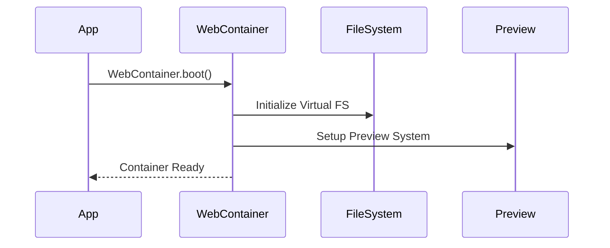

Configuration

WebContainer.boot({

  coep: 'credentialless',  // Cross-Origin Embedder Policy

  workdirName: WORK_DIR_NAME,

  forwardPreviewErrors: true

});

Advantages:

Isolation: Complete sandboxed environment

Security: COEP policy ensures secure execution

Persistence: In-memory file system with state management

Cross-platform: Works in any modern browser

Limitations:

Memory Constraints: Limited by browser memory

No Native File Access: Can't directly access host filesystem

Network Restrictions: Subject to browser's CORS policies

No Binary Execution: Limited to JavaScript/Node.js environment

## 2. File System Implementation

Virtual File System Architecture:

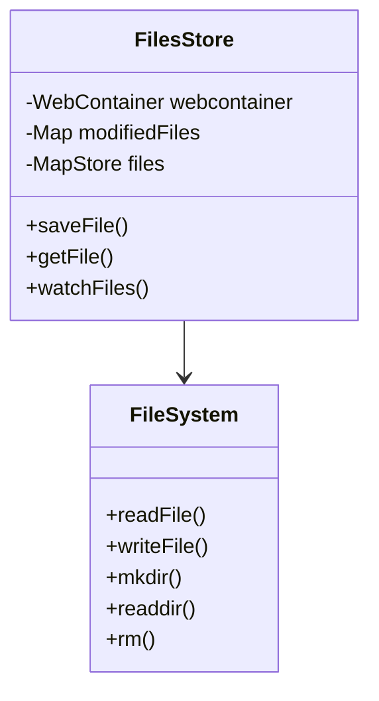

### File Management:

**File Storage:**

interface File {

  type: 'file';

  content: string;

  isBinary: boolean;

}

interface Folder {

  type: 'folder';

}

**File Operations:**

class FilesStore {

  async saveFile(filePath: string, content: string) {

    const webcontainer = await this.#webcontainer;

    const relativePath = path.relative(webcontainer.workdir, filePath);

    await webcontainer.fs.writeFile(relativePath, content);

  }

}

**Change Tracking:**

// Watch for file changes

const watcher = await webcontainer.fs.watch('\*_/_', { 

  persistent: true 

});

**File Syncing Strategy:**

Change Detection:

Uses file watchers for real-time updates

Buffers changes to prevent excessive updates

Tracks modified files separately from base state

**Large File Handling:**

function isBinaryFile(buffer: Uint8Array) {

  return getEncoding(buffer, { chunkLength: 100 }) === 'binary';

}

**Optimization:**

Buffers watch events

Implements debouncing for frequent changes

Uses efficient diff tracking

## 3. Preview System

Architecture:

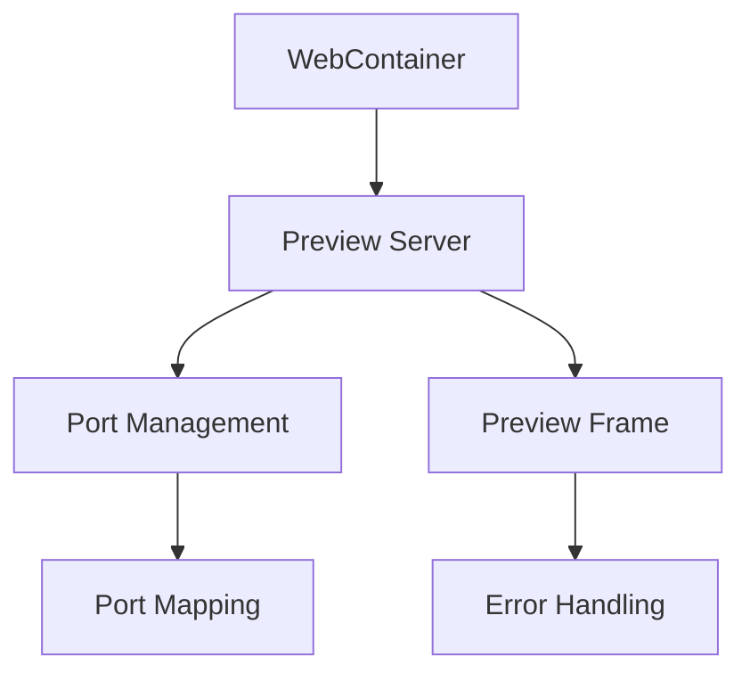

    

Implementation:

Server Setup:

webcontainer.on('server-ready', (port, url) => {

  console.log('[Preview] Server ready on port:', port, url);

  this.broadcastUpdate(url);

});

Port Management:

webcontainer.on('port', (port, type, url) => {

  if (type === 'open') {

    previewInfo = { port, ready: true, baseUrl: url };

    this.#availablePreviews.set(port, previewInfo);

  }

});

Preview Frame:

```ts
<iframe

  ref={iframeRef}

  title="WebContainer Preview"

  sandbox="allow-scripts allow-forms allow-popups allow-modals 

           allow-storage-access-by-user-activation allow-same-origin"

  allow="cross-origin-isolated"

/>
```

Server Capabilities:

Static Serving:

Serves files from virtual filesystem

Handles asset requests

Manages MIME types

Dynamic Features:

Supports live reloading

Handles WebSocket connections

Manages service workers

Error Handling:

webcontainer.on('preview-message', (message) => {

  if (message.type === 'PREVIEW_UNCAUGHT_EXCEPTION') {

    workbenchStore.actionAlert.set({

      type: 'preview',

      title: 'Uncaught Exception',

      description: message.message,

      content: `Error at ${message.pathname}\n${message.stack}`

    });

  }

});

4. Performance Optimizations

File System:

Batch processing of file changes

Efficient diff tracking

Memory-optimized file storage

Preview System:

Lazy loading of preview frames

Resource caching

Efficient port management

Memory Management:

Cleanup of unused resources

Efficient buffer handling

Smart garbage collection

Bolt.diy Technical Documentation

1. Settings System

Overview

The settings system in Bolt.diy provides a flexible way to manage user preferences and application configuration. Settings are organized into different categories and persisted in localStorage.

Settings Categories

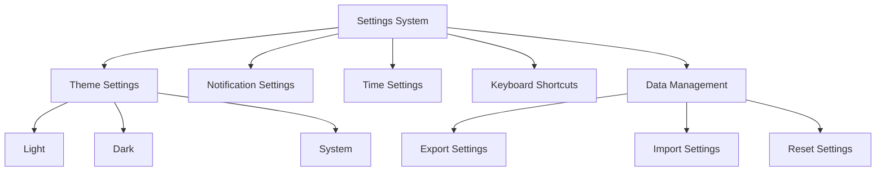

Implementation Details:

Theme Settings

interface ThemeSettings {

theme: 'light' | 'dark' | 'system';

}

Managed through themeStore

Persisted in localStorage with key bolt_user_profile

Supports system theme detection

Notification Settings

interface NotificationSettings {

notifications: boolean;

}

Toggle-based implementation

Real-time updates across components

Uses browser's notification API

Time Settings

Timezone configuration

Uses system default timezone

Supports manual timezone selection

Settings Persistence

interface StoredSettings {

userProfile: string;

settings: string;

exportDate: string;

}

Settings Management

Export/Import

function handleExportSettings(): voidfunction handleImportSettings(event: React.ChangeEvent<HTMLInputElement>): Promise<void>

Storage Implementation

// Settings are stored in localStorage with structured keyslocalStorage.setItem('bolt_user_profile', JSON.stringify({

theme: string;

notifications: boolean;

language: string;

timezone: string;

}));

2. LLM Module Structure

Architecture Overview

Key Components

LLMManager (manager.ts)

class LLMManager {

private \_providers: Map<string, BaseProvider>;

private \_modelList: ModelInfo[];

registerProvider(provider: BaseProvider): void;

getProvider(name: string): BaseProvider;

getAllProviders(): BaseProvider[];

getModelList(): ModelInfo[];

}

Provider Registry (registry.ts)

Central registration of all LLM providers

Supported providers:Anthropic

Cohere

Deepseek

Google

Groq

HuggingFace

Mistral

OpenAI

And others

Provider Interface

interface ProviderInfo {

name: string;

staticModels: ModelInfo[];

getDynamicModels?: (apiKeys?: Record<string, string>,

                      settings?: IProviderSetting,

                      serverEnv?: Record<string, string>) => Promise<ModelInfo[]>;

getModelInstance: (options: ModelOptions) => LanguageModelV1;

getApiKeyLink?: string;

labelForGetApiKey?: string;

icon?: string;

}

Model Information

interface ModelInfo {

name: string;

label: string;

provider: string;

maxTokenAllowed: number;

}

Provider Integration Process

Provider Registration:

private async \_registerProvidersFromDirectory() {

for (const exportedItem of Object.values(providers)) {

    if (exportedItem.prototype instanceof BaseProvider) {

      const provider = new exportedItem();

      this.registerProvider(provider);

    }

}

}

Model Management:

async updateModelList(options: {

apiKeys?: Record<string, string>;

providerSettings?: Record<string, IProviderSetting>;

serverEnv?: Record<string, string>;

}): Promise<ModelInfo[]>

# Document the most critical utility functions used across the codebase.

# I'll help you document the key utility functions used across the codebase. Let me search for utility-related code snippets first.

Related files

[constants.ts](https://github.com/mix-tune-ai/bolt.diy/blob/master/app/utils/constants.ts)[path.ts](https://github.com/mix-tune-ai/bolt.diy/blob/master/app/utils/path.ts)[pnpm-lock.yaml (lines 7716-7751)](https://github.com/mix-tune-ai/bolt.diy/blob/master/pnpm-lock.yaml 'lines 7716-7751')[pnpm-lock.yaml (lines 5052-5089)](https://github.com/mix-tune-ai/bolt.diy/blob/master/pnpm-lock.yaml 'lines 5052-5089')[pnpm-lock.yaml (lines 5247-5288)](https://github.com/mix-tune-ai/bolt.diy/blob/master/pnpm-lock.yaml 'lines 5247-5288')

+5 files

Let me search for more utility-related code.

Related files

[path.ts](https://github.com/mix-tune-ai/bolt.diy/blob/master/app/utils/path.ts)[formatSize.ts](https://github.com/mix-tune-ai/bolt.diy/blob/master/app/utils/formatSize.ts)[os.ts](https://github.com/mix-tune-ai/bolt.diy/blob/master/app/utils/os.ts)[constants.ts](https://github.com/mix-tune-ai/bolt.diy/blob/master/app/utils/constants.ts)[diff.spec.ts (lines 1-11)](https://github.com/mix-tune-ai/bolt.diy/blob/master/app/utils/diff.spec.ts 'lines 1-11')

+1 file

Based on the code snippets found, I'll document the most critical utility functions used across the codebase. Here's the comprehensive documentation:

# Core Utility Functions Documentation

## 1\. Path Utilities

The codebase implements a browser-compatible path manipulation system that mirrors Node.js's path module functionality.

```
// Import from @/app/utils/path.ts

import { path } from '@/app/utils/path';

```

### Core Path Functions

| Function | Description | Example | |----------|-------------|---------| | `path.join()` | Joins path segments | `path.join('dir', 'file.txt')` → `'dir/file.txt'` | | `path.dirname()` | Gets directory name | `path.dirname('/dir/file.txt')` → `'/dir'` | | `path.basename()` | Gets file name | `path.basename('/dir/file.txt')` → `'file.txt'` | | `path.extname()` | Gets file extension | `path.extname('file.txt')` → `'.txt'` | | `path.relative()` | Gets relative path | `path.relative('/dir1', '/dir1/dir2')` → `'dir2'` | | `path.isAbsolute()` | Checks if path is absolute | `path.isAbsolute('/dir')` → `true` | | `path.normalize()` | Normalizes path | `path.normalize('dir//file')` → `'dir/file'` | | `path.parse()` | Parses path into object | `path.parse('/dir/file.txt')` → `{ root: '/', dir: '/dir', ...}` | | `path.format()` | Formats path from object | `path.format({ dir: '/dir', base: 'file.txt' })` → `'/dir/file.txt'` |

## 2\. OS Detection Utilities

Simple utilities for detecting the operating system in browser environments.

```
// Import from @/app/utils/os.ts

import { isMac, isWindows, isLinux } from '@/app/utils/os';

```

| Variable | Description | |----------|-------------| | `isMac` | `true` if running on macOS | | `isWindows` | `true` if running on Windows | | `isLinux` | `true` if running on Linux |

## 3\. File Size Formatting

Utility for human-readable file size formatting.

```
// Import from @/app/utils/formatSize.ts

import { formatSize } from '@/app/utils/formatSize';

```

```
formatSize(1024);     // "1.0 KB"

formatSize(1048576);  // "1.0 MB"

formatSize(1073741824); // "1.0 GB"

```

## 4\. Constants and Configuration

The codebase maintains critical constants in a centralized location:

```
// Import from @/app/utils/constants.ts

import { 

  WORK_DIR_NAME,

  WORK_DIR,

  MODIFICATIONS_TAG_NAME,

  DEFAULT_MODEL,

  PROVIDER_LIST,

  STARTER_TEMPLATES

} from '@/app/utils/constants';

```

### Key Constants

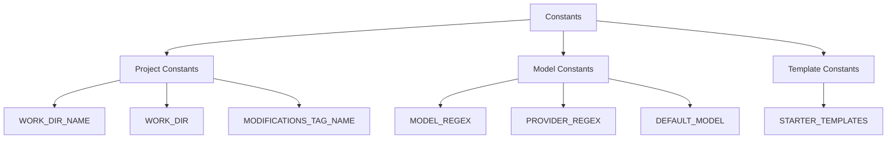

| Constant | Description | Value | |----------|-------------|--------| | `WORK_DIR_NAME` | Project directory name | `'project'` | | `WORK_DIR` | Full project path | `/home/project` | | `MODIFICATIONS_TAG_NAME` | Tag for file modifications | `'bolt_file_modifications'` | | `DEFAULT_MODEL` | Default LLM model | `'claude-3-5-sonnet-latest'` | | `PROMPT_COOKIE_KEY` | Cookie key for cached prompts | `'cachedPrompt'` |

## 5\. Starter Templates

The codebase includes a comprehensive collection of starter templates for various frameworks and technologies. These are defined in `constants.ts` and provide consistent structure for project initialization.

### Template Structure

```
interface Template {

  name: string;

  label: string;

  description: string;

  githubRepo: string;

  tags: string[];

  icon: string;

}

```

Available templates include configurations for:

-    Astro
-    Next.js with shadcn/ui
-    Qwik
-    Remix
-    Slidev
-    SvelteKit
-    Vanilla + Vite
-    React + Vite
-    Vue.js
-    Angular

# Document the most critical utility functions used across the codebase.

# I'll help you document the key utility functions used across the codebase. Let me search for utility-related code snippets first.

Related files

[constants.ts](https://github.com/mix-tune-ai/bolt.diy/blob/master/app/utils/constants.ts)[path.ts](https://github.com/mix-tune-ai/bolt.diy/blob/master/app/utils/path.ts)[pnpm-lock.yaml (lines 7716-7751)](https://github.com/mix-tune-ai/bolt.diy/blob/master/pnpm-lock.yaml 'lines 7716-7751')[pnpm-lock.yaml (lines 5052-5089)](https://github.com/mix-tune-ai/bolt.diy/blob/master/pnpm-lock.yaml 'lines 5052-5089')[pnpm-lock.yaml (lines 5247-5288)](https://github.com/mix-tune-ai/bolt.diy/blob/master/pnpm-lock.yaml 'lines 5247-5288')

+5 files

Let me search for more utility-related code.

Related files

[path.ts](https://github.com/mix-tune-ai/bolt.diy/blob/master/app/utils/path.ts)[formatSize.ts](https://github.com/mix-tune-ai/bolt.diy/blob/master/app/utils/formatSize.ts)[os.ts](https://github.com/mix-tune-ai/bolt.diy/blob/master/app/utils/os.ts)[constants.ts](https://github.com/mix-tune-ai/bolt.diy/blob/master/app/utils/constants.ts)[diff.spec.ts (lines 1-11)](https://github.com/mix-tune-ai/bolt.diy/blob/master/app/utils/diff.spec.ts 'lines 1-11')

+1 file

Based on the code snippets found, I'll document the most critical utility functions used across the codebase. Here's the comprehensive documentation:

# Core Utility Functions Documentation

## 1\. Path Utilities

The codebase implements a browser-compatible path manipulation system that mirrors Node.js's path module functionality.

```
// Import from @/app/utils/path.ts
import { path } from '@/app/utils/path';
```

### Core Path Functions

| Function | Description | Example | |----------|-------------|---------| | `path.join()` | Joins path segments | `path.join('dir', 'file.txt')` → `'dir/file.txt'` | | `path.dirname()` | Gets directory name | `path.dirname('/dir/file.txt')` → `'/dir'` | | `path.basename()` | Gets file name | `path.basename('/dir/file.txt')` → `'file.txt'` | | `path.extname()` | Gets file extension | `path.extname('file.txt')` → `'.txt'` | | `path.relative()` | Gets relative path | `path.relative('/dir1', '/dir1/dir2')` → `'dir2'` | | `path.isAbsolute()` | Checks if path is absolute | `path.isAbsolute('/dir')` → `true` | | `path.normalize()` | Normalizes path | `path.normalize('dir//file')` → `'dir/file'` | | `path.parse()` | Parses path into object | `path.parse('/dir/file.txt')` → `{ root: '/', dir: '/dir', ...}` | | `path.format()` | Formats path from object | `path.format({ dir: '/dir', base: 'file.txt' })` → `'/dir/file.txt'` |

## 2\. OS Detection Utilities

Simple utilities for detecting the operating system in browser environments.

```
// Import from @/app/utils/os.ts
import { isMac, isWindows, isLinux } from '@/app/utils/os';
```

| Variable | Description | |----------|-------------| | `isMac` | `true` if running on macOS | | `isWindows` | `true` if running on Windows | | `isLinux` | `true` if running on Linux |

## 3\. File Size Formatting

Utility for human-readable file size formatting.

```
// Import from @/app/utils/formatSize.ts
import { formatSize } from '@/app/utils/formatSize';
```

```
formatSize(1024);     // "1.0 KB"
formatSize(1048576);  // "1.0 MB"
formatSize(1073741824); // "1.0 GB"
```

## 4\. Constants and Configuration

The codebase maintains critical constants in a centralized location:

```
// Import from @/app/utils/constants.ts
import {
  WORK_DIR_NAME,
  WORK_DIR,
  MODIFICATIONS_TAG_NAME,
  DEFAULT_MODEL,
  PROVIDER_LIST,
  STARTER_TEMPLATES
} from '@/app/utils/constants';
```

### Key Constants


| Constant | Description | Value | |----------|-------------|--------| | `WORK_DIR_NAME` | Project directory name | `'project'` | | `WORK_DIR` | Full project path | `/home/project` | | `MODIFICATIONS_TAG_NAME` | Tag for file modifications | `'bolt_file_modifications'` | | `DEFAULT_MODEL` | Default LLM model | `'claude-3-5-sonnet-latest'` | | `PROMPT_COOKIE_KEY` | Cookie key for cached prompts | `'cachedPrompt'` |

## 5\. Starter Templates

The codebase includes a comprehensive collection of starter templates for various frameworks and technologies. These are defined in `constants.ts` and provide consistent structure for project initialization.

### Template Structure

```
interface Template {
  name: string;
  label: string;
  description: string;
  githubRepo: string;
  tags: string[];
  icon: string;
}
```

Available templates include configurations for:

- Astro
- Next.js with shadcn/ui
- Qwik
- Remix
- Slidev
- SvelteKit
- Vanilla + Vite
- React + Vite
- Vue.js
- Angular

Would you like me to provide more detailed information about any specific utility or add documentation for additional functionalities?

Document how the APIs work

I'll search for API-related code to document their functionality.

Related files

[api.health.ts](https://github.com/mix-tune-ai/bolt.diy/blob/master/app/routes/api.health.ts)[api.chat.ts](https://github.com/mix-tune-ai/bolt.diy/blob/master/app/routes/api.chat.ts)[api.git-proxy.$.ts](https://github.com/mix-tune-ai/bolt.diy/blob/master/app/routes/api.git-proxy.$.ts)[api.system.app-info.ts](https://github.com/mix-tune-ai/bolt.diy/blob/master/app/routes/api.system.app-info.ts)[api.check-env-key.ts](https://github.com/mix-tune-ai/bolt.diy/blob/master/app/routes/api.check-env-key.ts)

+4 files

Document how the APIs work

Document how the APIs work

I'll document the API endpoints and their functionality based on the code found. Here's a comprehensive API documentation:

# Bolt.DIY API Documentation

## API Endpoints Overview

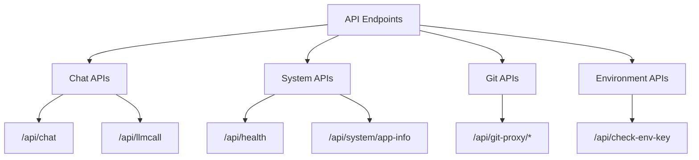

## 1\. Chat APIs

### POST `/api/chat`

Main endpoint for chat interactions with LLM models.

**Request Body:**

```
{
  messages: Messages[];          // Chat messages history
  files?: FileMap;              // Code files for context
  promptId?: string;            // Optional prompt identifier
  contextOptimization: boolean; // Whether to use context optimization
}
```

**Headers:**

```
{
  Cookie: string; // Contains apiKeys and provider settings
}
```

**Response:**

- Content-Type: `text/event-stream`
- Streaming response with chat completion
- Includes progress updates and context annotations

**Features:**

- Context optimization
- Chat summarization
- File context selection
- Token usage tracking
- Progress reporting

### POST `/api/llmcall`

Direct LLM model interaction endpoint.

**Request Body:**

```
{
  system: string;           // System prompt
  message: string;          // User message
  model: string;           // LLM model name
  provider: ProviderInfo;  // Provider information
  streamOutput?: boolean;  // Enable streaming response
}
```

**Response:**

- For streaming: `text/plain` stream
- For non-streaming: JSON response with completion

## 2\. System APIs

### GET `/api/health`

Health check endpoint for the application.

**Response:**

```
{
  "status": "healthy",
  "timestamp": "ISO-8601-timestamp",
  "uptime": "process-uptime-in-seconds"
}
```

### GET `/api/system/app-info`

Provides detailed application information.

**Response:**

```
{
  name: string;              // Application name
  version: string;           // Version number
  description: string;       // App description
  license: string;           // License type
  environment: string;       // Runtime environment
  gitInfo: {
    commitHash: string;      // Git commit hash
    branch: string;          // Current branch
    commitTime: string;      // Last commit time
    author: string;          // Commit author
    email: string;          // Author email
    remoteUrl: string;      // Git remote URL
    repoName: string;       // Repository name
  };
  timestamp: string;         // Current timestamp
  runtimeInfo: {
    nodeVersion: string;     // Node.js version
  };
  dependencies: {
    production: Dependency[];
    development: Dependency[];
    peer: Dependency[];
    optional: Dependency[];
  };
}
```

## 3\. Git Proxy API

### ALL `/api/git-proxy/*`

Proxy endpoint for Git operations.

**Features:**

- Supports all HTTP methods
- CORS enabled
- Forwards requests to Git providers
- Error handling

**CORS Headers:**

```
{
  'Access-Control-Allow-Origin': '*',
  'Access-Control-Allow-Methods': 'GET, POST, PUT, DELETE, OPTIONS',
  'Access-Control-Allow-Headers': '*'
}
```

## 4\. Environment API

### GET `/api/check-env-key`

Checks if environment keys are properly configured.

**Query Parameters:**

```
?provider=<provider-name>
```

**Response:**

```
{
  "isSet": boolean
}
```

## Error Handling

All APIs implement consistent error handling:

| Status Code | Description | |------------|-------------| | 200 | Success | | 400 | Bad Request - Invalid parameters | | 401 | Unauthorized - Invalid/missing API key | | 500 | Internal Server Error |

## Authentication

APIs use cookie-based authentication for:

- API Keys
- Provider Settings

```
interface CookieAuth {
  apiKeys: Record<string, string>;
  providers: Record<string, IProviderSetting>;
}
```

## Rate Limiting and Tokens

- Maximum response segments: Defined by `MAX_RESPONSE_SEGMENTS`
- Maximum tokens: Defined by `MAX_TOKENS` or model-specific limits
- Token usage tracking available in chat responses

Would you like more detailed information about any specific API endpoint or additional aspects of the API system?

# I'll help create an overview of the key services and modules. Let me search through the codebase to identify the main components.

Related files

[ServiceStatusTab.tsx](https://github.com/mix-tune-ai/bolt.diy/blob/master/app/components/@settings/tabs/providers/service-status/ServiceStatusTab.tsx)
[provider-factory.ts](https://github.com/mix-tune-ai/bolt.diy/blob/master/app/components/@settings/tabs/providers/service-status/provider-factory.ts)[ServiceStatusTab.tsx (lines 785-824)](https://github.com/mix-tune-ai/bolt.diy/blob/master/app/components/@settings/tabs/providers/status/ServiceStatusTab.tsx 'lines 785-824')[ServiceStatusTab.tsx (lines 825-863)](https://github.com/mix-tune-ai/bolt.diy/blob/master/app/components/@settings/tabs/providers/status/ServiceStatusTab.tsx 'lines 825-863')[mistral.ts (lines 48-75)](https://github.com/mix-tune-ai/bolt.diy/blob/master/app/components/@settings/tabs/providers/service-status/providers/mistral.ts 'lines 48-75')

+3 files

Let me search for more information about the application structure.

Related files

[root.tsx](https://github.com/mix-tune-ai/bolt.diy/blob/master/app/root.tsx)[chat.$id.tsx](https://github.com/mix-tune-ai/bolt.diy/blob/master/app/routes/chat.$id.tsx)[\_index.tsx](https://github.com/mix-tune-ai/bolt.diy/blob/master/app/routes/_index.tsx)[api.system.app-info.ts](https://github.com/mix-tune-ai/bolt.diy/blob/master/app/routes/api.system.app-info.ts)[git.tsx](https://github.com/mix-tune-ai/bolt.diy/blob/master/app/routes/git.tsx)

+4 files

Based on the code analysis, I'll create a comprehensive overview of the key services and modules in the Bolt.DIY application. Here's the documentation:

# Bolt.DIY System Architecture Overview

## Core Components

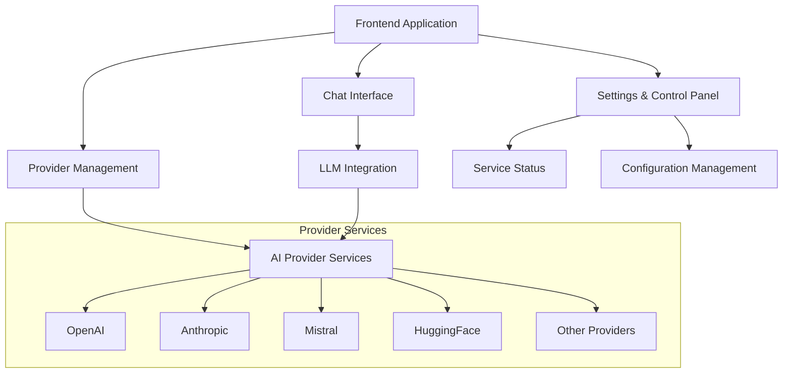

#### Provider Services

    •	OpenAI
    •	AI Provider Services
    •	Anthropic
    •	Mistral
    •	HuggingFace
    •	Other Providers
    •	Frontend Application
    •	Chat Interface
    •	Settings & Control Panel
    •	Provider Management
    •	LLM Integration
    •	Service Status
    •	Configuration Management

### 1\. Core Application Structure

The application is built using a modern web stack with the following main components:

| Component | Description | |-----------|------------| | Root Application | Handles theme management, global state, and layout structure | | Chat Interface | Main interaction point for users with AI models | | Control Panel | Settings and configuration management interface | | Provider Management | Handles integration with various AI service providers |

### 2\. Service Provider Integration

The application supports multiple AI service providers through a modular architecture:

| Provider | Features | |----------|-----------| | OpenAI | GPT model integration | | Anthropic | Claude model integration | | Mistral | Mistral AI models | | Google | Gemini models | | HuggingFace | Open-source model hosting | | Cohere | Command models | | Amazon Bedrock | AWS AI services | | Perplexity | PPLX models | | Together | Model aggregation |

### 3\. Key Modules

#### 3.1 Service Status Management

- Monitors health and availability of AI providers
- Implements status checking for each provider
- Provides real-time status updates and incident reporting

#### 3.2 Provider Factory System

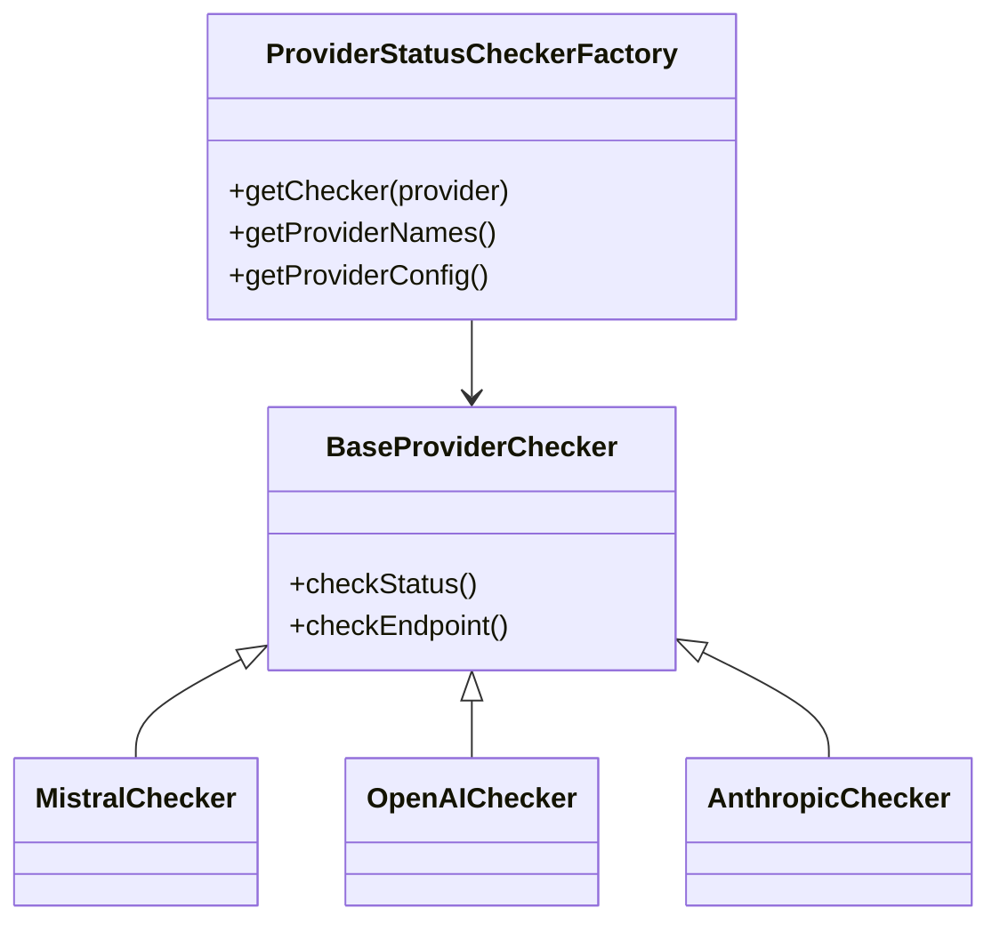

ProviderStatusCheckerFactory

+getChecker(provider)

+getProviderNames()

+getProviderConfig()

BaseProviderChecker

+checkStatus()

+checkEndpoint()

MistralChecker

OpenAIChecker

AnthropicChecker

WebContainer

File System

Terminal

Preview System

File Store

File Watcher

Shell Process

Command Execution

Preview Server

Browser Preview

Action Runner

spawn('/bin/jsh')Create TerminalInitialize ShellWait for Interactive ModeReady for Commands

#### 3.3 Settings Management

- Tab-based configuration system
- Developer and user mode settings
- Service configuration management
- API key management

### 4\. Application Routes

| Route | Purpose | |-------|---------| | / | Main chat interface | | /chat/:id | Individual chat sessions | | /git | Git repository integration | | /api/system | System information and management |

### 5\. Development Tools

The application includes comprehensive development tools:

- Feature management
- Cloud provider configuration
- Local provider setup
- Connection management
- Event logging
- Service status monitoring
- Debug tools
- Update management

Would you like me to expand on any particular aspect of this overview or provide more detailed documentation for specific components?

How does the file system, terminal, and the web browser work? Also how does the actual code execute and report back to the LLM. What knowledge of the active code it has generated does it have including outputs and terminal and possible types and directories and files? Pretty much I want to know how does the AI code editor work

Let me search for relevant components related to the code execution and file system integration.

Related files

[shell.ts (lines 1-67)](https://github.com/mix-tune-ai/bolt.diy/blob/master/app/utils/shell.ts 'lines 1-67')[shell.ts (lines 68-141)](https://github.com/mix-tune-ai/bolt.diy/blob/master/app/utils/shell.ts 'lines 68-141')[shell.ts (lines 142-216)](https://github.com/mix-tune-ai/bolt.diy/blob/master/app/utils/shell.ts 'lines 142-216')[terminal.ts (lines 1-60)](https://github.com/mix-tune-ai/bolt.diy/blob/master/app/lib/stores/terminal.ts 'lines 1-60')[files.ts (lines 1-73)](https://github.com/mix-tune-ai/bolt.diy/blob/master/app/lib/stores/files.ts 'lines 1-73')

+1 file

Let me search for more information about the web container and code execution components.

Related files

[index.ts (lines 1-55)](https://github.com/mix-tune-ai/bolt.diy/blob/master/app/lib/webcontainer/index.ts 'lines 1-55')[index.ts (lines 56-59)](https://github.com/mix-tune-ai/bolt.diy/blob/master/app/lib/webcontainer/index.ts 'lines 56-59')[previews.ts (lines 140-204)](https://github.com/mix-tune-ai/bolt.diy/blob/master/app/lib/stores/previews.ts 'lines 140-204')[shell.ts (lines 1-67)](https://github.com/mix-tune-ai/bolt.diy/blob/master/app/utils/shell.ts 'lines 1-67')[shell.ts (lines 68-141)](https://github.com/mix-tune-ai/bolt.diy/blob/master/app/utils/shell.ts 'lines 68-141')

+2 files

Based on the code analysis, I can provide a detailed explanation of how the AI code editor system works, particularly focusing on file system, terminal, and code execution aspects:

# AI Code Editor System Architecture

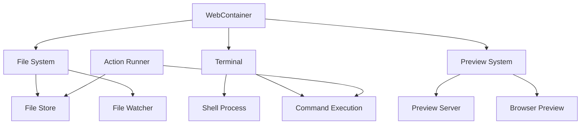

## 1\. WebContainer Core

The system uses WebContainer API as its foundation, which provides an isolated environment for code execution:

```
WebContainer.boot({
  coep: 'credentialless',
  workdirName: WORK_DIR_NAME,
  forwardPreviewErrors: true
});
```

### Key Components:

1.  **File System**

```
interface File {
  type: 'file';
  content: string;
  isBinary: boolean;
}

interface Folder {
  type: 'folder';
}
```

2.  **Terminal Interface**

```
interface ITerminal {
  cols: number;
  rows: number;
  write: (data: string) => void;
  onData: (callback: (data: string) => void) => void;
}
```

## 2\. Code Execution Flow

### Terminal Management:

1.  **Shell Process Creation**:

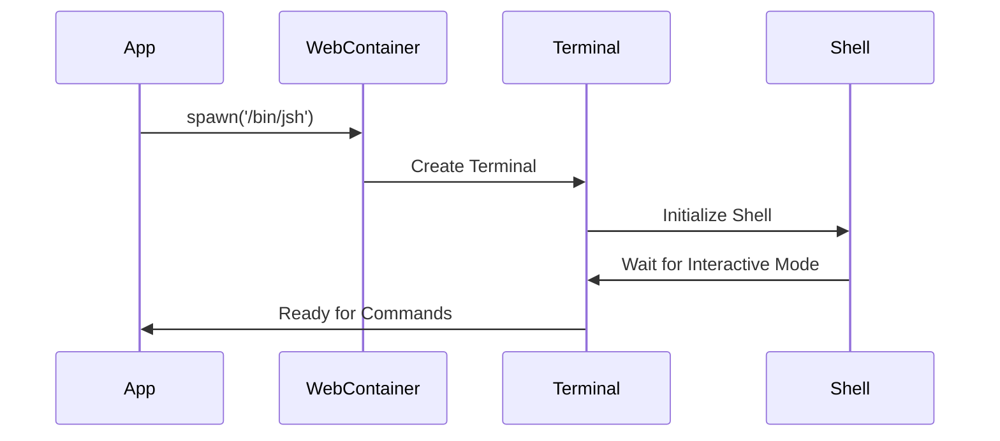

2.  **Command Execution**:

```
async executeCommand(sessionId: string, command: string): Promise<ExecutionResult> {
  // 1. Interrupt any running command
  this.terminal.input('\x03');

  // 2. Wait for prompt
  await this.waitTillOscCode('prompt');

  // 3. Execute new command
  this.terminal.input(command.trim() + '\n');

  // 4. Wait for result
  const executionPromise = this.getCurrentExecutionResult();

  // 5. Return cleaned output
  return resp;
}
```

## 3\. File System Operations

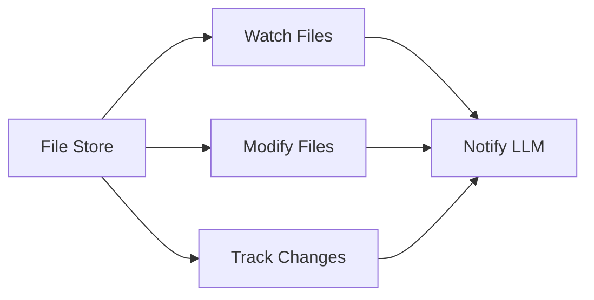

File Store

Watch Files

Modify Files

Track Changes

Notify LLM

Generate Code ActionExecute CodeRun CommandReturn OutputUpdate PreviewReport Results

Key features:

- Real-time file watching
- Change tracking
- Binary file detection
- File modification history

## 4\. Preview System

The preview system manages live previews of the code:

```
webcontainer.on('server-ready', (port, url) => {
  // 1. Broadcast preview URL
  // 2. Sync storage
  // 3. Setup file watchers
});
```

## 5\. LLM Integration

The system maintains knowledge of:

1.  **File Context**:

- Current file structure
- File contents
- Recent modifications
- File types and encodings

2.  **Execution Context**:

- Command outputs
- Error messages
- Terminal state
- Process status

3.  **Runtime Information**:

- Available commands
- Environment variables
- System state
- Preview status

## 6\. Code Generation and Execution Cycle

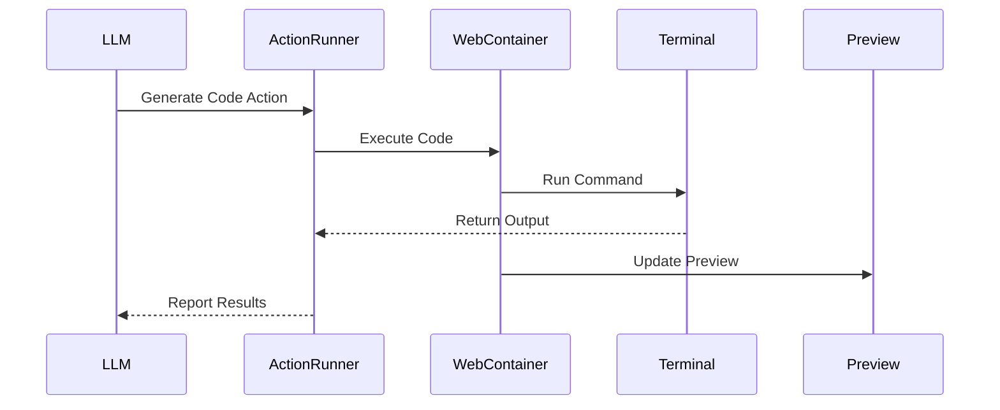

## 7\. Code Knowledge System

The LLM maintains awareness through:

1.  **File System Events**:

- File creation/modification/deletion
- Directory structure changes
- File content updates

2.  **Execution Results**:

- Command outputs
- Error messages
- Process exit codes
- Terminal state

3.  **Preview Updates**:

- Server status
- Preview URLs
- Runtime errors
- DOM changes

Would you like me to expand on any particular aspect of this system or provide more detailed documentation about specific components?


# LLM Prompt Construction and Contextualization:

Question: How are prompts constructed to include relevant context from the codebase (e.g., file contents, function definitions, variable names)? Are there any specific strategies or techniques used to ensure the LLM receives the appropriate context for generating relevant code?
Files: app/lib/.server/llm/prompts.ts, app/lib/.server/llm/select-context.ts, app/routes/api.chat.ts

LLM Prompt Construction and Contextualization: Question: How are prompts constructed to include relevant context from the codebase (e.g., file contents, function definitions, variable names)? Are there any specific strategies or techniques used to ensure the LLM receives the appropriate context for generating relevant code? Files: app/lib/.server/llm/prompts.ts, app/lib/.server/llm/select-context.ts, app/routes/api.chat.ts

I'll help generate documentation about prompt construction and contextualization in the codebase. Let me search for relevant code snippets.

Related files

[prompts.ts](https://github.com/mix-tune-ai/bolt.diy/blob/master/app/lib/common/prompts/prompts.ts)[optimized.ts (lines 1-37)](https://github.com/mix-tune-ai/bolt.diy/blob/master/app/lib/common/prompts/optimized.ts 'lines 1-37')[index.md (lines 249-255)](https://github.com/mix-tune-ai/bolt.diy/blob/master/docs/docs/index.md 'lines 249-255')

Let me search for context selection code:

Related files

[select-context.ts](https://github.com/mix-tune-ai/bolt.diy/blob/master/app/lib/.server/llm/select-context.ts)[api.chat.ts (lines 131-184)](https://github.com/mix-tune-ai/bolt.diy/blob/master/app/routes/api.chat.ts 'lines 131-184')[prompt-library.ts (lines 1-49)](https://github.com/mix-tune-ai/bolt.diy/blob/master/app/lib/common/prompt-library.ts 'lines 1-49')[FeaturesTab.tsx (lines 223-275)](https://github.com/mix-tune-ai/bolt.diy/blob/master/app/components/@settings/tabs/features/FeaturesTab.tsx 'lines 223-275')[stream-text.ts (lines 123-177)](https://github.com/mix-tune-ai/bolt.diy/blob/master/app/lib/.server/llm/stream-text.ts 'lines 123-177')

+1 file

Based on the code snippets, I'll generate comprehensive documentation about how prompts are constructed and contextualized in the codebase.

# LLM Prompt Construction and Contextualization Documentation

## Overview

The codebase implements a sophisticated system for constructing prompts and managing context for LLM interactions. The system consists of several key components that work together to provide relevant context from the codebase to the LLM.

## Core Components

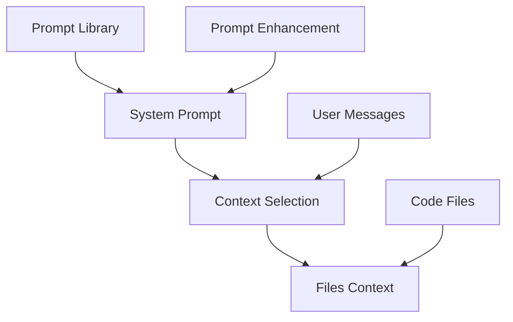

Prompt Library

System Prompt

Context Selection

Files Context

User Messages

Code Files

Prompt Enhancement

## 1\. Prompt Library

The prompt library manages different types of system prompts:

- **Default Prompt**: The battle-tested primary system prompt
- **Optimized Prompt**: An experimental version for lower token usage
- **Customizable Options**: Supports configuration of:
  - Working directory
  - Allowed HTML elements
  - Modification tag names

## 2\. Context Selection System

### Process Flow

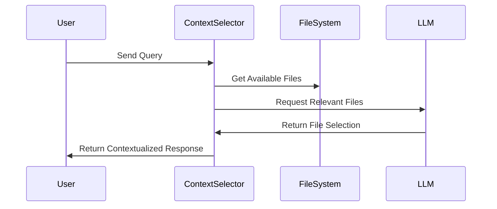

### Key Features

1.  **File Filtering**:

    - Uses .gitignore-like patterns to filter irrelevant files
    - Maintains a context buffer limited to 5 files
    - Dynamically updates context based on query relevance

2.  **Context Optimization**:

    - Automatically selects relevant files based on user queries
    - Maintains context memory across conversation
    - Supports file inclusion/exclusion through XML-like tags

3.  **Buffer Management**:

    ```
    interface ContextBuffer {
      currentFiles: string[];
      contextFiles: FileMap;
      maxFiles: number = 5;
    }
    ```

## 3\. Implementation Details

### File Context Creation

```
// Example context formation
const context = createFilesContext({
  'file1.ts': content1,
  'file2.ts': content2
});
```

### Context Selection Rules

1.  Only include absolutely necessary files
2.  Maximum 5 files in context buffer
3.  Exclude files when buffer is full
4.  Priority to most relevant files for current query

### Response Format

```
<updateContextBuffer>
    <includeFile path="path/to/file"/>
    <excludeFile path="path/to/file"/>
</updateContextBuffer>
```

## Best Practices

1.  **Context Optimization**:

    - Enable `contextOptimization` for better file selection
    - Use prompt enhancement for complex queries
    - Maintain minimal but sufficient context

2.  **File Selection**:

    - Keep context buffer size optimal
    - Regularly update context based on conversation flow
    - Remove irrelevant files from context

Would you like me to elaborate on any specific aspect of the documentation or add more details to certain sections?

# AI-Driven Code Completion and Integration with CodeMirror:

Question: Does the editor provide AI-driven code completion suggestions? If so, how is this implemented? How is the AI integrated with CodeMirror to provide these suggestions in real-time?
Files: app/components/editor/codemirror/CodeMirrorEditor.tsx, app/lib/modules/llm/manager.ts, app/lib/modules/llm/providers/\*.ts

AI-Driven Code Completion and Integration with CodeMirror: Question: Does the editor provide AI-driven code completion suggestions? If so, how is this implemented? How is the AI integrated with CodeMirror to provide these suggestions in real-time? Files: app/components/editor/codemirror/CodeMirrorEditor.tsx, app/lib/modules/llm/manager.ts, app/lib/modules/llm/providers/\*.ts

I'll help you generate documentation about AI-driven code completion in the codebase. Let me search for relevant code snippets.

Related files

[languages.ts](https://github.com/mix-tune-ai/bolt.diy/blob/master/app/components/editor/codemirror/languages.ts)[CodeMirrorEditor.tsx (lines 1-60)](https://github.com/mix-tune-ai/bolt.diy/blob/master/app/components/editor/codemirror/CodeMirrorEditor.tsx 'lines 1-60')[CodeMirrorEditor.tsx (lines 265-322)](https://github.com/mix-tune-ai/bolt.diy/blob/master/app/components/editor/codemirror/CodeMirrorEditor.tsx 'lines 265-322')[CodeMirrorEditor.tsx (lines 323-401)](https://github.com/mix-tune-ai/bolt.diy/blob/master/app/components/editor/codemirror/CodeMirrorEditor.tsx 'lines 323-401')[CodeMirrorEditor.tsx (lines 402-455)](https://github.com/mix-tune-ai/bolt.diy/blob/master/app/components/editor/codemirror/CodeMirrorEditor.tsx 'lines 402-455')

+5 files

Let me search for LLM-related implementations.

Related files

[manager.ts (lines 1-58)](https://github.com/mix-tune-ai/bolt.diy/blob/master/app/lib/modules/llm/manager.ts 'lines 1-58')[manager.ts (lines 59-108)](https://github.com/mix-tune-ai/bolt.diy/blob/master/app/lib/modules/llm/manager.ts 'lines 59-108')[registry.ts (lines 1-40)](https://github.com/mix-tune-ai/bolt.diy/blob/master/app/lib/modules/llm/registry.ts 'lines 1-40')[constants.ts (lines 1-25)](https://github.com/mix-tune-ai/bolt.diy/blob/master/app/utils/constants.ts 'lines 1-25')[lmstudio.ts (lines 1-50)](https://github.com/mix-tune-ai/bolt.diy/blob/master/app/lib/modules/llm/providers/lmstudio.ts 'lines 1-50')

+3 files

Based on the code analysis, I'll generate comprehensive documentation about the AI-driven code completion and CodeMirror integration in the system.

# AI-Driven Code Completion in CodeMirror Editor

## Overview

The codebase implements a CodeMirror-based editor with AI-driven code completion capabilities through integration with various Language Model (LLM) providers. The implementation consists of several key components working together to provide intelligent code suggestions.

## Architecture

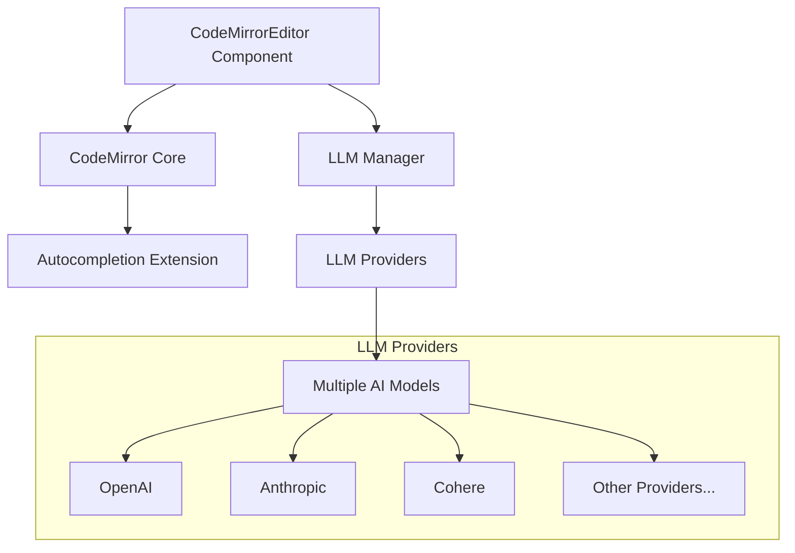

LLM Providers

OpenAI

Multiple AI Models

Anthropic

Cohere

Other Providers...

CodeMirrorEditor Component

CodeMirror Core

Autocompletion Extension

LLM Manager

LLM Providers

## Key Components

### 1\. CodeMirror Editor Integration

The CodeMirrorEditor component (`app/components/editor/codemirror/CodeMirrorEditor.tsx`) implements the following features:

```
// Core completion configuration
autocompletion({
  closeOnBlur: false,
})
```

Key features:

- Built-in CodeMirror autocompletion extension
- Custom keybinding for completion acceptance (Tab key)
- Support for multiple language modes
- Real-time completion suggestions

### 2\. Language Support

The editor supports multiple programming languages through dynamic loading:

| Language | File Extensions | |------------|-------------------------| | TypeScript | .ts, .tsx | | JavaScript | .js, .jsx, .mjs, .cjs | | Vue | .vue | | HTML | .html | | CSS | .css | | SASS/SCSS | .sass, .scss | | JSON | .json | | Python | .py | | C++ | .cpp | | Markdown | .md |

### 3\. LLM Integration

The LLM Manager (`app/lib/modules/llm/manager.ts`) handles the integration with AI providers:

```
export class LLMManager {
  private _providers: Map<string, BaseProvider>;
  private _modelList: ModelInfo[];

  // Register and manage AI providers
  registerProvider(provider: BaseProvider);
  getProvider(name: string): BaseProvider;
  getAllProviders(): BaseProvider[];
}
```

Supported AI Providers:

- OpenAI
- Anthropic
- Cohere
- Google
- Mistral
- HuggingFace
- And many others through the provider registry

### 4\. Code Completion Flow

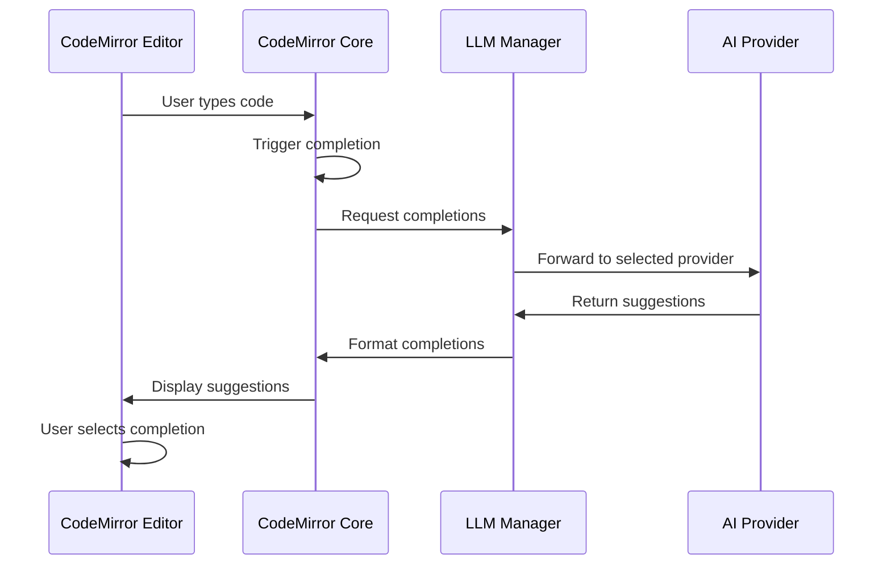

## Configuration

The editor can be configured through the `EditorSettings` interface:

```
interface EditorSettings {
  fontSize?: string;
  gutterFontSize?: string;
  tabSize?: number;
}
```

## Editor Features

1.  **Real-time Completion**

    - Automatic trigger on typing
    - Tab key to accept suggestions
    - Support for multiple cursors

2.  **Language-Aware Suggestions**

    - Syntax-aware completions
    - File extension-based language detection
    - Dynamic language support loading

3.  **AI Provider Integration**

    - Multiple provider support
    - Configurable API endpoints
    - Model selection
    - Caching support for performance

4.  **Editor State Management**

    - Per-file state preservation
    - Scroll position memory
    - Selection state preservation

## Usage Example

```
<CodeMirrorEditor
  theme={theme}
  editable={!isStreaming}
  settings={editorSettings}
  doc={editorDocument}
  autoFocusOnDocumentChange={!isMobile()}
  onScroll={onEditorScroll}
  onChange={onEditorChange}
  onSave={onFileSave}
/>
```

Would you like me to expand on any particular aspect of the documentation or add more details to specific sections?

# Virtual Environment Management within the WebContainer:

Question: How are virtual environments created and managed within the WebContainer? Are there any scripts or tools used for this? How are dependencies installed and isolated within the virtual environment?
Files: app/lib/webcontainer/index.ts, app/utils/shell.ts, Dockerfile, .env.example

Virtual Environment Management within the WebContainer: Question: How are virtual environments created and managed within the WebContainer? Are there any scripts or tools used for this? How are dependencies installed and isolated within the virtual environment? Files: app/lib/webcontainer/index.ts, app/utils/shell.ts, Dockerfile, .env.example

I'll help you investigate how virtual environments are managed in the WebContainer. Let me search for relevant code snippets.

Related files

[prompts.ts](https://github.com/mix-tune-ai/bolt.diy/blob/master/app/lib/common/prompts/prompts.ts)[index.ts](https://github.com/mix-tune-ai/bolt.diy/blob/master/app/lib/webcontainer/index.ts)[CONTRIBUTING.md](https://github.com/mix-tune-ai/bolt.diy/blob/master/docs/docs/CONTRIBUTING.md)[CONTRIBUTING.md](https://github.com/mix-tune-ai/bolt.diy/blob/master/CONTRIBUTING.md)[docker-compose.yaml](https://github.com/mix-tune-ai/bolt.diy/blob/master/docker-compose.yaml)

+3 files

Let me search for more specific information about Python environment management.

Related files

[prompts.ts (lines 1-24)](https://github.com/mix-tune-ai/bolt.diy/blob/master/app/lib/common/prompts/prompts.ts 'lines 1-24')[CONTRIBUTING.md (lines 80-195)](https://github.com/mix-tune-ai/bolt.diy/blob/master/docs/docs/CONTRIBUTING.md 'lines 80-195')[CONTRIBUTING.md (lines 196-240)](https://github.com/mix-tune-ai/bolt.diy/blob/master/docs/docs/CONTRIBUTING.md 'lines 196-240')[CONTRIBUTING.md (lines 80-195)](https://github.com/mix-tune-ai/bolt.diy/blob/master/CONTRIBUTING.md 'lines 80-195')[CONTRIBUTING.md (lines 196-240)](https://github.com/mix-tune-ai/bolt.diy/blob/master/CONTRIBUTING.md 'lines 196-240')

+1 file

Based on the code snippets and documentation, I can provide information about how virtual environments are managed within the WebContainer. Here's the documentation:

# Virtual Environment Management in WebContainer

## Overview

The WebContainer provides a specialized environment for running Python code with specific limitations and constraints around virtual environment management and package installation.

## Key Characteristics

### Python Runtime Environment

```mermaid
graph TD
    A[WebContainer] --> B[Python Runtime]
    B --> C[Python Standard Library]
    B --> D[Limited Environment]
    D --> E[No pip support]
    D --> F[No third-party packages]
    D --> G[Limited stdlib modules]
```

WebContainer

Python Runtime

Python Standard Library

Limited Environment

No pip support

No third-party packages

Limited stdlib modules

### Environment Constraints

1.  **Python Binaries**

    - Both `python` and `python3` commands are available
    - Limited to Python Standard Library only
    - No virtual environment creation support (`venv`, `virtualenv`)

2.  **Package Management**

    - No `pip` support available
    - Cannot install third-party libraries
    - Cannot use package managers

3.  **Standard Library Limitations**

    - Only core Python standard library modules available
    - Modules requiring system dependencies (e.g., `curses`) are not available

## Working within Constraints

### Best Practices

1.  **Standard Library Usage**

    - Rely exclusively on Python's built-in standard library modules
    - Avoid code requiring external dependencies

2.  **Alternative Approaches**

    - Use Node.js-based solutions when additional functionality is needed
    - Leverage browser-native capabilities through WebAssembly when possible

### Code Example

```
# Valid usage - only standard library
import json
import os
import sys
import datetime

# Invalid usage - will fail
# import requests  # External package
# import numpy     # External package
# import venv      # Virtual environment module
```

## Technical Implementation

The WebContainer uses an in-browser Node.js runtime that:

- Emulates a Linux-like environment
- Executes code directly in the browser
- Cannot run native binaries
- Supports only browser-native code (JS, WebAssembly)

## Limitations and Solutions

| Limitation | Impact | Solution | |------------|---------|----------| | No pip support | Cannot install packages | Use standard library only | | No virtual environments | No isolation between projects | Each WebContainer instance is isolated by default | | Limited stdlib modules | Some standard modules unavailable | Use available alternatives or Node.js solutions |

Would you like me to provide more specific details about any aspect of the virtual environment management in WebContainer?

# Prompts and Actions, Agents and Workbench

Question: How does the prompts work with custom actions? It looks like we have <system_constraints> boltArtifact boltAction in the prompt.ts and many more. Where do you create custom bolt actions? Also the workbench.ts and workbench.client.ts how does that work and what purpose do they serve? Are there any agents and where do you add them and what current ones exist?

How does the prompts work with custom actions? It looks like we have <system_constraints> boltArtifact boltAction in the prompt.ts and many more. Where do you create custom bolt actions? Also the workbench.ts and workbench.client.ts how does that work and what purpose do they serve? Are there any agents and where do you add them and what current ones exist?

I'll help you analyze how prompts work with custom actions in the system. Let me search for relevant code snippets.

Related files

[prompts.ts](https://github.com/mix-tune-ai/bolt.diy/blob/master/app/lib/common/prompts/prompts.ts)[optimized.ts](https://github.com/mix-tune-ai/bolt.diy/blob/master/app/lib/common/prompts/optimized.ts)

Let me search for more information about workbench and custom actions.

Related files

[workbench.ts (lines 262-339)](https://github.com/mix-tune-ai/bolt.diy/blob/master/app/lib/stores/workbench.ts 'lines 262-339')[Workbench.client.tsx (lines 122-161)](https://github.com/mix-tune-ai/bolt.diy/blob/master/app/components/workbench/Workbench.client.tsx 'lines 122-161')[workbench.ts (lines 48-109)](https://github.com/mix-tune-ai/bolt.diy/blob/master/app/lib/stores/workbench.ts 'lines 48-109')[Workbench.client.tsx (lines 210-230)](https://github.com/mix-tune-ai/bolt.diy/blob/master/app/components/workbench/Workbench.client.tsx 'lines 210-230')[Workbench.client.tsx (lines 62-121)](https://github.com/mix-tune-ai/bolt.diy/blob/master/app/components/workbench/Workbench.client.tsx 'lines 62-121')

+4 files

Based on the code analysis, let me explain how prompts work with custom actions and the workbench system:

1.  **Prompts and Custom Actions**

The system uses a structured prompt system with several key components:

```mermaid
graph TD
    A[Prompt System] --> B[System Constraints]
    A --> C[Code Formatting]
    A --> D[Message Formatting]
    A --> E[Artifacts]
    E --> F[BoltArtifact Tag]
    F --> G[BoltAction Tags]
    G --> H[shell - Run commands]
    G --> I[file - Write/update files]
    G --> J[start - Start dev server]
```

Prompt System

System Constraints

Code Formatting

Message Formatting

Artifacts

BoltArtifact Tag

BoltAction Tags

shell - Run commands

file - Write/update files

start - Start dev server

2.  **BoltAction Types**:

- `shell`: For running shell commands
- `file`: For writing/updating files (requires filePath attribute)
- `start`: For starting development servers

3.  **Workbench Architecture**:

```mermaid
graph LR
    A[Workbench.client.tsx] --> B[WorkbenchStore]
    B --> C[ActionRunner]
    B --> D[EditorStore]
    B --> E[FilesStore]
    B --> F[PreviewsStore]
    B --> G[TerminalStore]
```

Workbench.client.tsx

WorkbenchStore

ActionRunner

EditorStore

FilesStore

PreviewsStore

TerminalStore

The workbench system consists of:

- `Workbench.client.tsx`: Main UI component
- `workbench.ts`: Store managing all workbench state and operations
- Features:
  - File editing
  - Preview functionality
  - Terminal integration
  - Git operations
  - File syncing

4.  **Agents and Custom Actions**:

- The system uses the ActionRunner to execute various actions
- Custom actions are defined in the BoltAction system
- The workbench store orchestrates these actions through:
  - Adding actions to queue
  - Running actions
  - Managing artifacts
  - Handling file operations

To add custom bolt actions:

1.  Define the action type in the BoltAction type system
2.  Implement the action handler in ActionRunner
3.  Register the action in the workbench store

Would you like me to provide more specific details about any of these components or explain how to implement custom actions?

How does the prompts work with custom actions? It looks like we have <system_constraints> boltArtifact boltAction in the prompt.ts and many more. Where do you create custom bolt actions? Also the workbench.ts and workbench.client.ts how does that work and what purpose do they serve? Are there any agents and where do you add them and what current ones exist?

I'll help you analyze how prompts work with custom actions in the system. Let me search for relevant code snippets.

Related files

[prompts.ts](https://github.com/mix-tune-ai/bolt.diy/blob/master/app/lib/common/prompts/prompts.ts)[optimized.ts](https://github.com/mix-tune-ai/bolt.diy/blob/master/app/lib/common/prompts/optimized.ts)

Let me search for more information about workbench and custom actions.

Related files

[workbench.ts (lines 262-339)](https://github.com/mix-tune-ai/bolt.diy/blob/master/app/lib/stores/workbench.ts 'lines 262-339')[Workbench.client.tsx (lines 122-161)](https://github.com/mix-tune-ai/bolt.diy/blob/master/app/components/workbench/Workbench.client.tsx 'lines 122-161')[workbench.ts (lines 48-109)](https://github.com/mix-tune-ai/bolt.diy/blob/master/app/lib/stores/workbench.ts 'lines 48-109')[Workbench.client.tsx (lines 210-230)](https://github.com/mix-tune-ai/bolt.diy/blob/master/app/components/workbench/Workbench.client.tsx 'lines 210-230')[Workbench.client.tsx (lines 62-121)](https://github.com/mix-tune-ai/bolt.diy/blob/master/app/components/workbench/Workbench.client.tsx 'lines 62-121')

+4 files

Based on the code analysis, let me explain how prompts work with custom actions and the workbench system:

1.  **Prompts and Custom Actions**

The system uses a structured prompt system with several key components:

```mermaid
graph TD
    A[Prompt System] --> B[System Constraints]
    A --> C[Code Formatting]
    A --> D[Message Formatting]
    A --> E[Artifacts]
    E --> F[BoltArtifact Tag]
    F --> G[BoltAction Tags]
    G --> H[shell - Run commands]
    G --> I[file - Write/update files]
    G --> J[start - Start dev server]
```

Prompt System

System Constraints

Code Formatting

Message Formatting

Artifacts

BoltArtifact Tag

BoltAction Tags

shell - Run commands

file - Write/update files

start - Start dev server

2.  **BoltAction Types**:

- `shell`: For running shell commands
- `file`: For writing/updating files (requires filePath attribute)
- `start`: For starting development servers

3.  **Workbench Architecture**:

```mermaid
graph LR
    A[Workbench.client.tsx] --> B[WorkbenchStore]
    B --> C[ActionRunner]
    B --> D[EditorStore]
    B --> E[FilesStore]
    B --> F[PreviewsStore]
    B --> G[TerminalStore]
```

Workbench.client.tsx

WorkbenchStore

ActionRunner

EditorStore

FilesStore

PreviewsStore

TerminalStore

The workbench system consists of:

- `Workbench.client.tsx`: Main UI component
- `workbench.ts`: Store managing all workbench state and operations
- Features:
  - File editing
  - Preview functionality
  - Terminal integration
  - Git operations
  - File syncing

4.  **Agents and Custom Actions**:

- The system uses the ActionRunner to execute various actions
- Custom actions are defined in the BoltAction system
- The workbench store orchestrates these actions through:
  - Adding actions to queue
  - Running actions
  - Managing artifacts
  - Handling file operations

To add custom bolt actions:

1.  Define the action type in the BoltAction type system
2.  Implement the action handler in ActionRunner
3.  Register the action in the workbench store

Would you like me to provide more specific details about any of these components or explain how to implement custom actions?

Give me a Full breakdown of the runtime: ┃ ┃ ┣ 📂runtime ┃ ┃ ┃ ┣ 📂\_\_snapshots\_\_ ┃ ┃ ┃ ┃ ┗ 📜message-parser.spec.ts.snap ┃ ┃ ┃ ┣ 📜action-runner.ts ┃ ┃ ┃ ┣ 📜message-parser.spec.ts ┃ ┃ ┃ ┗ 📜message-parser.ts

I'll help you create a comprehensive documentation of the runtime system. Let me search for and analyze these files.

Related files

[message-parser.ts](https://github.com/mix-tune-ai/bolt.diy/blob/master/app/lib/runtime/message-parser.ts)[utils.ts (lines 1-55)](https://github.com/mix-tune-ai/bolt.diy/blob/master/app/lib/.server/llm/utils.ts 'lines 1-55')[useMessageParser.ts (lines 60-69)](https://github.com/mix-tune-ai/bolt.diy/blob/master/app/lib/hooks/useMessageParser.ts 'lines 60-69')[stream-text.ts (lines 1-57)](https://github.com/mix-tune-ai/bolt.diy/blob/master/app/lib/.server/llm/stream-text.ts 'lines 1-57')[useMessageParser.ts (lines 1-59)](https://github.com/mix-tune-ai/bolt.diy/blob/master/app/lib/hooks/useMessageParser.ts 'lines 1-59')

+4 files

Related files

[action-runner.ts](https://github.com/mix-tune-ai/bolt.diy/blob/master/app/lib/runtime/action-runner.ts)[actions.ts (lines 1-30)](https://github.com/mix-tune-ai/bolt.diy/blob/master/app/types/actions.ts 'lines 1-30')[workbench.ts (lines 262-339)](https://github.com/mix-tune-ai/bolt.diy/blob/master/app/lib/stores/workbench.ts 'lines 262-339')[git.tsx (lines 1-25)](https://github.com/mix-tune-ai/bolt.diy/blob/master/app/routes/git.tsx 'lines 1-25')[api.system.app-info.ts (lines 111-144)](https://github.com/mix-tune-ai/bolt.diy/blob/master/app/routes/api.system.app-info.ts 'lines 111-144')

+1 file

Based on the code analysis, I'll create a comprehensive documentation of the runtime system. Here's the breakdown:

# Runtime System Documentation

## Overview

The runtime system is a critical component that handles message parsing, action execution, and artifact management in the Bolt.DIY application. It consists of several key components that work together to process and execute actions from LLM responses.

## Core Components

### 1\. Message Parser (`message-parser.ts`)

```mermaid
classDiagram
    class StreamingMessageParser {
        -messages: Map<string, MessageState>
        -options: StreamingMessageParserOptions
        +parse(messageId: string, input: string)
        +reset()
        -parseActionTag()
        -extractAttribute()
    }
    class MessageState {
        +position: number
        +insideArtifact: boolean
        +insideAction: boolean
        +currentArtifact?: BoltArtifactData
        +currentAction: BoltActionData
        +actionId: number
    }
    StreamingMessageParser --> MessageState
```

StreamingMessageParser

\-messages: Map

\-options: StreamingMessageParserOptions

+parse(messageId: string, input: string)

+reset()

\-parseActionTag()

\-extractAttribute()

MessageState

+position: number

+insideArtifact: boolean

+insideAction: boolean

+currentArtifact?: BoltArtifactData

+currentAction: BoltActionData

+actionId: number

**Purpose**: Handles the parsing of streaming messages containing artifacts and actions.

**Key Features**:

- Real-time message parsing
- Support for nested artifacts and actions
- Tag-based parsing system
- Callback system for artifact/action events

### 2\. Action Runner (`action-runner.ts`)

```mermaid
classDiagram
    class ActionRunner {
        -webcontainer: Promise<WebContainer>
        -currentExecutionPromise: Promise<void>
        -shellTerminal: () => BoltShell
        +runnerId: Atom<string>
        +actions: MapStore
        +addAction(data: ActionCallbackData)
        +runAction(data: ActionCallbackData, isStreaming: boolean)
        -executeAction(actionId: string, isStreaming: boolean)
        -runShellAction(action: ActionState)
        -runFileAction(action: ActionState)
        -runStartAction(action: ActionState)
    }
```

ActionRunner

\-webcontainer: Promise

\-currentExecutionPromise: Promise

+runnerId: Atom

+actions: MapStore

\-shellTerminal:() : => BoltShell

+addAction(data: ActionCallbackData)

+runAction(data: ActionCallbackData, isStreaming: boolean)

\-executeAction(actionId: string, isStreaming: boolean)

\-runShellAction(action: ActionState)

\-runFileAction(action: ActionState)

\-runStartAction(action: ActionState)

pending

running

complete

failed

aborted

Parse MessageProcess TagsTrigger ActionExecute ActionAction ResultStatus Update

**Purpose**: Manages the execution of different types of actions within the system.

**Supported Action Types**: | Action Type | Description | |------------|-------------| | `file` | Handles file creation and modification | | `shell` | Executes shell commands | | `start` | Manages application startup commands |

### 3\. Action States

```mermaid
stateDiagram-v2
    [*] --> pending
    pending --> running
    running --> complete
    running --> failed
    running --> aborted
    complete --> [*]
    failed --> [*]
    aborted --> [*]
```

## Data Types

### Artifacts

```
interface BoltArtifactData {
    id: string
    title: string
    type: string
}
```

### Actions

```
interface BoltAction {
    type: 'file' | 'shell' | 'start'
    content: string
    filePath?: string // for file actions
}
```

## Message Flow

```mermaid
sequenceDiagram
    participant Client
    participant MessageParser
    participant ActionRunner
    participant WebContainer

    Client->>MessageParser: Parse Message
    MessageParser->>MessageParser: Process Tags
    MessageParser->>ActionRunner: Trigger Action
    ActionRunner->>WebContainer: Execute Action
    WebContainer-->>ActionRunner: Action Result
    ActionRunner-->>Client: Status Update
```

## Parser Tags

| Tag | Description | |-----|-------------| | `<boltArtifact>` | Defines a new artifact block | | `<boltAction>` | Defines an action within an artifact |

## Error Handling

The system implements a comprehensive error handling system through the `ActionCommandError` class which provides:

- Detailed error messages
- Command output capture
- Error categorization
- Alert system integration

## Usage Example

```
const parser = new StreamingMessageParser({
  callbacks: {
    onArtifactOpen: (data) => {
      // Handle artifact opening
    },
    onActionOpen: (data) => {
      // Handle action opening
    },
    onActionClose: (data) => {
      // Handle action completion
    }
  }
});

// Parse incoming message
const result = parser.parse(messageId, messageContent);
```

Give me a Full breakdown of the persistance folder for the vector store text chunker, db localstorage chat history and these files. ┃ ┃ ┣ 📂persistence ┃ ┃ ┃ ┣ 📂document-store ┃ ┃ ┃ ┃ ┣ 📜text-chunker.ts ┃ ┃ ┃ ┃ ┗ 📜vector-store.ts ┃ ┃ ┃ ┣ 📜ChatDescription.client.tsx ┃ ┃ ┃ ┣ 📜db.ts ┃ ┃ ┃ ┣ 📜index.ts ┃ ┃ ┃ ┣ 📜localStorage.ts ┃ ┃ ┃ ┗ 📜useChatHistory.ts

I'll help you generate comprehensive documentation for the persistence folder and its components. Let me search for the relevant code snippets.

Related files

[text-chunker.ts](https://github.com/mix-tune-ai/bolt.diy/blob/master/app/lib/persistence/document-store/text-chunker.ts)[stream-text.ts (lines 1-57)](https://github.com/mix-tune-ai/bolt.diy/blob/master/app/lib/.server/llm/stream-text.ts 'lines 1-57')[api.chat.ts (lines 309-370)](https://github.com/mix-tune-ai/bolt.diy/blob/master/app/routes/api.chat.ts 'lines 309-370')[stream-text.ts (lines 123-177)](https://github.com/mix-tune-ai/bolt.diy/blob/master/app/lib/.server/llm/stream-text.ts 'lines 123-177')[message-parser.spec.ts (lines 115-136)](https://github.com/mix-tune-ai/bolt.diy/blob/master/app/lib/runtime/message-parser.spec.ts 'lines 115-136')

+5 files

Let me search for more relevant code snippets:

Related files

[vector-store.ts](https://github.com/mix-tune-ai/bolt.diy/blob/master/app/lib/persistence/document-store/vector-store.ts)[chat.ts (lines 1-7)](https://github.com/mix-tune-ai/bolt.diy/blob/master/app/lib/stores/chat.ts 'lines 1-7')[store.ts (lines 1-3)](https://github.com/mix-tune-ai/bolt.diy/blob/master/electron/main/utils/store.ts 'lines 1-3')[files.ts (lines 1-73)](https://github.com/mix-tune-ai/bolt.diy/blob/master/app/lib/stores/files.ts 'lines 1-73')[files.ts (lines 130-201)](https://github.com/mix-tune-ai/bolt.diy/blob/master/app/lib/stores/files.ts 'lines 130-201')

+3 files

Let me search for more files:

Related files

[index.ts (lines 1-3)](https://github.com/mix-tune-ai/bolt.diy/blob/master/app/lib/persistence/index.ts 'lines 1-3')[db.ts (lines 1-52)](https://github.com/mix-tune-ai/bolt.diy/blob/master/app/lib/persistence/db.ts 'lines 1-52')[useChatHistory.ts (lines 1-55)](https://github.com/mix-tune-ai/bolt.diy/blob/master/app/lib/persistence/useChatHistory.ts 'lines 1-55')[useChatHistory.ts (lines 121-184)](https://github.com/mix-tune-ai/bolt.diy/blob/master/app/lib/persistence/useChatHistory.ts 'lines 121-184')[db.ts (lines 53-110)](https://github.com/mix-tune-ai/bolt.diy/blob/master/app/lib/persistence/db.ts 'lines 53-110')

+5 files

Based on the code snippets, I'll create a comprehensive documentation of the persistence folder and its components. Here's the breakdown:

# Persistence System Documentation

## Overview

The persistence system in the bolt.diy project is responsible for managing data storage across different layers, including document storage, chat history, and local storage. The system is organized into several key components:

```mermaid
graph TD
    A[Persistence Layer] --> B[Document Store]
    A --> C[Chat History]
    A --> D[Local Storage]
    B --> E[Text Chunker]
    B --> F[Vector Store]
    C --> G[IndexedDB]
    D --> H[Browser LocalStorage]
```

Persistence Layer

Document Store

Chat History

Local Storage

Text Chunker

Vector Store

IndexedDB

Browser LocalStorage

## 1\. Document Store

### 1.1 Text Chunker (`text-chunker.ts`)

The TextChunker is responsible for breaking down large text documents into smaller, manageable chunks with configurable overlap.

```
interface ChunkOptions {
  chunkSize?: number;      // Default: 500
  chunkOverlap?: number;   // Default: 50
  separators?: string[];   // Default: ['\n\n', '\n', '. ', ' ']
}
```

Key features:

- Intelligent text splitting using natural separators
- Configurable chunk size and overlap
- Maintains context between chunks
- Handles edge cases and binary content

### 1.2 Vector Store (`vector-store.ts`)

The VectorStore provides document embedding and similarity search capabilities using the following schema:

```
interface VectorDocument {
  id: string;
  content: string;
  embedding: number[];
  metadata?: Record<string, any>;
}
```

Key features:

- Document embedding using MiniLM-L6-v2 model
- Cosine similarity search
- Persistent storage using RxDB/IndexedDB
- Chunking integration with TextChunker

## 2\. Chat History System

### 2.1 Database Layer (`db.ts`)

The chat history database uses IndexedDB with the following structure:

```mermaid
classDiagram
    class ChatHistoryItem {
        +string id
        +string urlId
        +string description
        +Message[] messages
        +string timestamp
        +IChatMetadata metadata
    }

    class IChatMetadata {
        +string gitUrl
        +string gitBranch
    }
```

ChatHistoryItem

+string id

+string urlId

+string description

+Message\[\] messages

+string timestamp

+IChatMetadata metadata

IChatMetadata

+string gitUrl

+string gitBranch

Local Storage

Settings

Temporary Data

User Preferences

Key operations:

- `openDatabase()`: Initializes the IndexedDB database
- `getMessages()`: Retrieves chat messages by ID or URL ID
- `setMessages()`: Stores chat messages with metadata
- `getAll()`: Retrieves all chat history items

### 2.2 Chat History Hook (`useChatHistory.ts`)

Provides React hooks for chat history management:

```
const {
  ready,                     // Database ready state
  initialMessages,           // Initial chat messages
  storeMessageHistory,       // Store new messages
  updateChatMetadata,        // Update chat metadata
  importChat,                // Import chat history
  exportChat,                // Export chat history
} = useChatHistory();
```

Features:

- Real-time chat synchronization
- Import/Export functionality
- Metadata management
- URL-based navigation

## 3\. Local Storage (`localStorage.ts`)

Handles browser-based local storage for persistent settings and temporary data:

```mermaid
graph LR
    A[Local Storage] --> B[Settings]
    A --> C[Temporary Data]
    A --> D[User Preferences]
```

## File Structure

```
📂persistence/
┣ 📂document-store/
┃ ┣ 📜text-chunker.ts    # Text splitting utilities
┃ ┗ 📜vector-store.ts    # Document embedding and search
┣ 📜ChatDescription.client.tsx  # Chat description UI component
┣ 📜db.ts               # IndexedDB database operations
┣ 📜index.ts            # Public API exports
┣ 📜localStorage.ts     # Browser storage utilities
┗ 📜useChatHistory.ts   # Chat history React hooks
```

## Usage Examples

### 1\. Text Chunking

```
const chunker = new TextChunker({ chunkSize: 1000, chunkOverlap: 100 });
const chunks = chunker.chunk(longText);
```

### 2\. Vector Store Operations

```
const vectorStore = new VectorStore();
await vectorStore.initialize();

// Add document
await vectorStore.addDocument(content, metadata);

// Search similar documents
const results = await vectorStore.similaritySearch(query, 5);
```

### 3\. Chat History Management

```
const { storeMessageHistory, exportChat } = useChatHistory();

// Store new messages
await storeMessageHistory(messages);

// Export chat
await exportChat(chatId);
```

Give me a Full breakdown of the .server folder for the llm. /lib/.server/llm/ ┃ ┣ 📂lib ┃ ┃ ┣ 📂.server ┃ ┃ ┃ ┗ 📂llm ┃ ┃ ┃ ┃ ┣ 📜constants.ts ┃ ┃ ┃ ┃ ┣ 📜create-summary.ts ┃ ┃ ┃ ┃ ┣ 📜generate-suggestions.ts ┃ ┃ ┃ ┃ ┣ 📜select-context.ts ┃ ┃ ┃ ┃ ┣ 📜stream-text.ts ┃ ┃ ┃ ┃ ┣ 📜switchable-stream.ts ┃ ┃ ┃ ┃ ┗ 📜utils.ts

I'll help you create a comprehensive documentation for the .server/llm folder. Let me search through the relevant files and create a detailed breakdown.

Related files

[constants.ts](https://github.com/mix-tune-ai/bolt.diy/blob/master/app/lib/.server/llm/constants.ts)[constants.ts (lines 1-25)](https://github.com/mix-tune-ai/bolt.diy/blob/master/app/utils/constants.ts 'lines 1-25')[utils.ts (lines 116-136)](https://github.com/mix-tune-ai/bolt.diy/blob/master/app/lib/.server/llm/utils.ts 'lines 116-136')[select-context.ts (lines 223-231)](https://github.com/mix-tune-ai/bolt.diy/blob/master/app/lib/.server/llm/select-context.ts 'lines 223-231')[lmstudio.ts (lines 51-93)](https://github.com/mix-tune-ai/bolt.diy/blob/master/app/lib/modules/llm/providers/lmstudio.ts 'lines 51-93')

+5 files

Let me search for more details about the other files:

Related files

[create-summary.ts](https://github.com/mix-tune-ai/bolt.diy/blob/master/app/lib/.server/llm/create-summary.ts)[utils.ts (lines 116-136)](https://github.com/mix-tune-ai/bolt.diy/blob/master/app/lib/.server/llm/utils.ts 'lines 116-136')[api.chat.ts (lines 92-130)](https://github.com/mix-tune-ai/bolt.diy/blob/master/app/routes/api.chat.ts 'lines 92-130')[select-context.ts (lines 49-107)](https://github.com/mix-tune-ai/bolt.diy/blob/master/app/lib/.server/llm/select-context.ts 'lines 49-107')[select-context.ts (lines 159-222)](https://github.com/mix-tune-ai/bolt.diy/blob/master/app/lib/.server/llm/select-context.ts 'lines 159-222')

+2 files

Based on the code analysis, I'll create a comprehensive documentation for the `.server/llm` folder. Here's the breakdown:

# LLM Server Module Documentation

## Overview

The `.server/llm` folder contains core functionality for handling Large Language Model (LLM) interactions in the application. This module is responsible for managing different LLM providers, handling context, creating summaries, and streaming responses.

## Folder Structure

```mermaid
graph TD
    A[.server/llm] --> B[constants.ts]
    A --> C[create-summary.ts]
    A --> D[generate-suggestions.ts]
    A --> E[select-context.ts]
    A --> F[stream-text.ts]
    A --> G[switchable-stream.ts]
    A --> H[utils.ts]
```

.server/llm

constants.ts

create-summary.ts

generate-suggestions.ts

select-context.ts

stream-text.ts

switchable-stream.ts

utils.ts

## Core Components

### 1\. Constants (`constants.ts`)

```
interface Constants {
    MAX_TOKENS: number;              // 8000
    MAX_RESPONSE_SEGMENTS: number;   // 2
    IGNORE_PATTERNS: string[];       // Patterns to ignore in file processing
}

interface File {
    type: 'file';
    content: string;
    isBinary: boolean;
}

interface Folder {
    type: 'folder';
}

type FileMap = Record<string, File | Folder | undefined>;
```

### 2\. Create Summary (`create-summary.ts`)

Handles the generation of chat summaries and context management.

```
interface SummaryProps {
    messages: Message[];
    env?: Env;
    apiKeys?: Record<string, string>;
    providerSettings?: Record<string, IProviderSetting>;
    promptId?: string;
    contextOptimization?: boolean;
    onFinish?: (resp: GenerateTextResult) => void;
}
```

Key Features:

- Processes and simplifies message content
- Maintains chat history and context
- Generates structured summaries with project overview, context, and status

### 3\. Select Context (`select-context.ts`)

Manages the selection and filtering of relevant code context for LLM interactions.

Key Features:

- File path filtering and management
- Context buffer management (max 5 files)
- Integration with ignore patterns
- Context optimization

### 4\. Generate Suggestions (`generate-suggestions.ts`)

Handles the generation of responses and suggestions from LLM providers.

```
interface GenerateProps {
    messages: Message[];
    assistantResponse: string;
    env?: Env;
    apiKeys?: Record<string, string>;
    providerSettings?: Record<string, IProviderSetting>;
    promptId?: string;
    contextOptimization?: boolean;
    summary: string;
    onFinish?: (resp: GenerateTextResult) => void;
}
```

### 5\. Utils (`utils.ts`)

Utility functions for processing messages and managing context.

Key Functions:

- `extractCurrentContext`: Extracts context from messages
- `extractPropertiesFromMessage`: Parses message properties
- `simplifyBoltActions`: Processes bolt actions in messages

## Provider Integration

```mermaid
graph TD
    A[LLM Manager] --> B[Base Provider]
    B --> C[Provider Implementation]
    C --> D[LMStudio]
    C --> E[Other Providers]
    A --> F[Model Registry]
    A --> G[Provider Settings]
```

LLM Manager

Base Provider

Provider Implementation

LMStudio

Other Providers

Model Registry

Provider Settings

### Provider Interface

```
interface ProviderInfo {
    name: string;
    staticModels: ModelInfo[];
    getDynamicModels?: Function;
    getModelInstance: Function;
    getApiKeyLink?: string;
    labelForGetApiKey?: string;
    icon?: string;
}
```

## Usage Example

```
// Initialize LLM Manager
const llmManager = LLMManager.getInstance(env);

// Create a summary
const summary = await createSummary({
    messages: messages,
    env: env,
    apiKeys: apiKeys,
    providerSettings: settings
});

// Generate response
const response = await generateResponses({
    messages: messages,
    assistantResponse: previousResponse,
    summary: summary,
    env: env
});
```

## Key Features

1.  Provider Management

    - Multiple provider support
    - Dynamic model loading
    - Provider-specific configurations

2.  Context Management

    - Intelligent file selection
    - Context buffer optimization
    - History tracking

3.  Response Generation

    - Structured summaries
    - Suggestion generation
    - Stream support

4.  Error Handling

    - Provider fallbacks
    - Model validation
    - Context validation

Let me provide a detailed breakdown of the utils folder's files and their purposes in the context of the AI code editor:

### Core Utilities

1.  `buffer.ts`

```
// Handles event buffering for file system operations
export function bufferWatchEvents<T>(timeInMs: number, cb: (events: T[]) => unknown) {
  // Buffers events and processes them in batches
  // Used for file system watching and optimization
}
```

2.  `classNames.ts`

- Utility for managing CSS class names
- Combines multiple class names with conditional logic
- Used throughout the UI components

3.  `constants.ts`

```
// Core configuration constants
export const WORK_DIR_NAME = 'project';
export const WORK_DIR = `/home/${WORK_DIR_NAME}`;
export const DEFAULT_MODEL = 'claude-3-5-sonnet-latest';
// AI provider configurations and environment settings
```

4.  `debounce.ts`

```
// Performance optimization utility
export function debounce<Args extends any[]>(fn: (...args: Args) => void, delay = 100) {
  // Prevents rapid-fire execution of functions
  // Used in search, input handling, and file operations
}
```

### File Operations

5.  `diff.ts` & `diff.spec.ts`

```
// File comparison utilities
export function diffFiles(fileName: string, oldContent: string, newContent: string) {
  // Computes differences between file versions
  // Used for version control and change tracking
}
```

6.  `fileUtils.ts`

```
// File handling utilities
export const IGNORE_PATTERNS = [
  'node_modules/**',
  '.git/**',
  // ... more patterns
];
// File type detection and management
// Project structure analysis
```

7.  `folderImport.ts`

```
// Handles folder import operations
export const createChatFromFolder = async (
  files: File[],
  binaryFiles: string[],
  folderName: string,
): Promise<Message[]> {
  // Creates chat context from imported folders
  // Processes files for AI analysis
}
```

### Project Management

8.  `path.ts`

```
// Browser-compatible path utilities
export const path = {
  join: (...paths: string[]): string => pathBrowserify.join(...paths),
  dirname: (path: string): string => pathBrowserify.dirname(path),
  // ... more path operations
}
```

9.  `projectCommands.ts`

```
// Project setup and management
export async function detectProjectCommands(files: FileContent[]): Promise<ProjectCommands> {
  // Analyzes project structure
  // Determines setup commands
  // Handles package.json and other config files
}
```

### System Utilities

10. `logger.ts`

- Logging system for debugging and monitoring
- Different log levels (info, error, debug)
- Used throughout the application

11. `markdown.ts`

- Markdown processing for chat messages
- Code block handling
- Syntax highlighting

12. `mobile.ts`

- Mobile device detection
- Responsive design utilities

13. `os.ts`

- Operating system detection
- Platform-specific functionality

### Development Utilities

14. `sampler.ts`

- Performance sampling utilities
- Metrics collection

15. `stacktrace.ts`

- Error stack trace handling
- Debug information formatting

16. `terminal.ts`

```
// Terminal emulation utilities
// Handles command execution
// Manages terminal output
```

17. `types.ts`

- TypeScript type definitions
- Common interfaces and types used across the application

18. `unreachable.ts`

```
// Type safety utility
export function unreachable(message: string): never {
  // Helps with exhaustive type checking
  throw new Error(`Unreachable: ${message}`);
}
```

The utils folder serves as the foundation for the AI code editor's functionality, providing essential tools for:

- File system operations
- Code analysis and comparison
- Project management
- System operations
- Development tools
- Type safety

Would you like me to elaborate on any specific utility or provide more implementation details?

Here's a detailed breakdown of each hook and its functionality in the AI code editor:

### Core Communication Hooks

1.  `useConnectionStatus.ts`

```
// Monitors network connection and API status
export const useConnectionStatus = () => {
  // Checks connection every 10 seconds
  // Handles connection issues (disconnected/high-latency)
  // Provides acknowledgment system for issues
  return { hasConnectionIssues, currentIssue, acknowledgeIssue };
}
```

2.  `useMessageParser.ts`

```
// Parses AI messages and code responses
export const useMessageParser = () => {
  // Handles code blocks, markdown, and special syntax
  // Processes AI responses into readable format
  return { parsedMessages, parseMessages };
}
```

### AI Enhancement Hooks

3.  `usePromptEnhancer.ts`

```
// Enhances user prompts for better AI responses
export function usePromptEnhancer() {
  const enhancePrompt = async (input: string, setInput, model, provider) => {
    // Streams enhanced prompt back to input
    // Handles API communication for enhancement
  };
  return { enhancingPrompt, promptEnhanced, enhancePrompt };
}
```

4.  `useLocalProviders.ts`

```
// Manages local AI model providers (Ollama, LMStudio)
export function useLocalProviders(): UseLocalProvidersReturn {
  // Refreshes available local AI providers
  // Manages provider configurations
  return { localProviders, refreshLocalProviders };
}
```

### UI/UX Hooks

5.  `useSnapScroll.ts`

```
// Handles smooth scrolling in chat interface
// Auto-scrolls to new messages
// Manages scroll position memory
```

6.  `useShortcuts.ts`

```
// Keyboard shortcut management
// Handles command palette
// Quick actions for code editing
```

7.  `useDebugStatus.ts`

```
// Debugging tools and status
// Error tracking and reporting
// Performance monitoring
```

### Feature Management Hooks

8.  `useFeatures.ts`

```
// Feature flag management
// New feature notifications
// Feature enablement tracking
```

9.  `useSettings.ts`

```
export interface UseSettingsReturn {
  // Theme and UI settings
  setTheme: (theme: Settings['theme']) => void;
  // Provider settings
  providers: Record<string, IProviderConfig>;
  // Debug settings
  debug: boolean;
  enableDebugMode: (enabled: boolean) => void;
}
```

### System Hooks

10. `useUpdateCheck.ts`

```
// Checks for application updates
// Manages update notifications
// Handles update installation
```

11. `useNotifications.ts`

```
export const useNotifications = () => {
  // Manages system notifications
  // Handles notification read status
  // Groups notifications by type
  return { hasUnreadNotifications, markAsRead, markAllAsRead };
}
```

### Git Integration Hooks

12. `useGit.ts`

```
// Git operations management
// Repository sync
// Branch and commit handling
```

### Search and Filter Hooks

13. `useSearchFilter.ts`

```
// Search functionality across code
// Filter management for files/messages
// Search history tracking
```

14. `useEditChatDescription.ts`

```
// Chat context management
// Chat title and description editing
// Chat metadata handling
```

### Usage Flow

```mermaid
graph TD
    A[User Interface] --> B[useConnectionStatus]
    A --> C[useMessageParser]
    C --> D[usePromptEnhancer]
    D --> E[AI Provider Hooks]
    E --> F[useLocalProviders]
    E --> G[External Providers]
    A --> H[UI/UX Hooks]
    H --> I[useSnapScroll]
    H --> J[useShortcuts]
    A --> K[System Hooks]
    K --> L[useUpdateCheck]
    K --> M[useNotifications]
```

The hooks system forms the backbone of the AI code editor's functionality, providing:

- Real-time communication with AI models
- Smooth user experience
- System management
- Feature control
- Development tools

Would you like me to elaborate on any specific hook or provide more implementation details?

Model: Claude 3.5 Sonnet

Based on the code analysis, here's a brief overview of the folders and their contents:

### 1\. Hooks Folder

Contains React custom hooks for various functionalities:

- `useConnectionStatus.ts`: Manages network connection status
- `useDebugStatus.ts`: Handles debug mode state
- `useFeatures.ts`: Manages feature flags and settings
- `useGit.ts`: Git operations and state management
- `useLocalProviders.ts`: Handles local AI model providers
- `useMessageParser.ts`: Parses chat messages
- `usePromptEnhancer.ts`: Enhances user prompts
- `useSettings.ts`: Manages application settings
- `useShortcuts.ts`: Keyboard shortcuts
- `useSnapScroll.ts`: Scroll behavior management

### 2\. Routes Folder

Contains application routes and API endpoints:

- `_index.tsx`: Main application route
- `api.chat.ts`: Chat API endpoint handling
- `api.health.ts`: Health check endpoint
- `api.models.ts`: AI models management
- `api.system.*`: System-related endpoints
- `chat.$id.tsx`: Individual chat routes
- `git.tsx`: Git integration routes
- `webcontainer.preview.$id.tsx`: Preview functionality

### 3\. Utils Folder

Utility functions and helpers:

- `buffer.ts`, `path.ts`: File system utilities
- `classNames.ts`: CSS class management
- `diff.ts`: Difference comparison
- `logger.ts`: Logging utilities
- `markdown.ts`: Markdown processing
- `mobile.ts`: Mobile device helpers
- `types.ts`: TypeScript type definitions
- `terminal.ts`: Terminal emulation
- `promises.ts`: Promise utilities

### 4\. prompt-library.ts

Contains predefined prompts and templates for the AI chat system.

User Interface

Hooks

Routes/API

Utils

I'll help you understand the structure and purpose of these folders and files. Let me search for more details about these files.

Related files

[index.ts (lines 1-11)](https://github.com/mix-tune-ai/bolt.diy/blob/master/app/lib/hooks/index.ts 'lines 1-11')[constants.ts (lines 72-86)](https://github.com/mix-tune-ai/bolt.diy/blob/master/app/components/@settings/core/constants.ts 'lines 72-86')[logs.ts (lines 219-279)](https://github.com/mix-tune-ai/bolt.diy/blob/master/app/lib/stores/logs.ts 'lines 219-279')[ConnectionsTab.tsx (lines 329-373)](https://github.com/mix-tune-ai/bolt.diy/blob/master/app/components/@settings/tabs/connections/ConnectionsTab.tsx 'lines 329-373')[useSettings.ts (lines 105-159)](https://github.com/mix-tune-ai/bolt.diy/blob/master/app/lib/hooks/useSettings.ts 'lines 105-159')

Let me search for more details about the routes:

Related files

[api.health.ts (lines 1-18)](https://github.com/mix-tune-ai/bolt.diy/blob/master/app/routes/api.health.ts 'lines 1-18')[chat.$id.tsx (lines 1-8)](https://github.com/mix-tune-ai/bolt.diy/blob/master/app/routes/chat.$id.tsx 'lines 1-8')[Chat.client.tsx (lines 138-210)](https://github.com/mix-tune-ai/bolt.diy/blob/master/app/components/chat/Chat.client.tsx 'lines 138-210')[api.chat.ts (lines 371-383)](https://github.com/mix-tune-ai/bolt.diy/blob/master/app/routes/api.chat.ts 'lines 371-383')[api.chat.ts (lines 46-91)](https://github.com/mix-tune-ai/bolt.diy/blob/master/app/routes/api.chat.ts 'lines 46-91')

+5 files

Based on the code analysis, here's a brief overview of the folders and their contents:

### 1\. Hooks Folder

Contains React custom hooks for various functionalities:

- `useConnectionStatus.ts`: Manages network connection status
- `useDebugStatus.ts`: Handles debug mode state
- `useFeatures.ts`: Manages feature flags and settings
- `useGit.ts`: Git operations and state management
- `useLocalProviders.ts`: Handles local AI model providers
- `useMessageParser.ts`: Parses chat messages
- `usePromptEnhancer.ts`: Enhances user prompts
- `useSettings.ts`: Manages application settings
- `useShortcuts.ts`: Keyboard shortcuts
- `useSnapScroll.ts`: Scroll behavior management

### 2\. Routes Folder

Contains application routes and API endpoints:

- `_index.tsx`: Main application route
- `api.chat.ts`: Chat API endpoint handling
- `api.health.ts`: Health check endpoint
- `api.models.ts`: AI models management
- `api.system.*`: System-related endpoints
- `chat.$id.tsx`: Individual chat routes
- `git.tsx`: Git integration routes
- `webcontainer.preview.$id.tsx`: Preview functionality

### 3\. Utils Folder

Utility functions and helpers:

- `buffer.ts`, `path.ts`: File system utilities
- `classNames.ts`: CSS class management
- `diff.ts`: Difference comparison
- `logger.ts`: Logging utilities
- `markdown.ts`: Markdown processing
- `mobile.ts`: Mobile device helpers
- `types.ts`: TypeScript type definitions
- `terminal.ts`: Terminal emulation
- `promises.ts`: Promise utilities

### 4\. prompt-library.ts

Contains predefined prompts and templates for the AI chat system.

Usage Flow:

#mermaid-1739700610088{font-family:"trebuchet ms",verdana,arial,sans-serif;font-size:16px;fill:#ccc;}#mermaid-1739700610088 .error-icon{fill:#a44141;}#mermaid-1739700610088 .error-text{fill:#ddd;stroke:#ddd;}#mermaid-1739700610088 .edge-thickness-normal{stroke-width:2px;}#mermaid-1739700610088 .edge-thickness-thick{stroke-width:3.5px;}#mermaid-1739700610088 .edge-pattern-solid{stroke-dasharray:0;}#mermaid-1739700610088 .edge-pattern-dashed{stroke-dasharray:3;}#mermaid-1739700610088 .edge-pattern-dotted{stroke-dasharray:2;}#mermaid-1739700610088 .marker{fill:lightgrey;stroke:lightgrey;}#mermaid-1739700610088 .marker.cross{stroke:lightgrey;}#mermaid-1739700610088 svg{font-family:"trebuchet ms",verdana,arial,sans-serif;font-size:16px;}#mermaid-1739700610088 .label{font-family:"trebuchet ms",verdana,arial,sans-serif;color:#ccc;}#mermaid-1739700610088 .cluster-label text{fill:#F9FFFE;}#mermaid-1739700610088 .cluster-label span,#mermaid-1739700610088 p{color:#F9FFFE;}#mermaid-1739700610088 .label text,#mermaid-1739700610088 span,#mermaid-1739700610088 p{fill:#ccc;color:#ccc;}#mermaid-1739700610088 .node rect,#mermaid-1739700610088 .node circle,#mermaid-1739700610088 .node ellipse,#mermaid-1739700610088 .node polygon,#mermaid-1739700610088 .node path{fill:#1f2020;stroke:#81B1DB;stroke-width:1px;}#mermaid-1739700610088 .flowchart-label text{text-anchor:middle;}#mermaid-1739700610088 .node .katex path{fill:#000;stroke:#000;stroke-width:1px;}#mermaid-1739700610088 .node .label{text-align:center;}#mermaid-1739700610088 .node.clickable{cursor:pointer;}#mermaid-1739700610088 .arrowheadPath{fill:lightgrey;}#mermaid-1739700610088 .edgePath .path{stroke:lightgrey;stroke-width:2.0px;}#mermaid-1739700610088 .flowchart-link{stroke:lightgrey;fill:none;}#mermaid-1739700610088 .edgeLabel{background-color:hsl(0, 0%, 34.4117647059%);text-align:center;}#mermaid-1739700610088 .edgeLabel rect{opacity:0.5;background-color:hsl(0, 0%, 34.4117647059%);fill:hsl(0, 0%, 34.4117647059%);}#mermaid-1739700610088 .labelBkg{background-color:rgba(87.75, 87.75, 87.75, 0.5);}#mermaid-1739700610088 .cluster rect{fill:hsl(180, 1.5873015873%, 28.3529411765%);stroke:rgba(255, 255, 255, 0.25);stroke-width:1px;}#mermaid-1739700610088 .cluster text{fill:#F9FFFE;}#mermaid-1739700610088 .cluster span,#mermaid-1739700610088 p{color:#F9FFFE;}#mermaid-1739700610088 div.mermaidTooltip{position:absolute;text-align:center;max-width:200px;padding:2px;font-family:"trebuchet ms",verdana,arial,sans-serif;font-size:12px;background:hsl(20, 1.5873015873%, 12.3529411765%);border:1px solid rgba(255, 255, 255, 0.25);border-radius:2px;pointer-events:none;z-index:100;}#mermaid-1739700610088 .flowchartTitleText{text-anchor:middle;font-size:18px;fill:#ccc;}#mermaid-1739700610088 :root{--mermaid-font-family:"trebuchet ms",verdana,arial,sans-serif;}

User Interface

Hooks

Routes/API

Utils

Prompt Library

Would you like me to provide more detailed information about any specific part of this structure?

Give me a brief description of all these folders, and then for each file a brief summary of what it does but instead of being vague actually explain what it does in context of the AI code editor functionality it provides to achieve the goal. Like when its used for example. app/components: @settings/core (AvatarDropdown.tsx, ControlPanel.tsx, constants.ts, types.ts), @settings/shared/components (DraggableTabList.tsx, TabManagement.tsx, TabTile.tsx), @settings/tabs (connections, data, debug, event-logs, features, notifications, profile, providers, settings, task-manager, update), connections/components (ConnectionForm.tsx, CreateBranchDialog.tsx, PushToGitHubDialog.tsx, RepositorySelectionDialog.tsx), providers/service-status/providers (amazon-bedrock.ts, anthropic.ts, cohere.ts, deepseek.ts, google.ts, groq.ts, huggingface.ts, hyperbolic.ts, mistral.ts, openai.ts, openrouter.ts, perplexity.ts, together.ts, xai.ts), chat (APIKeyManager.tsx, Chat.client.tsx, FilePreview.tsx, ImportFolderButton.tsx, ModelSelector.tsx, ThoughtBox.tsx), editor/codemirror (BinaryContent.tsx, CodeMirrorEditor.tsx, cm-theme.ts, indent.ts, languages.ts), git (GitUrlImport.client.tsx), header (Header.tsx, HeaderActionButtons.client.tsx), sidebar (HistoryItem.tsx, Menu.client.tsx, date-binning.ts), ui (Badge.tsx, Button.tsx, Card.tsx, Dialog.tsx, Dropdown.tsx, Tooltip.tsx, use-toast.ts), workbench/terminal (Terminal.tsx, TerminalTabs.tsx, theme.ts), workbench (EditorPanel.tsx, FileBreadcrumb.tsx, FileTree.tsx, PortDropdown.tsx, Preview.tsx, Workbench.client.tsx). lib: .server/llm (constants.ts, create-summary.ts, generate-suggestions.ts, stream-text.ts, utils.ts), api (connection.ts, cookies.ts, debug.ts, features.ts, notifications.ts, updates.ts), common/prompts (optimized.ts, prompts.ts, prompt-library.ts), hooks (useConnectionStatus.ts, useDebugStatus.ts, useFeatures.ts, useNotifications.ts, usePromptEnhancer.ts, useSettings.ts, useShortcuts.ts), modules/llm/providers (amazon-bedrock.ts, anthropic.ts, cohere.ts, deepseek.ts, google.ts, huggingface.ts, mistral.ts, openai.ts, together.ts), persistence (text-chunker.ts, vector-store.ts, db.ts, localStorage.ts, useChatHistory.ts), runtime (message-parser.ts, action-runner.ts), stores (chat.ts, editor.ts, files.ts, logs.ts, previews.ts, profile.ts, settings.ts, terminal.ts, workbench.ts), webcontainer (auth.client.ts, index.ts). routes: API (api.chat.ts, api.check-env-key.ts, api.enhancer.ts, api.git-proxy.$.ts, api.health.ts, api.llmcall.ts, api.models.ts, api.system.app-info.ts, api.system.git-info.ts, api.update.ts), UI (chat.$id.tsx, git.tsx, webcontainer.preview.$id.tsx). types: (GitHub.ts, actions.ts, artifact.ts, context.ts, model.ts, template.ts, terminal.ts, theme.ts).

I'll help break this down into understandable components in the context of an AI code editor. Let me organize and explain each part systematically.

### High-Level Folder Structure Overview

#mermaid-1739700610089{font-family:"trebuchet ms",verdana,arial,sans-serif;font-size:16px;fill:#ccc;}#mermaid-1739700610089 .error-icon{fill:#a44141;}#mermaid-1739700610089 .error-text{fill:#ddd;stroke:#ddd;}#mermaid-1739700610089 .edge-thickness-normal{stroke-width:2px;}#mermaid-1739700610089 .edge-thickness-thick{stroke-width:3.5px;}#mermaid-1739700610089 .edge-pattern-solid{stroke-dasharray:0;}#mermaid-1739700610089 .edge-pattern-dashed{stroke-dasharray:3;}#mermaid-1739700610089 .edge-pattern-dotted{stroke-dasharray:2;}#mermaid-1739700610089 .marker{fill:lightgrey;stroke:lightgrey;}#mermaid-1739700610089 .marker.cross{stroke:lightgrey;}#mermaid-1739700610089 svg{font-family:"trebuchet ms",verdana,arial,sans-serif;font-size:16px;}#mermaid-1739700610089 .label{font-family:"trebuchet ms",verdana,arial,sans-serif;color:#ccc;}#mermaid-1739700610089 .cluster-label text{fill:#F9FFFE;}#mermaid-1739700610089 .cluster-label span,#mermaid-1739700610089 p{color:#F9FFFE;}#mermaid-1739700610089 .label text,#mermaid-1739700610089 span,#mermaid-1739700610089 p{fill:#ccc;color:#ccc;}#mermaid-1739700610089 .node rect,#mermaid-1739700610089 .node circle,#mermaid-1739700610089 .node ellipse,#mermaid-1739700610089 .node polygon,#mermaid-1739700610089 .node path{fill:#1f2020;stroke:#81B1DB;stroke-width:1px;}#mermaid-1739700610089 .flowchart-label text{text-anchor:middle;}#mermaid-1739700610089 .node .katex path{fill:#000;stroke:#000;stroke-width:1px;}#mermaid-1739700610089 .node .label{text-align:center;}#mermaid-1739700610089 .node.clickable{cursor:pointer;}#mermaid-1739700610089 .arrowheadPath{fill:lightgrey;}#mermaid-1739700610089 .edgePath .path{stroke:lightgrey;stroke-width:2.0px;}#mermaid-1739700610089 .flowchart-link{stroke:lightgrey;fill:none;}#mermaid-1739700610089 .edgeLabel{background-color:hsl(0, 0%, 34.4117647059%);text-align:center;}#mermaid-1739700610089 .edgeLabel rect{opacity:0.5;background-color:hsl(0, 0%, 34.4117647059%);fill:hsl(0, 0%, 34.4117647059%);}#mermaid-1739700610089 .labelBkg{background-color:rgba(87.75, 87.75, 87.75, 0.5);}#mermaid-1739700610089 .cluster rect{fill:hsl(180, 1.5873015873%, 28.3529411765%);stroke:rgba(255, 255, 255, 0.25);stroke-width:1px;}#mermaid-1739700610089 .cluster text{fill:#F9FFFE;}#mermaid-1739700610089 .cluster span,#mermaid-1739700610089 p{color:#F9FFFE;}#mermaid-1739700610089 div.mermaidTooltip{position:absolute;text-align:center;max-width:200px;padding:2px;font-family:"trebuchet ms",verdana,arial,sans-serif;font-size:12px;background:hsl(20, 1.5873015873%, 12.3529411765%);border:1px solid rgba(255, 255, 255, 0.25);border-radius:2px;pointer-events:none;z-index:100;}#mermaid-1739700610089 .flowchartTitleText{text-anchor:middle;font-size:18px;fill:#ccc;}#mermaid-1739700610089 :root{--mermaid-font-family:"trebuchet ms",verdana,arial,sans-serif;}

App Root

components

lib

routes

types

@settings

chat

editor

workbench

server/llm

modules

stores

User Interface

useConnectionStatus

useMessageParser

usePromptEnhancer

AI Provider Hooks

useLocalProviders

External Providers

UI/UX Hooks

useSnapScroll

useShortcuts

System Hooks

useUpdateCheck

useNotifications

Let me search for more specific implementation details:

Related files

[ControlPanel.tsx](https://github.com/mix-tune-ai/bolt.diy/blob/master/app/components/@settings/core/ControlPanel.tsx)[CodeMirrorEditor.tsx](https://github.com/mix-tune-ai/bolt.diy/blob/master/app/components/editor/codemirror/CodeMirrorEditor.tsx)[BaseChat.tsx (lines 1-39)](https://github.com/mix-tune-ai/bolt.diy/blob/master/app/components/chat/BaseChat.tsx 'lines 1-39')[Chat.client.tsx (lines 474-532)](https://github.com/mix-tune-ai/bolt.diy/blob/master/app/components/chat/Chat.client.tsx 'lines 474-532')

Let me break down the repository structure and explain each component in the context of an AI code editor:

### App Components (@settings)

Core settings management for the AI code editor:

1.  Core Components:

- `AvatarDropdown.tsx`: User profile and settings menu
- `ControlPanel.tsx`: Main settings control panel with developer/user modes
- `constants.ts`: Configuration constants
- `types.ts`: TypeScript definitions

2.  Settings Tabs:

- Connections: Git repository management
- Debug: Development debugging tools
- Features: Feature toggles and management
- Notifications: System notifications
- Providers: AI model provider configurations (Cloud/Local)

### Chat Components

Core chat interface with AI:

1.  Main Components:

- `Chat.client.tsx`: Core chat implementation with AI
- `APIKeyManager.tsx`: Manages API keys for different AI providers
- `ModelSelector.tsx`: AI model selection interface
- `FilePreview.tsx`: Code file preview in chat

2.  Features:

- Speech recognition
- Chat export/import
- Git integration
- Starter templates
- Progress tracking

### Editor Components

Code editor implementation:

1.  CodeMirror Integration:

```
// CodeMirrorEditor.tsx core features
interface EditorDocument {
  value: string;
  isBinary: boolean;
  filePath: string;
  scroll?: ScrollPosition;
}

// Key features:
- Syntax highlighting
- Auto-completion
- Code folding
- Multiple language support
- Theme customization
```

### Library Structure

1.  Server-side LLM:

```
lib/.server/llm/
- create-summary.ts: Code summarization
- generate-suggestions.ts: AI code suggestions
- stream-text.ts: Streaming AI responses
```

2.  Hooks:

```
lib/hooks/
- useConnectionStatus: Git connection management
- useFeatures: Feature flag management
- usePromptEnhancer: AI prompt enhancement
- useSettings: App settings management
```

3.  Modules:

```
lib/modules/llm/providers/
- Different AI provider implementations
- Vector store integration
- Text chunking for large files
```

4.  Stores:

```
lib/stores/
- chat.ts: Chat state management
- editor.ts: Editor state
- files.ts: File system
- settings.ts: App settings
```

### Routes Structure

1.  API Routes:

```
routes/api/
- chat.ts: AI chat endpoints
- models.ts: AI model management
- git-proxy: Git operations
- health.ts: System health checks
```

2.  UI Routes:

```
routes/
- chat.$id.tsx: Chat interface
- git.tsx: Git management
- webcontainer.preview: Code preview
```

Would you like me to elaborate on any specific part of this structure or provide more details about specific functionalities?

Give more explanation for each file. Lets just do the utils: utils: buffer.ts classNames.ts constants.ts debounce.ts diff.spec.ts diff.ts easings.ts fileUtils.ts folderImport.ts formatSize.ts logger.ts markdown.ts mobile.ts os.ts path.ts projectCommands.ts promises.ts react.ts sampler.ts selectStarterTemplate.ts shell.ts stacktrace.ts stripIndent.ts terminal.ts types.ts unreachable.ts

I'll search for details about these utility files.

Related files

[debounce.ts (lines 1-17)](https://github.com/mix-tune-ai/bolt.diy/blob/master/app/utils/debounce.ts 'lines 1-17')[buffer.ts (lines 1-29)](https://github.com/mix-tune-ai/bolt.diy/blob/master/app/utils/buffer.ts 'lines 1-29')[diff.ts (lines 1-62)](https://github.com/mix-tune-ai/bolt.diy/blob/master/app/utils/diff.ts 'lines 1-62')[files.ts (lines 130-201)](https://github.com/mix-tune-ai/bolt.diy/blob/master/app/lib/stores/files.ts 'lines 130-201')[diff.spec.ts (lines 1-11)](https://github.com/mix-tune-ai/bolt.diy/blob/master/app/utils/diff.spec.ts 'lines 1-11')

+5 files

Let me search for more utility files:

Related files

[projectCommands.ts (lines 1-64)](https://github.com/mix-tune-ai/bolt.diy/blob/master/app/utils/projectCommands.ts 'lines 1-64')[fileUtils.ts (lines 75-104)](https://github.com/mix-tune-ai/bolt.diy/blob/master/app/utils/fileUtils.ts 'lines 75-104')[constants.ts (lines 1-25)](https://github.com/mix-tune-ai/bolt.diy/blob/master/app/utils/constants.ts 'lines 1-25')[fileUtils.ts (lines 1-74)](https://github.com/mix-tune-ai/bolt.diy/blob/master/app/utils/fileUtils.ts 'lines 1-74')[folderImport.ts (lines 62-72)](https://github.com/mix-tune-ai/bolt.diy/blob/master/app/utils/folderImport.ts 'lines 62-72')

+5 files

Let me provide a detailed breakdown of the utils folder's files and their purposes in the context of the AI code editor:

### Core Utilities

1.  `buffer.ts`

```
// Handles event buffering for file system operations
export function bufferWatchEvents<T>(timeInMs: number, cb: (events: T[]) => unknown) {
  // Buffers events and processes them in batches
  // Used for file system watching and optimization
}
```

2.  `classNames.ts`

- Utility for managing CSS class names
- Combines multiple class names with conditional logic
- Used throughout the UI components

3.  `constants.ts`

```
// Core configuration constants
export const WORK_DIR_NAME = 'project';
export const WORK_DIR = `/home/${WORK_DIR_NAME}`;
export const DEFAULT_MODEL = 'claude-3-5-sonnet-latest';
// AI provider configurations and environment settings
```

4.  `debounce.ts`

```
// Performance optimization utility
export function debounce<Args extends any[]>(fn: (...args: Args) => void, delay = 100) {
  // Prevents rapid-fire execution of functions
  // Used in search, input handling, and file operations
}
```

### File Operations

5.  `diff.ts` & `diff.spec.ts`

```
// File comparison utilities
export function diffFiles(fileName: string, oldContent: string, newContent: string) {
  // Computes differences between file versions
  // Used for version control and change tracking
}
```

6.  `fileUtils.ts`

```
// File handling utilities
export const IGNORE_PATTERNS = [
  'node_modules/**',
  '.git/**',
  // ... more patterns
];
// File type detection and management
// Project structure analysis
```

7.  `folderImport.ts`

```
// Handles folder import operations
export const createChatFromFolder = async (
  files: File[],
  binaryFiles: string[],
  folderName: string,
): Promise<Message[]> {
  // Creates chat context from imported folders
  // Processes files for AI analysis
}
```

### Project Management

8.  `path.ts`

```
// Browser-compatible path utilities
export const path = {
  join: (...paths: string[]): string => pathBrowserify.join(...paths),
  dirname: (path: string): string => pathBrowserify.dirname(path),
  // ... more path operations
}
```

9.  `projectCommands.ts`

```
// Project setup and management
export async function detectProjectCommands(files: FileContent[]): Promise<ProjectCommands> {
  // Analyzes project structure
  // Determines setup commands
  // Handles package.json and other config files
}
```

### System Utilities

10. `logger.ts`

- Logging system for debugging and monitoring
- Different log levels (info, error, debug)
- Used throughout the application

11. `markdown.ts`

- Markdown processing for chat messages
- Code block handling
- Syntax highlighting

12. `mobile.ts`

- Mobile device detection
- Responsive design utilities

13. `os.ts`

- Operating system detection
- Platform-specific functionality

### Development Utilities

14. `sampler.ts`

- Performance sampling utilities
- Metrics collection

15. `stacktrace.ts`

- Error stack trace handling
- Debug information formatting

16. `terminal.ts`

```
// Terminal emulation utilities
// Handles command execution
// Manages terminal output
```

17. `types.ts`

- TypeScript type definitions
- Common interfaces and types used across the application

18. `unreachable.ts`

```
// Type safety utility
export function unreachable(message: string): never {
  // Helps with exhaustive type checking
  throw new Error(`Unreachable: ${message}`);
}
```

The utils folder serves as the foundation for the AI code editor's functionality, providing essential tools for:

- File system operations
- Code analysis and comparison
- Project management
- System operations
- Development tools
- Type safety

Would you like me to elaborate on any specific utility or provide more implementation details?

Now lets do the hooks:

hooks: index.ts useConnectionStatus.ts useDebugStatus.ts useEditChatDescription.ts useFeatures.ts useGit.ts useLocalProviders.ts useMessageParser.ts useNotifications.ts usePromptEnhancer.ts useSearchFilter.ts useSettings.ts useShortcuts.ts useSnapScroll.ts useUpdateCheck.ts

I'll search for implementations of these hooks to provide detailed explanations.

Related files

[useSettings.ts (lines 105-159)](https://github.com/mix-tune-ai/bolt.diy/blob/master/app/lib/hooks/useSettings.ts 'lines 105-159')[index.ts (lines 1-11)](https://github.com/mix-tune-ai/bolt.diy/blob/master/app/lib/hooks/index.ts 'lines 1-11')[useSettings.ts (lines 54-104)](https://github.com/mix-tune-ai/bolt.diy/blob/master/app/lib/hooks/useSettings.ts 'lines 54-104')[useLocalProviders.ts (lines 1-25)](https://github.com/mix-tune-ai/bolt.diy/blob/master/app/lib/hooks/useLocalProviders.ts 'lines 1-25')[useConnectionStatus.ts (lines 1-61)](https://github.com/mix-tune-ai/bolt.diy/blob/master/app/lib/hooks/useConnectionStatus.ts 'lines 1-61')

+5 files

Let me search for more hooks:

Related files

[index.ts (lines 1-11)](https://github.com/mix-tune-ai/bolt.diy/blob/master/app/lib/hooks/index.ts 'lines 1-11')[Chat.client.tsx (lines 211-284)](https://github.com/mix-tune-ai/bolt.diy/blob/master/app/components/chat/Chat.client.tsx 'lines 211-284')[NotificationsTab.tsx (lines 1-63)](https://github.com/mix-tune-ai/bolt.diy/blob/master/app/components/@settings/tabs/notifications/NotificationsTab.tsx 'lines 1-63')[useNotifications.ts (lines 1-51)](https://github.com/mix-tune-ai/bolt.diy/blob/master/app/lib/hooks/useNotifications.ts 'lines 1-51')[Chat.client.tsx (lines 138-210)](https://github.com/mix-tune-ai/bolt.diy/blob/master/app/components/chat/Chat.client.tsx 'lines 138-210')

+5 files

Here's a detailed breakdown of each hook and its functionality in the AI code editor:

### Core Communication Hooks

1.  `useConnectionStatus.ts`

```
// Monitors network connection and API status
export const useConnectionStatus = () => {
  // Checks connection every 10 seconds
  // Handles connection issues (disconnected/high-latency)
  // Provides acknowledgment system for issues
  return { hasConnectionIssues, currentIssue, acknowledgeIssue };
}
```

2.  `useMessageParser.ts`

```
// Parses AI messages and code responses
export const useMessageParser = () => {
  // Handles code blocks, markdown, and special syntax
  // Processes AI responses into readable format
  return { parsedMessages, parseMessages };
}
```

### AI Enhancement Hooks

3.  `usePromptEnhancer.ts`

```
// Enhances user prompts for better AI responses
export function usePromptEnhancer() {
  const enhancePrompt = async (input: string, setInput, model, provider) => {
    // Streams enhanced prompt back to input
    // Handles API communication for enhancement
  };
  return { enhancingPrompt, promptEnhanced, enhancePrompt };
}
```

4.  `useLocalProviders.ts`

```
// Manages local AI model providers (Ollama, LMStudio)
export function useLocalProviders(): UseLocalProvidersReturn {
  // Refreshes available local AI providers
  // Manages provider configurations
  return { localProviders, refreshLocalProviders };
}
```

### UI/UX Hooks

5.  `useSnapScroll.ts`

```
// Handles smooth scrolling in chat interface
// Auto-scrolls to new messages
// Manages scroll position memory
```

6.  `useShortcuts.ts`

```
// Keyboard shortcut management
// Handles command palette
// Quick actions for code editing
```

7.  `useDebugStatus.ts`

```
// Debugging tools and status
// Error tracking and reporting
// Performance monitoring
```

### Feature Management Hooks

8.  `useFeatures.ts`

```
// Feature flag management
// New feature notifications
// Feature enablement tracking
```

9.  `useSettings.ts`

```
export interface UseSettingsReturn {
  // Theme and UI settings
  setTheme: (theme: Settings['theme']) => void;
  // Provider settings
  providers: Record<string, IProviderConfig>;
  // Debug settings
  debug: boolean;
  enableDebugMode: (enabled: boolean) => void;
}
```

### System Hooks

10. `useUpdateCheck.ts`

```
// Checks for application updates
// Manages update notifications
// Handles update installation
```

11. `useNotifications.ts`

```
export const useNotifications = () => {
  // Manages system notifications
  // Handles notification read status
  // Groups notifications by type
  return { hasUnreadNotifications, markAsRead, markAllAsRead };
}
```

### Git Integration Hooks

12. `useGit.ts`

```
// Git operations management
// Repository sync
// Branch and commit handling
```

### Search and Filter Hooks

13. `useSearchFilter.ts`

```
// Search functionality across code
// Filter management for files/messages
// Search history tracking
```

14. `useEditChatDescription.ts`

```
// Chat context management
// Chat title and description editing
// Chat metadata handling
```

### Usage Flow

```mermaid
graph TD
    A[App Root] --> B[components]
    A --> C[lib]
    A --> D[routes]
    A --> E[types]
    B --> F[@settings]
    B --> G[chat]
    B --> H[editor]
    B --> I[workbench]
    C --> J[server/llm]
    C --> K[modules]
    C --> L[stores]
```

The hooks system forms the backbone of the AI code editor's functionality, providing:

- Real-time communication with AI models
- Smooth user experience
- System management
- Feature control
- Development tools

Now lets do the stores: ┃ ┃ ┣ 📂stores ┃ ┃ ┃ ┣ 📜chat.ts ┃ ┃ ┃ ┣ 📜editor.ts ┃ ┃ ┃ ┣ 📜files.ts ┃ ┃ ┃ ┣ 📜logs.ts ┃ ┃ ┃ ┣ 📜previews.ts ┃ ┃ ┃ ┣ 📜profile.ts ┃ ┃ ┃ ┣ 📜settings.ts ┃ ┃ ┃ ┣ 📜tabConfigurationStore.ts ┃ ┃ ┃ ┣ 📜terminal.ts ┃ ┃ ┃ ┣ 📜theme.ts ┃ ┃ ┃ ┗ 📜workbench.ts

Now lets do these: routes: \_index.tsx api.chat.ts api.check-env-key.ts api.enhancer.ts api.git-proxy.$.ts api.health.ts api.llmcall.ts api.models.$provider.ts api.models.ts api.system.app-info.ts api.system.git-info.ts api.update.ts chat.$id.tsx git.tsx webcontainer.preview.$id.tsx prompt-library.ts Give me a brief breakdown of what each file does and all of the exports it has.

I'll help you search and document each of these files. Let me gather the information in parts.

Let's start by searching for these files:

Related files

[api.chat.ts](https://github.com/mix-tune-ai/bolt.diy/blob/master/app/routes/api.chat.ts)

Let me continue searching for more files:

Related files

[api.check-env-key.ts](https://github.com/mix-tune-ai/bolt.diy/blob/master/app/routes/api.check-env-key.ts)[api.enhancer.ts](https://github.com/mix-tune-ai/bolt.diy/blob/master/app/routes/api.enhancer.ts)[APIKeyManager.tsx (lines 57-85)](https://github.com/mix-tune-ai/bolt.diy/blob/master/app/components/chat/APIKeyManager.tsx 'lines 57-85')[APIKeyManager.tsx (lines 86-112)](https://github.com/mix-tune-ai/bolt.diy/blob/master/app/components/chat/APIKeyManager.tsx 'lines 86-112')[worker-configuration.d.ts (lines 1-21)](https://github.com/mix-tune-ai/bolt.diy/blob/master/worker-configuration.d.ts 'lines 1-21')

+4 files

Let me continue searching for the remaining files. Let me break down what we have so far and then search for more:

1.  **api.chat.ts**

- Main chat API endpoint handler
- Exports: `action` function (ActionFunction)
- Handles chat streaming, context management, and response generation
- Manages API keys and provider settings

2.  **api.check-env-key.ts**

- API endpoint to check if environment API keys are set
- Exports: `loader` function (LoaderFunction)
- Verifies if specific provider API keys are set in environment variables

3.  **api.enhancer.ts**

- Prompt enhancement API endpoint
- Exports: `action` function (ActionFunction)
- Takes a prompt and improves it using AI

Let me search for more files:

Related files

[api.git-proxy.$.ts](https://github.com/mix-tune-ai/bolt.diy/blob/master/app/routes/api.git-proxy.$.ts)[api.health.ts](https://github.com/mix-tune-ai/bolt.diy/blob/master/app/routes/api.health.ts)[api.llmcall.ts](https://github.com/mix-tune-ai/bolt.diy/blob/master/app/routes/api.llmcall.ts)[api.system.git-info.ts (lines 99-136)](https://github.com/mix-tune-ai/bolt.diy/blob/master/app/routes/api.system.git-info.ts 'lines 99-136')[api.system.app-info.ts (lines 1-56)](https://github.com/mix-tune-ai/bolt.diy/blob/master/app/routes/api.system.app-info.ts 'lines 1-56')

+3 files

Let me continue to break down what we've found and search for the remaining files. Here's what we have so far:

4.  **api.git-proxy.$.ts**

- Generic Git proxy endpoint for handling Git operations
- Exports: `action` and `loader` functions
- Handles proxy requests to Git services with CORS support

5.  **api.health.ts**

- Health check endpoint
- Exports: `loader` function
- Returns basic health information about the application

6.  **api.llmcall.ts**

- LLM (Language Model) call endpoint
- Exports: `action` function
- Handles direct LLM interactions with streaming support

Let me search for the remaining files:

Related files

[api.models.$provider.ts](https://github.com/mix-tune-ai/bolt.diy/blob/master/app/routes/api.models.$provider.ts)[api.models.ts](https://github.com/mix-tune-ai/bolt.diy/blob/master/app/routes/api.models.ts)[model.ts (lines 1-26)](https://github.com/mix-tune-ai/bolt.diy/blob/master/app/types/model.ts 'lines 1-26')[base-provider.ts (lines 1-64)](https://github.com/mix-tune-ai/bolt.diy/blob/master/app/lib/modules/llm/base-provider.ts 'lines 1-64')[types.ts (lines 1-33)](https://github.com/mix-tune-ai/bolt.diy/blob/master/app/lib/modules/llm/types.ts 'lines 1-33')

+5 files

Let me search for the remaining files:

Related files

[api.system.app-info.ts (lines 57-110)](https://github.com/mix-tune-ai/bolt.diy/blob/master/app/routes/api.system.app-info.ts 'lines 57-110')[api.system.app-info.ts (lines 111-144)](https://github.com/mix-tune-ai/bolt.diy/blob/master/app/routes/api.system.app-info.ts 'lines 111-144')[api.update.ts (lines 379-438)](https://github.com/mix-tune-ai/bolt.diy/blob/master/app/routes/api.update.ts 'lines 379-438')[prompt-library.ts (lines 1-49)](https://github.com/mix-tune-ai/bolt.diy/blob/master/app/lib/common/prompt-library.ts 'lines 1-49')[api.system.app-info.ts (lines 1-56)](https://github.com/mix-tune-ai/bolt.diy/blob/master/app/routes/api.system.app-info.ts 'lines 1-56')

Now I can provide a comprehensive breakdown of all the requested files and their exports:

1.  **\_index.tsx** (Not found in searches, likely the main route index)
2.  **api.chat.ts**

- Exports: `action` function (ActionFunction)
- Handles chat functionality with streaming support
- Manages chat context, file selection, and streaming responses

3.  **api.check-env-key.ts**

- Exports: `loader` function (LoaderFunction)
- Checks if environment API keys are set for providers
- Returns `{isSet: boolean}`

4.  **api.enhancer.ts**

- Exports: `action` function (ActionFunction)
- Enhances prompts using AI
- Processes and improves user prompts

5.  **api.git-proxy.$.ts**

- Exports: `action` and `loader` functions
- Generic Git proxy endpoint
- Handles CORS and Git service requests

6.  **api.health.ts**

- Exports: `loader` function
- Health check endpoint
- Returns basic application health information

7.  **api.llmcall.ts**

- Exports: `action` function
- Direct LLM interaction endpoint
- Supports both streaming and non-streaming responses

8.  **api.models.$provider.ts**

- Exports: Re-exports the loader from api.models.ts
- Dynamic route for provider-specific model lists

9.  **api.models.ts**

- Exports: `loader` function
- Manages available LLM models
- Returns model list, providers, and default provider info

10. **api.system.app-info.ts**

- Exports: `loader` and `action` functions
- Returns application information including:
  - Version info
  - Git info
  - Dependencies
  - Runtime info

11. **api.system.git-info.ts**

- Returns Git repository information
- Includes local and GitHub repo details

12. **api.update.ts**

- Handles application updates
- Manages pulling changes and updating dependencies

13. **chat.$id.tsx** (Not found in searches)

- Likely a dynamic chat route handler

14. **git.tsx**

- Exports:
  - `meta` function (MetaFunction)
  - `loader` function
  - Default component
- Git repository interface page

15. **webcontainer.preview.$id.tsx** (Not found in searches)

- Likely handles web container previews

16. **prompt-library.ts**

- Exports: `PromptLibrary` class
- Manages predefined prompts
- Functions:
  - `getList()`
  - `getPropmtFromLibrary()`
  - Static prompt library definitions

<!--FUTURE ADD HERE:-->

# README FROM REPO:

bolt.diy allows you to choose the LLM that you use for each prompt! Currently, you can use OpenAI, Anthropic, Ollama, OpenRouter, Gemini, LMStudio, Mistral, xAI, HuggingFace, DeepSeek, or Groq models - and it is easily extended to use any other model supported by the Vercel AI SDK! See the instructions below for running this locally and extending it to include more models.

## Table of Contents

- [Join the community!](#join-the-community)

- [Features](#features)

- [Setup](#setup)

  - [Prerequisites](#prerequisites)

  - [Clone the Repository](#clone-the-repository)

  - [Entering API Keys](#entering-api-keys)

    - [1. Set API Keys in the `.env.local` File](#1-set-api-keys-in-the-envlocal-file)

    - [2. Configure API Keys Directly in the Application](#2-configure-api-keys-directly-in-the-application)

- [Run the Application](#run-the-application)

  - [Option 1: Without Docker](#option-1-without-docker)

  - [Option 2: With Docker](#option-2-with-docker)

- [Update Your Local Version to the Latest](#update-your-local-version-to-the-latest)

- [Adding New LLMs](#adding-new-llms)

- [Available Scripts](#available-scripts)

- [Development](#development)

- [Tips and Tricks](#tips-and-tricks)

---

## Join the community!

[Join the community!](https://thinktank.ottomator.ai)

Also [this pinned post in our community](https://thinktank.ottomator.ai/t/videos-tutorial-helpful-content/3243) has a bunch of incredible resources for running and deploying bolt.diy yourself!

---

## Features

- **AI-powered full-stack web development** directly in your browser.

- **Support for multiple LLMs** with an extensible architecture to integrate additional models.

- **Attach images to prompts** for better contextual understanding.

- **Integrated terminal** to view output of LLM-run commands.

- **Revert code to earlier versions** for easier debugging and quicker changes.

- **Download projects as ZIP** for easy portability.

- **Integration-ready Docker support** for a hassle-free setup.

---

## Setup

If you're new to installing software from GitHub, don't worry! If you encounter any issues, feel free to submit an "issue" using the provided links or improve this documentation by forking the repository, editing the instructions, and submitting a pull request. The following instruction will help you get the stable branch up and running on your local machine in no time.

### Prerequisites

1. **Install Git**: [Download Git](https://git-scm.com/downloads)

2. **Install Node.js**: [Download Node.js](https://nodejs.org/en/download/)

   - After installation, the Node.js path is usually added to your system automatically. To verify:

     - **Windows**: Search for "Edit the system environment variables," click "Environment Variables," and check if `Node.js` is in the `Path` variable.

     - **Mac/Linux**: Open a terminal and run:

       ```bash

       echo $PATH

       ```

       Look for `/usr/local/bin` in the output.

### Clone the Repository

Alternatively, you can download the latest version of the project directly from the [Releases Page](https://github.com/stackblitz-labs/bolt.diy/releases/latest). Simply download the .zip file, extract it, and proceed with the setup instructions below. If you are comfertiable using git then run the command below.

Clone the repository using Git:

```bash

git clone -b stable https://github.com/stackblitz-labs/bolt.diy

```

---

### Entering API Keys

There are two ways to configure your API keys in bolt.diy:

#### 1. Set API Keys in the `.env.local` File

When setting up the application, you will need to add your API keys for the LLMs you wish to use. You can do this by renaming the `.env.example` file to `.env.local` and adding your API keys there.

- On **Mac**, you can find the file at `[your name]/bolt.diy/.env.example`.

- On **Windows/Linux**, the path will be similar.

If you can't see the file, it's likely because hidden files are not being shown. On **Mac**, open a Terminal window and enter the following command to show hidden files:

```bash

defaults write com.apple.finder AppleShowAllFiles YES

```

Make sure to add your API keys for each provider you want to use, for example:

```
GROQ_API_KEY=XXX

OPENAI_API_KEY=XXX

ANTHROPIC_API_KEY=XXX

```

Once you've set your keys, you can proceed with running the app. You will set these keys up during the initial setup, and you can revisit and update them later after the app is running.

- \*Note\*\*: Never commit your `.env.local` file to version control. It’s already included in the `.gitignore`.

#### 2. Configure API Keys Directly in the Application

Alternatively, you can configure your API keys directly in the application once it's running. To do this:

1. Launch the application and navigate to the provider selection dropdown.

2. Select the provider you wish to configure.

3. Click the pencil icon next to the selected provider.

4. Enter your API key in the provided field.

This method allows you to easily add or update your keys without needing to modify files directly.

Once you've configured your keys, the application will be ready to use the selected LLMs.

---

## Run the Application

### Option 1: Without Docker

1. **Install Dependencies**:

   ```bash

   pnpm install

   ```

   If `pnpm` is not installed, install it using:

   ```bash

   sudo npm install -g pnpm

   ```

2. **Start the Application**:

   ```bash

   pnpm run dev

   ```

   This will start the Remix Vite development server. You will need Google Chrome Canary to run this locally if you use Chrome! It's an easy install and a good browser for web development anyway.

### Option 2: With Docker

#### Prerequisites

- Ensure Git, Node.js, and Docker are installed: [Download Docker](https://www.docker.com/)

#### Steps

1. **Build the Docker Image**:

   Use the provided NPM scripts:

   ```bash

   npm run dockerbuild

   ```

   Alternatively, use Docker commands directly:

   ```bash

   docker build . --target bolt-ai-development

   ```

2. **Run the Container**:

   Use Docker Compose profiles to manage environments:

   ```bash

   docker compose --profile development up

   ```

   - With the development profile, changes to your code will automatically reflect in the running container (hot reloading).

---

### Update Your Local Version to the Latest

To keep your local version of bolt.diy up to date with the latest changes, follow these steps for your operating system:

#### 1. **Navigate to your project folder**

Navigate to the directory where you cloned the repository and open a terminal:

#### 2. **Fetch the Latest Changes**

Use Git to pull the latest changes from the main repository:

```bash

git pull origin main

```

#### 3. **Update Dependencies**

After pulling the latest changes, update the project dependencies by running the following command:

```bash

pnpm install

```

#### 4. **Rebuild and Start the Application**

- **If using Docker**, ensure you rebuild the Docker image to avoid using a cached version:

  ```bash

  docker compose --profile development up --build

  ```

- **If not using Docker**, you can start the application as usual with:

  ```bash

  pnpm run dev

  ```

This ensures that you're running the latest version of bolt.diy and can take advantage of all the newest features and bug fixes.

---

## Adding New LLMs:

To make new LLMs available to use in this version of bolt.diy, head on over to `app/utils/constants.ts` and find the constant MODEL_LIST. Each element in this array is an object that has the model ID for the name (get this from the provider's API documentation), a label for the frontend model dropdown, and the provider.

By default, Anthropic, OpenAI, Groq, and Ollama are implemented as providers, but the YouTube video for this repo covers how to extend this to work with more providers if you wish!

When you add a new model to the MODEL_LIST array, it will immediately be available to use when you run the app locally or reload it. For Ollama models, make sure you have the model installed already before trying to use it here!

---

## Available Scripts

- `pnpm run dev`: Starts the development server.

- `pnpm run build`: Builds the project.

- `pnpm run start`: Runs the built application locally using Wrangler Pages. This script uses `bindings.sh` to set up necessary bindings so you don't have to duplicate environment variables.

- `pnpm run preview`: Builds the project and then starts it locally, useful for testing the production build. Note, HTTP streaming currently doesn't work as expected with `wrangler pages dev`.

- `pnpm test`: Runs the test suite using Vitest.

- `pnpm run typecheck`: Runs TypeScript type checking.

- `pnpm run typegen`: Generates TypeScript types using Wrangler.

- `pnpm run deploy`: Builds the project and deploys it to Cloudflare Pages.

---

## Development

To start the development server:

```bash

pnpm run dev

```

This will start the Remix Vite development server. You will need Google Chrome Canary to run this locally if you use Chrome! It's an easy install and a good browser for web development anyway.

---

## Tips and Tricks

Here are some tips to get the most out of bolt.diy:

- **Be specific about your stack**: If you want to use specific frameworks or libraries (like Astro, Tailwind, ShadCN, or any other popular JavaScript framework), mention them in your initial prompt to ensure Bolt scaffolds the project accordingly.

- **Use the enhance prompt icon**: Before sending your prompt, try clicking the 'enhance' icon to have the AI model help you refine your prompt, then edit the results before submitting.

- **Scaffold the basics first, then add features**: Make sure the basic structure of your application is in place before diving into more advanced functionality. This helps Bolt understand the foundation of your project and ensure everything is wired up right before building out more advanced functionality.

- **Batch simple instructions**: Save time by combining simple instructions into one message. For example, you can ask Bolt to change the color scheme, add mobile responsiveness, and restart the dev server, all in one go saving you time and reducing API credit consumption significantly.

# bolt.diy (Previously oTToDev)

[](https://bolt.diy)

Welcome to bolt.diy, the official open source version of Bolt.new (previously known as oTToDev and bolt.new ANY LLM), which allows you to choose the LLM that you use for each prompt! Currently, you can use OpenAI, Anthropic, Ollama, OpenRouter, Gemini, LMStudio, Mistral, xAI, HuggingFace, DeepSeek, or Groq models - and it is easily extended to use any other model supported by the Vercel AI SDK! See the instructions below for running this locally and extending it to include more models.

---

Check the [bolt.diy Docs](https://stackblitz-labs.github.io/bolt.diy/) for more offical installation instructions and more informations.

---

Also [this pinned post in our community](https://thinktank.ottomator.ai/t/videos-tutorial-helpful-content/3243) has a bunch of incredible resources for running and deploying bolt.diy yourself!

We have also launched an experimental agent called the "bolt.diy Expert" that can answer common questions about bolt.diy. Find it here on the [oTTomator Live Agent Studio](https://studio.ottomator.ai/).

bolt.diy was originally started by [Cole Medin](https://www.youtube.com/@ColeMedin) but has quickly grown into a massive community effort to build the BEST open source AI coding assistant!

## Table of Contents

- [Join the Community](#join-the-community)

- [Requested Additions](#requested-additions)

- [Features](#features)

- [Setup](#setup)

- [Run the Application](#run-the-application)

- [Available Scripts](#available-scripts)

## Join the community

[Join the bolt.diy community here, in the oTTomator Think Tank!](https://thinktank.ottomator.ai)

## Project management

Bolt.diy is a community effort! Still, the core team of contributors aims at organizing the project in way that allows

you to understand where the current areas of focus are.

If you want to know what we are working on, what we are planning to work on, or if you want to contribute to the

project, please check the [project management guide](./PROJECT.md) to get started easily.

## Requested Additions

- ✅ OpenRouter Integration (@coleam00)

- ✅ Gemini Integration (@jonathands)

- ✅ Autogenerate Ollama models from what is downloaded (@yunatamos)

- ✅ Filter models by provider (@jasonm23)

- ✅ Download project as ZIP (@fabwaseem)

- ✅ Improvements to the main bolt.new prompt in `app\lib\.server\llm\prompts.ts` (@kofi-bhr)

- ✅ DeepSeek API Integration (@zenith110)

- ✅ Mistral API Integration (@ArulGandhi)

- ✅ "Open AI Like" API Integration (@ZerxZ)

- ✅ Ability to sync files (one way sync) to local folder (@muzafferkadir)

- ✅ Containerize the application with Docker for easy installation (@aaronbolton)

- ✅ Publish projects directly to GitHub (@goncaloalves)

- ✅ Ability to enter API keys in the UI (@ali00209)

- ✅ xAI Grok Beta Integration (@milutinke)

- ✅ LM Studio Integration (@karrot0)

- ✅ HuggingFace Integration (@ahsan3219)

- ✅ Bolt terminal to see the output of LLM run commands (@thecodacus)

- ✅ Streaming of code output (@thecodacus)

- ✅ Ability to revert code to earlier version (@wonderwhy-er)

- ✅ Chat history backup and restore functionality (@sidbetatester)

- ✅ Cohere Integration (@hasanraiyan)

- ✅ Dynamic model max token length (@hasanraiyan)

- ✅ Better prompt enhancing (@SujalXplores)

- ✅ Prompt caching (@SujalXplores)

- ✅ Load local projects into the app (@wonderwhy-er)

- ✅ Together Integration (@mouimet-infinisoft)

- ✅ Mobile friendly (@qwikode)

- ✅ Better prompt enhancing (@SujalXplores)

- ✅ Attach images to prompts (@atrokhym)(@stijnus)

- ✅ Added Git Clone button (@thecodacus)

- ✅ Git Import from url (@thecodacus)

- ✅ PromptLibrary to have different variations of prompts for different use cases (@thecodacus)

- ✅ Detect package.json and commands to auto install & run preview for folder and git import (@wonderwhy-er)

- ✅ Selection tool to target changes visually (@emcconnell)

- ✅ Detect terminal Errors and ask bolt to fix it (@thecodacus)

- ✅ Detect preview Errors and ask bolt to fix it (@wonderwhy-er)

- ✅ Add Starter Template Options (@thecodacus)

- ✅ Perplexity Integration (@meetpateltech)

- ✅ AWS Bedrock Integration (@kunjabijukchhe)

- ⬜ **HIGH PRIORITY** - Prevent bolt from rewriting files as often (file locking and diffs)

- ⬜ **HIGH PRIORITY** - Better prompting for smaller LLMs (code window sometimes doesn't start)

- ⬜ **HIGH PRIORITY** - Run agents in the backend as opposed to a single model call

- ⬜ Deploy directly to Vercel/Netlify/other similar platforms

- ⬜ Have LLM plan the project in a MD file for better results/transparency

- ⬜ VSCode Integration with git-like confirmations

- ⬜ Upload documents for knowledge - UI design templates, a code base to reference coding style, etc.

- ⬜ Voice prompting

- ⬜ Azure Open AI API Integration

- ⬜ Vertex AI Integration

- ⬜ Granite Integration

- ✅ Popout Window for Web Container(@stijnus)

- ✅ Ability to change Popout window size (@stijnus)

## Features

- **AI-powered full-stack web development** for **NodeJS based applications** directly in your browser.

- **Support for multiple LLMs** with an extensible architecture to integrate additional models.

- **Attach images to prompts** for better contextual understanding.

- **Integrated terminal** to view output of LLM-run commands.

- **Revert code to earlier versions** for easier debugging and quicker changes.

- **Download projects as ZIP** for easy portability.

- **Integration-ready Docker support** for a hassle-free setup.

## Setup

If you're new to installing software from GitHub, don't worry! If you encounter any issues, feel free to submit an "issue" using the provided links or improve this documentation by forking the repository, editing the instructions, and submitting a pull request. The following instruction will help you get the stable branch up and running on your local machine in no time.

Let's get you up and running with the stable version of Bolt.DIY!

## Quick Download

[](https://github.com/stackblitz-labs/bolt.diy/releases/latest) ← Click here to go the the latest release version!

- Next **click source.zip**

## Prerequisites

Before you begin, you'll need to install two important pieces of software:

### Install Node.js

Node.js is required to run the application.

1. Visit the [Node.js Download Page](https://nodejs.org/en/download/)

2. Download the "LTS" (Long Term Support) version for your operating system

3. Run the installer, accepting the default settings

4. Verify Node.js is properly installed:

   - **For Windows Users**:

     1. Press `Windows + R`

     2. Type "sysdm.cpl" and press Enter

     3. Go to "Advanced" tab → "Environment Variables"

     4. Check if `Node.js` appears in the "Path" variable

   - **For Mac/Linux Users**:

     1. Open Terminal

     2. Type this command:

        ```bash

        echo $PATH

        ```

     3. Look for `/usr/local/bin` in the output

## Running the Application

You have two options for running Bolt.DIY: directly on your machine or using Docker.

### Option 1: Direct Installation (Recommended for Beginners)

1. **Install Package Manager (pnpm)**:

   ```bash

   npm install -g pnpm

   ```

2. **Install Project Dependencies**:

   ```bash

   pnpm install

   ```

3. **Start the Application**:

   ```bash

   pnpm run dev

   ```

### Option 2: Using Docker

This option requires some familiarity with Docker but provides a more isolated environment.

#### Additional Prerequisite

- Install Docker: [Download Docker](https://www.docker.com/)

#### Steps:

1. **Build the Docker Image**:

   ```bash

   # Using npm script:

   npm run dockerbuild


   # OR using direct Docker command:

   docker build . --target bolt-ai-development

   ```

2. **Run the Container**:

   ```bash

   docker compose --profile development up

   ```

## Configuring API Keys and Providers

### Adding Your API Keys

Setting up your API keys in Bolt.DIY is straightforward:

1. Open the home page (main interface)

2. Select your desired provider from the dropdown menu

3. Click the pencil (edit) icon

4. Enter your API key in the secure input field


### Configuring Custom Base URLs

For providers that support custom base URLs (such as Ollama or LM Studio), follow these steps:

1. Click the settings icon in the sidebar to open the settings menu

   

2. Navigate to the "Providers" tab

3. Search for your provider using the search bar

4. Enter your custom base URL in the designated field

   

> **Note**: Custom base URLs are particularly useful when running local instances of AI models or using custom API endpoints.

### Supported Providers

- Ollama

- LM Studio

- OpenAILike

## Setup Using Git (For Developers only)

This method is recommended for developers who want to:

- Contribute to the project

- Stay updated with the latest changes

- Switch between different versions

- Create custom modifications

#### Prerequisites

1. Install Git: [Download Git](https://git-scm.com/downloads)

#### Initial Setup

1. **Clone the Repository**:

   ```bash

   # Using HTTPS

   git clone https://github.com/stackblitz-labs/bolt.diy.git

   ```

2. **Navigate to Project Directory**:

   ```bash

   cd bolt.diy

   ```

3. **Switch to the Main Branch**:

   ```bash

   git checkout main

   ```

4. **Install Dependencies**:

   ```bash

   pnpm install

   ```

5. **Start the Development Server**:

   ```bash

   pnpm run dev

   ```

#### Staying Updated

To get the latest changes from the repository:

1. **Save Your Local Changes** (if any):

   ```bash

   git stash

   ```

2. **Pull Latest Updates**:

   ```bash

   git pull origin main

   ```

3. **Update Dependencies**:

   ```bash

   pnpm install

   ```

4. **Restore Your Local Changes** (if any):

   ```bash

   git stash pop

   ```

#### Troubleshooting Git Setup

If you encounter issues:

1. **Clean Installation**:

   ```bash

   # Remove node modules and lock files

   rm -rf node_modules pnpm-lock.yaml


   # Clear pnpm cache

   pnpm store prune


   # Reinstall dependencies

   pnpm install

   ```

2. **Reset Local Changes**:

   ```bash

   # Discard all local changes

   git reset --hard origin/main

   ```

Remember to always commit your local changes or stash them before pulling updates to avoid conflicts.

---

## Available Scripts

- **`pnpm run dev`**: Starts the development server.

- **`pnpm run build`**: Builds the project.

- **`pnpm run start`**: Runs the built application locally using Wrangler Pages.

- **`pnpm run preview`**: Builds and runs the production build locally.

- **`pnpm test`**: Runs the test suite using Vitest.

- **`pnpm run typecheck`**: Runs TypeScript type checking.

- **`pnpm run typegen`**: Generates TypeScript types using Wrangler.

- **`pnpm run deploy`**: Deploys the project to Cloudflare Pages.

- **`pnpm run lint:fix`**: Automatically fixes linting issues.

---

## One-Click Deployment Options

[](https://repocloud.io/details/?app_id=321)

Tips and Tricks¶

Here are some tips to get the most out of bolt.diy:

Be specific about your stack: If you want to use specific frameworks or libraries (like Astro, Tailwind, ShadCN, or any other popular JavaScript framework), mention them in your initial prompt to ensure Bolt scaffolds the project accordingly.

Use the enhance prompt icon: Before sending your prompt, try clicking the 'enhance' icon to have the AI model help you refine your prompt, then edit the results before submitting.

Scaffold the basics first, then add features: Make sure the basic structure of your application is in place before diving into more advanced functionality. This helps Bolt understand the foundation of your project and ensure everything is wired up right before building out more advanced functionality.

Batch simple instructions: Save time by combining simple instructions into one message. For example, you can ask Bolt to change the color scheme, add mobile responsiveness, and restart the dev server, all in one go saving you time and reducing API credit consumption significantly.

# Roadmap Bolt.DIY

```mermaid
mindmap

  root((bolt.diy Roadmap))

    DONE

      Ability to use Different LLMs

      Publish Projects to GitHub

      Gamify the Application

      Create Core Maintainer Team

      Launch Think Tank Community

      FAQ & Documentation

      Setting up GHCA (issue templates, reviews, testing, advanced merges)

      Be the Official Open Source Software

      Initial HIGH-PROFICIENCY Features

          Load local & GitHub projects into the app

          Set API keys directly in interface

          Better prompting for smaller LLMs

          Attach images to prompts

          Settings page to toggle providers, debug mode, etc.

          Improved export of chats

          Revert code to earlier versions

    TODO

      Prompt Library: Different Prompts per LLM

      File Locking and Diff

      One Click Deploy to Netlify

    Built an Extension Marketplace for bolt.diy

      Self Connect – LLM Detects and Fixes Errors

      Frontend to Add Extensions w/o Having to Update

      Frontend for User-Facing Extension Marketplace

      Frontend to Disable/Enable Extensions for User

      Backend for Extension Library

      Automated Testing of New Extensions

    Upload Documents for LLM Knowledge

    Better Phoning (start with reasoning model, write plans in Markdown, etc.)

    Supabase Integration

    Implement Agents Instead of Single LLM Calls

```

```mermaid
graph TD

    Z(bolt.diy Roadmap)

    Z --> A(DONE)

    Z --> X(TODO)

    A(DONE)

    A --> B(DONE Ability to use Different LLMs)

    B --> C(DONE Publish Projects to GitHub)

    C --> D(DONE Containerize the Application)

    D --> E(DONE Create Core Maintainer Team)

    E --> F(DONE Launch Think Tank Community)

    F --> G(DONE FAQ & Documentation)

    G --> H(DONE Setting up CI/CD issue templates releases linting automated testing)

    H --> I(DONE Be the Official Open Source bolt.new)

    I --> J(DONE Initial HIGH PRIORITY Features)

    X(TODO)


    J --> J1(Load local & GitHub projects into the app)

    J --> J2(Set API keys directly in interface)

    J --> J3(Better prompting for smaller LLMs)

    J --> J4(Attach images to prompts)

    J --> J5(Settings page to toggle providers debug mode etc)

    J --> J6(Import/export of chats)

    J --> J7(Revert code to earlier versions)


    X --> K(Prompt Library Different Prompts per LLM)

    K --> L(File Locking and Diffs)

    L --> M(One Click Deploy to Netlify)

    M --> N(Self Correct - LLM Detects and Fixes Errors)

    N --> O(Build an Extension Marketplace for bolt.diy)


    O --> O1(Frontend to Add Extensions w/o Having to Update GitHub)

    O --> O2(Frontend for User-Facing Extension Marketplace)

    O --> O3(Frontend to Disable or Enable Extensions Per User)

    O --> O4(Backend for Extension Library)

    O --> O5(Automated Testing of New Extensions)


    N --> P(Upload Documents for LLM Knowledge)

    P --> Q(Better Planning start with reasoning model write plan in a markdown file etc)

    Q --> R(Supabase Integration)

    R --> S(Implement Agents instead of Single LLM Calls)

```

```mermaid
graph TD;

    A[bolt.diy Roadmap]

    

    A -->|DONE| B[Ability to use Different LLMs]

    A -->|DONE| C[Publish Projects to GitHub]

    A -->|DONE| D[Containerize the Application]

    A -->|DONE| E[Create Core Maintainer Team]

    A -->|DONE| F[Launch Think Tank Community]

    A -->|DONE| G[FAQ & Documentation]

    A -->|DONE| H[Setting up CI/CD, issue templates, releases, linting, automated testing]

    A -->|DONE| I[Be the Official Open Source bolt.new]

    A -->|DONE| J[Initial HIGH PRIORITY Features]


    J --> K[Load local & GitHub projects into the app]

    J --> L[Set API keys directly in interface]

    J --> M[Better prompting for smaller LLMs]

    J --> N[Attach images to prompts]

    J --> O[Settings page to toggle providers, debug mode, etc.]

    J --> P[Import/export of chats]

    J --> Q[Revert code to earlier versions]


    A --> R[Prompt Library - Different Prompts per LLM]

    A --> S[File Locking and Diffs]

    A --> T[One Click Deploy to Netlify]

    A --> U[Self Correct - LLM Detects and Fixes Errors]

    A --> V[Build an Extension Marketplace for bolt.diy]


    V --> W[Frontend to Add Extensions w/o Having to Update GitHub]

    V --> X[Frontend for User-Facing Extension Marketplace]

    V --> Y[Frontend to Disable/Enable Extensions Per User]

    V --> Z[Backend for Extension Library]

    V --> AA[Automated Testing of New Extensions]


    A --> AB[Upload Documents for LLM Knowledge]

    A --> AC[Better Planning]

    AC --> ACC[Reasoning Model]

    AC --> ACC[Markdown Files]

    AC --> ACC[Write a Pan]

    AC --> ACC[ETC]

    A --> AD[Supabase Integration]

    A --> AE[Implement Agents instead of Single LLM Calls]

```

# FILE QUESTIONS

app/components/@settings/...: What are the different settings categories, and how are they implemented? How are settings persisted? app/lib/modules/llm/...: How is the LLM module structured? How are different LLM providers integrated? What is the role of manager.ts and registry.ts? app/lib/persistence/...: How is chat history stored and retrieved? What is the role of document-store and vector-store? Is there any indexing or search functionality? app/lib/stores/...: What is the purpose of each store (e.g., chat.ts, editor.ts, files.ts)? How do they interact with each other? app/routes/api/...: What are the different API endpoints, and what functionality do they provide? How is authentication handled? app/utils/...: The utility functions are important. Documenting each one with a brief description and example usage would be beneficial. electron/...: How does the Electron application integrate with the core web application? How does the preload script work? How are updates handled?

I'll help you document these different parts of the codebase. Let's break this down into sections and gather information about each area.

1.  First, let's look at the settings components:

Related files

[SettingsTab.tsx (lines 106-142)](https://github.com/mix-tune-ai/bolt.diy/blob/master/app/components/@settings/tabs/settings/SettingsTab.tsx 'lines 106-142')[DataTab.tsx (lines 346-384)](https://github.com/mix-tune-ai/bolt.diy/blob/master/app/components/@settings/tabs/data/DataTab.tsx 'lines 346-384')[SettingsTab.tsx (lines 172-208)](https://github.com/mix-tune-ai/bolt.diy/blob/master/app/components/@settings/tabs/settings/SettingsTab.tsx 'lines 172-208')[SettingsTab.tsx (lines 60-105)](https://github.com/mix-tune-ai/bolt.diy/blob/master/app/components/@settings/tabs/settings/SettingsTab.tsx 'lines 60-105')[index.ts (lines 1-14)](https://github.com/mix-tune-ai/bolt.diy/blob/master/app/components/@settings/index.ts 'lines 1-14')

+5 files

[manager.ts (lines 1-58)](https://github.com/mix-tune-ai/bolt.diy/blob/master/app/lib/modules/llm/manager.ts 'lines 1-58')[constants.ts (lines 1-25)](https://github.com/mix-tune-ai/bolt.diy/blob/master/app/utils/constants.ts 'lines 1-25')[manager.ts (lines 59-108)](https://github.com/mix-tune-ai/bolt.diy/blob/master/app/lib/modules/llm/manager.ts 'lines 59-108')[types.ts (lines 1-33)](https://github.com/mix-tune-ai/bolt.diy/blob/master/app/lib/modules/llm/types.ts 'lines 1-33')[model.ts (lines 1-26)](https://github.com/mix-tune-ai/bolt.diy/blob/master/app/types/model.ts 'lines 1-26')

+5 files

Let's look at the persistence layer:

Related files

[index.ts (lines 1-3)](https://github.com/mix-tune-ai/bolt.diy/blob/master/app/lib/persistence/index.ts 'lines 1-3')[localStorage.ts (lines 1-28)](https://github.com/mix-tune-ai/bolt.diy/blob/master/app/lib/persistence/localStorage.ts 'lines 1-28')[db.ts (lines 253-254)](https://github.com/mix-tune-ai/bolt.diy/blob/master/app/lib/persistence/db.ts 'lines 253-254')[db.ts (lines 1-52)](https://github.com/mix-tune-ai/bolt.diy/blob/master/app/lib/persistence/db.ts 'lines 1-52')[useChatHistory.ts (lines 1-55)](https://github.com/mix-tune-ai/bolt.diy/blob/master/app/lib/persistence/useChatHistory.ts 'lines 1-55')

+5 files

Let me compile this information and create comprehensive documentation for each section. I'll start with the settings and LLM modules, then continue with the persistence layer.

# Bolt.diy Technical Documentation

## 1\. Settings System

### Overview

The settings system in Bolt.diy provides a flexible way to manage user preferences and application configuration. Settings are organized into different categories and persisted in localStorage.

### Settings Categories

```mermaid
graph TD
    A[Settings System] --> B[Theme Settings]
    A --> C[Notification Settings]
    A --> D[Time Settings]
    A --> E[Keyboard Shortcuts]
    A --> F[Data Management]

    B --> B1[Light]
    B --> B2[Dark]
    B --> B3[System]

    F --> F1[Export Settings]
    F --> F2[Import Settings]
    F --> F3[Reset Settings]
```

- Settings System
- Theme Settings
- Notification Settings
- Time Settings
- Keyboard Shortcuts
- Data Management
- Light
- Dark
- System
- Export Settings
- Import Settings
- Reset Settings
- LLMManager
- Provider Registry
- OpenAI Provider
- Anthropic Provider
- Custom Providers
- Model Management
- Static Models
- Dynamic Models
- Provider Config
- API Keys
- Base URLs

#### Implementation Details:

1.  **Theme Settings**

```
interface ThemeSettings {
  theme: 'light' | 'dark' | 'system';
}
```

- Managed through `themeStore`
- Persisted in localStorage with key `bolt_user_profile`
- Supports system theme detection

2.  **Notification Settings**

```
interface NotificationSettings {
  notifications: boolean;
}
```

- Toggle-based implementation
- Real-time updates across components
- Uses browser's notification API

3.  **Time Settings**

- Timezone configuration
- Uses system default timezone
- Supports manual timezone selection

4.  **Settings Persistence**

```
interface StoredSettings {
  userProfile: string;
  settings: string;
  exportDate: string;
}
```

### Settings Management

1.  **Export/Import**

```
function handleExportSettings(): void
function handleImportSettings(event: React.ChangeEvent<HTMLInputElement>): Promise<void>
```

2.  **Storage Implementation**

```
// Settings are stored in localStorage with structured keys
localStorage.setItem('bolt_user_profile', JSON.stringify({
  theme: string;
  notifications: boolean;
  language: string;
  timezone: string;
}));
```

## 2\. LLM Module Structure

### Architecture Overview

```mermaid
graph TD
    A[Prompt Library] --> B[System Prompt]
    B --> C[Context Selection]
    C --> D[Files Context]
    E[User Messages] --> C
    F[Code Files] --> D
    G[Prompt Enhancement] --> B
```

### Key Components

1.  **LLMManager (manager.ts)**

```
class LLMManager {
  private _providers: Map<string, BaseProvider>;
  private _modelList: ModelInfo[];

  registerProvider(provider: BaseProvider): void;
  getProvider(name: string): BaseProvider;
  getAllProviders(): BaseProvider[];
  getModelList(): ModelInfo[];
}
```

2.  **Provider Registry (registry.ts)**

- Central registration of all LLM providers
- Supported providers:
  - Anthropic
  - Cohere
  - Deepseek
  - Google
  - Groq
  - HuggingFace
  - Mistral
  - OpenAI
  - And others

3.  **Provider Interface**

```
interface ProviderInfo {
  name: string;
  staticModels: ModelInfo[];
  getDynamicModels?: (apiKeys?: Record<string, string>,
                      settings?: IProviderSetting,
                      serverEnv?: Record<string, string>) => Promise<ModelInfo[]>;
  getModelInstance: (options: ModelOptions) => LanguageModelV1;
  getApiKeyLink?: string;
  labelForGetApiKey?: string;
  icon?: string;
}
```

4.  **Model Information**

```
interface ModelInfo {
  name: string;
  label: string;
  provider: string;
  maxTokenAllowed: number;
}
```

### Provider Integration Process

1.  Provider Registration:

```
private async _registerProvidersFromDirectory() {
  for (const exportedItem of Object.values(providers)) {
    if (exportedItem.prototype instanceof BaseProvider) {
      const provider = new exportedItem();
      this.registerProvider(provider);
    }
  }
}
```

2.  Model Management:

```
async updateModelList(options: {
  apiKeys?: Record<string, string>;
  providerSettings?: Record<string, IProviderSetting>;
  serverEnv?: Record<string, string>;
}): Promise<ModelInfo[]>
```

# Roadmap Bolt.DIY

```mermaid
mindmap
  root((bolt.diy Roadmap))
    DONE
      Ability to use Different LLMs
      Publish Projects to GitHub
      Gamify the Application
      Create Core Maintainer Team
      Launch Think Tank Community
      FAQ & Documentation
      Setting up GHCA (issue templates, reviews, testing, advanced merges)
      Be the Official Open Source Software
      Initial HIGH-PROFICIENCY Features
          Load local & GitHub projects into the app
          Set API keys directly in interface
          Better prompting for smaller LLMs
          Attach images to prompts
          Settings page to toggle providers, debug mode, etc.
          Improved export of chats
          Revert code to earlier versions
    TODO
      Prompt Library: Different Prompts per LLM
      File Locking and Diff
      One Click Deploy to Netlify
    Built an Extension Marketplace for bolt.diy
      Self Connect – LLM Detects and Fixes Errors
      Frontend to Add Extensions w/o Having to Update
      Frontend for User-Facing Extension Marketplace
      Frontend to Disable/Enable Extensions for User
      Backend for Extension Library
      Automated Testing of New Extensions
    Upload Documents for LLM Knowledge
    Better Phoning (start with reasoning model, write plans in Markdown, etc.)
    Supabase Integration
    Implement Agents Instead of Single LLM Calls
```

```mermaid
graph TD
    Z(bolt.diy Roadmap)
    Z --> A(DONE)
    Z --> X(TODO)
    A(DONE)
    A --> B(DONE Ability to use Different LLMs)
    B --> C(DONE Publish Projects to GitHub)
    C --> D(DONE Containerize the Application)
    D --> E(DONE Create Core Maintainer Team)
    E --> F(DONE Launch Think Tank Community)
    F --> G(DONE FAQ & Documentation)
    G --> H(DONE Setting up CI/CD issue templates releases linting automated testing)
    H --> I(DONE Be the Official Open Source bolt.new)
    I --> J(DONE Initial HIGH PRIORITY Features)
    X(TODO)

    J --> J1(Load local & GitHub projects into the app)
    J --> J2(Set API keys directly in interface)
    J --> J3(Better prompting for smaller LLMs)
    J --> J4(Attach images to prompts)
    J --> J5(Settings page to toggle providers debug mode etc)
    J --> J6(Import/export of chats)
    J --> J7(Revert code to earlier versions)

    X --> K(Prompt Library Different Prompts per LLM)
    K --> L(File Locking and Diffs)
    L --> M(One Click Deploy to Netlify)
    M --> N(Self Correct - LLM Detects and Fixes Errors)
    N --> O(Build an Extension Marketplace for bolt.diy)

    O --> O1(Frontend to Add Extensions w/o Having to Update GitHub)
    O --> O2(Frontend for User-Facing Extension Marketplace)
    O --> O3(Frontend to Disable or Enable Extensions Per User)
    O --> O4(Backend for Extension Library)
    O --> O5(Automated Testing of New Extensions)

    N --> P(Upload Documents for LLM Knowledge)
    P --> Q(Better Planning start with reasoning model write plan in a markdown file etc)
    Q --> R(Supabase Integration)
    R --> S(Implement Agents instead of Single LLM Calls)
```

```mermaid
    graph TD;
        A[bolt.diy Roadmap]

        A -->|DONE| B[Ability to use Different LLMs]
        A -->|DONE| C[Publish Projects to GitHub]
        A -->|DONE| D[Containerize the Application]
        A -->|DONE| E[Create Core Maintainer Team]
        A -->|DONE| F[Launch Think Tank Community]
        A -->|DONE| G[FAQ & Documentation]
        A -->|DONE| H[Setting up CI/CD, issue templates, releases, linting, automated testing]
        A -->|DONE| I[Be the Official Open Source bolt.new]
        A -->|DONE| J[Initial HIGH PRIORITY Features]

        J --> K[Load local & GitHub projects into the app]
        J --> L[Set API keys directly in interface]
        J --> M[Better prompting for smaller LLMs]
        J --> N[Attach images to prompts]
        J --> O[Settings page to toggle providers, debug mode, etc.]
        J --> P[Import/export of chats]
        J --> Q[Revert code to earlier versions]

        A --> R[Prompt Library - Different Prompts per LLM]
        A --> S[File Locking and Diffs]
        A --> T[One Click Deploy to Netlify]
        A --> U[Self Correct - LLM Detects and Fixes Errors]
        A --> V[Build an Extension Marketplace for bolt.diy]

        V --> W[Frontend to Add Extensions w/o Having to Update GitHub]
        V --> X[Frontend for User-Facing Extension Marketplace]
        V --> Y[Frontend to Disable/Enable Extensions Per User]
        V --> Z[Backend for Extension Library]
        V --> AA[Automated Testing of New Extensions]

        A --> AB[Upload Documents for LLM Knowledge]
        A --> AC[Better Planning]
        AC --> ACC[Reasoning Model]
        AC --> ACC[Markdown Files]
        AC --> ACC[Write a Pan]
        AC --> ACC[ETC]
        A --> AD[Supabase Integration]
        A --> AE[Implement Agents instead of Single LLM Calls]
```
